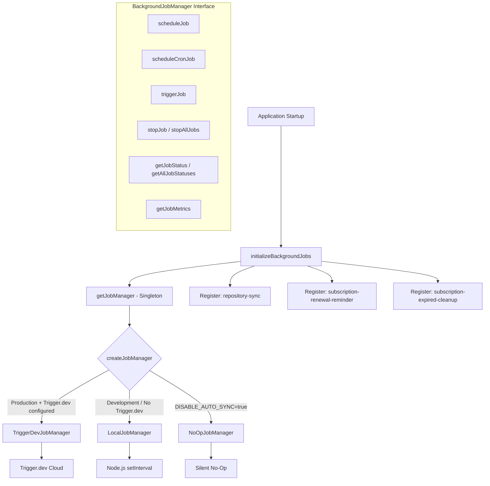
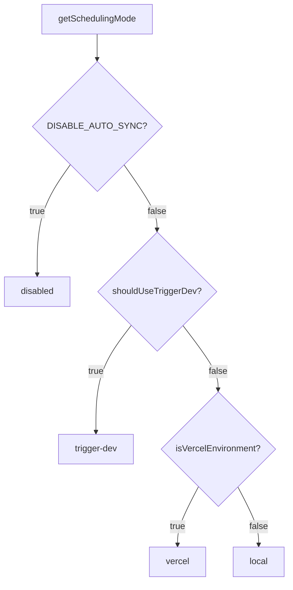

# Module de tâches en arrière-plan

Le module de tâches en arrière-plan (`template/lib/background-jobs/`) fournit une couche d'abstraction pour planifier et exécuter des tâches récurrentes. Il prend en charge trois stratégies d'exécution : **Trigger.dev** pour la production, **local `setInterval`** pour le développement et un mode **no-op** pour désactiver complètement les tâches -- sélectionné automatiquement en fonction de la configuration de l'environnement.

## Présentation de l'architecture



## Fichiers sources

|Fichier|Descriptif|
|------|-------------|
|`lib/background-jobs/types.ts`|Définitions d'interface et de type|
|`lib/background-jobs/config.ts`|Détection de la configuration et du mode de planification de Trigger.dev|
|`lib/background-jobs/job-factory.ts`|Fonction d'usine et gestionnaire de singleton|
|`lib/background-jobs/local-job-manager.ts`|`LocalJobManager` implémentation|
|`lib/background-jobs/trigger-dev-job-manager.ts`|`TriggerDevJobManager` implémentation|
|`lib/background-jobs/noop-job-manager.ts`|`NoOpJobManager` implémentation|
|`lib/background-jobs/initialize-jobs.ts`|Inscription au travail au démarrage de l'application|
|`lib/background-jobs/index.ts`|Exportations de barils|

## Définitions des types

### `BackgroundJobManager`Interface

```typescript
interface BackgroundJobManager {
  scheduleJob(id: string, name: string, job: () => void | Promise<void>, interval: number): void;
  scheduleCronJob(id: string, name: string, job: () => void | Promise<void>, cronExpression: string): void;
  triggerJob(id: string): Promise<void>;
  stopJob(id: string): void;
  stopAllJobs(): void;
  getJobStatus(id: string): JobStatus | undefined;
  getAllJobStatuses(): JobStatus[];
  getJobMetrics(): JobMetrics;
}
```

### `JobStatus`

```typescript
type JobStatusType = 'running' | 'completed' | 'failed' | 'scheduled' | 'stopped';

interface JobStatus {
  id: string;
  name: string;
  status: JobStatusType;
  lastRun: Date | null;
  nextRun: Date | null;
  duration: number;     // Last execution duration in ms
  error?: string;       // Error message if status is 'failed'
}
```

### `JobMetrics`

```typescript
interface JobMetrics {
  totalExecutions: number;       // Total invocations (not unique jobs)
  successfulJobs: number;
  failedJobs: number;
  averageJobDuration: number;    // Rolling average in ms
  lastCleanup: Date;
}
```

### `TriggerDevConfig`

```typescript
interface TriggerDevConfig {
  enabled: boolean;
  apiKey?: string;
  apiUrl?: string;
  environment: string;
  isFullyConfigured: boolean;
  isPartiallyConfigured: boolean;
}
```

### `SchedulingMode`

```typescript
type SchedulingMode = 'trigger-dev' | 'vercel' | 'local' | 'disabled';
```

## Fonctions de configuration

### `getTriggerDevConfig(): TriggerDevConfig`

Lit les paramètres Trigger.dev à partir du ConfigService.

### `shouldUseTriggerDev(): boolean`

Renvoie `true` lorsque Trigger.dev est entièrement configuré, activé et que l'environnement est en production.

### `getSchedulingMode(): SchedulingMode`

Détermine quel système de planification doit être actif en utilisant cette priorité :



## Usine et Singleton

### `createJobManager(): BackgroundJobManager`

Crée le gestionnaire de travaux approprié en fonction de l'environnement :

```typescript
import { createJobManager } from '@/lib/background-jobs';

const manager = createJobManager();
// Returns: TriggerDevJobManager | LocalJobManager | NoOpJobManager
```

### `getJobManager(): BackgroundJobManager`

Renvoie l'instance singleton, en la créant lors du premier appel :

```typescript
import { getJobManager } from '@/lib/background-jobs';

const manager = getJobManager();
manager.scheduleJob('my-job', 'My Job', async () => {
  await doWork();
}, 60_000);
```

### `resetJobManager(): void`

Arrête tous les travaux et détruit le singleton (utile pour les tests) :

```typescript
import { resetJobManager } from '@/lib/background-jobs';
resetJobManager();
```

## LocalJobManager

Utilise Node.js `setInterval` pour les environnements de développement et de secours.

**Comportements clés :**
- Ignore l'exécution lorsqu'un travail est déjà en cours d'exécution (empêche le chevauchement)
- Suit les métriques avec une durée moyenne mobile
- Convertit les expressions cron en intervalles via un mappage simplifié
- Réduit la journalisation de la console en mode développement

### Mappage Cron-Intervalle

|Modèle Cron|Intervalle|
|-------------|----------|
| `*/30 * * * * *` |30 secondes|
| `*/2 * * * *` |2 minutes|
| `*/5 * * * *` |5 minutes|
| `*/15 * * * *` |15 minutes|
| `0 * * * *` |1 heure|
| `0 9 * * *` |24 heures|
|Par défaut|1 minute|

## TriggerDevJobManager

Enregistre les planifications avec l'API de planifications `@trigger.dev/sdk` v4. N'exécute **pas** les minuteurs locaux -- l'exécution est gérée par le processus de travail Trigger.dev.

**Comportements clés :**
- Chargements différés `@trigger.dev/sdk` via importation dynamique
- Convertit les planifications basées sur des intervalles en expressions cron
- Suit les métriques locales lorsque les tâches sont exécutées dans le contexte du travailleur
- `stopJob` / `stopAllJobs` efface uniquement l'état local (les plannings à distance sont gérés par Trigger.dev)

## NoOpJobManager

Toutes les opérations sont des opérations silencieuses. Utilisé lorsque `DISABLE_AUTO_SYNC=true` en développement.

## Inscription à l'emploi

La fonction `initializeBackgroundJobs()` enregistre tous les travaux d'application au démarrage :

```typescript
import { initializeBackgroundJobs } from '@/lib/background-jobs/initialize-jobs';

// Called once during app initialization
await initializeBackgroundJobs();
```

### Emplois enregistrés

|ID de travail|Calendrier|Descriptif|
|--------|----------|-------------|
|`repository-sync`|Toutes les 5 minutes|Synchronise le contenu CMS basé sur Git via `syncManager.performSync()`|
|`subscription-renewal-reminder`|Tous les jours à 9h00|Envoie des rappels de renouvellement pour les abonnements expirant dans 7 jours|
|`subscription-expired-cleanup`|Tous les jours à minuit|Traite et expire les abonnements après leur date de fin|

**Important :** Tous les rappels de tâches utilisent des importations dynamiques pour empêcher Webpack de regrouper des modules spécifiques à Node.js au moment de la construction :

```typescript
manager.scheduleJob('repository-sync', 'Repository Synchronization', async () => {
  // Dynamic import prevents webpack bundling of isomorphic-git chain
  const { syncManager } = await import('@/lib/services/sync-service');
  await syncManager.performSync();
}, 5 * 60 * 1000);
```

## Exemples d'utilisation

### Planification d'une tâche personnalisée

```typescript
import { getJobManager } from '@/lib/background-jobs';

const manager = getJobManager();

// Interval-based (every 10 minutes)
manager.scheduleJob('cleanup-temp', 'Temp File Cleanup', async () => {
  await cleanupTempFiles();
}, 10 * 60 * 1000);

// Cron-based (every hour)
manager.scheduleCronJob('hourly-report', 'Hourly Report', async () => {
  await generateReport();
}, '0 * * * *');
```

### Surveillance des tâches

```typescript
const manager = getJobManager();

// Check specific job
const status = manager.getJobStatus('repository-sync');
console.log(status?.status, status?.lastRun, status?.duration);

// List all jobs
const allStatuses = manager.getAllJobStatuses();

// Get aggregate metrics
const metrics = manager.getJobMetrics();
console.log(`Total: ${metrics.totalExecutions}, Failed: ${metrics.failedJobs}`);
```

### Déclenchement manuel

```typescript
const manager = getJobManager();
await manager.triggerJob('repository-sync');
```
