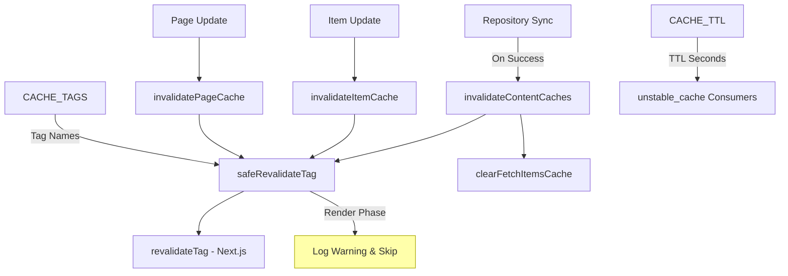
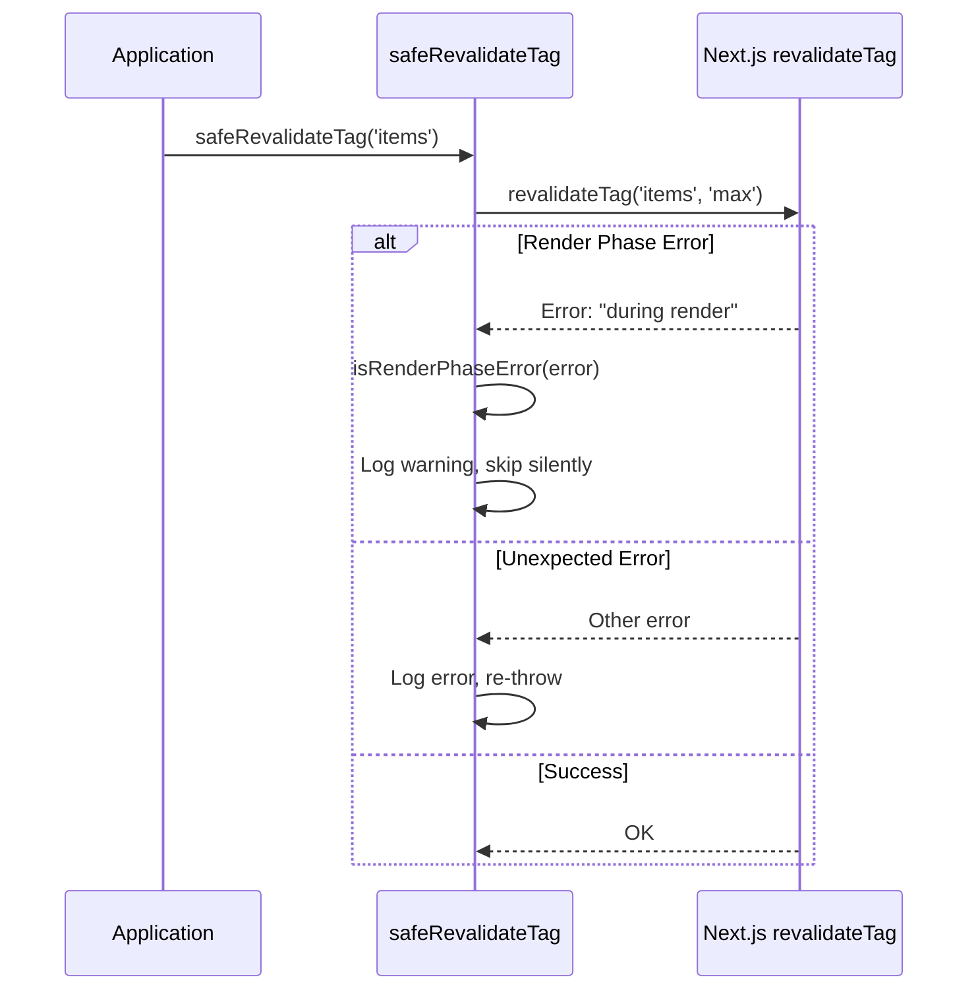
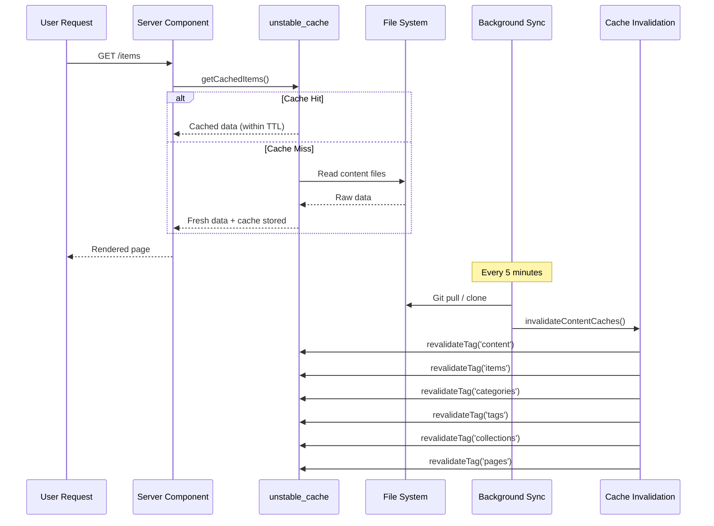

# Module d'invalidation du cache

Le module d'invalidation du cache (`template/lib/cache-config.ts` et `template/lib/cache-invalidation.ts`) fournit un système de balises de cache centralisé et des fonctions d'invalidation pour Next.js `unstable_cache` et `revalidateTag`. Il garantit que les caches de contenu sont correctement invalidés après la synchronisation du référentiel tout en gérant correctement les restrictions de phase de rendu Next.js.

## Présentation de l'architecture



## Fichiers sources

|Fichier|Descriptif|
|------|-------------|
|`lib/cache-config.ts`|Mettre en cache les constantes TTL et les définitions de balises|
|`lib/cache-invalidation.ts`|Fonctions d'invalidation avec sécurité de phase de rendu|

## Configuration du cache TTL

Toutes les valeurs TTL sont en **secondes**, utilisées avec Next.js `unstable_cache` :

```typescript
const CACHE_TTL = {
  CONTENT: 600,   // 10 minutes -- content listings
  ITEM: 600,      // 10 minutes -- individual items
  CONFIG: 600,    // 10 minutes -- site configuration
  PAGES: 600,     // 10 minutes -- static pages
} as const;
```

### Utilisation avec `unstable_cache`

```typescript
import { unstable_cache } from 'next/cache';
import { CACHE_TTL, CACHE_TAGS } from '@/lib/cache-config';

const getCachedItems = unstable_cache(
  async () => fetchAllItems(),
  ['items-list'],
  {
    revalidate: CACHE_TTL.CONTENT,
    tags: [CACHE_TAGS.CONTENT, CACHE_TAGS.ITEMS],
  }
);
```

## Balises de cache

Les balises sont utilisées avec `revalidateTag()` pour invalider sélectivement les caches.

### Balises statiques

|Constante de balise|Valeur|Descriptif|
|-------------|-------|-------------|
|`CACHE_TAGS.CONTENT`|`'content'`|Balise principale : invalide tous les caches de contenu|
|`CACHE_TAGS.ITEMS`|`'items'`|Collection de tous les objets|
|`CACHE_TAGS.CATEGORIES`|`'categories'`|Toutes les catégories|
|`CACHE_TAGS.TAGS`|`'tags'`|Toutes les balises|
|`CACHE_TAGS.COLLECTIONS`|`'collections'`|Toutes les collections|
|`CACHE_TAGS.CONFIG`|`'config'`|Configuration du site|
|`CACHE_TAGS.PAGES`|`'pages'`|Toutes les pages statiques|

### Balises dynamiques (fonctions)

|Fonction de balise|Exemple de sortie|Descriptif|
|-------------|---------------|-------------|
|`CACHE_TAGS.ITEM(slug)`|`'item:my-tool'`|Article spécifique par slug|
|`CACHE_TAGS.PAGE(slug)`|`'page:about'`|Page spécifique par slug|
|`CACHE_TAGS.ITEMS_LOCALE(locale)`|`'items:en'`|Éléments filtrés par paramètres régionaux|
|`CACHE_TAGS.CATEGORIES_LOCALE(locale)`|`'categories:fr'`|Catégories par région|
|`CACHE_TAGS.TAGS_LOCALE(locale)`|`'tags:de'`|Balises par langue|
|`CACHE_TAGS.COLLECTIONS_LOCALE(locale)`|`'collections:es'`|Collections par région|

### Exemple : mise en cache spécifique aux paramètres régionaux

```typescript
import { CACHE_TAGS, CACHE_TTL } from '@/lib/cache-config';

const getCachedItemsByLocale = unstable_cache(
  async (locale: string) => fetchItemsByLocale(locale),
  ['items-by-locale'],
  {
    revalidate: CACHE_TTL.CONTENT,
    tags: [CACHE_TAGS.ITEMS, CACHE_TAGS.ITEMS_LOCALE('en')],
  }
);
```

## Fonctions d'invalidation

### `invalidateContentCaches(): Promise<void>`

Invalide **tous** les caches liés au contenu. Appelé une fois la synchronisation du référentiel terminée avec succès.

```typescript
import { invalidateContentCaches } from '@/lib/cache-invalidation';

// After successful repository sync
await performSync();
await invalidateContentCaches();
```

**Invalide ces balises :**
- `CONTENT`, `ITEMS`, `CATEGORIES`, `TAGS`, `COLLECTIONS`, `PAGES`
- Efface également le cache en mémoire `fetchItems` via `clearFetchItemsCache()`

### `invalidateItemCache(slug: string): Promise<void>`

Invalide le cache pour un seul élément.

```typescript
import { invalidateItemCache } from '@/lib/cache-invalidation';

await invalidateItemCache('my-saas-tool');
// Revalidates tag: 'item:my-saas-tool'
```

### `invalidatePageCache(slug: string): Promise<void>`

Invalide le cache pour une seule page statique.

```typescript
import { invalidatePageCache } from '@/lib/cache-invalidation';

await invalidatePageCache('about');
// Revalidates tag: 'page:about'
```

## Sécurité de la phase de rendu

Next.js n'autorise pas `revalidateTag()` pendant la phase de rendu des composants du serveur. Le module gère cela avec un wrapper `safeRevalidateTag`.

### Comment ça marche



### Modèles de détection d'erreurs

La fonction `isRenderPhaseError` vérifie que plusieurs modèles sont résilients aux modifications des messages d'erreur Next.js :

- `"during render"` -- Message Next.js actuel
- `"render phase"` -- Phrase alternative
- `"revalidate"` + `"render"` -- Les deux mots-clés sont présents
- `"unsupported"` + `"render"` -- Vérification de la combinaison

## Diagramme de flux de cache


