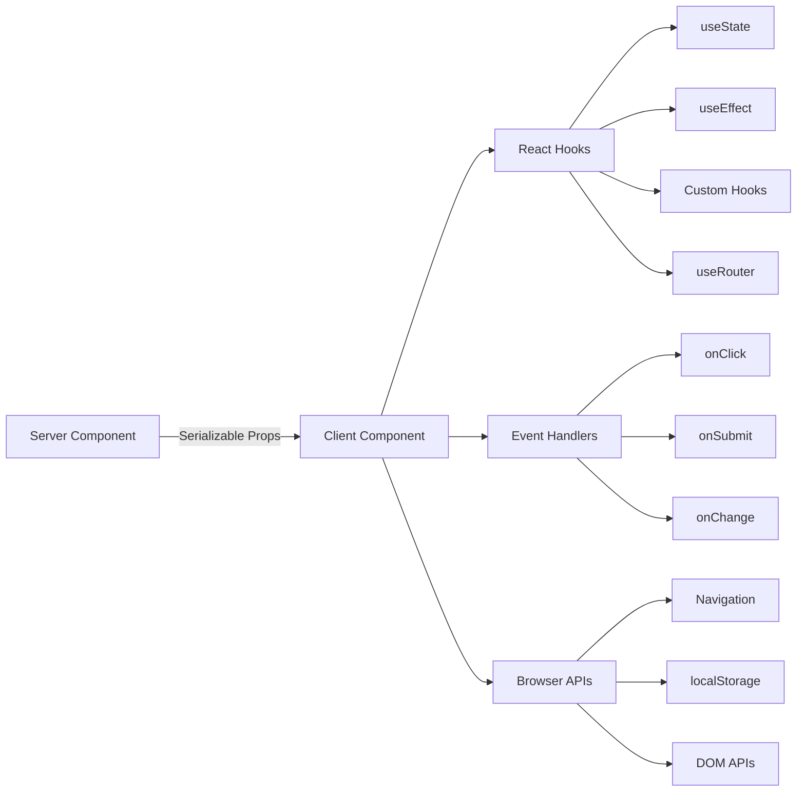

# Modèles de composants clients

## Aperçu

Les composants clients du modèle Ever Works sont des « îlots » interactifs qui gèrent les événements utilisateur, gèrent l'état local et s'intègrent aux API du navigateur. Ils sont identifiés par la directive `"use client"` en haut du fichier et sont utilisés de manière sélective là où l'interactivité est requise.

## Architecture



## Fichiers sources

|Fichier|Modèle|
|------|---------|
|`template/app/[locale]/admin/page.tsx`|Wrapper client minimal déléguant au composant|
|`template/app/not-found.tsx`|Navigation client avec `useRouter`|
|`template/app/global-error.tsx`|Limite d'erreur avec fonctionnalité de réinitialisation|
|`template/components/filters/filter-url-parser.tsx`|Gestion de l'état des URL|
|`template/components/header/more-menu.tsx`|Menus déroulants interactifs|

## Modèles de base

### Modèle 1 : Wrappers clients minimaux

De nombreux composants de page utilisent le wrapper client le plus fin possible :

```typescript
"use client";

import { AdminDashboard } from "@/components/admin";

export default function AdminPage() {
    return <AdminDashboard />;
}
```

Ce modèle maintient le fichier d'échange petit tout en déléguant toute la logique à un composant distinct. La directive `"use client"` marque la limite où l'arborescence des composants du serveur passe au rendu client.

### Modèle 2 : composants de limite d'erreur

Le gestionnaire d'erreurs global illustre le modèle de limite d'erreur :

```typescript
'use client';

export default function GlobalError({
    error,
    reset,
}: {
    error: Error & { digest?: string };
    reset: () => void;
}) {
    useEffect(() => {
        console.error(error);
    }, [error]);

    return (
        <html lang="en">
            <body>
                <div>
                    <h1>Something went wrong!</h1>
                    {process.env.NODE_ENV !== 'production' && (
                        <div>
                            <p>{error.message}</p>
                            {error.digest && <p>Error ID: {error.digest}</p>}
                        </div>
                    )}
                    <Button onPress={() => reset()}>Refresh</Button>
                    <Link href="/">Go Home</Link>
                </div>
            </body>
        </html>
    );
}
```

Aspects clés :
- La prop `error` inclut un `digest` facultatif pour le suivi des erreurs du serveur.
- La fonction `reset()` restitue les enfants de la limite d'erreur
- Les traces de pile ne sont affichées qu'en développement
- Le composant enveloppe ses propres balises `<html>` et `<body>` puisque les erreurs globales remplacent la page entière

### Modèle 3 : Navigation côté client

La page Not Found illustre les modèles de navigation côté client :

```typescript
'use client';

import { useRouter } from 'next/navigation';

export default function NotFound() {
    const router = useRouter();

    return (
        <div>
            <Button onClick={() => router.back()}>Go Back</Button>
            <Button onClick={() => router.push('/')}>Back to Home</Button>
            <button onClick={() => router.push('/help')}>Contact Support</button>
        </div>
    );
}
```

Le hook `useRouter` de `next/navigation` fournit une navigation par programmation. Notez qu'il s'agit de `next/navigation`, et non de `next/router` (Pages Router).

### Modèle 4 : Navigation client i18n-Aware

Le modèle fournit des hooks de navigation compatibles avec les paramètres régionaux via `i18n/navigation.ts` :

```typescript
import { createNavigation } from "next-intl/navigation";
import { routing } from "./routing";

export const { Link, redirect, usePathname, useRouter, getPathname } =
    createNavigation(routing);
```

Composants clients qui nécessitent une importation de navigation tenant compte des paramètres régionaux à partir de ce module au lieu de `next/navigation` :

```typescript
'use client';

import { Link, useRouter, usePathname } from '@/i18n/navigation';

function LocaleAwareComponent() {
    const router = useRouter();
    const pathname = usePathname();

    // router.push('/about') automatically includes the current locale prefix
    return <Link href="/about">About</Link>;
}
```

### Modèle 5 : actions du serveur avec validation de formulaire

Les composants clients s'intègrent aux actions du serveur à l'aide du modèle d'action validé de `lib/auth/middleware.ts` :

```typescript
// Server action (lib/auth/middleware.ts)
export function validatedAction<S extends z.ZodType, T>(
    schema: S,
    action: ValidatedActionFunction<S, T>
) {
    return async (prevState: ActionState, formData: FormData): Promise<T> => {
        const result = schema.safeParse(Object.fromEntries(formData));
        if (!result.success) {
            return { error: result.error.issues[0].message } as T;
        }
        return action(result.data, formData);
    };
}

// Client component
'use client';

import { useActionState } from 'react';
import { myServerAction } from './actions';

function MyForm() {
    const [state, formAction, isPending] = useActionState(myServerAction, {});

    return (
        <form action={formAction}>
            {state.error && <p>{state.error}</p>}
            <input name="email" type="email" />
            <button type="submit" disabled={isPending}>Submit</button>
        </form>
    );
}
```

### Modèle 6 : Gestion de l'état avec des hooks personnalisés

Le modèle organise la logique côté client en hooks personnalisés dans le répertoire `hooks/` :

```typescript
'use client';

import { useFavorites } from '@/hooks/useFavorites';
import { useFilters } from '@/hooks/useFilters';

function ItemList() {
    const { favorites, toggleFavorite } = useFavorites();
    const { filters, updateFilter, resetFilters } = useFilters();

    return (
        <div>
            <FilterBar filters={filters} onChange={updateFilter} onReset={resetFilters} />
            <ItemGrid items={items} favorites={favorites} onToggleFavorite={toggleFavorite} />
        </div>
    );
}
```

## Limites des composants clients

### Quand utiliser `"use client"`

- **Gestionnaires d'événements** : `onClick`, `onSubmit`, `onChange`
- **Hooks React** : `useState`, `useEffect`, `useRef`, hooks personnalisés
- **API du navigateur** : `window`, `localStorage`, `navigator`
- **Bibliothèques clientes tierces** : bibliothèques de composants d'interface utilisateur nécessitant de l'interactivité

### Quand conserver en tant que composant serveur

- Rendu de contenu statique
- Récupération et transformation de données
- Chargement de la traduction (`getTranslations`)
- Génération de métadonnées
- Emballages de mise en page

## Meilleures pratiques dans le modèle

1. **Poussez `"use client"` aussi profondément que possible** -- gardez la limite proche de la feuille interactive
2. **Transmettre les données du serveur en tant qu'accessoires** -- évitez de les récupérer sur le client
3. **Utilisez `useEffect` pour les effets secondaires uniquement** -- pas pour la récupération de données
4. **Préférez les actions du serveur aux routes API** -- pour les soumissions de formulaires et les mutations
5. **Importer la navigation depuis `@/i18n/navigation`** -- garantit un routage tenant compte des paramètres régionaux
6. **Interface utilisateur de développement Gate uniquement** -- utilisez les contrôles `process.env.NODE_ENV !== 'production'`
