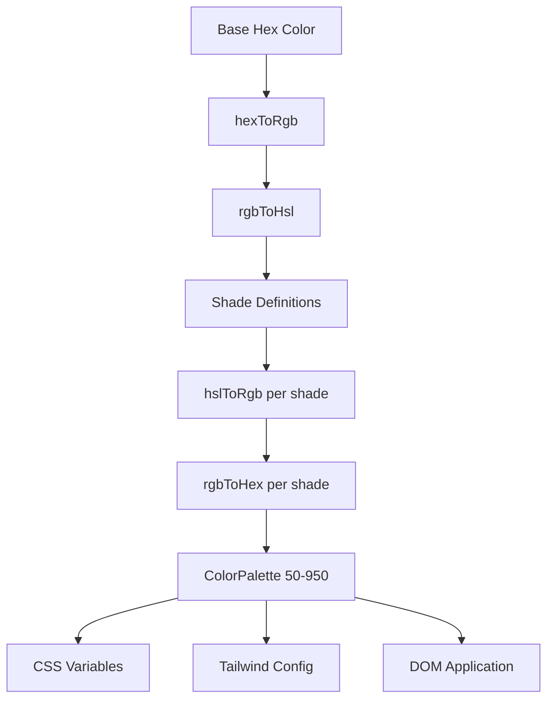

# Système de couleurs

Le modèle utilise un système de génération de couleurs dynamique qui crée des palettes de couleurs complètes à partir des couleurs hexadécimales de base. Cela alimente le moteur de thème et permet la personnalisation des couleurs d'exécution via des variables CSS et l'intégration CSS de Tailwind.

## Présentation de l'architecture



## Fichiers sources

|Fichier|Objectif|
|------|---------|
|`lib/color-generator.ts`|Génération de palette de base à partir de couleurs hexadécimales|
|`lib/theme-color-manager.ts`|Application de couleur au niveau du thème et génération CSS|
|`lib/theme-utils.ts`|Classes utilitaires, assistants d'opacité et préréglages de thème|

## Pipeline de conversion de couleurs

Le système convertit les couleurs à travers plusieurs représentations pour générer avec précision des nuances. Quatre fonctions de conversion gèrent l'aller-retour complet.

```typescript
// Hex -> RGB -> HSL (for manipulation) -> RGB -> Hex (output)
export function hexToRgb(hex: string): { r: number; g: number; b: number };
export function rgbToHsl(r: number, g: number, b: number): { h: number; s: number; l: number };
export function hslToRgb(h: number, s: number, l: number): { r: number; g: number; b: number };
export function rgbToHex(r: number, g: number, b: number): string;
```

Les ajustements de luminosité et de saturation s'effectuent dans l'espace colorimétrique HSL, qui fournit des transitions de nuances perceptuellement uniformes sur toute la palette.

## Définitions des nuances

Chaque niveau de teinte a des réglages fixes de luminosité et de saturation par rapport à la couleur de base (500) :

|Ombre|Ajustement de la luminosité|Ajustement de la saturation|Utilisation|
|-------|-----------------|-------------------|-------|
| 50 | +45 | -30 |Fonds les plus clairs|
| 100 | +40 | -25 |Survolez les arrière-plans|
| 200 | +30 | -20 |Arrière-plans actifs|
| 300 | +20 | -10 |Frontières|
| 400 | +10 | -5 |Texte d'espace réservé|
| **500** | **0** | **0** |**Couleur de base**|
| 600 | -10 | +5 |États de survol|
| 700 | -20 | +10 |États actifs|
| 800 | -30 | +15 |Texte en accentuation|
| 900 | -40 | +20 |Titres|
| 950 | -45 | +25 |Milieux les plus sombres|

## Interface de la palette de couleurs

```typescript
export interface ColorPalette {
  50: string;
  100: string;
  200: string;
  300: string;
  400: string;
  500: string;  // Base color
  600: string;
  700: string;
  800: string;
  900: string;
  950: string;
}
```

## Générer une palette

La fonction `generateColorPalette` prend n'importe quelle couleur hexadécimale et produit la palette complète de 11 nuances :

```typescript
import { generateColorPalette } from '@/lib/color-generator';

const palette = generateColorPalette('#3b82f6');
// Returns: { 50: '#e8f0fe', 100: '#d4e4fd', ..., 950: '#0a1d3d' }
```

Les valeurs sont comprises entre 0 et 100 pour la luminosité et la saturation afin d'éviter les couleurs hors plage.

## Génération de variables CSS

Le système génère des propriétés CSS personnalisées pour chaque teinte :

```typescript
import { generateCssVariables } from '@/lib/color-generator';

const palette = generateColorPalette('#3b82f6');
const css = generateCssVariables('theme-primary', palette);
// Output:
// --theme-primary: #3b82f6;
// --theme-primary-50: #e8f0fe;
// --theme-primary-100: #d4e4fd;
// ... (all 11 shades)
```

## Intégration CSS Tailwind

Générez des objets de configuration Tailwind qui font référence à des variables CSS :

```typescript
import { generateTailwindConfig } from '@/lib/color-generator';

const config = generateTailwindConfig('theme-primary');
// Returns: {
//   DEFAULT: 'var(--theme-primary)',
//   50: 'var(--theme-primary-50)',
//   100: 'var(--theme-primary-100)',
//   ...
// }
```

## Gestionnaire de couleurs du thème

Le module `theme-color-manager.ts` applique des palettes au DOM au moment de l'exécution.

### Configurations de thème étendues

Quatre thèmes intégrés définissent les couleurs de base pour les couleurs primaires, secondaires, d'accentuation, d'arrière-plan, de surface et de texte :

```typescript
export const EXTENDED_THEME_CONFIGS: Record<ThemeKey, ThemeConfig> = {
  everworks: {
    primary: "#3d70ef",
    secondary: "#00c853",
    accent: "#0056b3",
    background: "#ffffff",
    surface: "#f8f9fa",
    text: "#1a1a1a",
    textSecondary: "#6c757d",
  },
  corporate: { /* ... */ },
  material: { /* ... */ },
  funny: { /* ... */ },
};
```

### Application de palettes au DOM

```typescript
import { applyColorPalette, applyThemeWithPalettes } from '@/lib/theme-color-manager';

// Apply a single color palette
applyColorPalette('theme-primary', '#3d70ef');

// Apply an entire theme (primary + secondary + accent + utility colors)
applyThemeWithPalettes('everworks');
```

La fonction `applyColorPalette` génère également une variante RVB pour la prise en charge de l'opacité :

```typescript
// Sets both:
// --theme-primary: #3d70ef
// --theme-primary-rgb: 61, 112, 239
```

### Générer du CSS statique

Pour le rendu côté serveur ou la génération CSS au moment de la construction :

```typescript
import { generateThemeCss } from '@/lib/theme-color-manager';

const css = generateThemeCss('everworks');
// Returns full CSS variable string for all theme colors
```

## Classes d'utilitaires de thème

Le module `theme-utils.ts` fournit des combinaisons de classes Tailwind prédéfinies :

```typescript
import { themeClasses } from '@/lib/theme-utils';

// Button variants
themeClasses.button.primary   // "bg-theme-primary hover:bg-theme-accent text-white"
themeClasses.button.secondary // "bg-theme-secondary hover:bg-theme-secondary/80 text-white"
themeClasses.button.outline   // "border-2 border-theme-primary text-theme-primary ..."
themeClasses.button.ghost     // "text-theme-primary hover:bg-theme-primary/10"

// Text variants
themeClasses.text.primary     // "text-theme-text"
themeClasses.text.secondary   // "text-theme-text-secondary"
themeClasses.text.accent      // "text-theme-primary"
```

### Fonctions d'assistance

```typescript
import { withOpacity, getCssVariable, cn, buildThemeClasses } from '@/lib/theme-utils';

// Generate opacity variant
withOpacity('bg-theme-primary', 50); // "bg-theme-primary/50"

// Get CSS variable reference
getCssVariable('theme-primary'); // "var(--theme-primary)"

// Conditional class building
buildThemeClasses('base-class', 'theme-class', {
  'active-class': isActive,
  'disabled-class': isDisabled,
});
```

## Génération de couleurs de thème par lots

Générez la configuration CSS et Tailwind pour plusieurs couleurs à la fois :

```typescript
import { generateThemeColors } from '@/lib/color-generator';

const result = generateThemeColors({
  primary: '#3d70ef',
  secondary: '#00c853',
  accent: '#0056b3',
});

// result.css - Complete CSS variable declarations
// result.tailwind - Tailwind config object for all colors
```

## Application de thème personnalisé

Appliquez des couleurs arbitraires sans utiliser les thèmes prédéfinis :

```typescript
import { applyCustomTheme } from '@/lib/theme-color-manager';

applyCustomTheme({
  primary: '#e91e63',
  secondary: '#9c27b0',
  accent: '#673ab7',
});
```

## Gestion des erreurs

Le gestionnaire de couleurs du thème inclut un comportement de secours :

- Si une clé de thème n'est pas trouvée, elle revient au thème par défaut `everworks`.
- Si l'application d'un thème génère une erreur et que le thème demandé n'est pas `everworks`, il réessaye automatiquement avec le thème par défaut.
- Sécurité SSR : `useThemeWithPalettes` vérifie la disponibilité de `window` avant d'appliquer les modifications DOM.
