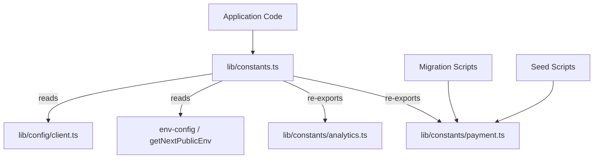

# Référence des constantes

Le module de constantes (`template/lib/constants.ts` et `template/lib/constants/`) centralise toutes les valeurs de configuration, énumérations, paramètres basés sur l'environnement et nombres magiques à l'échelle de l'application. Les constantes sont organisées en fichiers spécifiques au domaine pour permettre des importations sécurisées dans des contextes en dehors du runtime Next.js (par exemple, scripts de migration, scripts de départ).

## Présentation de l'architecture



## Fichiers sources

|Fichier|Descriptif|
|------|-------------|
|`lib/constants.ts`|Baril de constantes principales - importations depuis les sous-modules env-config et réexportations|
|`lib/constants/payment.ts`|Énumérations et types de paiement (sans danger pour les scripts)|
|`lib/constants/analytics.ts`|Constantes liées à l'analyse|

## Constantes de localisation

```typescript
const DEFAULT_LOCALE = 'en';

const LOCALES = [
  'en', 'fr', 'es', 'de', 'zh', 'ar', 'he', 'ru', 'uk', 'pt',
  'it', 'ja', 'ko', 'nl', 'pl', 'tr', 'vi', 'th', 'hi', 'id', 'bg'
] as const;

type Locale = (typeof LOCALES)[number];

/** Right-to-left locales */
const RTL_LOCALES: readonly Locale[] = ['ar', 'he'] as const;
```

## Image de marque et interface utilisateur

```typescript
const LOGO_URL = '/logo-ever-work-3.png';
```

## API et back-end

```typescript
/** Base URL for internal Next.js API routes */
const API_BASE_URL = getNextPublicEnv('NEXT_PUBLIC_API_BASE_URL');
```

## Authentification et sécurité

```typescript
const COOKIE_SECRET = getNextPublicEnv('COOKIE_SECRET');
const JWT_ACCESS_TOKEN_EXPIRES_IN = getNextPublicEnv('JWT_ACCESS_TOKEN_EXPIRES_IN');
const JWT_REFRESH_TOKEN_EXPIRES_IN = getNextPublicEnv('JWT_REFRESH_TOKEN_EXPIRES_IN');
```

## Analyses – PostHog

|Constante|Origine|Descriptif|
|----------|--------|-------------|
|`POSTHOG_KEY`|`NEXT_PUBLIC_POSTHOG_KEY`|Clé API du projet PostHog|
|`POSTHOG_HOST`|`NEXT_PUBLIC_POSTHOG_HOST`|Hôte de l'API PostHog|
|`POSTHOG_ENABLED`|Dérivé|Vrai lorsque la clé et l'hôte existent|
|`POSTHOG_DEBUG`|`POSTHOG_DEBUG`|Activer la journalisation du débogage|
|`POSTHOG_SESSION_RECORDING_ENABLED`|env / `'true'`|Bascule d'enregistrement de session|
|`POSTHOG_AUTO_CAPTURE`|env / `'false'`|Capture automatique des pages vues|
|`POSTHOG_SAMPLE_RATE`|Calculé|`0.1` en production, `1.0` en développement|
|`POSTHOG_SESSION_RECORDING_SAMPLE_RATE`|Calculé|`0.1` en production, `1.0` en développement|

## Suivi des erreurs – Sentry

|Constante|Origine|Descriptif|
|----------|--------|-------------|
|`SENTRY_DSN`|`NEXT_PUBLIC_SENTRY_DSN`|Nom de la source de données Sentry|
|`SENTRY_ENABLE_DEV`|`SENTRY_ENABLE_DEV`|Activer Sentry en développement|
|`SENTRY_DEBUG`|`SENTRY_DEBUG`|Mode de débogage Sentinelle|
|`SENTRY_ENABLED`|Dérivé|Vrai lorsque DSN est défini et que l'environnement le permet|

## Suivi des exceptions unifié

```typescript
const EXCEPTION_TRACKING_PROVIDER = getNextPublicEnv('EXCEPTION_TRACKING_PROVIDER', 'both');
const POSTHOG_EXCEPTION_TRACKING = getNextPublicEnv('POSTHOG_EXCEPTION_TRACKING', 'true');
const SENTRY_EXCEPTION_TRACKING = getNextPublicEnv('SENTRY_EXCEPTION_TRACKING', 'true');

type ExceptionTrackingProvider = 'sentry' | 'posthog' | 'both' | 'none';
```

## ReCAPTCHA

```typescript
const RECAPTCHA_SITE_KEY = getNextPublicEnv('NEXT_PUBLIC_RECAPTCHA_SITE_KEY');
const RECAPTCHA_SECRET_KEY = getNextPublicEnv('RECAPTCHA_SECRET_KEY');
```

## Constantes de paiement (`constants/payment.ts`)

Ce fichier est intentionnellement séparé de `constants.ts` pour éviter d'importer `@/lib/config`, permettant ainsi son utilisation dans les scripts de migration et de départ qui s'exécutent en dehors de Next.js.

### Énumérations

```typescript
enum PaymentFlow {
  PAY_AT_START = 'pay_at_start',
  PAY_AT_END = 'pay_at_end',
}

enum PaymentStatus {
  PENDING = 'pending',
  PAID = 'paid',
  FAILED = 'failed',
}

enum PaymentInterval {
  DAILY = 'daily',
  WEEKLY = 'weekly',
  MONTHLY = 'monthly',
  YEARLY = 'yearly',
  ONE_TIME = 'one-time',
  PER_SUBMISSION = 'per-submission',
}

enum PaymentPlan {
  FREE = 'free',
  STANDARD = 'standard',
  PREMIUM = 'premium',
}

enum PaymentMethod {
  CREDIT_CARD = 'credit_card',
  PAYPAL = 'paypal',
}

enum PaymentCurrency {
  USD = 'USD',
  EUR = 'EUR',
  GBP = 'GBP',
  CAD = 'CAD',
  AUD = 'AUD',
  ETH = 'ETH',
}

enum PaymentProvider {
  STRIPE = 'stripe',
  SOLIDGATE = 'solidgate',
  LEMONSQUEEZY = 'lemonsqueezy',
  POLAR = 'polar',
}

enum SubmissionStatus {
  DRAFT = 'draft',
  PENDING = 'pending',
  APPROVED = 'approved',
  REJECTED = 'rejected',
  PUBLISHED = 'published',
  ARCHIVED = 'archived',
}
```

### Noms d’affichage des plans

```typescript
const PAYMENT_PLAN_NAMES: Record<PaymentPlan, string> = {
  free: 'Free Plan',
  standard: 'Standard Plan',
  premium: 'Premium Plan',
};
```

### Tarifs des publicités des sponsors

```typescript
const SponsorAdPricing = {
  WEEKLY: 100,    // $100.00
  MONTHLY: 300,   // $300.00
} as const;
```

## Constantes d'analyse (`constants/analytics.ts`)

```typescript
/** Cookie name for anonymous viewer tracking */
const VIEWER_COOKIE_NAME = 'ever_viewer_id';

/** Cookie max age: 365 days in seconds */
const VIEWER_COOKIE_MAX_AGE = 365 * 24 * 60 * 60;  // 31,536,000
```

## Modèles d'importation

### Code d'application complet

```typescript
// Import everything from the main barrel
import {
  DEFAULT_LOCALE,
  LOCALES,
  POSTHOG_ENABLED,
  PaymentPlan,
  PaymentProvider,
  SubmissionStatus,
  VIEWER_COOKIE_NAME,
} from '@/lib/constants';
```

### Scripts en dehors du runtime Next.js

```typescript
// Import only from payment.ts to avoid Next.js dependencies
import { PaymentPlan, PaymentStatus, SubmissionStatus } from '@/lib/constants/payment';
```
