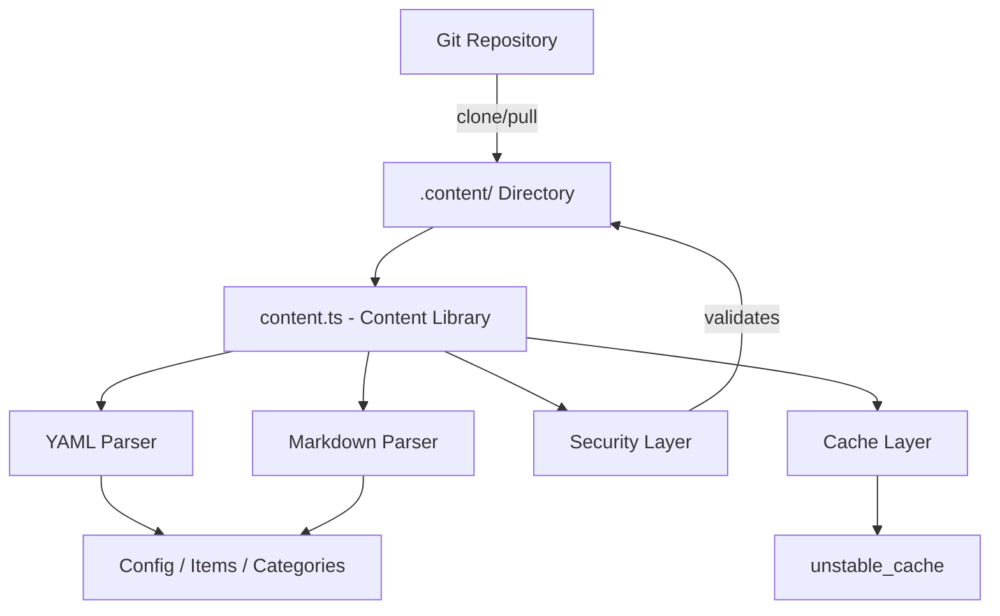
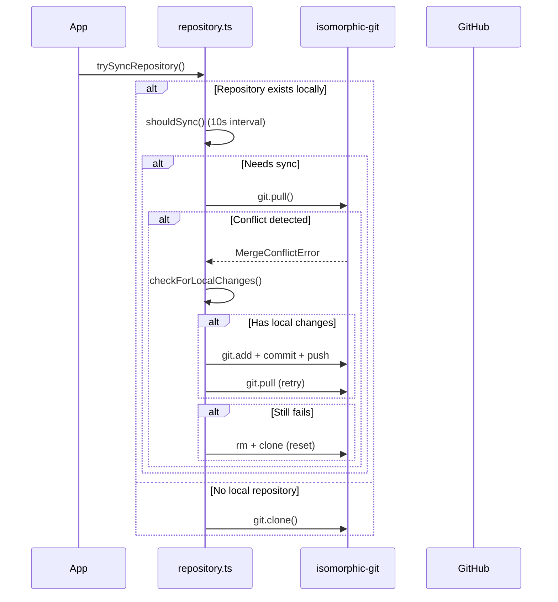

# Bibliothèque de contenu

La bibliothèque de contenu (`lib/content.ts`) fournit des utilitaires côté serveur pour lire, analyser et mettre en cache le contenu d'un référentiel CMS basé sur Git. Il gère les fichiers de contenu YAML/Markdown, la gestion de la configuration et la synchronisation du contenu avec des mesures de sécurité robustes.

## Présentation de l'architecture



## Fichiers sources

|Fichier|Objectif|
|------|---------|
|`lib/content.ts`|Traitement, lecture et mise en cache du contenu principal|
|`lib/repository.ts`|Synchronisation Git clone/pull avec le référentiel distant|
|`lib/lib.ts`|Utilitaires de chemin (`getContentPath`, `fsExists`, `dirExists`)|
|`lib/cache-config.ts`|Balises de cache et configuration TTL|

## Couche de sécurité

La bibliothèque de contenu applique plusieurs mesures de sécurité pour empêcher les attaques par traversée de chemin et par injection.

### Validation du code de langue

```typescript
function validateLanguageCode(lang: string): boolean {
  const validLangPattern = /^[a-zA-Z0-9_-]+$/;
  return validLangPattern.test(lang) && lang.length <= 10;
}
```

Seuls les caractères alphanumériques, les tirets et les traits de soulignement sont acceptés avec une longueur maximale de 10 caractères.

### Nettoyage du nom de fichier

```typescript
function sanitizeFilename(filename: string): string {
  const sanitized = path.basename(filename);
  if (sanitized.includes('..') || sanitized.includes('/') || sanitized.includes('\\')) {
    throw new Error('Invalid filename: contains dangerous characters');
  }
  return sanitized;
}
```

Utilise `path.basename` pour supprimer les composants du répertoire et rejette tous les caractères de parcours restants.

### Validation du chemin

```typescript
function validatePath(filepath: string, basePath: string): void {
  const resolvedPath = path.resolve(filepath);
  const resolvedBase = path.resolve(basePath);
  if (!resolvedPath.startsWith(resolvedBase + path.sep) && resolvedPath !== resolvedBase) {
    throw new Error('Invalid file path: outside of allowed directory');
  }
}
```

La fonction `safeReadFile` effectue une double vérification : elle valide le chemin puis vérifie que le chemin réel résolu (suivant les liens symboliques) reste dans le répertoire de base.

### Validation d'URL

```typescript
function isValidUrl(url: string): boolean {
  const trimmed = url.trim();
  if (trimmed.startsWith('/') && !trimmed.startsWith('//')) return true;
  return trimmed.startsWith('http://') || trimmed.startsWith('https://');
}
```

Bloque `javascript:`, `data:`, `vbscript:` et d'autres schémas de protocole dangereux.

### Validation de la taille CSS

```typescript
function isValidCssSize(value: string): boolean {
  if (['auto', 'inherit', 'initial', 'unset'].includes(value.trim())) return true;
  return /^\d+(\.\d+)?(px|em|rem|vh|vw|%|pt|cm|mm|in)?$/.test(value.trim());
}
```

Empêche l'injection de CSS via les champs de frontmatter de héros personnalisés.

## Traitement du contenu

### Analyse YAML

Les fichiers de contenu sont analysés à l'aide de la bibliothèque `yaml` avec validation de schéma Zod pour le frontmatter :

```typescript
const customHeroFrontmatterSchema = z.object({
  background_image: z.string().refine(isValidUrl, {
    message: 'Invalid URL: must be http, https, or relative path'
  }).optional(),
  // ... additional validated fields
});
```

### Mise en cache des configurations

La configuration du site est mise en cache à l'aide de Next.js `unstable_cache` avec des durées de vie et des balises de cache définies :

```typescript
import { CACHE_TAGS, CACHE_TTL } from './cache-config';

const getCachedConfig = unstable_cache(
  async () => { /* read and parse config.yml */ },
  [CACHE_TAGS.CONFIG],
  { revalidate: CACHE_TTL }
);
```

## Synchronisation du référentiel Git

Le module `repository.ts` gère les opérations Git à l'aide de `isomorphic-git`.

### Flux de synchronisation



### Protection contre l'expiration du délai

Toutes les opérations Git sont encadrées par des délais d'attente configurables :

```typescript
async function withTimeout<T>(promise: Promise<T>, timeoutMs: number = 120000): Promise<T> {
  const timeoutPromise = new Promise<never>((_, reject) => {
    setTimeout(() => reject(new Error(`Operation timeout after ${timeoutMs}ms`)), timeoutMs);
  });
  return Promise.race([promise, timeoutPromise]);
}
```

### Résolution des conflits

Le système gère les conflits de fusion via une stratégie en plusieurs étapes :

1. **Détecter les modifications locales** via `git.statusMatrix()`
2. **Essayez de pousser** les modifications locales avant de les extraire
3. **Réessayez d'extraire** après une poussée réussie
4. **Réinitialisation complète** (supprimer + re-cloner) en dernier recours

### Comportement de repli

Si `DATA_REPOSITORY` n'est pas configuré ou si le clonage échoue, le système crée un contenu de secours minimal :

```typescript
// Creates empty content directory with minimal config
const DEFAULT_CONFIG = `site_name: Website
item_name: Item
items_name: Items
copyright_year: ${new Date().getFullYear()}
`;
```

## Application uniquement sur le serveur

`content.ts` et `repository.ts` utilisent l'importation `server-only` pour éviter toute utilisation accidentelle côté client :

```typescript
'use server';
import 'server-only';
```

Cela garantit que les opérations de contenu avec accès au système de fichiers ne s'infiltrent jamais dans les bundles clients.

## Fonctions clés exportées

|Fonction|Descriptif|
|----------|-------------|
|`getCachedConfig()`|Renvoie la configuration du site mis en cache à partir de `config.yml`|
|`trySyncRepository()`|Clone ou extrait le contenu du référentiel Git distant|
|`pullChanges()`|Extrait les dernières modifications avec la résolution des conflits|
|`validateLanguageCode()`|Valide le format de code de langue i18n|
|`sanitizeFilename()`|Supprime les composants de répertoire des noms de fichiers|
|`safeReadFile()`|Lit les fichiers avec une protection complète contre la traversée du chemin|
