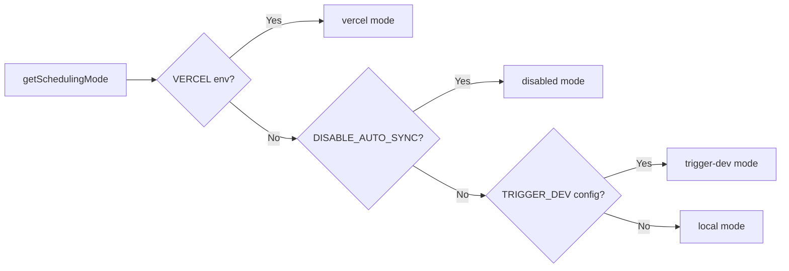

# Système de tâches Cron

## Aperçu

Le modèle Ever Works implémente un système de tâches en arrière-plan flexible qui prend en charge trois modes de planification : **Vercel Cron**, **Trigger.dev** et un **planificateur local**. Les points de terminaison Cron sont des routes API Next.js standard authentifiées via `CRON_SECRET`, et le système comprend un module d'initialisation singleton qui garantit que les tâches sont configurées exactement une fois par processus.

## Architecture

```mermaid
flowchart TD
    A[Scheduling Mode Detection] --> B{getSchedulingMode}

    B -->|vercel| C[Vercel Cron]
    B -->|trigger-dev| D[Trigger.dev]
    B -->|local| E[Local Scheduler]
    B -->|disabled| F[No Jobs]

    C --> G[vercel.json crons]
    G --> G1[/api/cron/sync]
    G --> G2[/api/cron/subscription-reminders]
    G --> G3[/api/cron/subscription-expiration]

    G1 --> H[CRON_SECRET Verification]
    G2 --> H
    G3 --> H

    H -->|Valid| I[Execute Job]
    H -->|Invalid| J[401 Unauthorized]

    I --> I1[triggerManualSync]
    I --> I2[subscriptionRenewalReminderJob]
    I --> I3[processExpiredSubscriptions]

    D --> K[Trigger.dev SDK]
    E --> L[Internal setInterval]

    K --> I
    L --> I
```

## Fichiers sources

|Fichier|Objectif|
|------|---------|
|`template/vercel.json`|Définitions du calendrier cron de Vercel|
|`template/app/api/cron/sync/route.ts`|Point de terminaison cron de synchronisation de contenu|
|`template/app/api/cron/subscription-reminders/route.ts`|E-mails de rappel de renouvellement|
|`template/app/api/cron/subscription-expiration/route.ts`|Traitement des abonnements expirés|
|`template/app/api/cron/jobs/background-jobs-init.ts`|Initialisation du travail Singleton|

## Configuration de la planification Cron

### vercel.json

```json
{
    "crons": [
        {
            "path": "/api/cron/sync",
            "schedule": "0 3 * * *"
        },
        {
            "path": "/api/cron/subscription-reminders",
            "schedule": "0 9 * * *"
        },
        {
            "path": "/api/cron/subscription-expiration",
            "schedule": "0 0 * * *"
        }
    ]
}
```

|Emploi|Calendrier|Temps|Descriptif|
|-----|----------|------|-------------|
|Synchronisation du contenu| `0 3 * * *` |03h00 UTC tous les jours|Synchronise le contenu du CMS basé sur Git|
|Rappels d'abonnement| `0 9 * * *` |9h00 UTC tous les jours|Envoie des e-mails de rappel de renouvellement|
|Expiration de l'abonnement| `0 0 * * *` |Minuit UTC tous les jours|Traite les abonnements expirés|

## Authentification

### Vérification secrète en toute sécurité

Tous les points de terminaison cron vérifient le `CRON_SECRET` à l'aide d'une comparaison sécurisée pour empêcher les attaques temporelles :

```typescript
import crypto from 'crypto';

function verifyCronSecret(request: NextRequest): boolean {
    const authHeader = request.headers.get('authorization');
    const cronSecret = process.env.CRON_SECRET;

    // Development bypass
    if (!cronSecret && process.env.NODE_ENV === 'development') {
        console.log('[Cron] Bypassing cron auth in development');
        return true;
    }

    if (!cronSecret || !authHeader) return false;

    const expectedValue = `Bearer ${cronSecret}`;

    // Length check before timing-safe comparison
    if (authHeader.length !== expectedValue.length) return false;

    return crypto.timingSafeEqual(
        Buffer.from(authHeader, 'utf8'),
        Buffer.from(expectedValue, 'utf8')
    );
}
```

Principales fonctionnalités de sécurité :
- **Comparaison sécurisée dans le temps** via `crypto.timingSafeEqual` -- empêche les attaquants de mesurer les différences de temps de réponse pour deviner le secret
- **Vérification préalable de la longueur** -- `timingSafeEqual` nécessite des tampons de longueur égale
- **Bypass de développement** -- uniquement lorsque `CRON_SECRET` n'est pas configuré et `NODE_ENV=development`

### Authentification automatique Vercel

Lorsqu'elle est déployée sur Vercel, la plateforme inclut automatiquement l'en-tête `Authorization: Bearer <CRON_SECRET>` pour les tâches cron configurées. Il vous suffit de définir la variable d'environnement `CRON_SECRET` dans le tableau de bord Vercel.

## Implémentations de tâches

### Travail de synchronisation de contenu

```typescript
export async function GET(request: Request): Promise<NextResponse> {
    const startTime = Date.now();

    // Verify authorization
    if (!isAuthorized) {
        return NextResponse.json({ success: false, message: "Unauthorized" }, { status: 401 });
    }

    try {
        const result = await triggerManualSync();
        const duration = Date.now() - startTime;

        return NextResponse.json({
            success: result.success,
            timestamp: new Date().toISOString(),
            duration,
            message: result.message,
        }, {
            headers: { "Cache-Control": "no-cache, no-store, must-revalidate" },
        });
    } catch (error) {
        return NextResponse.json({
            success: false,
            message: "Cron sync failed",
            details: safeErrorMessage(error, "Unknown error"),
        }, { status: 500 });
    }
}
```

Format de réponse :
```json
{
    "success": true,
    "timestamp": "2025-01-15T03:00:05.123Z",
    "duration": 5123,
    "message": "Sync completed successfully"
}
```

### Tâche d’expiration d’abonnement

Cette tâche traite les abonnements expirés et envoie des e-mails de notification :

```typescript
export async function GET(request: NextRequest) {
    if (!verifyCronSecret(request)) {
        return NextResponse.json({ success: false, message: 'Unauthorized' }, { status: 401 });
    }

    // 1. Find and update expired subscriptions
    const result = await subscriptionService.processExpiredSubscriptions();

    // 2. Send notification emails
    const { service: emailService } = await createEmailService();
    if (emailService.isServiceAvailable()) {
        for (const subscription of result.subscriptions) {
            const user = await getUserById(subscription.userId);
            const emailTemplate = getSubscriptionExpiredTemplate({ /* ... */ });
            await sendEmailSafely(emailService, emailConfig, emailTemplate, user.email);
        }
    }

    // 3. Return results
    return NextResponse.json({
        success: true,
        data: {
            processed: result.processed,
            affectedUsers,
            errors: result.errors,
            timestamp: new Date().toISOString()
        }
    });
}
```

Comportements clés :
- Les échecs de courrier électronique n'entraînent pas l'échec du travail
- La méthode `POST` est également exportée comme alias pour les déclencheurs manuels
- Renvoie `207 Multi-Status` pour les succès partiels

### Travail de rappels d’abonnement

```typescript
export async function GET(request: NextRequest) {
    if (!verifyCronSecret(request)) {
        return NextResponse.json({ error: 'Unauthorized' }, { status: 401 });
    }

    const result = await subscriptionRenewalReminderJob();

    if (!result.success) {
        return NextResponse.json(
            { error: 'Job completed with errors', ...result },
            { status: 207 }  // Multi-Status for partial success
        );
    }

    return NextResponse.json({
        message: 'Subscription reminder job completed',
        ...result
    });
}

// Support POST for Vercel Cron
export async function POST(request: NextRequest) {
    return GET(request);
}
```

## Initialisation des tâches en arrière-plan

### Modèle Singleton

Le module d'initialisation utilise `globalThis` pour garantir que les tâches sont configurées exactement une seule fois, même lors des invocations de fonctions sans serveur :

```typescript
const GLOBAL_KEY = '__BACKGROUND_JOBS_INIT__' as const;

interface BackgroundJobsGlobalState {
    initializationState: 'pending' | 'initializing' | 'completed';
    initializationPromise: Promise<void> | null;
    loggedMode: SchedulingMode | null;
}

export async function ensureBackgroundJobsInitialized(): Promise<void> {
    // Skip during tests and builds
    if (process.env.NODE_ENV === 'test') return;
    if (process.env.NEXT_PHASE === 'phase-production-build') return;

    const state = getGlobalState();

    // Fast path: already completed
    if (state.initializationState === 'completed') return;

    // Wait for in-progress initialization
    if (state.initializationState === 'initializing') {
        return state.initializationPromise;
    }

    // Start initialization
    state.initializationState = 'initializing';
    state.initializationPromise = doInitialize();

    try {
        await state.initializationPromise;
        state.initializationState = 'completed';
    } catch (error) {
        state.initializationState = 'pending'; // Allow retry
        throw error;
    }
}
```

### Modes de planification



|Mode|Comportement|
|------|----------|
|`vercel`|Tâches gérées par Vercel Cron via des points de terminaison HTTP|
|`trigger-dev`|Tâches gérées par le planificateur cloud Trigger.dev|
|`local`|Planificateur interne basé sur `setInterval` pour le développement|
|`disabled`|Aucune planification automatique (`DISABLE_AUTO_SYNC=true`)|

## Variables d'environnement

|Variable|Obligatoire|Descriptif|
|----------|----------|-------------|
|`CRON_SECRET`|Production uniquement|Jeton du porteur pour l'authentification cron|
|`DISABLE_AUTO_SYNC`|Non|Définissez sur `true` pour désactiver toutes les tâches en arrière-plan|
|`VERCEL`|Réglage automatique|Automatiquement réglé par la plateforme Vercel|

## Meilleures pratiques

1. **Toujours utiliser une comparaison sécurisée** pour les secrets cron – empêche les attaques temporelles
2. **Exportez à la fois GET et POST** - Vercel Cron peut utiliser l'une ou l'autre méthode
3. **Définissez `Cache-Control: no-cache`** sur les réponses -- empêchez la mise en cache des résultats du travail
4. **Durée de la tâche de journalisation** : permet d'identifier les régressions de performances
5. **Gérez les échecs de courrier électronique avec élégance** - ne laissez pas les échecs de notification faire planter le travail
6. **Utilisez `207 Multi-Status`** pour les réussites partielles – fait la distinction entre un succès/un échec total
