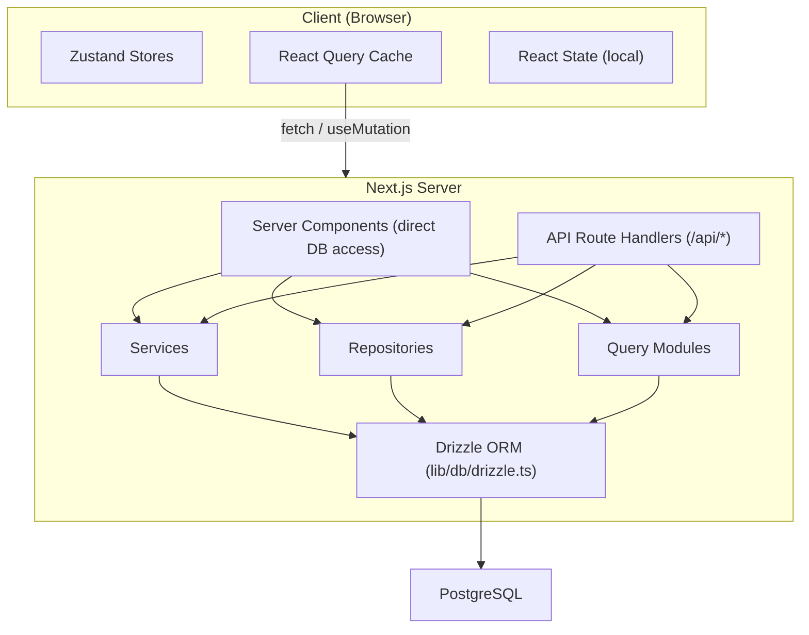

# Gestion des flux de données et de l'état

Ce document décrit comment les données circulent à travers le modèle Ever Works, de la base de données à l'interface utilisateur, couvrant les composants du serveur, les routes API, React Query, les magasins Zustand et le modèle de référentiel.

## Présentation de l'architecture

Le modèle utilise une architecture de données multicouche :



## Récupération de données côté serveur

### Composants du serveur (accès direct à la base de données)

Les composants serveur du répertoire `app/` peuvent directement importer et appeler des fonctions de requête de base de données ou des méthodes de référentiel. Il s’agit du chemin le plus efficace car il évite les allers-retours HTTP inutiles.

```typescript
// app/[locale]/admin/items/page.tsx (simplified)
import { getItems } from '@/lib/db/queries';

export default async function AdminItemsPage() {
  const items = await getItems();
  return <ItemsList items={items} />;
}
```

### Gestionnaires de routes API

Les routes API dans `app/api/` servent de pont entre les composants client et la logique côté serveur. Ils suivent un modèle de gestionnaire léger : valident l'entrée, appellent le service ou le référentiel approprié et renvoient une réponse HTTP.

```typescript
// Typical API route pattern
export async function GET(request: NextRequest) {
  const session = await auth();
  if (!session?.user) {
    return NextResponse.json({ error: 'Unauthorized' }, { status: 401 });
  }

  const data = await someRepository.findAll();
  return NextResponse.json({ success: true, data });
}
```

## Gestion de l'état côté client

### Requête TanStack (requête React 5)

React Query est le principal outil de gestion de l'état du serveur côté client. Le modèle l'utilise largement via des hooks personnalisés dans le répertoire `hooks/`.

**Configuration globale** (`lib/react-query-config.ts`) :
- Temps d'obsolescence par défaut : 5 minutes
- Temps de collecte des déchets : 10 minutes
- Nouvelle tentative automatique avec interruption exponentielle (jusqu'à 3 tentatives)
- Récupérer sur le focus de la fenêtre et se reconnecter
- Aucune nouvelle tentative sur les erreurs client 4xx

**Modèle de crochet** : chaque zone de fonctionnalités possède des hooks dédiés qui enveloppent React Query :

```typescript
// hooks/use-admin-items.ts (simplified pattern)
import { useQuery, useMutation, useQueryClient } from '@tanstack/react-query';

export function useAdminItems(params) {
  return useQuery({
    queryKey: ['admin', 'items', params],
    queryFn: () => fetch('/api/admin/items').then(r => r.json()),
    staleTime: 5 * 60 * 1000,
  });
}

export function useCreateItem() {
  const queryClient = useQueryClient();
  return useMutation({
    mutationFn: (data) => fetch('/api/admin/items', {
      method: 'POST',
      body: JSON.stringify(data),
    }).then(r => r.json()),
    onSuccess: () => {
      queryClient.invalidateQueries({ queryKey: ['admin', 'items'] });
    },
  });
}
```

### Magasins Zustand

Zustand est utilisé pour l'état de l'interface utilisateur client uniquement qui ne nécessite pas de synchronisation du serveur. Les exemples incluent :

- **État du thème** : préférence de mode clair/sombre
- **État du filtre** : sélections de filtres actives
- **État modal** : état ouvert/fermé pour les modaux et les superpositions
- **Préférences de mise en page** : vue Grille ou liste, état de la barre latérale

### Contexte de réaction

Les fournisseurs de contexte React dans `components/context/` et `components/providers/` fournissent un état partagé aux sous-arbres de composants. Le wrapper des fournisseurs racine (`app/[locale]/providers.tsx`) compose :

- Fournisseur React Query (avec client de requête)
- Fournisseur de thème
- Fournisseur de session d'authentification
- Fournisseur de notifications Toast

## Couches d'accès aux données

### Modèle de référentiel

Les référentiels dans `lib/repositories/` fournissent une abstraction propre sur les opérations de base de données. Chaque référentiel encapsule les requêtes pour une entité de domaine spécifique.

```
lib/repositories/
├── admin-analytics-optimized.repository.ts
├── admin-stats.repository.ts
├── category.repository.ts
├── client-dashboard.repository.ts
├── client-item.repository.ts
├── collection.repository.ts
├── integration-mapping.repository.ts
├── item.repository.ts
├── role.repository.ts
├── sponsor-ad.repository.ts
├── tag.repository.ts
├── twenty-crm-config.repository.ts
└── user.repository.ts
```

### Modules de requête

Le répertoire `lib/db/queries/` contient plus de 23 modules de requête organisés par domaine. Ceux-ci fournissent des fonctions de requête brutes Drizzle ORM consommées par les référentiels et les services.

### Couche de services

Le répertoire `lib/services/` contient plus de 30 fichiers de service qui implémentent la logique métier. Les services orchestrent plusieurs référentiels, appels d'API externes et effets secondaires (e-mails, notifications, webhooks).

## Architecture client API

### Client API côté serveur

`lib/api/server-api-client.ts` fournit un client HTTP centralisé pour les appels côté serveur avec :
- Nouvelle tentative automatique avec interruption exponentielle
- Délais d'attente configurables (30 secondes par défaut)
- Journalisation structurée en développement
- Normalisation des erreurs

### Client API côté navigateur

`lib/api/api-client.ts` et `lib/api/api-client-class.ts` fournissent l'abstraction d'API côté client utilisée par les hooks React Query pour appeler des routes d'API.

## Données de contenu (CMS basé sur Git)

Le contenu des éléments (listes de répertoires) est stocké dans un référentiel Git et géré via `lib/content.ts` et `lib/repository.ts`. Ce contenu est cloné dans `.content/` au moment de la construction et synchronisé périodiquement. Le système de contenu utilise `isomorphic-git` pour les opérations Git directement depuis Node.js.

## Stratégie de cache

Le modèle implémente une approche de mise en cache à plusieurs niveaux :

1. **Cache React Query** : côté client avec des temps périmés/GC configurables par requête
2. **Cache Next.js** : rendu côté serveur et cache de données via `lib/cache-config.ts`
3. **Invalidation du cache** : invalidation ciblée via `lib/cache-invalidation.ts` à l'aide de balises de revalidation
4. **Regroupement de connexions de base de données** : configuré dans `lib/db/drizzle.ts` avec des tailles de pool comprises entre 1 et 50 connexions
