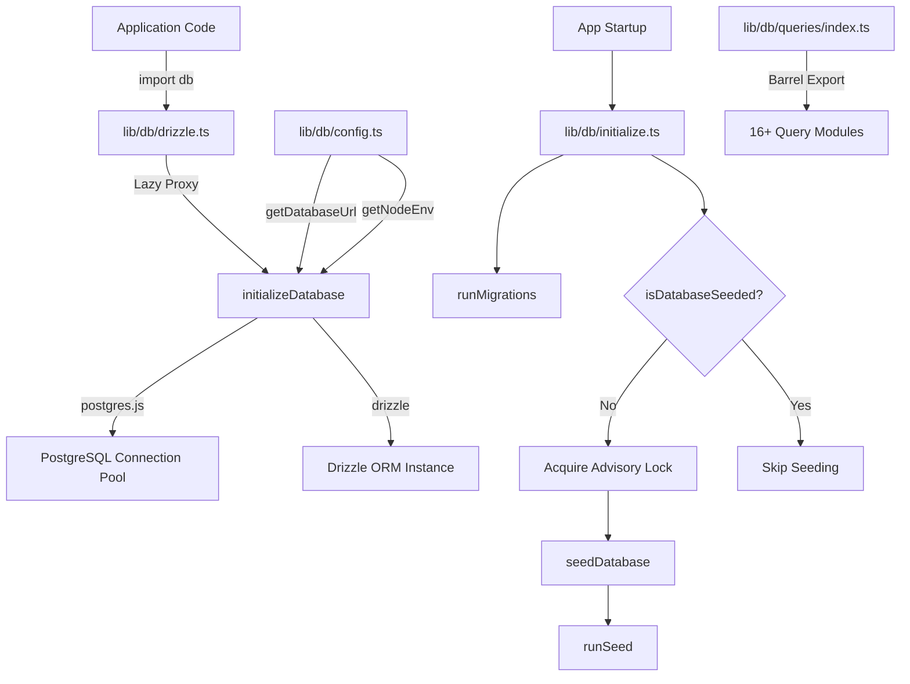
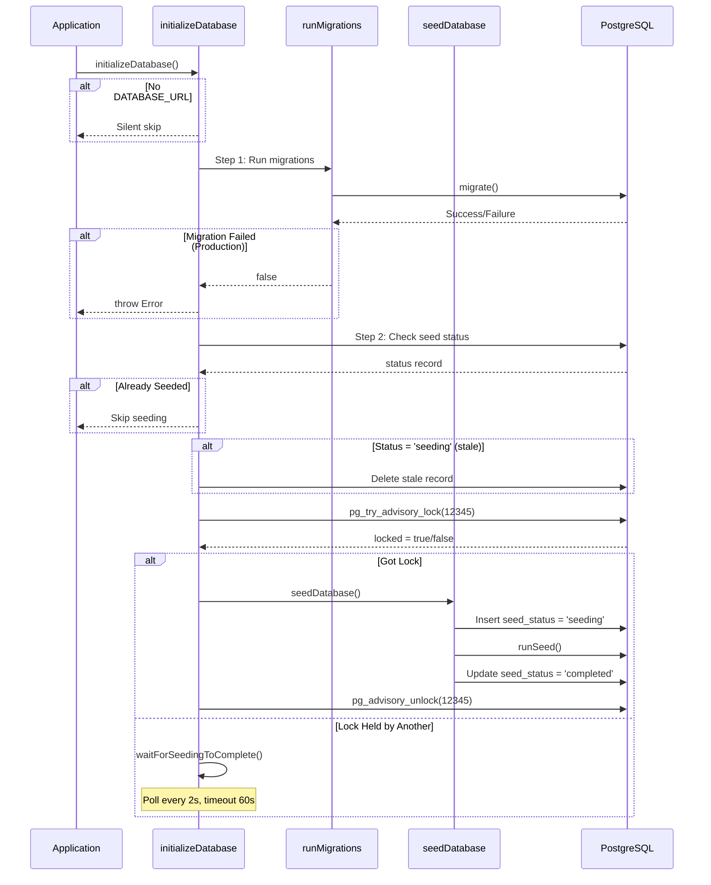

# Module utilitaires de base de données

Le module utilitaires de base de données (`template/lib/db/`) gère le pool de connexions PostgreSQL via `postgres.js`, l'initialisation Drizzle ORM, les migrations automatisées et l'amorçage de la base de données avec verrouillage sécurisé par concurrence. Il est conçu pour fonctionner dans des environnements sans serveur (Vercel) où plusieurs démarrages à froid peuvent s'accélérer pour initialiser la base de données.

## Présentation de l'architecture



## Fichiers sources

|Fichier|Descriptif|
|------|-------------|
|`lib/db/config.ts`|Configuration de base de données sécurisée pour les scripts (pas de `server-only`)|
|`lib/db/drizzle.ts`|Pool de connexions et instance Drizzle avec proxy paresseux|
|`lib/db/initialize.ts`|Migration automatique et orchestration de l'amorçage|
|`lib/db/migrate.ts`|Coureur de migration|
|`lib/db/queries/index.ts`|Exportation en baril pour tous les modules de requête|

## Configuration de la base de données (`config.ts`)

Fonctions sécurisées pour les scripts qui n'importent **pas** `server-only`, permettant une utilisation dans les scripts de migration et de départ :

```typescript
function getDatabaseUrl(): string | undefined;
function getNodeEnv(): 'development' | 'production' | 'test';
function isProduction(): boolean;
```

## Connexion et ORM (`drizzle.ts`)

### Modèle de proxy paresseux

L'export `db` utilise un JavaScript `Proxy` pour différer l'initialisation de la connexion jusqu'à la première utilisation. Cela évite les erreurs de connexion pendant la construction lorsque `DATABASE_URL` peut ne pas être disponible.

```typescript
// Proxy intercepts all property access and initializes on demand
export const db = new Proxy({} as ReturnType<typeof drizzle>, {
  get(target, prop) {
    const database = initializeDatabase();
    return database[prop as keyof typeof database];
  },
});
```

### Configuration du pool de connexions

```typescript
function getPoolSize(): number;
// - Reads DB_POOL_SIZE env var (clamped to 1-50)
// - Defaults: 20 (production), 10 (development)
```

Paramètres de la piscine :
- `idle_timeout` : 20 secondes
- `connect_timeout` : 30 secondes
- `prepare` : false (obligatoire pour certains environnements sans serveur)

### Singleton via `globalThis`

La connexion est mise en cache sur `globalThis` pour survivre aux rechargements à chaud du module Next.js en cours de développement :

```typescript
const globalForDb = globalThis as unknown as {
  conn: postgres.Sql | undefined;
  db: ReturnType<typeof drizzle> | undefined;
};
```

### Accès direct aux instances

Pour les cas nécessitant l'instance Drizzle réelle (par exemple, l'adaptateur NextAuth.js Drizzle) :

```typescript
import { getDrizzleInstance } from '@/lib/db/drizzle';

const adapter = DrizzleAdapter(getDrizzleInstance(), { ... });
```

## Exécuteur de migration (`migrate.ts`)

### `runMigrations(): Promise<boolean>`

Exécute les migrations Drizzle à partir du dossier `./lib/db/migrations`. Vous pouvez faire appel à chaque startup en toute sécurité, car `migrate()` de Drizzle est idempotent : il suit les migrations appliquées dans une table `__drizzle_migrations`.

```typescript
import { runMigrations } from '@/lib/db/migrate';

const success = await runMigrations();
if (!success) {
  console.error('Migrations failed -- run pnpm db:migrate manually');
}
```

**Comportement :**
- Enregistre l'historique de migration récente avant et après l'exécution
- Renvoie `true` en cas de succès, `false` en cas d'échec
- Ne lance pas -- les échecs sont enregistrés et renvoyés sous forme booléenne

## Initialisation de la base de données (`initialize.ts`)

### `initializeDatabase(): Promise<void>`

La fonction d'initialisation principale appelée au démarrage de l'application. Gère le cycle de vie complet :



### Sécurité de la concurrence

Plusieurs instances sans serveur peuvent démarrer simultanément. Le module empêche l'amorçage en double en utilisant :

1. **Verrou consultatif PostgreSQL** (`pg_try_advisory_lock(12345)`) -- non bloquant
2. **Tableau d'état des semences** suivi des états `seeding`, `completed`, `failed`
3. **Détection obsolète** - seuil de 5 minutes pour le statut bloqué `seeding`
4. **Wait-and-poll** : instances qui ne peuvent pas acquérir l'interrogation de verrouillage toutes les 2 secondes.

### Fonctions d'assistance

```typescript
// Check if database has been successfully seeded
async function isDatabaseSeeded(): Promise<boolean>;

// Wait for another instance to finish seeding (60s timeout, 2s intervals)
async function waitForSeedingToComplete(): Promise<boolean>;
```

## Modules de requête

Le répertoire `lib/db/queries/` contient des modules de requêtes spécifiques au domaine, tous réexportés via `index.ts` :

|Module|Domaine|
|--------|--------|
|`activity.queries.ts`|Journalisation des activités|
|`auth.queries.ts`|Authentification (recherche d'utilisateur, vérification du mot de passe)|
|`client.queries.ts`|Profils clients|
|`comment.queries.ts`|Commentaires|
|`company.queries.ts`|Profils d'entreprises|
|`dashboard.queries.ts`|Statistiques du tableau de bord|
|`engagement.queries.ts`|Agrégation de vues, votes, favoris|
|`item.queries.ts`|Article CRUD|
|`location-index.queries.ts`|Indexation basée sur la localisation|
|`newsletter.queries.ts`|Abonnements à la newsletter|
|`payment.queries.ts`|Dossiers de paiement|
|`report.queries.ts`|Rapports|
|`subscription.queries.ts`|Abonnements|
|`survey.queries.ts`|Enquêtes et réponses|
|`user.queries.ts`|Gestion des utilisateurs|
|`vote.queries.ts`|Système de vote|

### Modèle d'importation

```typescript
import {
  getUserByEmail,
  getClientProfileByUserId,
  logActivity,
  isUserAdmin,
} from '@/lib/db/queries';
```

## Variables d'environnement

|Variable|Obligatoire|Descriptif|
|----------|----------|-------------|
|`DATABASE_URL`|Non (DB en option)|Chaîne de connexion PostgreSQL|
|`DB_POOL_SIZE`|Non|Taille du pool de connexions (par défaut : 10/20)|
|`NODE_ENV`|Non|Détermine les valeurs par défaut de la taille du pool et la journalisation|
