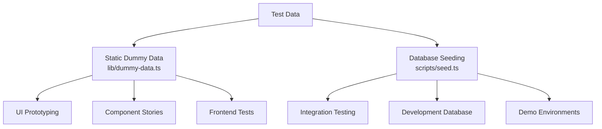
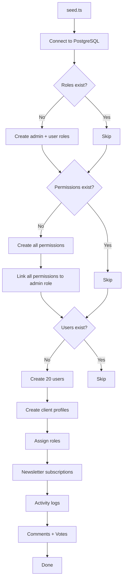
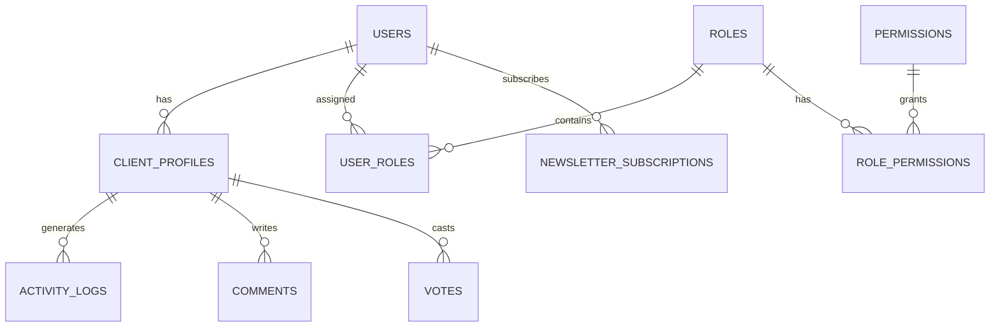

# Système de données factice

Le modèle propose deux approches pour tester les données : des données factices statiques pour le développement et le prototypage de l'interface utilisateur, et un système d'amorçage de base de données pour générer des enregistrements réalistes dans PostgreSQL. Ensemble, ils couvrent le cycle de vie complet du développement, des maquettes aux tests d'intégration.

## Aperçu



## Données factices statiques

Le module `lib/dummy-data.ts` exporte des exemples de données typées pour les utiliser dans les composants pendant le développement.

### Interface de soumission

```typescript
export interface Submission {
  id: string;
  title: string;
  description: string;
  status: "approved" | "pending" | "rejected";
  submittedAt: string | null;
  approvedAt?: string;
  rejectedAt?: string;
  rejectionReason?: string;
  category: string;
  tags: string[];
  views: number;
  likes: number;
}
```

### Soumissions factices

Six exemples de soumissions couvrant tous les états de statut :

|pièce d'identité|Titre|Statut|Catégorie|Vues|J'aime|
|---|---|---|---|---|---|
| 1 |Plateforme de commerce électronique moderne|approuvé|Développement Web| 1250 | 89 |
| 2 |Application de gestion des tâches|en attente|Développement mobile| 567 | 23 |
| 3 |Tableau de bord météo|rejeté|Développement Web| 890 | 45 |
| 4 |Assistant de discussion IA|approuvé|IA/ML| 2100 | 156 |
| 5 |Application de suivi de la condition physique|en attente|Développement mobile| 432 | 18 |
| 6 |Plateforme de blogs|en attente|Développement Web| 0 | 0 |

Utilisation dans les composants :

```typescript
import { dummySubmissions } from '@/lib/dummy-data';

export function SubmissionList() {
  return (
    <div>
      {dummySubmissions.map((submission) => (
        <SubmissionCard key={submission.id} submission={submission} />
      ))}
    </div>
  );
}
```

### mannequinPortfolio

Trois exemples d'éléments de portfolio pour présenter des cartes de projet :

|pièce d'identité|Titre|En vedette|Balises|
|---|---|---|---|
| 1 |Plateforme de commerce électronique|Oui|Next.js, Stripe, E-commerce|
| 2 |Application de gestion des tâches|Oui|Réagir, Firebase, temps réel|
| 3 |Tableau de bord météo|Non|Vue.js, API Météo, Tableau de bord|

Chaque élément du portefeuille comprend :

```typescript
{
  id: string;
  title: string;
  description: string;
  imageUrl: string;      // Unsplash placeholder image
  externalUrl: string;   // Demo link
  tags: string[];
  isFeatured: boolean;
}
```

## Amorçage de base de données

Le script `scripts/seed.ts` génère des données réalistes directement dans PostgreSQL à l'aide de Drizzle ORM.

### Architecture d'ensemencement



### Relations entre les données



### Profils utilisateur générés

Le seeder crée des profils avec une variation déterministe :

```typescript
// Plan distribution
plan: i % 5 === 0 ? 'premium'    // 20% premium
    : i % 3 === 0 ? 'standard'   // ~13% standard
    : 'free';                     // ~67% free

// Job titles alternate
jobTitle: i % 2 === 0 ? 'Developer' : 'Designer';

// Companies alternate
company: i % 2 === 0 ? 'Acme Inc.' : 'Globex';

// Bios for every 3rd user
bio: i % 3 === 0 ? 'Power user' : null;
```

### Modèles de journaux d'activité

Les journaux d'activité passent par quatre types d'actions :

|Modèle d'index|Action|Descriptif|
|---|---|---|
|`i % 4 === 0`|`SIGN_UP`|Création de compte|
|`i % 4 === 1`|`SIGN_IN`|Événement de connexion|
|`i % 4 === 2`|`COMMENT`|Commentaire posté|
|`i % 4 === 3`|`VOTE`|Vote exprimé|

Les horodatages sont randomisés au cours des 7 derniers jours.

### Répartition des votes

Les votes utilisent une répartition 75/25 favorisant les votes positifs :

```typescript
voteType: i % 4 === 0 ? VoteType.DOWNVOTE : VoteType.UPVOTE
```

### Configuration de connexion

Le seeder utilise des paramètres de connexion conservateurs adaptés aux scripts :

```typescript
const conn = postgres(databaseUrl, {
  max: 1,              // Single connection (no pool needed)
  idle_timeout: 20,    // Close idle connections after 20s
  connect_timeout: 10, // 10-second connection timeout
  prepare: false,      // Disable prepared statements
});
```

## Ensemencement de produits à rayures

Le script `scripts/seed-stripe-products.ts` crée le catalogue de facturation dans Stripe. Consultez la documentation [Database Scripts](../development/database-scripts.md) pour la liste complète des produits.

## Idempotence

Les deux approches d’amorçage sont conçues pour être sûres pour une exécution répétée :

|Type de données|État de la garde|Comportement lors de la réexécution|
|---|---|---|
|Rôles|`SELECT * FROM roles LIMIT 1`|Ignorer s'il en existe|
|Autorisations|`SELECT * FROM permissions LIMIT 1`|Ignorer s'il en existe|
|Utilisateurs|`SELECT count(*) FROM users`|Ignorer si nombre > 0|
|Bulletin|Inclus dans le bloc de création d'utilisateur|Ignoré avec les utilisateurs|

## Utilisation de données factices en développement

### Modèle 1 : prototypage de composants

Utilisez des données factices statiques pour créer des composants d'interface utilisateur avant que le backend ne soit prêt :

```typescript
import { dummySubmissions, type Submission } from '@/lib/dummy-data';

interface SubmissionCardProps {
  submission: Submission;
}

export function SubmissionCard({ submission }: SubmissionCardProps) {
  const statusColors = {
    approved: 'bg-green-100 text-green-800',
    pending: 'bg-yellow-100 text-yellow-800',
    rejected: 'bg-red-100 text-red-800',
  };

  return (
    <div className="p-4 border rounded-lg">
      <h3>{submission.title}</h3>
      <span className={statusColors[submission.status]}>
        {submission.status}
      </span>
      <p>{submission.description}</p>
      <div className="flex gap-2">
        {submission.tags.map(tag => (
          <span key={tag} className="badge">{tag}</span>
        ))}
      </div>
    </div>
  );
}
```

### Modèle 2 : maquettes de tableaux de bord

```typescript
import { dummySubmissions } from '@/lib/dummy-data';

// Derive stats from dummy data
const stats = {
  total: dummySubmissions.length,
  approved: dummySubmissions.filter(s => s.status === 'approved').length,
  pending: dummySubmissions.filter(s => s.status === 'pending').length,
  rejected: dummySubmissions.filter(s => s.status === 'rejected').length,
  totalViews: dummySubmissions.reduce((sum, s) => sum + s.views, 0),
};
```

### Modèle 3 : Remplacer par des données réelles

Lorsque l'intégration backend est prête, échangez l'importation :

```typescript
// Before (dummy data)
import { dummySubmissions } from '@/lib/dummy-data';
const submissions = dummySubmissions;

// After (real data)
const submissions = await getSubmissions();
```

## Ajout de nouvelles données factices

Lors de l'ajout de nouvelles fonctionnalités, étendez `lib/dummy-data.ts` avec des exemples de données saisies :

1. Définir l'interface TypeScript pour la forme de données
2. Exportez-le pour l'utiliser dans des composants
3. Créez des exemples d'entrées couvrant les cas extrêmes (champs vides, chaînes de longueur maximale, toutes les valeurs d'état)
4. Utilisez des valeurs réalistes (noms propres, URL valides, chiffres raisonnables)
5. Incluez les éléments en vedette et non en vedette, le cas échéant

```typescript
// Example: adding dummy reviews
export interface DummyReview {
  id: string;
  authorName: string;
  rating: number;
  comment: string;
  createdAt: string;
}

export const dummyReviews: DummyReview[] = [
  {
    id: "1",
    authorName: "Jane Developer",
    rating: 5,
    comment: "Excellent tool for rapid prototyping",
    createdAt: "2024-02-01T10:00:00Z"
  },
  // ... more entries covering 1-star, no comment, etc.
];
```
