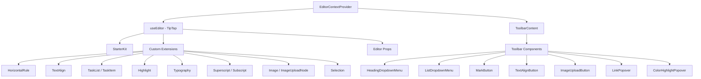

# Système d'édition

Le modèle comprend un éditeur de texte enrichi construit sur TipTap (ProseMirror) avec une architecture modulaire d'extensions, de composants de barre d'outils, de hooks et de fonctions utilitaires. L'éditeur prend en charge les titres, les listes, les listes de tâches, les images, les blocs de code, le formatage du texte, etc.

## Présentation de l'architecture



## Fichiers sources

|Annuaire|Contenu|
|-----------|----------|
|`lib/editor/extensions/`|Réexportations et configuration de l’extension TipTap|
|`lib/editor/components/`|Composants de l'interface utilisateur (boutons de la barre d'outils, popovers, icônes)|
|`lib/editor/hooks/`|Hooks React pour la gestion de l'état de l'éditeur|
|`lib/editor/providers/`|Fournisseur de contexte d'éditeur avec configuration d'extension|
|`lib/editor/contents/`|Disposition de la barre d'outils et composants du contenu de l'éditeur|
|`lib/editor/utils/`|Fonctions utilitaires (raccourcis, validation, téléchargement)|

## Configuration des extensions

Les extensions sont enregistrées dans le `EditorContextProvider`. Le `StarterKit` fournit des fonctionnalités de base, avec des extensions supplémentaires superposées :

```typescript
const extensions = useMemo(() => [
  StarterKit.configure({
    horizontalRule: false,
    link: { openOnClick: false, enableClickSelection: true },
  }),
  HorizontalRule,
  TextAlign.configure({ types: ['heading', 'paragraph'] }),
  ImageUploadNode.configure({
    accept: 'image/*',
    maxSize: MAX_FILE_SIZE, // 5MB
    limit: 3,
    upload: handleImageUpload,
    onError: (error) => console.error('Upload failed:', error),
  }),
  TaskList,
  TaskItem.configure({ nested: true }),
  Highlight.configure({ multicolor: true }),
  Image,
  Typography,
  Superscript,
  Subscript,
  Selection,
], []);
```

### Résumé des extensions

|Rallonge|Origine|Objectif|
|-----------|--------|---------|
|`StarterKit`|`@tiptap/starter-kit`|Paragraphes, gras, italique, listes, code, blockquote|
|`HorizontalRule`|`@tiptap/extension-horizontal-rule`|Diviseurs horizontaux|
|`TextAlign`|`@tiptap/extension-text-align`|Gauche, centre, droite, justifier l'alignement|
|`TaskList` / `TaskItem`|`@tiptap/extension-list`|Listes de cases à cocher interactives|
|`Highlight`|`@tiptap/extension-highlight`|Surlignage de texte multicolore|
|`Typography`|`@tiptap/extension-typography`|Citations intelligentes, tirets, points de suspension|
|`Superscript`|`@tiptap/extension-superscript`|Texte en exposant|
|`Subscript`|`@tiptap/extension-subscript`|Texte d'indice|
|`Selection`|`@tiptap/extensions`|Gestion améliorée de la sélection|
|`Image`|`@tiptap/extension-image`|Affichage d'images statiques|
|`ImageUploadNode`|Personnalisé|Téléchargement d'images par glisser-déposer avec progression|

## Fournisseur de contexte d'éditeur

L'éditeur est fourni via React Context pour un accès à l'échelle de l'arborescence :

```typescript
export const EditorContext = createContext<Editor | null>(null);

export function EditorContextProvider({ children }: { children: React.ReactNode }) {
  const editor = useEditor({
    immediatelyRender: false,
    shouldRerenderOnTransaction: false,
    editorProps: {
      attributes: {
        autocomplete: 'on',
        autocorrect: 'on',
        autocapitalize: 'off',
        'aria-label': 'Main content area, start typing to enter text.',
        class: cn('min-h-96'),
      },
    },
    extensions,
  });

  return <EditorContext.Provider value={editor}>{children}</EditorContext.Provider>;
}
```

Choix de configuration clés :
- `immediatelyRender: false` évite les inadéquations d'hydratation SSR
- `shouldRerenderOnTransaction: false` optimise les performances en évitant les nouveaux rendus inutiles

## Configuration de la barre d'outils

Le composant `ToolbarContent` définit la disposition complète de la barre d'outils organisée en groupes :

|Groupe|Composants|
|-------|------------|
|Histoire|Annuler, Refaire|
|Types de blocs|Liste déroulante des titres (H1-H4), liste déroulante (puce, ordonnée, tâche), blockquote, bloc de code|
|Marques en ligne|Gras, italique, barré, code, souligné, surbrillance de couleur, lien|
|Scénario|Exposant, Indice|
|Alignement|Gauche, Centre, Droite, Justifier|
|Médias|Téléchargement d'images|

Les groupes sont séparés par des composants `ToolbarSeparator` avec des éléments `Spacer` pour le positionnement.

## Crochets de l'éditeur

### `useTiptapEditor`

Fournit un accès flexible à l'instance de l'éditeur à partir d'accessoires ou de contexte :

```typescript
export function useTiptapEditor(providedEditor?: Editor | null): {
  editor: Editor | null;
  editorState?: Editor["state"];
  canCommand?: Editor["can"];
}
```

Ce hook fusionne un éditeur directement fourni avec l'éditeur de contexte, permettant aux composants de fonctionner à la fois de manière autonome et au sein de l'arborescence des fournisseurs.

### Crochets supplémentaires

|Crochet|Objectif|
|------|---------|
|`use-editor.ts`|Gestion de l'état de l'éditeur principal|
|`use-editor-sync.ts`|Synchronisation entre les instances de l'éditeur|
|`use-cursor-visibility.ts`|Position du curseur et suivi de la visibilité|
|`use-element-rect.ts`|Suivi du rectangle de délimitation des éléments|
|`use-scrolling.ts`|Position et comportement du défilement|
|`use-throttled-callback.ts`|Exécution de rappel limitée|
|`use-window-size.ts`|Suivi réactif de la taille des fenêtres|
|`use-unmount.ts`|Nettoyage lors du démontage du composant|

## Fonctions utilitaires

### Formatage des touches de raccourci

Le système gère les raccourcis clavier spécifiques à la plate-forme :

```typescript
export const MAC_SYMBOLS: Record<string, string> = {
  mod: "Command", command: "Command", meta: "Command",
  ctrl: "Ctrl", alt: "Option", shift: "Shift",
  // ... additional mappings
};

export const formatShortcutKey = (key: string, isMac: boolean, capitalize?: boolean) => {
  // Returns Mac symbols or formatted key names
};

export const parseShortcutKeys = (props: {
  shortcutKeys: string | undefined;
  delimiter?: string;
  capitalize?: boolean;
}) => string[];
```

### Validation du schéma

```typescript
// Check if a mark type exists in the editor schema
export const isMarkInSchema = (markName: string, editor: Editor | null): boolean;

// Check if a node type exists in the editor schema
export const isNodeInSchema = (nodeName: string, editor: Editor | null): boolean;

// Check if extensions are registered
export function isExtensionAvailable(editor: Editor | null, extensionNames: string | string[]): boolean;
```

### Navigation dans les nœuds

```typescript
// Find a node at a specific document position
export function findNodeAtPosition(editor: Editor, position: number): TiptapNode | null;

// Find a node by reference or position
export function findNodePosition(props: {
  editor: Editor | null;
  node?: TiptapNode | null;
  nodePos?: number | null;
}): { pos: number; node: TiptapNode } | null;

// Move focus to the next node
export function focusNextNode(editor: Editor): boolean;
```

### Téléchargement d'images

```typescript
export const MAX_FILE_SIZE = 5 * 1024 * 1024; // 5MB

export const handleImageUpload = async (
  file: File,
  onProgress?: (event: { progress: number }) => void,
  abortSignal?: AbortSignal
): Promise<string>;
```

Le gestionnaire de téléchargement valide la taille du fichier, prend en charge le suivi de la progression et gère l'annulation via `AbortSignal`.

### Nettoyage des URL

```typescript
export function isAllowedUri(uri: string | undefined, protocols?: ProtocolConfig): boolean;
export function sanitizeUrl(inputUrl: string, baseUrl: string, protocols?: ProtocolConfig): string;
```

Garantit que seuls les protocoles sécurisés (`http`, `https`, `ftp`, `mailto`, etc.) sont autorisés dans les liens. Les URL non sécurisées sont remplacées par `"#"`.
