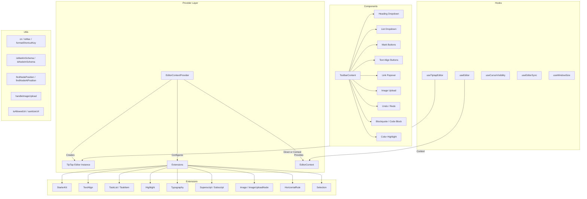

# Module utilitaires d'édition

Le module d'utilitaires d'édition (`template/lib/editor/`) fournit une solution complète d'édition de texte riche basée sur **TipTap** (ProseMirror). Il comprend un fournisseur d'éditeur préconfiguré, des extensions TipTap, une bibliothèque complète de composants de barre d'outils, des fonctions utilitaires pour la manipulation du DOM et des hooks React personnalisés pour la gestion de l'état de l'éditeur.

## Présentation de l'architecture



## Fichiers sources

|Annuaire|Descriptif|
|-----------|-------------|
|`lib/editor/index.ts`|Exportation de barils pour tous les sous-modules|
|`lib/editor/providers/`|`EditorContextProvider` et `EditorContext`|
|`lib/editor/extensions/`|Réexportations de l'extension TipTap|
|`lib/editor/hooks/`|Crochets React personnalisés|
|`lib/editor/utils/`|Fonctions utilitaires|
|`lib/editor/contents/`|Composants `ToolbarContent` et `EditorContent`|
|`lib/editor/components/`|Primitives de l'interface utilisateur, boutons de la barre d'outils, icônes, nœuds|
|`lib/editor/styles/`|Styles CSS de l'éditeur|

## Fournisseur d'éditeur

### `EditorContextProvider`

Encapsule les enfants avec une instance d'éditeur TipTap préconfigurée :

```tsx
import { EditorContextProvider } from '@/lib/editor';

function MyEditor() {
  return (
    <EditorContextProvider>
      <ToolbarContent editor={null} />
      <EditorContent />
    </EditorContextProvider>
  );
}
```

### Configuration

Le fournisseur configure TipTap avec ces paramètres :

```typescript
const editor = useEditor({
  immediatelyRender: false,
  shouldRerenderOnTransaction: false,
  editorProps: {
    attributes: {
      autocomplete: 'on',
      autocorrect: 'on',
      autocapitalize: 'off',
      'aria-label': 'Main content area, start typing to enter text.',
      class: 'min-h-96',
    },
  },
  extensions: [/* ... */],
});
```

### Extensions préconfigurées

|Rallonge|Configuration|
|-----------|--------------|
|`StarterKit`|`horizontalRule: false`, `link.openOnClick: false`|
|`HorizontalRule`|Par défaut|
|`TextAlign`|S'applique aux nœuds `heading` et `paragraph`|
|`ImageUploadNode`|Accepter : `image/*`, maximum 5 Mo, limite de 3 images|
|`TaskList` / `TaskItem`|Tâches imbriquées activées|
|`Highlight`|Multicolore activé|
|`Image`|Par défaut|
|`Typography`|Citations et tirets intelligents|
|`Superscript` / `Subscript`|Par défaut|
|`Selection`|Par défaut|

## Crochets

### `useEditor(): Editor`

Récupère l’instance de l’éditeur à partir du `EditorContext`. Doit être utilisé dans un `EditorContextProvider`.

```typescript
import { useEditor } from '@/lib/editor';

function MyComponent() {
  const editor = useEditor();
  // editor is the TipTap Editor instance
}
```

### `useTiptapEditor(providedEditor?): { editor, editorState?, canCommand? }`

Hook flexible qui accepte une instance d'éditeur facultative ou revient au contexte TipTap :

```typescript
import { useTiptapEditor } from '@/lib/editor/hooks';

function ToolbarButton({ editor: externalEditor }) {
  const { editor, editorState, canCommand } = useTiptapEditor(externalEditor);

  const isBold = editorState ? editor?.isActive('bold') : false;
  const canBold = canCommand ? canCommand().toggleBold() : false;
}
```

### Autres crochets

|Crochet|Objectif|
|------|---------|
|`useCursorVisibility`|Suit la visibilité de la position du curseur dans la fenêtre|
|`useEditorSync`|Synchronise le contenu de l'éditeur avec l'état externe|
|`useElementRect`|Rectangle de délimitation de l'élément Tracks|
|`useScrolling`|Détecte l'état du défilement|
|`useThrottledCallback`|Limite une fonction de rappel|
|`useUnmount`|Exécute le nettoyage lors du démontage du composant|
|`useWindowSize`|Dimensions de la fenêtre des pistes|

## Fonctions utilitaires

### Assistant de nom de classe

```typescript
function cn(...classes: (string | boolean | undefined | null)[]): string;
// Filters falsy values and joins with space
cn('min-h-96', isActive && 'bg-blue-500', undefined); // 'min-h-96 bg-blue-500'
```

### Détection de plate-forme

```typescript
function isMac(): boolean;
// Returns true if navigator.platform includes 'mac'
```

### Formatage des touches de raccourci

```typescript
function formatShortcutKey(key: string, isMac: boolean, capitalize?: boolean): string;
// Mac: 'ctrl' -> '???', 'alt' -> '???', 'shift' -> '???', 'meta' -> '???'
// Windows: 'ctrl' -> 'Ctrl'

function parseShortcutKeys(props: {
  shortcutKeys: string | undefined;
  delimiter?: string;    // default: '+'
  capitalize?: boolean;  // default: true
}): string[];
// 'ctrl+shift+b' -> ['???', '???', 'B'] (Mac) or ['Ctrl', 'Shift', 'B'] (Windows)
```

### Inspection du schéma

```typescript
function isMarkInSchema(markName: string, editor: Editor | null): boolean;
// Checks if a mark type exists in the editor schema

function isNodeInSchema(nodeName: string, editor: Editor | null): boolean;
// Checks if a node type exists in the editor schema

function isExtensionAvailable(editor: Editor | null, extensionNames: string | string[]): boolean;
// Checks if one or more extensions are registered
// Logs a warning if none found
```

### Opérations de nœud

```typescript
function findNodeAtPosition(editor: Editor, position: number): TiptapNode | null;
// Returns the node at the given document position

function findNodePosition(props: {
  editor: Editor | null;
  node?: TiptapNode | null;
  nodePos?: number | null;
}): { pos: number; node: TiptapNode } | null;
// Finds position by node reference or position number

function focusNextNode(editor: Editor): boolean;
// Moves cursor to the next node, creating a paragraph if at end

function isNodeTypeSelected(editor: Editor | null, types: string[]): boolean;
// Checks if current selection is a NodeSelection matching any type

function isValidPosition(pos: number | null | undefined): pos is number;
// Type guard for valid document positions (>= 0)
```

### Téléchargement d'images

```typescript
const MAX_FILE_SIZE = 5 * 1024 * 1024; // 5MB

async function handleImageUpload(
  file: File,
  onProgress?: (event: { progress: number }) => void,
  abortSignal?: AbortSignal,
): Promise<string>;
// Returns the URL of the uploaded image
// Default implementation is a demo stub -- replace with actual upload logic
```

### Validation d'URL

```typescript
function isAllowedUri(uri: string | undefined, protocols?: ProtocolConfig): boolean;
// Checks URI against allowed protocols:
// http, https, ftp, ftps, mailto, tel, callto, sms, cid, xmpp
// Plus any custom protocols passed in

function sanitizeUrl(inputUrl: string, baseUrl: string, protocols?: ProtocolConfig): string;
// Returns sanitized URL or '#' if not allowed
```

## Contenu de la barre d'outils

Le composant `ToolbarContent` fournit une barre d'outils complète et préconfigurée :

```tsx
import { ToolbarContent } from '@/lib/editor/contents';

<ToolbarContent editor={editor} />
```

### Groupes de barre d'outils

|Groupe|Composants|
|-------|-----------|
|Annuler/Rétablir|`UndoRedoButton` (annuler, refaire)|
|Formatage de bloc|`HeadingDropdownMenu` (H1-H4), `ListDropdownMenu` (puce, ordonnée, tâche), `BlockquoteButton`, `CodeBlockButton`|
|Formatage en ligne|`MarkButton` (gras, italique, barré, codé, souligné), `ColorHighlightPopover`, `LinkPopover`|
|Exposant|`MarkButton` (exposant, indice)|
|Alignement du texte|`TextAlignButton` (gauche, centre, droite, justifier)|
|Médias|`ImageUploadButton`|

## Bibliothèque de composants

### Composants primitifs

Composants de base de l'interface utilisateur utilisés par les boutons de la barre d'outils :

- `Badge`, `Button`, `Card`, `DropdownMenu`, `Input`, `Popover`, `Separator`, `Spacer`, `Toolbar`, `Tooltip`

### Composants de nœud

Vues personnalisées des nœuds TipTap :

- `HorizontalRuleNode` -- extension de règle horizontale personnalisée
- `ImageUploadNode` -- nœud de téléchargement de fichiers par glisser-déposer

### Composants d'icône

Icônes SVG pour toutes les actions de la barre d'outils (gras, italique, niveaux de titre, listes, alignement, etc.).
