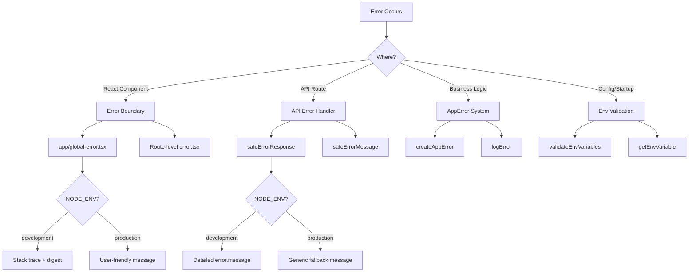

# Modèles de gestion des erreurs

## Aperçu

Le modèle Ever Works implémente une stratégie de gestion des erreurs à plusieurs niveaux qui couvre les limites d'erreur de React, les réponses aux erreurs de routage de l'API, les erreurs d'application typées et la validation des variables d'environnement. La conception donne la priorité à la sécurité (pas de fuite d'informations en production) tout en conservant un débogage convivial pour les développeurs en cours de développement.

## Architecture



## Fichiers sources

|Fichier|Objectif|
|------|---------|
|`template/app/global-error.tsx`|Limite d'erreur React au niveau racine|
|`template/app/not-found.tsx`|404 Page introuvable|
|`template/lib/utils/api-error.ts`|Utilitaires d'erreur de routage API|
|`template/lib/utils/error-handler.ts`|Types d’erreurs d’application et journalisation|
|`template/lib/auth/error-handler.ts`|Gestion des erreurs spécifiques à l'authentification|

## Réagir aux limites d’erreur

### Limite d'erreur globale

Le fichier `global-error.tsx` détecte les erreurs non gérées à la racine de l'application :

```typescript
'use client';

export default function GlobalError({
    error,
    reset,
}: {
    error: Error & { digest?: string };
    reset: () => void;
}) {
    useEffect(() => {
        console.error(error);
    }, [error]);

    return (
        <html lang="en">
            <body>
                <h1>Something went wrong!</h1>
                {process.env.NODE_ENV !== 'production' && (
                    <div>
                        <p className="text-red-600">{error.message}</p>
                        {error.stack && <pre>{error.stack}</pre>}
                        {error.digest && <p>Error ID: {error.digest}</p>}
                    </div>
                )}
                <Button onPress={() => reset()}>Refresh</Button>
                <Link href="/">Go Home</Link>
            </body>
        </html>
    );
}
```

Comportements clés :
- **Développement** : affiche le message d'erreur, la trace de la pile et le résumé des erreurs
- **Production** : affiche uniquement un message générique
- **Résumé d'erreur** : un identifiant unique généré par Next.js pour la corrélation des erreurs côté serveur
- **Fonction de réinitialisation** : restitue le sous-arbre de limite d'erreur
- **HTML autonome** : inclut ses propres balises `<html>` et `<body>` puisqu'il remplace la page entière

### Page introuvable

```typescript
'use client';

export default function NotFound() {
    const router = useRouter();
    return (
        <div>
            <h1>404</h1>
            <h2>Page Not Found</h2>
            <Button onClick={() => router.back()}>Go Back</Button>
            <Button onClick={() => router.push('/')}>Back to Home</Button>
        </div>
    );
}
```

## Gestion des erreurs API

### réponse d'erreur sûre

L'utilitaire principal pour les réponses aux erreurs de route API :

```typescript
export function safeErrorResponse(
    error: unknown,
    fallbackMessage: string,
    status: number = 500
): NextResponse {
    const detail = error instanceof Error ? error.message : String(error);

    // Always log full details server-side
    console.error(`[API Error] ${fallbackMessage}:`, detail);

    const message = process.env.NODE_ENV === "development" ? detail : fallbackMessage;

    return NextResponse.json({ success: false, error: message }, { status });
}
```

Utilisation dans les routes API :

```typescript
export async function GET(request: NextRequest) {
    try {
        const result = await someOperation();
        return NextResponse.json(result);
    } catch (error) {
        return safeErrorResponse(error, 'Failed to process request');
    }
}
```

### message d'erreur sécurisé

Pour les cas où vous avez besoin de la chaîne d'erreur sans créer de réponse :

```typescript
export function safeErrorMessage(error: unknown, fallbackMessage: string): string {
    if (process.env.NODE_ENV === "development") {
        return error instanceof Error ? error.message : String(error);
    }
    return fallbackMessage;
}
```

## Système d'erreur d'application

### Types d'erreurs

```typescript
export enum ErrorType {
    AUTH = 'auth',
    CONFIG = 'config',
    DATABASE = 'database',
    NETWORK = 'network',
    VALIDATION = 'validation',
    UNKNOWN = 'unknown'
}

export interface AppError {
    message: string;
    type: ErrorType;
    code?: string;
    originalError?: unknown;
}
```

### Création d'erreurs de saisie

```typescript
import { createAppError, ErrorType } from '@/lib/utils/error-handler';

const error = createAppError(
    'Failed to configure OAuth providers',
    ErrorType.CONFIG,
    'OAUTH_CONFIG_FAILED',
    originalError
);
```

### Journalisation structurée des erreurs

```typescript
import { logError } from '@/lib/utils/error-handler';

// Logs: [CONFIG] [Auth Config]: Failed to configure OAuth providers
// Logs: Error code: OAUTH_CONFIG_FAILED
// Logs: Original error: <original error details>
logError(error, 'Auth Config');
```

La fonction `logError` gère trois formes d'erreur :
1. **AppError** - journal structuré avec le type, le code et l'erreur d'origine
2. **Erreur** -- journal standard avec message et trace de pile
3. **Inconnu** -- journal de secours avec coercition de chaîne

### Validation des variables d'environnement

```typescript
import { validateEnvVariables, getEnvVariable } from '@/lib/utils/error-handler';

// Validate multiple variables at once
const validationError = validateEnvVariables([
    'DATABASE_URL', 'AUTH_SECRET', 'CRON_SECRET'
]);
if (validationError) {
    logError(validationError, 'Startup');
}

// Get a single required variable (throws if missing)
const dbUrl = getEnvVariable('DATABASE_URL');

// Get an optional variable
const optional = getEnvVariable('OPTIONAL_VAR', false);
```

## Gestion des erreurs dans l'authentification

La configuration d'authentification utilise une dégradation gracieuse :

```typescript
const configureProviders = () => {
    try {
        const oauthProviders = configureOAuthProviders();
        return createNextAuthProviders({ /* full config */ });
    } catch (error) {
        const appError = createAppError(
            'Failed to configure OAuth providers. Falling back to credentials only.',
            ErrorType.CONFIG,
            'OAUTH_CONFIG_FAILED',
            error
        );
        logError(appError, 'Auth Config');

        // Fallback to credentials only
        return createNextAuthProviders({
            credentials: { enabled: true },
            google: { enabled: false },
            github: { enabled: false },
            facebook: { enabled: false },
            twitter: { enabled: false },
        });
    }
};
```

Si la configuration du fournisseur OAuth échoue, le système revient à l'authentification par informations d'identification uniquement plutôt que de planter.

## Flux de gestion des erreurs par couche

|Couche|Stratégie|Comportement de production|
|-------|----------|-------------------|
|Composants de réaction|Limite d'erreur (`global-error.tsx`)|Message générique, aucune trace de pile|
|Itinéraires API|`safeErrorResponse()`|Message de secours générique|
|Actions du serveur|`validatedAction()` détecte les erreurs Zod|Premier message d'erreur de validation|
|Configuration d'authentification|Essayez/attrapez avec `createAppError()`|Dégradation gracieuse des informations d'identification|
|Emplois Cron|Try/catch + journalisation structurée|Erreur enregistrée, réponse renvoyée|
|Webhooks|Try/catch + 400 réponses|Message d'échec générique au fournisseur|

## Meilleures pratiques

1. **N'exposez jamais les éléments internes en production** - utilisez toujours `safeErrorResponse` pour les routes API
2. **Enregistrez tout côté serveur** - les détails complets de l'erreur sont affichés dans la console/la journalisation, quel que soit l'environnement.
3. **Utilisez des erreurs de frappe** -- `createAppError` avec `ErrorType` pour une catégorisation cohérente
4. **Dégradation progressive** -- revenez à des fonctionnalités réduites plutôt que de planter
5. **Résumés d'erreurs pour la corrélation** : utilisez le champ `digest` des erreurs Next.js pour suivre les problèmes côté serveur.
6. **Valider aux limites** -- vérifier les variables d'environnement au démarrage, valider l'entrée aux limites de l'API
