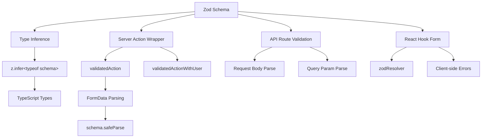

# Modèles de validation de formulaire

## Aperçu

Le modèle Ever Works utilise **Zod** comme source unique de vérité pour la validation des données au-delà des limites du client et du serveur. Les schémas de validation sont organisés en `lib/validations/` et sont consommés par :

- **Actions du serveur** via les wrappers `validatedAction()` et `validatedActionWithUser()`
- **Gestionnaires de routes API** pour la validation du corps de la requête/des paramètres de requête
- Intégration de **React Hook Form** pour la validation de formulaire côté client
- **Inférence de type** via `z.infer<>` pour une sécurité de type de bout en bout

## Architecture



## Fichiers sources

|Fichier|Objectif|
|------|---------|
|`template/lib/validations/auth.ts`|Schéma de validation du mot de passe|
|`template/lib/validations/company.ts`|Schémas CRUD de l’entreprise|
|`template/lib/validations/client-item.ts`|Schémas de soumission/mise à jour d'éléments clients|
|`template/lib/validations/client-dashboard.ts`|Schémas de requête du tableau de bord|
|`template/lib/validations/sponsor-ad.ts`|Schémas du cycle de vie des publicités sponsorisées|
|`template/lib/validations/item.ts`|Schéma des données de localisation|
|`template/lib/validations/user-location.ts`|Schéma des paramètres de localisation de l'utilisateur|
|`template/lib/auth/middleware.ts`|`validatedAction` / `validatedActionWithUser` utilitaires|

## Modèles de schéma de validation

### Modèle 1 : validation du mot de passe avec des règles chaînées

```typescript
import { z } from "zod";

export const passwordSchema = z
    .string()
    .min(8, "Password must be at least 8 characters")
    .regex(/[A-Z]/, "Password must contain at least one uppercase letter")
    .regex(/[a-z]/, "Password must contain at least one lowercase letter")
    .regex(/[0-9]/, "Password must contain at least one number")
    .regex(/[^A-Za-z0-9]/, "Password must contain at least one special character");
```

Ce schéma applique des exigences de mot de passe strictes grâce à des raffinements chaînés. Chaque `.regex()` fournit un message d'erreur spécifique que l'interface utilisateur peut afficher en ligne.

### Modèle 2 : créer/mettre à jour des paires de schémas

La validation de l'entreprise démontre le modèle de création/mise à jour :

```typescript
export const createCompanySchema = z.object({
    name: z.string().min(1, "Company name is required").max(255),
    website: z.string().url("Invalid URL format").optional().or(z.literal("")),
    domain: z.string().max(255).optional()
        .transform((val) => val?.toLowerCase().trim() || undefined),
    slug: z.string().max(255).optional()
        .transform((val) => val?.toLowerCase().trim() || undefined)
        .refine(
            (val) => !val || /^[a-z0-9-]+$/.test(val),
            { message: "Slug must contain only lowercase letters, numbers, and hyphens" }
        ),
    status: z.enum(companyStatus).default("active"),
});

export const updateCompanySchema = z.object({
    id: z.string().uuid(),
    name: z.string().min(1).max(255).optional(),  // Optional for updates
    // ... other fields also optional
    status: z.enum(companyStatus).optional(),
});
```

Principales différences :
- **Créer des schémas** comporte des champs obligatoires avec des valeurs par défaut
- **Les schémas de mise à jour** nécessitent un `id` et rendent tous les autres champs facultatifs
- Les deux partagent la logique `.transform()` pour la normalisation (par exemple, les slugs minuscules)

### Modèle 3 : champs d'état basés sur une énumération

```typescript
export const companyStatus = ["active", "inactive"] as const;
export const itemStatus = ['pending', 'approved', 'rejected'] as const;
export const sponsorAdStatuses = [
    "pending_payment", "pending", "rejected",
    "active", "expired", "cancelled",
] as const;

// Usage in schemas
status: z.enum(companyStatus).default("active"),
status: z.enum(sponsorAdStatuses).optional(),
```

L'utilisation de tableaux `as const` avec `z.enum()` fournit à la fois la validation d'exécution et la sécurité du type au moment de la compilation.

### Modèle 4 : schémas de paramètres de requête avec transformations

```typescript
export const clientItemsListQuerySchema = z.object({
    page: z.string().optional()
        .transform(val => (val ? parseInt(val, 10) : 1))
        .refine(val => !Number.isNaN(val), { message: 'Page must be a valid number' })
        .refine(val => val >= 1, { message: 'Page must be at least 1' }),
    limit: z.string().optional()
        .transform(val => (val ? parseInt(val, 10) : 10))
        .refine(val => val >= 1 && val <= 100, { message: 'Limit must be between 1 and 100' }),
    status: z.enum(clientStatusFilter).optional().default('all'),
    search: z.string().max(100, 'Search query is too long').optional(),
    sortBy: z.enum(['name', 'updated_at', 'status', 'submitted_at']).optional().default('updated_at'),
    sortOrder: z.enum(['asc', 'desc']).optional().default('desc'),
    deleted: z.string().optional().transform(val => val === 'true'),
});
```

Les paramètres de requête arrivent sous forme de chaînes. Le schéma utilise `.transform()` pour les convertir dans les types corrects (nombres, booléens) tout en appliquant la validation et les valeurs par défaut.

### Modèle 5 : Schémas d'objets imbriqués avec validation inter-champs

```typescript
export const updateLocationSchema = z
    .object({
        defaultLatitude: z.number().min(-90).max(90).nullable().optional(),
        defaultLongitude: z.number().min(-180).max(180).nullable().optional(),
        defaultCity: z.string().max(200).nullable().optional(),
        defaultCountry: z.string().max(100).nullable().optional(),
        locationPrivacy: locationPrivacySchema.optional(),
    })
    .refine(
        (data) => {
            const hasLat = data.defaultLatitude != null;
            const hasLng = data.defaultLongitude != null;
            return hasLat === hasLng;  // Both or neither
        },
        { message: 'Both latitude and longitude must be provided together' }
    );
```

Le `.refine()` au niveau de l'objet valide les dépendances entre champs : la latitude et la longitude doivent toutes deux être présentes ou toutes deux absentes.

### Modèle 6 : Types d'union pour des entrées flexibles

```typescript
category: z.union([
    z.string().min(1, 'Category is required'),
    z.array(z.string().min(1)).min(1, 'At least one category is required'),
]).optional().nullable(),
```

Cela accepte à la fois une seule chaîne et un tableau de chaînes pour le champ de catégorie, s'adaptant à différents types de saisie de formulaire.

## Validation côté serveur

### Wrapper d'action validé

```typescript
export function validatedAction<S extends z.ZodType<any, any>, T>(
    schema: S,
    action: ValidatedActionFunction<S, T>
) {
    return async (prevState: ActionState, formData: FormData): Promise<T> => {
        const result = schema.safeParse(Object.fromEntries(formData));
        if (!result.success) {
            return { error: result.error.issues[0].message } as T;
        }
        return action(result.data, formData);
    };
}
```

Cette fonction d'ordre supérieur :
1. Convertit `FormData` en un objet simple
2. Valide par rapport au schéma Zod en utilisant `safeParse()`
3. Renvoie la première erreur de validation si elle n'est pas valide
4. Appelle la fonction d'action avec des données analysées et saisies si elles sont valides

### validatedActionWithUser Wrapper

```typescript
export function validatedActionWithUser<S extends z.ZodType<any, any>, T>(
    schema: S,
    action: ValidatedActionWithUserFunction<S, T>
) {
    return async (prevState: ActionState, formData: FormData): Promise<T> => {
        const session = await auth();
        if (!session?.user) {
            throw new Error("User is not authenticated");
        }
        const result = schema.safeParse(Object.fromEntries(formData));
        if (!result.success) {
            return { error: result.error.issues[0].message } as T;
        }
        return action(result.data, formData, session.user);
    };
}
```

Cela ajoute un contrôle d'authentification avant validation, en transmettant l'objet `user` authentifié à la fonction d'action.

## Inférence de type

Chaque schéma exporte les types TypeScript déduits :

```typescript
export type CreateCompanyInput = z.infer<typeof createCompanySchema>;
export type UpdateCompanyInput = z.infer<typeof updateCompanySchema>;
export type ClientUpdateItemInput = z.infer<typeof clientUpdateItemSchema>;
export type ClientCreateItemInput = z.infer<typeof clientCreateItemSchema>;
```

Ces types sont utilisés tout au long de la couche de service et des routes API, garantissant que la forme des données validées correspond à ce que la logique métier attend.

## Meilleures pratiques

1. **Schéma unique, consommateurs multiples** -- définir une fois dans `lib/validations/`, utiliser partout
2. **Transformer à la limite** -- utilisez `.transform()` pour convertir les chaînes en types appropriés
3. **Messages d'erreur personnalisés** : chaque règle de validation comprend un message convivial
4. **Sous-schémas partagés** : réutilisez des schémas tels que `locationSchema` et `passwordSchema` dans tous les formulaires.
5. **Inférer des types à partir de schémas** : ne définissez jamais manuellement des types qui dupliquent les définitions de schéma.
6. **Validation inter-champs** -- utilisez `.refine()` au niveau de l'objet pour les règles multi-champs
7. **Paramètres par défaut raisonnables** -- utilisez `.default()` pour les champs facultatifs avec des valeurs standard
