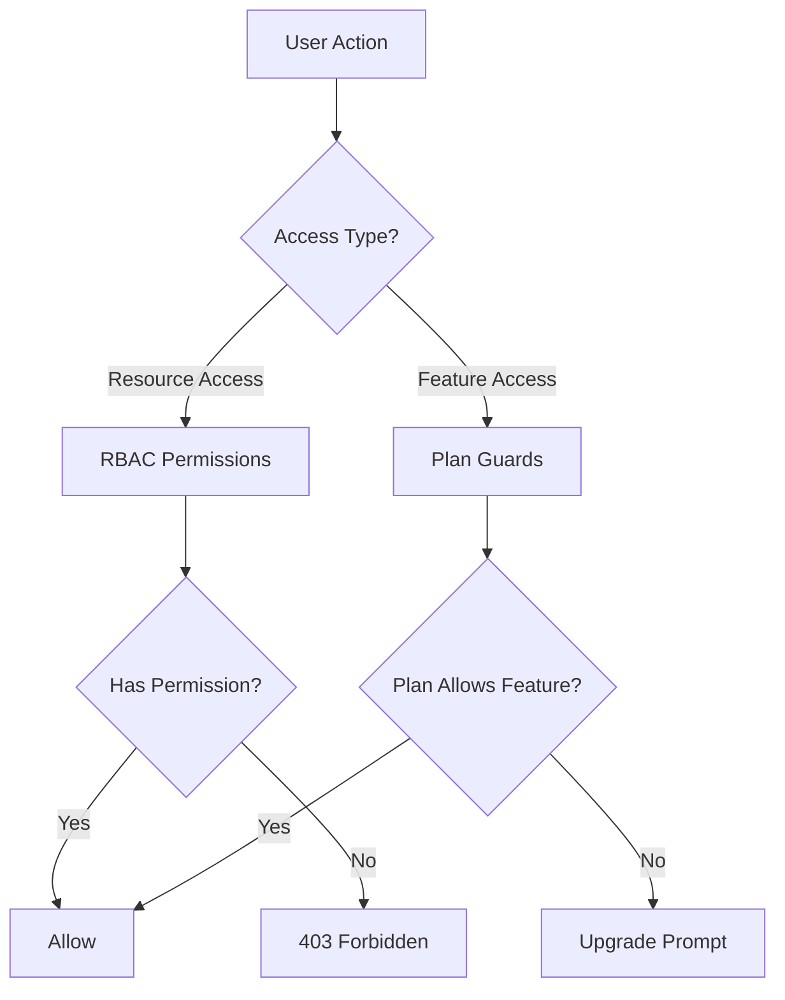
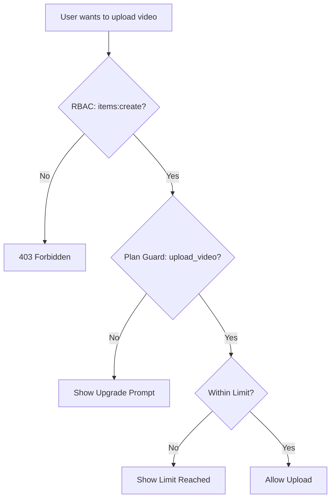

# Gardes et système de permission

Le modèle Ever Works implémente un système de contrôle d'accès à double couche : **autorisations RBAC** pour l'accès aux ressources basé sur les rôles et **plans de protection** pour le contrôle des fonctionnalités basé sur l'abonnement. Ensemble, ces systèmes contrôlent ce que les utilisateurs peuvent faire et les fonctionnalités auxquelles ils peuvent accéder.

## Architecture du système



## Système d'autorisation RBAC

### Définitions des autorisations

Toutes les autorisations sont définies dans `lib/permissions/definitions.ts` en utilisant un format `resource:action` :

```typescript
const PERMISSIONS = {
  items: {
    read: 'items:read',
    create: 'items:create',
    update: 'items:update',
    delete: 'items:delete',
    review: 'items:review',
    approve: 'items:approve',
    reject: 'items:reject',
  },
  categories: { read, create, update, delete },
  tags: { read, create, update, delete },
  roles: { read, create, update, delete },
  users: { read, create, update, delete, assignRoles },
  analytics: { read, export },
  system: { settings },
} as const;
```

### Type d'autorisation

Le type `Permission` est dérivé de l'objet const `PERMISSIONS`, garantissant la sécurité du type :

```typescript
type Permission = 'items:read' | 'items:create' | ... | 'system:settings';
```

### Rôles par défaut

Deux rôles par défaut sont préconfigurés :

|Rôle|pièce d'identité|Autorisations|
|---|---|---|
|Super administrateur|`super-admin`|Toutes les autorisations système|
|Gestionnaire de contenu|`content-manager`|Articles + Catégories + Tags (CRUD complet + avis)|

### Groupes d'autorisations

Les autorisations sont organisées en groupes conviviaux pour l'interface utilisateur dans `lib/permissions/groups.ts` :

|Groupe|Icône|Ressources incluses|
|---|---|---|
|Gestion de contenu|`FileText`|Articles, catégories, balises|
|Gestion des utilisateurs|`Users`|Utilisateurs, rôles|
|Système et analyses|`Settings`|Analyse, système|

### Fonctions utilitaires

Le module `lib/permissions/utils.ts` fournit des utilitaires de gestion d'état pour l'interface utilisateur des autorisations :

```typescript
// Create a permission state map for checkboxes
const state = createPermissionState(currentPermissions);
// { 'items:read': true, 'items:create': true, ... }

// Get selected permissions from state
const selected = getSelectedPermissions(state);

// Calculate changes between old and new permissions
const changes = calculatePermissionChanges(original, updated);
// { added: ['items:delete'], removed: ['tags:create'] }

// Compare two permission sets
const equal = arePermissionsEqual(perms1, perms2);

// Filter permissions by search term
const filtered = filterPermissions(allPerms, 'items');
```

## Système de gardes de plan

Les gardes du plan contrôlent l’accès aux fonctionnalités en fonction du plan d’abonnement de l’utilisateur. Le système est défini dans `lib/guards/plan-features.guard.ts`.

### Hiérarchie des plans

```typescript
const PLAN_LEVELS: Record<string, number> = {
  free: 1,
  standard: 2,
  premium: 3,
};
```

### Définitions des fonctionnalités

Toutes les fonctionnalités fermées sont énumérées dans `FEATURES` :

|Catégorie|Caractéristiques|
|---|---|
|Soumission|`submit_product`, `extended_description`, `unlimited_description`, `upload_images`, `upload_video`|
|Insignes|`verified_badge`, `sponsored_badge`|
|Examen|`priority_review`, `instant_review`|
|Visibilité|`search_visibility`, `category_placement`, `sponsored_position`, `homepage_featured`, `newsletter_mention`|
|Analyse|`view_statistics`, `advanced_analytics`|
|Assistance|`email_support`, `priority_email_support`, `phone_support`|
|Social|`social_sharing`, `learn_more_button`|
|Autre|`free_modifications`, `unlimited_submissions`|

### Matrice d'accès aux fonctionnalités

Chaque fonctionnalité est mappée à une règle d'accès :

|Type d'accès|Syntaxe|Exemple|
|---|---|---|
|Tous les forfaits|`'all'`|`submit_product`, `upload_images`|
|Forfait unique|`PaymentPlan.PREMIUM`|`upload_video`, `instant_review`|
|Forfait minimum|`{ minPlan: PaymentPlan.STANDARD }`|`verified_badge`, `priority_review`|
|Plans spécifiques|`[PaymentPlan.STANDARD, PaymentPlan.PREMIUM]`|(fonctionnalités personnalisées)|

### Limites du régime

Les limites numériques varient selon le plan :

|Limite|Gratuit|Norme|Prime|
|---|---|---|---|
|`max_images`| 1 | 5 |Illimité|
|`max_description_words`| 200 | 500 |Illimité|
|`max_submissions`| 1 | 10 |Illimité|
|`review_days`| 7 | 3 | 1 |
|`free_modification_days`| 0 | 30 | 365 |

### Utilisation de la protection côté serveur

```typescript
import { canAccessFeature, createPlanGuard, FEATURES } from '@/lib/guards';

// Simple check
const allowed = canAccessFeature(FEATURES.UPLOAD_VIDEO, userPlan);

// Guard factory for multiple checks
const guard = createPlanGuard(userPlan);
guard.canAccess(FEATURES.VERIFIED_BADGE);       // boolean
guard.requireFeature(FEATURES.UPLOAD_VIDEO);     // throws PlanGuardError
guard.getLimit('max_images');                    // number | null
guard.isWithinLimit('max_submissions', count);   // boolean
guard.getAccessibleFeatures();                   // Feature[]
```

### PlanGuardErreur

Lorsque `requireFeature` échoue, une erreur typée est générée :

```typescript
class PlanGuardError extends Error {
  feature: Feature;      // e.g., 'upload_video'
  userPlan: string;      // e.g., 'free'
  requiredPlan: PaymentPlan; // e.g., 'premium'
}
```

### Crochet de protection côté client

Le hook `usePlanGuard` dans `hooks/use-plan-guard.ts` enveloppe le système de protection pour les composants React :

```typescript
import { usePlanGuard, FEATURES } from '@/hooks/use-plan-guard';

function VideoUploadButton() {
  const { canAccess, requireUpgrade, isLoading } = usePlanGuard();

  if (isLoading) return <Spinner />;

  const upgradePlan = requireUpgrade(FEATURES.UPLOAD_VIDEO);
  if (upgradePlan) {
    return <UpgradePrompt plan={upgradePlan} />;
  }

  return <Button>Upload Video</Button>;
}
```

### Crochets spécialisés

#### `useFeatureAccess`

Vérifiez l'accès à une seule fonctionnalité :

```typescript
const { hasAccess, requiredPlan, isLoading } = useFeatureAccess(FEATURES.VERIFIED_BADGE);
```

#### `useFeatureLimit`

Vérifiez les limites numériques avec le nombre restant :

```typescript
const { limit, isUnlimited, remaining, isWithinLimit } = useFeatureLimit('max_images', currentCount);

if (!isUnlimited && remaining <= 0) {
  return <LimitReached />;
}
```

## Composer des gardes

Les gardes composent naturellement pour des scénarios de contrôle d’accès complexes :

```typescript
// Server: Combine RBAC + plan check
function canCreateItem(userPermissions: UserPermissions, userPlan: string): boolean {
  const hasRBACAccess = hasPermission(userPermissions, 'items:create');
  const hasPlanAccess = canAccessFeature(FEATURES.SUBMIT_PRODUCT, userPlan);
  return hasRBACAccess && hasPlanAccess;
}

// Client: Combine hooks
function CreateItemButton() {
  const { canAccess } = usePlanGuard();
  const { permissions } = useRolePermissions();

  const canCreate =
    hasPermission(permissions, 'items:create') &&
    canAccess(FEATURES.SUBMIT_PRODUCT);

  if (!canCreate) return null;
  return <Button>Create Item</Button>;
}
```

## Diagramme de flux de garde



## Ajout de nouveaux gardes

### Ajout d'une nouvelle autorisation

1. Ajouter à `PERMISSIONS` dans `lib/permissions/definitions.ts` :

```typescript
billing: {
  read: 'billing:read',
  manage: 'billing:manage',
},
```

2. Ajouter à un groupe d'autorisations dans `lib/permissions/groups.ts`
3. Attribuer aux rôles par défaut appropriés

### Ajout d'une nouvelle fonctionnalité de plan

1. Ajoutez la constante de fonctionnalité à `FEATURES` dans `lib/guards/plan-features.guard.ts`
2. Définir la règle d'accès dans `FEATURE_ACCESS`
3. Ajoutez éventuellement des limites numériques à `PLAN_LIMITS`

## Meilleures pratiques

1. **Préférez les gardes de plan pour le contrôle des fonctionnalités** et le RBAC pour le contrôle d'accès aux ressources - ne les mélangez pas.
2. **Toujours vérifier sur le serveur** même si le client masque les éléments de l'interface utilisateur : les vérifications côté client concernent uniquement l'UX.
3. **Utilisez `createPlanGuard`** pour plusieurs vérifications dans la même demande afin d'éviter des recherches de plan répétées.
4. **Gérer les états de chargement** dans les hooks : les données du plan peuvent être chargées de manière asynchrone à partir du service d'abonnement.
5. **Conservez les noms de fonctionnalités descriptifs** - utilisez `upload_video` et non `feature_3` pour plus de clarté dans les journaux et les messages d'erreur.
