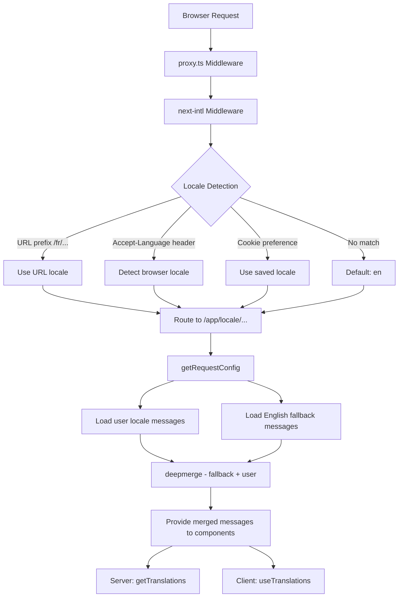

# Implémentation i18n

## Aperçu

Le modèle Ever Works implémente l'internationalisation à l'aide de **next-intl** avec la prise en charge de plus de 20 paramètres régionaux, l'orientation du texte RTL (de droite à gauche), les solutions de secours de messages de fusion profonde et la navigation tenant compte des paramètres régionaux. Le système est construit autour de trois couches : configuration du routage, chargement des messages avec solution de secours et aides à la navigation tenant compte des paramètres régionaux.

## Architecture



## Fichiers sources

|Fichier|Objectif|
|------|---------|
|`template/i18n/routing.ts`|Configuration du routage local|
|`template/i18n/request.ts`|Chargement des messages à l'échelle de la requête|
|`template/i18n/navigation.ts`|Exportations de navigation tenant compte des paramètres régionaux|
|`template/lib/constants.ts`|Définitions de paramètres régionaux et RTL|
|`template/messages/*.json`|Fichiers de messages de traduction|
|`template/proxy.ts`|Middleware avec résolution de préfixe local|

## Paramètres régionaux pris en charge

```typescript
// lib/constants.ts
export const DEFAULT_LOCALE = 'en';
export const LOCALES = [
    'en', 'fr', 'es', 'de', 'zh', 'ar', 'he',
    'ru', 'uk', 'pt', 'it', 'ja', 'ko', 'nl',
    'pl', 'tr', 'vi', 'th', 'hi', 'id', 'bg'
] as const;

export type Locale = (typeof LOCALES)[number];

/** Locales that use right-to-left text direction */
export const RTL_LOCALES: readonly Locale[] = ['ar', 'he'] as const;
```

Le modèle prend en charge 20 paramètres régionaux, dont deux paramètres régionaux RTL (arabe et hébreu).

## Configuration du routage

```typescript
// i18n/routing.ts
import { defineRouting } from "next-intl/routing";
import { DEFAULT_LOCALE, LOCALES } from "@/lib/constants";

export const routing = defineRouting({
    locales: LOCALES,
    defaultLocale: DEFAULT_LOCALE,
    localeDetection: true,
    localePrefix: "as-needed",
});
```

|Paramètre|Valeur|Effet|
|---------|-------|--------|
|`locales`|20 codes locaux|Ensemble de langues pris en charge|
|`defaultLocale`|`'en'`|Repli lorsqu'aucun paramètre régional ne correspond|
|`localeDetection`|`true`|Détection automatique à partir de l'en-tête `Accept-Language`|
|`localePrefix`|`"as-needed"`|Les paramètres régionaux par défaut n'ont pas de préfixe ; d'autres le font|

Avec `localePrefix: "as-needed"` :
- Anglais (par défaut) : `https://example.com/about`
- Français : `https://example.com/fr/about`
- Arabe : `https://example.com/ar/about`

## Chargement du message avec repli

```typescript
// i18n/request.ts
import deepmerge from "deepmerge";
import { getRequestConfig } from "next-intl/server";

export default getRequestConfig(async ({ requestLocale }) => {
    let locale = await requestLocale;

    if (!locale || !routing.locales.includes(locale as any)) {
        locale = routing.defaultLocale;
    }

    const userMessages = (await import(`../messages/${locale}.json`)).default;
    const defaultMessages = (await import(`../messages/en.json`)).default;
    const messages = deepmerge(defaultMessages, userMessages) as any;

    return { locale, messages };
});
```

La stratégie de fusion profonde garantit que :
1. Les messages en anglais servent d’ensemble de secours complet
2. Les messages spécifiques aux paramètres régionaux remplacent l'anglais là où des traductions existent
3. Les traductions manquantes reviennent gracieusement à l'anglais au lieu d'afficher les clés

### Structure du fichier de messages

```
messages/
  en.json        # Complete English messages (base)
  fr.json        # French translations
  es.json        # Spanish translations
  de.json        # German translations
  ar.json        # Arabic translations
  he.json        # Hebrew translations
  zh.json        # Chinese translations
  ...            # 13+ more locales
```

### Formats de date/nombre

```typescript
// i18n/request.ts
export const formats = {
    dateTime: {
        short: {
            day: "numeric",
            month: "short",
            year: "numeric",
        },
    },
    number: {
        precise: {
            maximumFractionDigits: 5,
        },
    },
    list: {
        enumeration: {
            style: "long",
            type: "conjunction",
        },
    },
} satisfies Formats;
```

## Aides à la navigation

```typescript
// i18n/navigation.ts
import { createNavigation } from "next-intl/navigation";
import { routing } from "./routing";

export const { Link, redirect, usePathname, useRouter, getPathname } =
    createNavigation(routing);
```

Ces exportations remplacent les utilitaires de navigation Next.js standard par des versions tenant compte des paramètres régionaux :

|Exporter|Standard Next.js|Comportement adapté aux paramètres régionaux|
|--------|-----------------|----------------------|
|`Link`|`next/link`|Ajoute un préfixe de paramètres régionaux à `href`|
|`redirect`|`next/navigation`|Préserve les paramètres régionaux actuels lors de la redirection|
|`usePathname`|`next/navigation`|Renvoie le chemin sans préfixe de paramètres régionaux|
|`useRouter`|`next/navigation`|`push()` / `replace()` ajouter un préfixe de paramètres régionaux|
|`getPathname`| -- |Chemin côté serveur avec paramètres régionaux|

### Utilisation dans les composants du serveur

```typescript
import { getTranslations } from 'next-intl/server';

export default async function Page({ params }: { params: Promise<{ locale: string }> }) {
    const { locale } = await params;
    const t = await getTranslations({ locale, namespace: 'common' });

    return <h1>{t('WELCOME')}</h1>;
}
```

### Utilisation dans les composants clients

```typescript
'use client';
import { useTranslations } from 'next-intl';
import { Link } from '@/i18n/navigation';

export function NavLink() {
    const t = useTranslations('navigation');
    return <Link href="/about">{t('ABOUT')}</Link>;
}
```

## Résolution des paramètres régionaux du middleware

Le middleware dans `proxy.ts` résout les informations de paramètres régionaux pour les décisions de garde d'authentification :

```typescript
function resolveLocalePrefix(pathname: string): {
    prefix: string;           // "/fr" or ""
    hasLocale: boolean;
    locale?: string;
    pathWithoutLocale: string; // "/admin/items"
} {
    const segments = pathname.split('/').filter(Boolean);
    const maybeLocale = segments[0];
    const hasLocale = routing.locales.includes(maybeLocale as any);
    const pathWithoutLocale = hasLocale
        ? `/${segments.slice(1).join('/')}`
        : pathname;
    return {
        prefix: hasLocale ? `/${maybeLocale}` : '',
        hasLocale,
        locale: hasLocale ? maybeLocale : undefined,
        pathWithoutLocale
    };
}
```

Ceci est utilisé pour construire des URL de redirection tenant compte des paramètres régionaux dans les gardes d'authentification :

```typescript
url.pathname = `${localePrefix}/auth/signin`;
```

## Prise en charge RTL

Les paramètres régionaux RTL sont définis dans `lib/constants.ts` :

```typescript
export const RTL_LOCALES: readonly Locale[] = ['ar', 'he'] as const;
```

Le composant de mise en page racine doit appliquer l'attribut `dir` en fonction des paramètres régionaux actuels :

```typescript
// app/[locale]/layout.tsx
const isRTL = RTL_LOCALES.includes(locale as Locale);

return (
    <html lang={locale} dir={isRTL ? 'rtl' : 'ltr'}>
        {/* ... */}
    </html>
);
```

## SEO : alternatives au Hreflang

L'utilitaire `lib/seo/hreflang.ts` génère des liens dans d'autres langues pour le référencement :

```typescript
import { generateHreflangAlternates } from '@/lib/seo/hreflang';

export async function generateMetadata(): Promise<Metadata> {
    return {
        alternates: {
            languages: generateHreflangAlternates('/about')
        }
    };
}
```

Cela génère des balises `<link rel="alternate" hreflang="fr" href="...">` pour tous les paramètres régionaux pris en charge, ainsi qu'une entrée `x-default` pointant vers la version anglaise.

## Intégration du plugin Next.js

```typescript
// next.config.ts
import createNextIntlPlugin from "next-intl/plugin";

const withNextIntl = createNextIntlPlugin('./i18n/request.ts');
const configWithIntl = withNextIntl(nextConfig);
```

Le plugin `next-intl` est appliqué à la configuration Next.js avec un chemin explicite vers le fichier de configuration de la requête.

## Meilleures pratiques

1. **Toujours utiliser `getTranslations` dans les composants serveur** -- charge les traductions sans coût du bundle client
2. **Importer la navigation depuis `@/i18n/navigation`** -- garantit une liaison compatible avec les paramètres régionaux
3. **Gardez l'anglais complet** : il sert de solution de secours pour tous les autres paramètres régionaux.
4. **Utilisez des traductions avec espace de noms** -- organisez par fonctionnalité (`common`, `footer`, `pages`, etc.)
5. **Vérifiez RTL avec `RTL_LOCALES`** - appliquez `dir="rtl"` au niveau de la mise en page
6. **Générer des balises hreflang** -- utilisez `generateHreflangAlternates()` dans les fonctions de métadonnées
