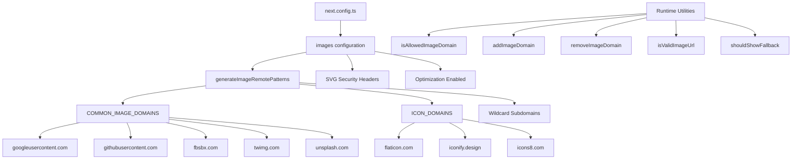

# Optimisation des images

## Aperçu

Le modèle Ever Works configure l'optimisation d'image Next.js avec des modèles distants dynamiques, la prise en charge SVG et une couche utilitaire pour la gestion de domaine. Le système gère les images des fournisseurs OAuth (Google, GitHub, Facebook, Twitter), les services de photos d'archives (Unsplash) et les bibliothèques d'icônes, tout en appliquant les en-têtes de sécurité pour le contenu SVG.

## Architecture



## Fichiers sources

|Fichier|Objectif|
|------|---------|
|`template/next.config.ts`|Configuration des images Next.js|
|`template/lib/utils/image-domains.ts`|Utilitaires de gestion de domaine|

## Configuration

### Paramètres d'image Next.js

```typescript
// next.config.ts
images: {
    remotePatterns: generateImageRemotePatterns(),
    dangerouslyAllowSVG: true,
    contentDispositionType: 'attachment',
    contentSecurityPolicy: "default-src 'self'; script-src 'none'; sandbox;",
    unoptimized: false,
},
```

|Paramètre|Valeur|Objectif|
|---------|-------|---------|
|`remotePatterns`|Dynamique via `generateImageRemotePatterns()`|Ajouter des domaines d'images externes à la liste blanche|
|`dangerouslyAllowSVG`|`true`|Autoriser les images SVG via l'optimiseur|
|`contentDispositionType`|`'attachment'`|Forcer le téléchargement au lieu du rendu en ligne pour un accès brut|
|`contentSecurityPolicy`|Bac à sable strict|Empêcher les attaques XSS basées sur SVG|
|`unoptimized`|`false`|Garder l'optimisation de l'image activée|

### Sécurité SVG

Les fichiers SVG peuvent contenir du JavaScript intégré. Le modèle atténue cela avec :
- **Politique de sécurité du contenu** : `script-src 'none'; sandbox;` empêche l'exécution de scripts dans les SVG
- **Disposition du contenu** : `attachment` garantit que les SVG sont téléchargés et non exécutés lorsqu'ils sont accessibles directement.

## Génération de modèles à distance

La fonction `generateImageRemotePatterns()` crée la liste blanche de manière dynamique :

```typescript
export function generateImageRemotePatterns() {
    const patterns = [
        {
            protocol: 'https' as const,
            hostname: 'lh3.googleusercontent.com',
            pathname: '/a/**'
        },
        {
            protocol: 'https' as const,
            hostname: 'avatars.githubusercontent.com',
            pathname: '/u/**'
        },
        {
            protocol: 'https' as const,
            hostname: 'platform-lookaside.fbsbx.com',
            pathname: '/platform/**'
        },
        // ... more specific patterns
    ];

    // Add wildcard subdomain patterns
    [...COMMON_IMAGE_DOMAINS, ...ICON_DOMAINS].forEach((domain) => {
        patterns.push({
            protocol: 'https' as const,
            hostname: `*.${domain}`,
            pathname: '/**'
        });
    });

    return patterns;
}
```

### Domaines autorisés

**Domaines d'images communs** (avatars OAuth, photos d'archives) :

|Domaine|Origine|
|--------|--------|
|`lh3.googleusercontent.com`|Avatars Google OAuth|
|`avatars.githubusercontent.com`|Avatars GitHub OAuth|
|`platform-lookaside.fbsbx.com`|Avatars Facebook OAuth|
|`pbs.twimg.com`|Avatars Twitter/X|
|`images.unsplash.com`|Photo stock de Unsplash|

**Domaines d'icônes** (icônes d'éléments) :

|Domaine|Origine|
|--------|--------|
|`flaticon.com`|Icônes plates|
|`iconify.design`|Iconifier les icônes|
|`icons8.com`|Icônes8 icônes|
|`feathericons.com`|Icônes de plumes|
|`heroicons.com`|Icônes de héros|
|`tabler-icons.io`|Icônes de table|

## Gestion du domaine d'exécution

### Vérification des domaines autorisés

```typescript
import { isAllowedImageDomain } from '@/lib/utils/image-domains';

// Returns true for whitelisted domains
isAllowedImageDomain('https://lh3.googleusercontent.com/a/photo.jpg'); // true
isAllowedImageDomain('https://cdn.flaticon.com/icons/svg/123.svg');    // true
isAllowedImageDomain('https://evil-site.com/image.jpg');               // false

// Relative URLs are always allowed
isAllowedImageDomain('/images/logo.png'); // true
```

### Ajout de domaine dynamique

```typescript
import { addImageDomain, removeImageDomain } from '@/lib/utils/image-domains';

// Add a new domain at runtime
addImageDomain('cdn.example.com');

// Add as an icon domain
addImageDomain('my-icons.com', true);

// Remove a domain
removeImageDomain('old-cdn.com');
```

Remarque : les ajouts d'exécution affectent les fonctions utilitaires mais ne modifient pas les modèles distants Next.js `next.config.ts` (ceux-ci nécessitent une reconstruction).

### Validation d'URL

```typescript
import { isValidImageUrl, isProblematicUrl, shouldShowFallback } from '@/lib/utils/image-domains';

// Check URL format validity
isValidImageUrl('https://example.com/photo.jpg'); // true
isValidImageUrl('/images/local.png');              // true (relative)
isValidImageUrl('not-a-url');                      // false

// Check for problematic URLs (non-image pages, redirect URLs)
isProblematicUrl('https://flaticon.com/icone-gratuite/search'); // true (not a direct image)
isProblematicUrl('https://cdn.flaticon.com/icon.svg');          // false (has image extension)

// Determine if fallback icon should be shown
shouldShowFallback('');                                          // true (empty)
shouldShowFallback('https://flaticon.com/icone-gratuite/123');   // true (problematic)
shouldShowFallback('https://cdn.flaticon.com/icon.svg');         // false
```

## En-têtes de sécurité

Le `next.config.ts` applique des en-têtes de sécurité à toutes les routes :

```typescript
async headers() {
    return [{
        source: "/(.*)",
        headers: [
            { key: "X-Content-Type-Options", value: "nosniff" },
            { key: "X-Frame-Options", value: "DENY" },
            { key: "Referrer-Policy", value: "strict-origin-when-cross-origin" },
            { key: "X-DNS-Prefetch-Control", value: "on" },
            { key: "Strict-Transport-Security", value: "max-age=63072000; includeSubDomains; preload" },
            {
                key: "Content-Security-Policy",
                value: "default-src 'self'; script-src 'self' 'unsafe-inline' https://assets.lemonsqueezy.com; style-src 'self' 'unsafe-inline'; img-src 'self' data: https:; font-src 'self'; connect-src 'self' https:; frame-ancestors 'none';"
            },
        ],
    }];
},
```

La directive `img-src 'self' data: https:` autorise les images de la même origine, les URI de données et toute source HTTPS. Ceci est intentionnellement permissif pour `img-src` car le composant Next.js Image gère la validation de domaine au niveau de l'application.

## Meilleures pratiques

1. **Utilisez `next/image`** pour toutes les images externes : il gère l'optimisation, le chargement différé et la conversion de format.
2. **Ajouter de nouveaux domaines à `image-domains.ts`** -- non intégré dans `next.config.ts`
3. **Vérifiez `shouldShowFallback()`** avant le rendu - affichez une icône par défaut pour les URL invalides/manquantes
4. **Conservez les en-têtes de sécurité SVG** - ne supprimez jamais les paramètres `contentSecurityPolicy` ou `contentDispositionType`
5. ** Préférez les restrictions de nom de chemin ** : utilisez des modèles `pathname` spécifiques (par exemple, `/a/**`) plutôt que des caractères génériques larges lorsque cela est possible.
