# Présentation de Lib Utilities

Le répertoire `template/lib/` est la couche principale d'utilitaire et de logique métier du modèle Ever Works. Il contient des modules partagés pour l'analyse, la communication API, l'authentification, les tâches en arrière-plan, la mise en cache, la configuration, l'accès à la base de données, les paiements, les outils d'édition, les gardes, etc. Toute la logique sans composants et sans route réside ici en suivant le principe consistant à conserver les composants de présentation et à déléguer une logique lourde à `lib/`.

## Carte des modules

```mermaid
graph TD
    subgraph Core Infrastructure
        A[config/] --> B[config.ts / config-manager.ts]
        C[db/] --> D[drizzle.ts / queries/ / migrate.ts]
        E[cache-config.ts] --> F[cache-invalidation.ts]
    end

    subgraph Auth & Security
        G[auth/] --> H[NextAuth / Supabase / Guards / Caching]
        I[guards/] --> J[Plan Feature Access Control]
        K[permissions/] --> L[Role-Based Permissions]
    end

    subgraph API Layer
        M[api/] --> N[ApiClient / ServerClient / Error Handling]
    end

    subgraph Analytics & Tracking
        O[analytics/] --> P[PostHog + Sentry Singleton]
    end

    subgraph Background Processing
        Q[background-jobs/] --> R[Trigger.dev / Local / NoOp]
    end

    subgraph Content & Editor
        S[content.ts] --> T[Git CMS Content Loader]
        U[editor/] --> V[TipTap Rich Text Editor]
        W[lib.ts] --> X[Content Path / File Utilities]
    end

    subgraph Business Logic
        Y[services/] --> Z[20+ Domain Services]
        AA[repositories/] --> AB[Data Access Layer]
        AC[payment/] --> AD[Stripe / LemonSqueezy / Polar]
    end

    subgraph Shared Utilities
        AE[constants.ts + constants/]
        AF[utils.ts + utils/]
        AG[types.ts + types/]
        AH[validations/]
        AI[helpers.ts]
    end
```



## Structure du répertoire

|Répertoire/Fichier|Descriptif|
|-----------------|-------------|
|`lib/analytics/`|Singleton d'analyse PostHog + Sentry ([docs](./analytics-module))|
|`lib/api/`|Clients HTTP pour navigateur et serveur ([docs](./api-client-module))|
|`lib/auth/`|Authentification avec NextAuth.js + Supabase ([docs](./auth-utilities-module))|
|`lib/background-jobs/`|Planification des tâches avec Trigger.dev / local / no-op ([docs](./background-jobs-module))|
|`lib/cache-config.ts`|Cache TTL et définitions de balises ([docs](./cache-invalidation-module))|
|`lib/cache-invalidation.ts`|Fonctions d'invalidation du cache ([docs](./cache-invalidation-module))|
|`lib/config/`|Service de configuration centralisé avec schémas Zod|
|`lib/config.ts`|Configuration du site (`siteConfig`)|
|`lib/config-manager.ts`|Gestionnaire de configuration d'exécution|
|`lib/constants.ts`|Baril de constantes d'application ([docs](./constants-reference-module))|
|`lib/constants/`|Constantes spécifiques au domaine (paiement, analyses)|
|`lib/content.ts`|Chargement et mise en cache du contenu CMS basé sur Git|
|`lib/db/`|Connexion à la base de données, migrations, amorçage, requêtes ([docs](./db-utilities-module))|
|`lib/editor/`|Composants et utilitaires de l'éditeur de texte enrichi TipTap ([docs](./editor-utilities-module))|
|`lib/guards/`|Contrôle d'accès aux fonctionnalités basé sur le plan ([docs](./guards-module))|
|`lib/helpers.ts`|Mappage du code de langue avec le code de pays|
|`lib/lib.ts`|Résolution du chemin du contenu, utilitaires du système de fichiers|
|`lib/logger.ts`|Utilitaire de journalisation structurée|
|`lib/mail/`|Envoi d'e-mails avec prise en charge des modèles|
|`lib/mappers/`|Mappeurs de transformation de données|
|`lib/maps/`|Intégrations de fournisseurs de cartes (Google Maps, Mapbox)|
|`lib/middleware/`|Utilitaires middleware Next.js|
|`lib/newsletter/`|Fournisseurs d'abonnements à la newsletter|
|`lib/paginate.ts`|Fonction d'aide à la pagination|
|`lib/payment/`|Traitement des paiements (Stripe, LemonSqueezy, Solidgate, Polar)|
|`lib/permissions/`|Définitions d'autorisations basées sur les rôles|
|`lib/query-client.ts`|Configuration du client React Query|
|`lib/react-query-config.ts`|Options par défaut de React Query|
|`lib/repositories/`|Couche d'accès aux données (modèle de référentiel)|
|`lib/repository.ts`|Opérations du référentiel Git (cloner, extraire, synchroniser)|
|`lib/seo/`|Métadonnées SEO et générateurs de données structurées|
|`lib/services/`|Services de logique métier (plus de 20 services de domaine)|
|`lib/stripe-helpers.ts`|Utilitaires spécifiques à Stripe|
|`lib/swagger/`|Annotations Swagger/OpenAPI|
|`lib/theme-color-manager.ts`|Gestion dynamique des couleurs du thème|
|`lib/theme-utils.ts`|Fonctions utilitaires du thème|
|`lib/themes.tsx`|Définitions des thèmes|
|`lib/types.ts`|Définitions de types partagés|
|`lib/types/`|Définitions de types spécifiques au domaine|
|`lib/utils.ts`|Fonctions utilitaires générales|
|`lib/utils/`|Utilitaires spécifiques au domaine (plus de 15 modules)|
|`lib/validations/`|Schémas de validation Zod|

## Modules autonomes clés

### `lib/helpers.ts` -- Mappage de code de langue/pays

```typescript
type LanguageCode = 'en' | 'fr' | 'es' | 'zh' | 'de' | 'ar' | ... ;

const LANGUAGE_COUNTRY_CODES: Record<LanguageCode, string>;
// { en: 'US', fr: 'FR', es: 'ES', zh: 'CN', ... }

const appLocales: string[];
// All supported locale codes

function getCountryCode(languageCode?: LanguageCode): string;
// 'en' -> 'US', 'fr' -> 'FR'
```

### `lib/lib.ts` -- Chemin du contenu et système de fichiers

Utilitaires serveur uniquement pour la gestion du répertoire de contenu :

```typescript
function getContentPath(): string;
// Returns '.content' path (local) or '/tmp/.content' (Vercel runtime)

async function ensureContentAvailable(): Promise<string>;
// Ensures content is available, triggering Git clone if needed

async function fsExists(filepath: string): Promise<boolean>;
async function dirExists(dirpath: string): Promise<boolean>;
```

### `lib/paginate.ts` -- Aide à la pagination

```typescript
function paginate<T>(items: T[], page: number, limit: number): T[];
```

### `lib/logger.ts` -- Journalisation structurée

```typescript
const logger = {
  info(message: string, context?: Record<string, any>): void;
  warn(message: string, context?: Record<string, any>): void;
  error(message: string, context?: Record<string, any>): void;
  debug(message: string, context?: Record<string, any>): void;
};
```

### `lib/color-generator.ts` -- Génération de couleurs déterministe

Génère des couleurs cohérentes à partir de chaînes (utilisées pour les avatars, les balises, etc.).

### `lib/theme-color-manager.ts` -- Couleurs du thème dynamique

Gère les mises à jour des propriétés personnalisées CSS pour le changement de thème.

## Couche de services (`lib/services/`)

Le répertoire des services contient des services de logique métier organisés par domaine :

|Service|Responsabilité|
|---------|---------------|
|`analytics-background-processor.ts`|Traitement analytique en arrière-plan|
|`analytics-export.service.ts`|Exportation de données analytiques|
|`analytics-scheduled-reports.service.ts`|Rapports d'analyse planifiés|
|`category-file.service.ts`|Opérations sur les fichiers de catégorie|
|`category-git.service.ts`|Catégorie Opérations Git|
|`collection-git.service.ts`|Opérations Git de collecte|
|`company.service.ts`|Gestion du profil de l'entreprise|
|`currency-detection.service.ts`|Détection de la devise de l'utilisateur|
|`currency.service.ts`|Conversion de devises|
|`email-notification.service.ts`|Notifications par courrier électronique|
|`engagement.service.ts`|Afficher/voter/suivi des favoris|
|`file.service.ts`|Téléchargement/gestion de fichiers|
|`geocoding/`|Géocodage avec les fournisseurs Google/Mapbox|
|`item-audit.service.ts`|Piste d'audit des articles|
|`item-git.service.ts`|Opérations Git sur les éléments|
|`location/`|Indexation et gestion de localisation|
|`moderation.service.ts`|Modération du contenu|
|`notification.service.ts`|Notifications poussées|
|`posthog-api.service.ts`|API PostHog côté serveur|
|`role-db.service.ts`|Gestion des rôles|
|`settings.service.ts`|Paramètres de l'application|
|`sponsor-ad.service.ts`|Gestion des publicités des sponsors|
|`stripe-products.service.ts`|Synchronisation des produits Stripe|
|`subscription-jobs.ts`|Travaux d’arrière-plan d’abonnement|
|`subscription.service.ts`|Cycle de vie de l'abonnement|
|`survey.service.ts`|Gestion des enquêtes|
|`sync-service.ts`|Synchronisation du référentiel Git|
|`tag-git.service.ts`|Marquer les opérations Git|
|`twenty-crm-*.ts`|Vingt intégrations CRM (5 fichiers)|
|`user-db.service.ts`|Opérations de base de données utilisateur|
|`webhook-subscription.service.ts`|Gestion des webhooks|

## Couche utilitaires (`lib/utils/`)

Modules utilitaires pour des préoccupations spécifiques :

|Module|Objectif|
|--------|---------|
|`api-error.ts`|Classe d'erreur API|
|`bot-detection.ts`|Détection des agents utilisateurs de robots|
|`checkout-utils.ts`|Aides à la caisse de paiement|
|`client-auth.ts`|Utilitaires d'authentification côté client|
|`currency-format.ts`|Formatage de la devise|
|`custom-navigation.ts`|Navigation de routeur personnalisée|
|`database-check.ts`|Bilan de santé de la base de données|
|`email-validation.ts`|Validation du format d'e-mail|
|`error-handler.ts`|Gestionnaire d'erreurs global|
|`featured-items.ts`|Sélection d'articles en vedette|
|`footer-utils.ts`|Utilitaires de lien de pied de page|
|`image-domains.ts`|Domaines d'images autorisés|
|`pagination-validation.ts`|Validation des paramètres de pagination|
|`payment-provider.ts`|Détection du fournisseur de paiement|
|`plan-expiration.utils.ts`|Calculs d'expiration du plan|
|`rate-limit.ts`|Limitation du débit de l'API|
|`request-body.ts`|Demander une analyse du corps|
|`server-url.ts`|Résolution d'URL du serveur|
|`settings.ts`|Fonctions d'aide aux paramètres|
|`slug.ts`|Génération de slug d'URL|
|`url-cleaner.ts`|Nettoyage des URL|
|`url-filter-sync.ts`|Synchronisation de l'état du filtre d'URL|

## Principes de conception

1. **Séparation des préoccupations** -- Logique métier dans `services/`, accès aux données dans `repositories/` et `db/queries/`, présentation dans `components/`.

2. **Sécurité des scripts** -- Les modules utilisés par les scripts de migration/seed (comme `constants/payment.ts` et `db/config.ts`) évitent d'importer du code spécifique à Next.js.

3. **Initialisation paresseuse** : les connexions de base de données, les clients API et les gestionnaires de travaux utilisent des modèles singleton avec initialisation paresseuse pour éviter les erreurs pendant la génération.

4. **Importations dynamiques** : les modules spécifiques à Node.js utilisent des importations dynamiques dans les tâches en arrière-plan et l'authentification pour éviter les problèmes de regroupement de webpacks.

5. ** Limite serveur/client ** -- Les modules serveur uniquement utilisent le package `server-only`. Les modules sécurisés pour le client évitent les importations de serveur. La directive `'use client'` est utilisée avec parcimonie.
