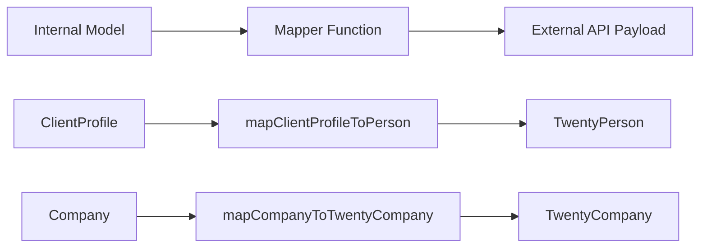

# Modèles de mappeur

Le modèle utilise des fonctions de mappage pures pour transformer les données entre les modèles internes et les charges utiles d'API externes. Les mappeurs sont sans effets secondaires, sans danger pour les valeurs nulles et valident les champs obligatoires avant la transformation.

## Présentation de l'architecture



## Fichiers sources

|Fichier|Objectif|
|------|---------|
|`lib/mappers/twenty-crm.mapper.ts`|Mappe les entités locales sur vingt charges utiles de l'API CRM|

## Principes de conception

Le module mappeur suit des conventions de programmation fonctionnelle strictes :

1. **Fonctions pures** -- pas d'effets secondaires, pas de mutations, pas d'appels à la base de données
2. **Null-safe** - tous les champs facultatifs utilisent des vérifications explicites nulles/non définies
3. **Validation avant mappage** : les champs obligatoires sont validés avec des erreurs descriptives
4. **Application de l'ID externe** : chaque entité mappée doit avoir un `external_id` valide

## Validation de l'identifiant externe

Chaque entité mappée à un système externe nécessite un identifiant valide :

```typescript
export function ensureExternalId(id: string | undefined | null, entityType: string): string {
  if (!id || id.trim() === '') {
    throw new Error(`${entityType} ID is required for external_id mapping`);
  }
  return id.trim();
}
```

Cette fonction est appelée au début de chaque mappeur pour garantir que le champ `external_id` n'est jamais vide.

## Extraction de localisation

Une fonction utilitaire analyse les noms de villes à partir des chaînes de localisation en texte libre :

```typescript
export function extractCityFromLocation(location: string | undefined | null): string | null {
  if (!location || location.trim() === '') return null;
  const parts = location.split(',');
  const city = parts[0]?.trim();
  return city || null;
}
```

Gère les formats tels que `"San Francisco"`, `"San Francisco, CA"` et `"San Francisco, CA, USA"`.

## Profil client à vingt personnes CRM

Mappe les enregistrements internes `ClientProfile` à la charge utile Twenty CRM `TwentyPerson` :

```typescript
export function mapClientProfileToPerson(clientProfile: ClientProfile): TwentyPerson {
  const external_id = ensureExternalId(clientProfile.id, 'ClientProfile');

  const person: TwentyPerson = {
    external_id,
    name: clientProfile.name,
    email: clientProfile.email,
  };

  // Optional field mapping (null-safe)
  if (clientProfile.phone)     person.phone = clientProfile.phone;
  if (clientProfile.jobTitle)  person.job_title = clientProfile.jobTitle;
  if (clientProfile.company)   person.company_name = clientProfile.company;
  if (clientProfile.website)   person.website = clientProfile.website;

  const city = extractCityFromLocation(clientProfile.location);
  if (city) person.city = city;

  // Custom fields
  if (clientProfile.accountType) person.account_type = clientProfile.accountType;
  if (clientProfile.plan)        person.plan = clientProfile.plan;
  if (clientProfile.totalSubmissions !== null && clientProfile.totalSubmissions !== undefined) {
    person.total_submissions = clientProfile.totalSubmissions;
  }

  return person;
}
```

### Table de mappage de champs

|Champ de profil client|Champ de vingt personnes|Obligatoire|Remarques|
|--------------------|--------------------|----------|-------|
|`id`|`external_id`|Oui|Validé et découpé|
|`name`|`name`|Oui|Cartographie directe|
|`email`|`email`|Oui|Cartographie directe|
|`phone`|`phone`|Non|Seulement si présent|
|`jobTitle`|`job_title`|Non|camelCase à serpent_case|
|`company`|`company_name`|Non|Champ renommé|
|`website`|`website`|Non|Cartographie directe|
|`location`|`city`|Non|Extrait via `extractCityFromLocation`|
|`accountType`|`account_type`|Non|Champ personnalisé|
|`plan`|`plan`|Non|Champ personnalisé|
|`totalSubmissions`|`total_submissions`|Non|Vérification nulle explicite requise|

## Entreprise à Twenty CRM Company

Mappe les entités internes `Company` à la charge utile Twenty CRM `TwentyCompany` :

```typescript
export function mapCompanyToTwentyCompany(company: Company): TwentyCompany {
  const external_id = ensureExternalId(company.id, 'Company');

  const twentyCompany: TwentyCompany = {
    external_id,
    name: company.name,
  };

  if (company.domain)  twentyCompany.domain_name = company.domain;
  if (company.website) twentyCompany.website = company.website;
  if (company.status)  twentyCompany.status = company.status;

  return twentyCompany;
}
```

### Table de mappage de champs

|Domaine de l'entreprise|Champ TwentyCompany|Obligatoire|Remarques|
|--------------|---------------------|----------|-------|
|`id`|`external_id`|Oui|Validé et découpé|
|`name`|`name`|Oui|Cartographie directe|
|`domain`|`domain_name`|Non|Champ renommé|
|`website`|`website`|Non|Cartographie directe|
|`status`|`status`|Non|`'active'` ou `'inactive'`|

## Ajout de nouveaux mappeurs

Lors de la création de mappeurs pour de nouvelles intégrations, suivez les modèles établis :

```typescript
// 1. Always validate external_id first
const external_id = ensureExternalId(entity.id, 'EntityName');

// 2. Build the required fields object
const payload: ExternalType = {
  external_id,
  // ... required fields
};

// 3. Conditionally add optional fields (null-safe)
if (entity.optionalField) {
  payload.optional_field = entity.optionalField;
}

// 4. Return the payload -- never mutate the input
return payload;
```

## Considérations relatives aux tests

Puisque les mappeurs sont de pures fonctions, ils sont simples à tester unitairement :

- Testez avec tous les champs facultatifs renseignés
- Testez avec tous les champs facultatifs comme `null` ou `undefined`
- Testez que les identifiants requis manquants génèrent des erreurs descriptives
- Tester l'extraction d'emplacement avec différents formats de chaînes
- Vérifiez que l'objet d'entrée n'est jamais muté
