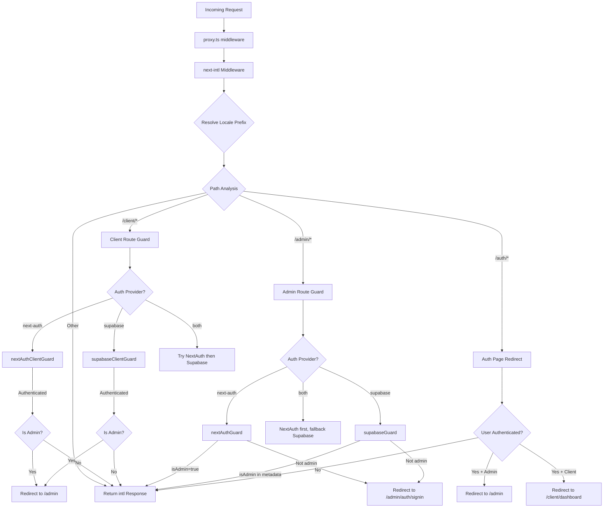

# Chaîne middleware et traitement des demandes

## Aperçu

Le modèle Ever Works utilise une architecture **middleware unifié** définie dans `proxy.ts` à la racine du projet. Ce middleware orchestre trois préoccupations critiques pour chaque requête entrante :

1. **Internationalisation** - détection des paramètres régionaux, insertion de préfixe et routage via `next-intl`
2. **Gardettes d'authentification** - protégeant les routes `/admin/*` et `/client/*` à l'aide de NextAuth, Supabase ou les deux.
3. **Redirection basée sur les rôles** : éloigner les utilisateurs authentifiés des pages d'authentification publiques et rediriger les administrateurs/clients vers leurs tableaux de bord respectifs.

La conception prend en charge un modèle de **fournisseur d'authentification enfichable** : le middleware lit le `AuthProviderType` actuel (`'next-auth'`, `'supabase'` ou `'both'`) à partir de la configuration d'authentification centralisée et sélectionne les fonctions de garde appropriées en conséquence.

## Schéma architectural



## Fichiers sources

|Fichier|Objectif|
|------|---------|
|`template/proxy.ts`|Point d’entrée principal du middleware|
|`template/lib/auth/config.ts`|Configuration du fournisseur d'authentification (`getAuthConfig()`)|
|`template/lib/auth/supabase/middleware.ts`|Assistant d'actualisation de session Supabase|
|`template/lib/auth/validate-callback-url.ts`|Construction d'URL de rappel sécurisée|
|`template/i18n/routing.ts`|Configuration du routage local|

## Ordre de traitement des demandes

### Étape 1 : internationalisation

Chaque requête passe d'abord par le middleware `next-intl` créé avec `createIntlMiddleware(routing)` :

```typescript
import createIntlMiddleware from 'next-intl/middleware';
import { routing } from './i18n/routing';

const intl = createIntlMiddleware(routing);
```

Cela gère la détection des paramètres régionaux via l'en-tête `Accept-Language`, les préférences de cookies et le préfixe d'URL. La configuration de routage utilise `localePrefix: "as-needed"`, ce qui signifie que les paramètres régionaux par défaut (`en`) ne nécessitent pas de préfixe d'URL.

### Étape 2 : Résolution des paramètres régionaux

L'assistant `resolveLocalePrefix` extrait les informations de paramètres régionaux du nom de chemin :

```typescript
function resolveLocalePrefix(pathname: string): {
    prefix: string;       // e.g., "/fr" or ""
    hasLocale: boolean;
    locale?: string;
    pathWithoutLocale: string;  // e.g., "/admin/items"
}
```

Ceci est essentiel car toutes les correspondances de chemin ultérieures (par exemple, vérification de `/admin` ou `/client`) doivent fonctionner sur le chemin **sans** le préfixe de paramètres régionaux.

### Étape 3 : Sélection de garde basée sur l'itinéraire

Le middleware évalue le `pathWithoutLocale` pour déterminer quelle chaîne de garde appliquer :

|Modèle de chemin|Garde appliquée|Objectif|
|-------------|--------------|---------|
|`/client` ou `/client/*`|Garde d'authentification client|Nécessite une authentification ; redirige les administrateurs vers `/admin`|
|`/admin/*` (sauf `/admin/auth/signin`)|Garde d'authentification administrateur|Nécessite une authentification + `isAdmin` indicateur|
|`/auth/*`|Redirection de la page d'authentification|Redirige les utilisateurs authentifiés loin de la connexion/inscription|
|Tout le reste|Pas de garde|Passe avec la réponse i18n|

### Étape 4 : Vérification de l'authentification

#### NextAuth Guard (basé sur JWT)

```typescript
const token = await getToken({ req, secret: process.env.AUTH_SECRET });
if (token?.isAdmin === true) {
    return baseRes; // Admin access granted
}
```

Les gardes NextAuth utilisent `getToken()` de `next-auth/jwt` pour lire le jeton JWT à partir des cookies. Ceci est compatible Edge Runtime et ne nécessite pas de recherche dans la base de données.

#### Garde Supabase

```typescript
const supRes = await supabaseUpdate(req);
// Merge cookies...
const { data: { user } } = await supabase.auth.getUser();
const isAdmin = user?.user_metadata?.isAdmin === true
    || user?.user_metadata?.role === 'admin';
```

Le garde Supabase actualise d'abord la session en utilisant `updateSession()`, puis vérifie les métadonnées utilisateur pour les indicateurs d'administrateur.

### Étape 5 : propagation des cookies

Un détail critique d'implémentation : lorsqu'un garde produit une réponse de redirection, tous les cookies du `intlResponse` doivent être propagés :

```typescript
const redirectRes = NextResponse.redirect(url);
baseRes.cookies.getAll().forEach((c) => redirectRes.cookies.set(c));
return redirectRes;
```

Cela garantit que les préférences locales et les cookies de session d'authentification survivent aux redirections.

## Configuration

### Sélection du fournisseur d'authentification

Le fournisseur d'authentification est déterminé par `getAuthConfig()` dans `lib/auth/config.ts` :

```typescript
export type AuthProviderType = 'supabase' | 'next-auth' | 'both';

export function getAuthConfig(): AuthConfig {
    // Priority 1: Global override via configureAuth()
    // Priority 2: Environment-based (detects Supabase env vars)
    // Priority 3: Default ('next-auth')
}
```

### Matcheur de middleware

```typescript
export const config = {
    matcher: ['/((?!api|trpc|_next|_vercel|.*\\..*).*)']
};
```

Cette expression régulière exclut :
- `/api/*` routes (gérées par la couche API Next.js)
- `/trpc/*` itinéraires
- `/_next/*` (internes de Next.js)
- `/_vercel/*` (internes Vercel)
- Tout chemin avec une extension de fichier (actifs statiques)

### Sécurité des URL de rappel

Le middleware utilise `createSafeCallbackUrl()` pour empêcher les attaques de redirection ouverte :

```typescript
export function createSafeCallbackUrl(pathname: string, search?: string): string {
    // Limits URL length to 2048 characters
    // Validates relative-only paths
}

export function isValidCallbackUrl(url: string | null): boolean {
    return url?.startsWith('/') && !url.startsWith('//');
}
```

## Mode double fournisseur (« les deux »)

Lorsque `provider === 'both'`, le middleware implémente une chaîne de repli :

1. **Routages clients** : essayez d'abord NextAuth ; si non authentifié, essayez Supabase
2. **Routes d'administration** : essayez d'abord NextAuth ; s'il produit une redirection (refusée), essayez Supabase
3. **Pages d'authentification** : vérifiez d'abord le jeton NextAuth, puis vérifiez la session Supabase

Cela permet aux organisations de migrer entre fournisseurs d'authentification sans perturber les utilisateurs existants.

## Détails clés de la mise en œuvre

### Compatibilité d'exécution Edge

Le middleware s’exécute dans le runtime Next.js Edge. Toutes les vérifications d'authentification utilisent des API compatibles Edge :
- NextAuth : `getToken()` (basé sur JWT, aucune base de données nécessaire)
- Supabase : `createServerClient()` avec session basée sur les cookies

### Journalisation du développement et de la production

La journalisation du débogage est sécurisée derrière `NODE_ENV === 'development'` :

```typescript
if (process.env.NODE_ENV === 'development') {
    console.log('[Middleware] Admin access granted via token');
}
```

### Actualisation de la session Supabase

L'assistant middleware Supabase (`updateSession`) est appelé avant chaque vérification d'authentification pour garantir l'actualisation des jetons :

```typescript
export async function updateSession(request: NextRequest) {
    const supabase = createServerClient(url, anonKey, {
        cookies: { getAll, setAll }
    });
    // IMPORTANT: DO NOT REMOVE auth.getUser()
    await supabase.auth.getUser();
    return supabaseResponse;
}
```

Le commentaire dans le code source souligne que `auth.getUser()` ne doit pas être supprimé -- cela déclenche le cycle d'actualisation du jeton qui empêche les déconnexions aléatoires.
