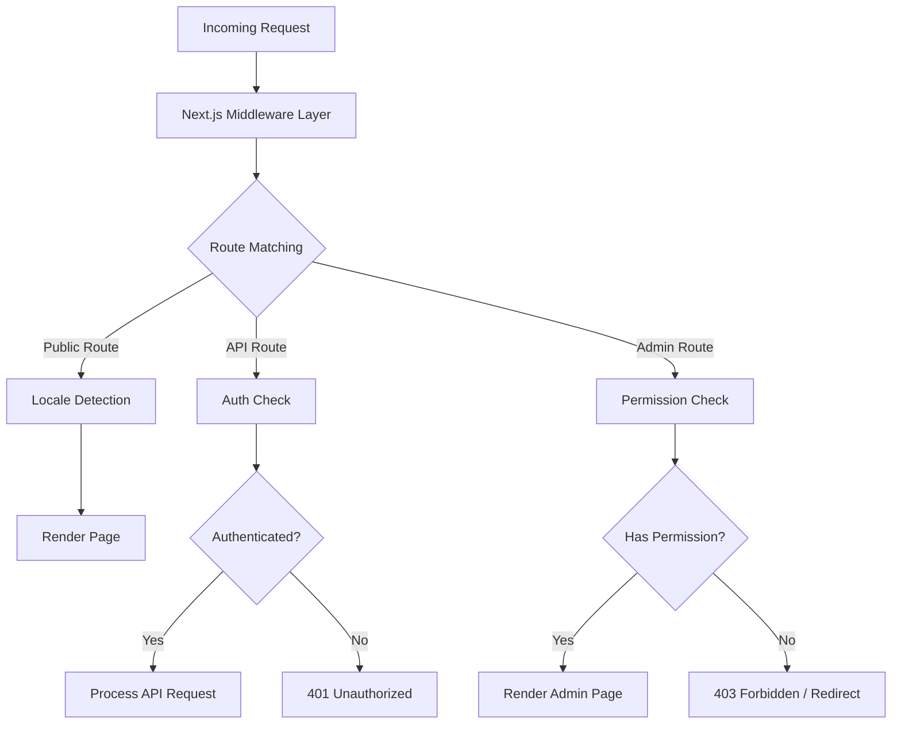
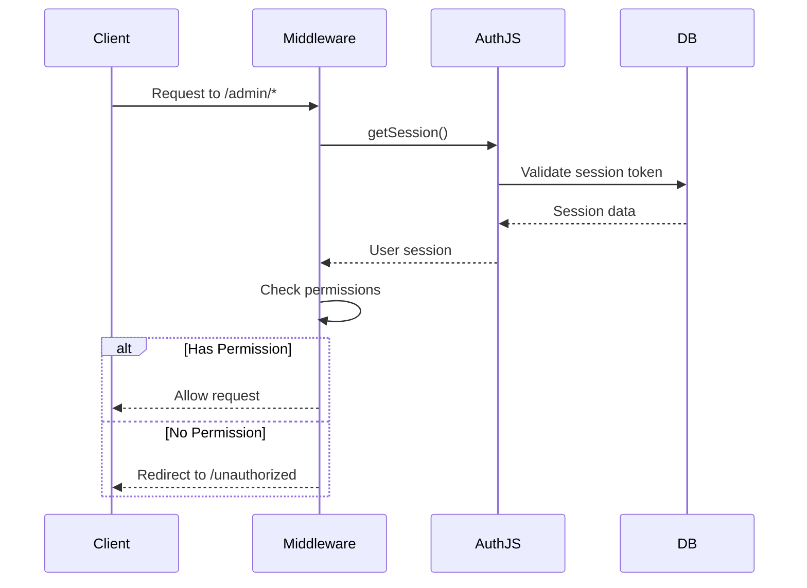
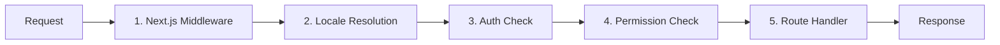

# Analyse approfondie du middleware

Le modèle Ever Works utilise une architecture middleware en couches construite sur les conventions Next.js App Router et une logique de vérification des autorisations personnalisée. Ce document couvre le pipeline complet de traitement des demandes, les vérifications d'autorisations, le middleware d'authentification, la gestion des paramètres régionaux et l'ordre des middlewares.

## Présentation de l'architecture



## Middleware de vérification des autorisations

Le système de vérification des autorisations réside dans `lib/middleware/permission-check.ts` et fournit un contrôle d'accès granulaire pour les routes API et les pages d'administration.

### Interface principale

```typescript
interface UserPermissions {
  userId: string;
  roles: string[];
  permissions: Permission[];
}
```

### Fonctions de vérification des autorisations

|Fonction|Objectif|Retours|
|---|---|---|
|`hasPermission(user, permission)`|Vérifier l'autorisation unique|`boolean`|
|`hasAnyPermission(user, permissions)`|Vérifiez si l'utilisateur en possède au moins un|`boolean`|
|`hasAllPermissions(user, permissions)`|Vérifiez si l'utilisateur a tous répertorié|`boolean`|
|`hasResourcePermission(user, resource, action)`|Vérifiez le format `resource:action`|`boolean`|
|`getResourcePermissions(user, resource)`|Obtenir toutes les autorisations pour une ressource|`Permission[]`|
|`canManageResource(user, resource)`|Vérifier l'accès à la création/mise à jour/suppression|`boolean`|
|`isSuperAdmin(user)`|Vérifiez le rôle de super-administrateur ou toutes les autorisations|`boolean`|

### Utilisation dans les routes API

```typescript
import { hasPermission, hasAnyPermission } from '@/lib/middleware/permission-check';

export async function GET(request: Request) {
  const userPermissions = await getUserPermissions(session);

  // Single permission check
  if (!hasPermission(userPermissions, 'items:read')) {
    return new Response('Forbidden', { status: 403 });
  }

  // Multiple permission check (any)
  if (!hasAnyPermission(userPermissions, ['items:review', 'items:approve'])) {
    return new Response('Forbidden', { status: 403 });
  }
}
```

### Vérifications au niveau des ressources

```typescript
// Check specific resource and action
const canEdit = hasResourcePermission(userPermissions, 'items', 'update');

// Get all permissions for a resource
const itemPerms = getResourcePermissions(userPermissions, 'items');
// Returns: ['items:read', 'items:create', 'items:update']

// Check management capability (create, update, or delete)
const canManage = canManageResource(userPermissions, 'categories');
```

### Aides aux autorisations spécialisées

Le middleware fournit des assistants spécifiques au domaine qui combinent plusieurs contrôles d'autorisation :

```typescript
// Can the user review, approve, or reject items?
const canReview = canReviewItems(userPermissions);

// Can the user manage users (read, create, update, delete, assignRoles)?
const canAdmin = canManageUsers(userPermissions);

// Can the user view analytics data?
const canView = canViewAnalytics(userPermissions);

// Is the user a super admin?
const isAdmin = isSuperAdmin(userPermissions);
```

### Détection du super-administrateur

La fonction `isSuperAdmin` utilise une approche à deux niveaux :

1. **Vérification du rôle** (primaire) : vérifie si l'utilisateur dispose du rôle `super-admin`
2. **Vérification des autorisations** (repli) : vérifie que l'utilisateur dispose de toutes les autorisations système

```typescript
function isSuperAdmin(userPermissions: UserPermissions): boolean {
  // Fast path: check role
  if (userPermissions.roles.includes('super-admin')) {
    return true;
  }
  // Exhaustive check: verify all permissions
  return hasAllPermissions(userPermissions, allSystemPermissions);
}
```

## Middleware d'authentification

L'authentification est gérée via NextAuth.js (Auth.js v5) configuré dans `auth.config.ts`. Le middleware s'exécute à chaque requête vers des routes protégées.

### Configuration du fournisseur

La configuration d'authentification configure dynamiquement les fournisseurs OAuth avec un repli gracieux :

|Fournisseur|Source de configuration|
|---|---|
|Google|`authConfig.google.clientId/clientSecret`|
|GitHub|`authConfig.github.clientId/clientSecret`|
|Facebook|`authConfig.facebook.clientId/clientSecret`|
|Twitter/X|`authConfig.twitter.clientId/clientSecret`|
|Informations d'identification|Toujours activé|

Si la configuration OAuth échoue, le système revient à l'authentification par informations d'identification uniquement.

### Flux de session d'authentification



## Middleware local

Le modèle prend en charge plus de 20 paramètres régionaux via l'intégration du middleware `next-intl`. La détection des paramètres régionaux suit le modèle de préfixe « selon les besoins » :

- Paramètres régionaux par défaut (`en`) : aucun préfixe d'URL -- `/items/my-app`
- Autres paramètres régionaux : préfixe de paramètres régionaux -- `/fr/items/my-app`

### Paramètres régionaux pris en charge

|Paramètres régionaux|Langue|Paramètres régionaux|Langue|
|---|---|---|---|
|`en`|Anglais (par défaut)|`ja`|Japonais|
|`fr`|Français|`ko`|Coréen|
|`es`|Espagnol|`nl`|Néerlandais|
|`de`|Allemand|`pl`|Polonais|
|`zh`|Chinois|`tr`|Turc|
|`ar`|arabe|`vi`|Vietnamien|
|`he`|Hébreu|`th`|Thaï|
|`ru`|russe|`hi`|hindi|
|`uk`|Ukrainien|`id`|Indonésien|
|`pt`|Portugais|`bg`|Bulgare|
|`it`|Italien| | |

## Pipeline de traitement des demandes

Le pipeline complet de traitement des demandes suit cet ordre :



### Étapes du pipeline

1. **Next.js Middleware** (`middleware.ts`) : s'exécute sur chaque requête correspondant aux correspondants configurés. Gère les redirections, les réécritures et l’injection d’en-tête.

2. **Résolution locale** : détecte les paramètres régionaux préférés de l'utilisateur à partir du chemin de l'URL, de l'en-tête `Accept-Language` ou du cookie. Définit les paramètres régionaux du contexte de la demande.

3. **Auth Check** : pour les routes protégées (`/admin/*`, `/dashboard/*`, `/api/admin/*`), valide le jeton de session de l'utilisateur.

4. **Vérification des autorisations** : après l'authentification, vérifie que l'utilisateur dispose des autorisations requises pour la ressource et l'action spécifiques.

5. **Gestionnaire de route** : le composant de page réel ou le gestionnaire de route API traite la demande.

### Garanties de commande de middleware

Le système impose un ordre strict :

- La détection des paramètres régionaux s'exécute toujours en premier (nécessaire pour les pages d'erreur)
- Les vérifications d'authentification sont exécutées avant les vérifications d'autorisation (besoin d'un utilisateur pour vérifier les autorisations)
- Les contrôles d'autorisation sont la dernière porte avant les gestionnaires d'itinéraire
- Les routes API utilisent des contrôles d'autorisation au niveau des fonctions (et non au niveau du middleware)

## Utilitaires de validation des autorisations

Le middleware comprend des assistants de validation pour travailler avec des chaînes d'autorisation :

```typescript
// Validate a permission string
validatePermission('items:read');     // true
validatePermission('invalid:perm');   // false

// Parse a permission into parts
parsePermission('items:update');
// Returns: { resource: 'items', action: 'update' }

// Get summary grouped by resource
getPermissionSummary(userPermissions);
// Returns: { items: ['read', 'create'], categories: ['read'] }
```

## Gestion des erreurs

Le système middleware gère les erreurs à chaque couche :

|Couche|Erreur|Réponse|
|---|---|---|
|Paramètres régionaux|Paramètres régionaux invalides|Redirection vers les paramètres régionaux par défaut|
|Authentification|Aucune séance|401 ou rediriger vers la connexion|
|Authentification|Session expirée|401 avec indice de rafraîchissement|
|Autorisation|Autorisation manquante|403 Interdit|
|Autorisation|Chaîne d'autorisation invalide|Avertissement enregistré, accès refusé|

## Meilleures pratiques

1. **Utilisez la vérification la plus spécifique** - préférez `hasPermission` avec une seule autorisation à `isSuperAdmin` pour le contrôle régulier des fonctionnalités.

2. **Vérifiez les autorisations dans les routes API** - ne vous fiez pas uniquement au middleware ; validez toujours dans le gestionnaire de route pour une défense en profondeur.

3. **Utilisez les importations dynamiques** dans le middleware pour éviter de regrouper des modules réservés au serveur dans le runtime Edge.

4. **Gardez les vérifications d'autorisation rapides** : la recherche d'ensemble d'autorisations `O(1)` garantit une surcharge minimale par requête.

5. **Échecs d'autorisation de journalisation** : utilisez la journalisation structurée avec l'ID utilisateur et la tentative d'autorisation pour l'audit de sécurité.
