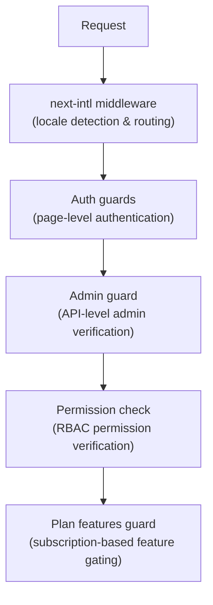

# Intergiciel et gardes

Le modèle Ever Works utilise un système de protection en couches composé du middleware Next.js pour le routage, de protections d'authentification pour la protection des pages et des API, de vérifications d'autorisation pour RBAC et de protections de fonctionnalités basées sur un plan pour le contrôle des abonnements.

## Couches middleware



## Middleware local (suivant-intl)

Le middleware racine gère le routage d'internationalisation via `next-intl`. Il est configuré via `i18n/routing.ts` et `i18n/request.ts`.

Responsabilités :
- Détecter les paramètres régionaux de l'utilisateur à partir du chemin d'URL, des cookies ou de l'en-tête `Accept-Language`
- Rediriger les requêtes sans préfixe de paramètres régionaux vers les paramètres régionaux appropriés
- Par défaut, l'anglais (`en`) lorsqu'aucune préférence n'est détectée
- Prise en charge de 6 paramètres régionaux : `en`, `fr`, `es`, `de`, `ar`, `zh`

## Gardes d'authentification

### Gardes au niveau de la page (`lib/auth/guards.ts`)

Le module guards fournit des contrôles d’authentification côté serveur pour les pages. Ceux-ci sont appelés en haut des composants du serveur pour protéger l'accès aux pages.

**`requireAuth()`** -- Nécessite que l'utilisateur soit authentifié :

```typescript
import { requireAuth } from '@/lib/auth/guards';

export default async function ProtectedPage() {
  const session = await requireAuth();
  // session.user is guaranteed to exist here
  return <div>Welcome {session.user.email}</div>;
}
```

Si l'utilisateur n'est pas authentifié, il est redirigé vers `/auth/signin`.

**`requireAdmin()`** -- Nécessite que l'utilisateur soit authentifié ET ait le rôle d'administrateur :

```typescript
import { requireAdmin } from '@/lib/auth/guards';

export default async function AdminPage() {
  const session = await requireAdmin();
  return <div>Admin: {session.user.email}</div>;
}
```

Si l'utilisateur n'est pas authentifié, il est redirigé vers `/admin/auth/signin`. S'ils sont authentifiés mais non administrateur, ils sont redirigés vers `/unauthorized`.

**`getSession()`** -- Obtient la session sans redirection :

```typescript
const session = await getSession();
if (session) {
  // Authenticated
} else {
  // Guest
}
```

**`checkIsAdmin()`** -- Vérifie le statut de l'administrateur sans redirection :

```typescript
const isAdmin = await checkIsAdmin();
// Returns true or false
```

### Actions validées (`lib/auth/guards.ts`)

Le module guards fournit également des wrappers d'action validés pour les actions du serveur Next.js :

**`validatedAction(schema, action)`** -- Valide les données du formulaire par rapport à un schéma Zod :

```typescript
export const myAction = validatedAction(mySchema, async (data, formData) => {
  // data is validated and typed
});
```

**`validatedActionWithUser(schema, action)`** -- Valide et nécessite une authentification :

```typescript
export const myAction = validatedActionWithUser(mySchema, async (data, formData, user) => {
  // data is validated, user is authenticated
});
```

## Garde administrative (`lib/auth/admin-guard.ts`)

Admin Guard fournit une protection des routes API spécifiquement pour les points de terminaison administrateurs.

**`checkAdminAuth()`** -- Fonction middleware pour les routes API :

```typescript
import { checkAdminAuth } from '@/lib/auth/admin-guard';

export async function GET(request: NextRequest) {
  const authError = await checkAdminAuth();
  if (authError) return authError;

  // User is verified admin, proceed with handler
}
```

Renvoie `null` si autorisé, ou un `NextResponse` avec le statut d'erreur approprié (401 ou 403).

**`withAdminAuth(handler)`** -- Wrapper de fonctions d'ordre supérieur :

```typescript
import { withAdminAuth } from '@/lib/auth/admin-guard';

export const GET = withAdminAuth(async (request) => {
  // Already verified as admin
  return NextResponse.json({ data: 'admin only' });
});
```

Le garde administrateur vérifie à la fois l'authentification (la session existe) et l'autorisation (l'utilisateur a le rôle d'administrateur dans la base de données via la vérification `isAdmin()`).

## Système de vérification des autorisations (`lib/middleware/permission-check.ts`)

Le système d'autorisations implémente un contrôle d'accès basé sur les rôles (RBAC) avec des autorisations granulaires.

### Structure des autorisations

Les autorisations suivent un format `resource:action` :

```typescript
// Examples of permission keys
'items:read'
'items:create'
'items:update'
'items:delete'
'items:review'
'items:approve'
'items:reject'
'categories:read'
'categories:create'
'users:assignRoles'
'analytics:read'
'system:settings'
```

### Fonctions de vérification des autorisations

```typescript
import {
  hasPermission,
  hasAnyPermission,
  hasAllPermissions,
  hasResourcePermission,
  canManageResource,
  canReviewItems,
  canManageUsers,
  canManageRoles,
  canViewAnalytics,
  isSuperAdmin,
} from '@/lib/middleware/permission-check';

// Single permission check
hasPermission(userPermissions, 'items:create');

// Any of multiple permissions
hasAnyPermission(userPermissions, ['items:create', 'items:update']);

// All permissions required
hasAllPermissions(userPermissions, ['items:read', 'items:update']);

// Resource-level check
hasResourcePermission(userPermissions, 'items', 'create');

// Domain-specific helpers
canManageResource(userPermissions, 'categories'); // create, update, or delete
canReviewItems(userPermissions);                  // review, approve, or reject
canManageUsers(userPermissions);                  // user CRUD + assignRoles
isSuperAdmin(userPermissions);                    // all system permissions
```

### Détection du super-administrateur

La fonction `isSuperAdmin()` vérifie deux conditions :
1. Si l'utilisateur a le rôle `super-admin` (de préférence)
2. En guise de solution de repli, si l'utilisateur dispose de TOUTES les autorisations système

### Validation des autorisations

```typescript
// Validate a permission string is defined in the system
validatePermission('items:create'); // true
validatePermission('invalid:perm'); // false

// Parse permission into resource and action
parsePermission('items:create'); // { resource: 'items', action: 'create' }
```

## Plan Caractéristiques Garde (`lib/guards/plan-features.guard.ts`)

Le plan comprend des contrôles de garde et un accès basé sur les plans d'abonnement (gratuit, standard, premium).

### Hiérarchie des plans

```typescript
const PLAN_LEVELS = {
  free: 1,
  standard: 2,
  premium: 3,
};
```

### Matrice d'accès aux fonctionnalités

Chaque fonctionnalité est mappée aux forfaits qui peuvent y accéder :

|Caractéristique|Gratuit|Norme|Prime|
|---------|------|----------|---------|
|Soumettre le produit|Oui|Oui|Oui|
|Télécharger des images|Oui|Oui|Oui|
|Assistance par e-mail|Oui|Oui|Oui|
|Description étendue| - |Oui|Oui|
|Badge vérifié| - |Oui|Oui|
|Examen prioritaire| - |Oui|Oui|
|Afficher les statistiques| - |Oui|Oui|
|Télécharger la vidéo| - | - |Oui|
|Insigne sponsorisé| - | - |Oui|
|Page d'accueil en vedette| - | - |Oui|
|Analyse avancée| - | - |Oui|
|Soumissions illimitées| - | - |Oui|

### Limites du régime

Chaque forfait comporte des limites numériques pour certaines fonctionnalités :

|Limite|Gratuit|Norme|Prime|
|-------|------|----------|---------|
|Images maximales| 1 | 5 |Illimité|
|Mots de description maximum| 200 | 500 |Illimité|
|Soumissions maximales| 1 | 10 |Illimité|
|Journées de révision| 7 | 3 | 1 |
|Journées de modification gratuites| 0 | 30 | 365 |

### Utiliser le Plan Guard

**Appels de fonction directs :**

```typescript
import { canAccessFeature, getFeatureLimit, isWithinLimit } from '@/lib/guards';

canAccessFeature('upload_video', 'free');    // false
canAccessFeature('upload_video', 'premium'); // true
getFeatureLimit('max_images', 'standard');   // 5
isWithinLimit('max_submissions', 3, 'free'); // false (limit is 1)
```

**Usine de garde (pour contrôles multiples) :**

```typescript
import { createPlanGuard } from '@/lib/guards';

const guard = createPlanGuard('standard');
guard.canAccess('verified_badge');     // true
guard.canAccess('upload_video');       // false
guard.getLimit('max_images');          // 5
guard.requireFeature('upload_video');  // throws PlanGuardError
```

**Intégration du hook React :**

```typescript
import { createPlanGuardResult } from '@/lib/guards';

// In a hook or component
const guardResult = createPlanGuardResult(userPlan);
guardResult.canAccess('verified_badge');
guardResult.accessibleFeatures; // array of all accessible features
```

Le `PlanGuardError` lancé par `requireFeature()` inclut le nom de la fonctionnalité, le plan actuel de l'utilisateur et le plan requis, permettant des invites de mise à niveau informatives dans l'interface utilisateur.
