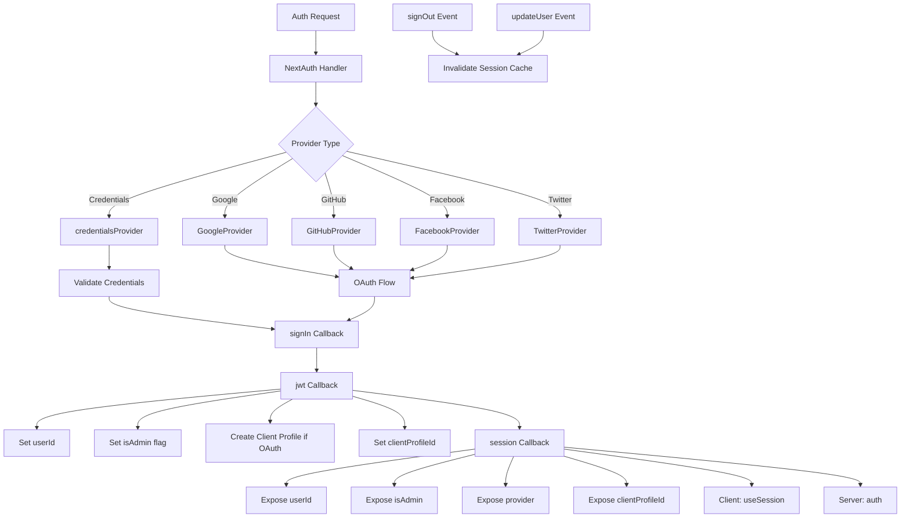

# Configuration d'authentification suivante

## Aperçu

Le modèle Ever Works configure NextAuth.js (Auth.js v5) avec des sessions basées sur JWT, un adaptateur Drizzle ORM, plusieurs fournisseurs OAuth (Google, GitHub, Facebook, Twitter), une authentification basée sur les informations d'identification et des rappels personnalisés pour la gestion des rôles administrateur/client. Le système prend en charge la création automatique de profils clients pour les utilisateurs OAuth et la mise en cache de session avec invalidation du cache.

## Architecture



## Fichiers sources

|Fichier|Objectif|
|------|---------|
|`template/lib/auth/index.ts`|Configuration et exportations principales de NextAuth|
|`template/auth.config.ts`|Configuration du fournisseur (compatible Edge)|
|`template/lib/auth/config.ts`|Sélection du type de fournisseur d'authentification|
|`template/lib/auth/providers.ts`|Fonctions d'usine du fournisseur OAuth|
|`template/lib/auth/credentials.ts`|Implémentation du fournisseur d'informations d'identification|
|`template/lib/auth/guards.ts`|Utilitaires de protection d'authentification côté serveur|
|`template/lib/auth/middleware.ts`|Wrappers d'action validés|
|`template/lib/auth/setup.ts`|Assistant d'initialisation d'authentification|
|`template/lib/auth/cached-session.ts`|Gestion du cache de session|
|`template/lib/auth/session-cache.ts`|Implémentation du cache de session|
|`template/lib/auth/admin-guard.ts`|Logique de garde spécifique à l'administrateur|

## Initialisation NextAuth

```typescript
// lib/auth/index.ts
export const { handlers, auth, signIn, signOut, unstable_update } = NextAuth({
    adapter: drizzle,
    session: {
        strategy: 'jwt',
        maxAge: 30 * 24 * 60 * 60,    // 30 days
        updateAge: 24 * 60 * 60        // Refresh every 24 hours
    },
    jwt: {
        maxAge: 30 * 24 * 60 * 60      // 30 days
    },
    callbacks: { authorized, redirect, signIn, jwt, session },
    events: { signOut, updateUser },
    pages: {
        signIn: '/auth/signin',
        signOut: '/auth/signout',
        error: '/auth/error',
        verifyRequest: '/auth/verify-request',
        newUser: '/auth/register'
    },
    ...authConfig  // Merges providers from auth.config.ts
});
```

### Stratégie de séance

Le modèle utilise des **sessions JWT** (`strategy: 'jwt'`), et non des sessions de base de données. Cela signifie :
- Les sessions sont stockées dans des cookies cryptés, pas dans la base de données
- Aucune requête de base de données n'est nécessaire pour valider une session
- Compatible avec Edge Runtime (middleware)
- Les données de session sont limitées à ce qui tient dans un jeton JWT

## Adaptateur de base de données

```typescript
const isDatabaseAvailable = !!coreConfig.DATABASE_URL && typeof db !== 'undefined';

const drizzle = isDatabaseAvailable
    ? DrizzleAdapter(getDrizzleInstance(), {
        usersTable: users,
        accountsTable: accounts,
        sessionsTable: sessions,
        verificationTokensTable: verificationTokens
    })
    : undefined;
```

L'adaptateur est créé de manière conditionnelle en fonction de la disponibilité de la base de données. Cela permet au modèle de démarrer même sans base de données (par exemple, lors de la configuration initiale), bien que l'authentification soit limitée.

## Configuration du fournisseur

### auth.config.ts (compatible Edge)

```typescript
// auth.config.ts
const configureProviders = () => {
    try {
        const oauthProviders = configureOAuthProviders();
        return createNextAuthProviders({
            google: oauthProviders.find((p) => p.id === 'google')
                ? { enabled: true, clientId: '...', clientSecret: '...' }
                : { enabled: false },
            github: { /* ... */ },
            facebook: { /* ... */ },
            twitter: { /* ... */ },
            credentials: { enabled: true },
        });
    } catch (error) {
        // Fallback to credentials only
        return createNextAuthProviders({
            credentials: { enabled: true },
            google: { enabled: false },
            github: { enabled: false },
            facebook: { enabled: false },
            twitter: { enabled: false },
        });
    }
};

export default {
    trustHost: true,
    providers: configureProviders(),
} satisfies NextAuthConfig;
```

### Usine de fournisseurs

```typescript
// lib/auth/providers.ts
export function createNextAuthProviders(config: OAuthProvidersConfig) {
    const providers = [];

    if (config.google?.enabled && config.google.clientId && config.google.clientSecret) {
        providers.push(GoogleProvider({
            clientId: config.google.clientId,
            clientSecret: config.google.clientSecret,
            ...config.google.options,
        }));
    }
    // GitHub, Facebook, Twitter follow the same pattern...

    if (config.credentials?.enabled) {
        providers.push(credentialsProvider);
    }

    return providers;
}
```

Les fournisseurs ne sont ajoutés que lorsqu'ils disposent d'informations d'identification valides, évitant ainsi les erreurs de configuration au démarrage.

## Rappels

### Connexion Rappel

```typescript
signIn: async ({ user, account, profile }) => {
    const isCredentials = account?.provider === 'credentials';

    if (!user?.email) {
        return !isCredentials; // Allow OAuth without email
    }

    if (!isDatabaseAvailable) {
        return !isCredentials; // Skip DB validation if no DB
    }

    // For OAuth providers, allow account linking
    if (!isCredentials && account?.provider) {
        return true;
    }

    return true;
}
```

### jwt Rappel

Le rappel JWT est au cœur du pipeline d'authentification. Il s'exécute à chaque requête et gère :

```typescript
jwt: async ({ token, user, account }) => {
    // 1. Set userId from user object or token.sub
    if (user?.id) token.userId = user.id;
    if (!token.userId && token.sub) token.userId = token.sub;

    // 2. Set clientProfileId
    if (user?.clientProfileId) token.clientProfileId = user.clientProfileId;

    // 3. Record provider
    if (account?.provider) token.provider = account.provider;

    // 4. Auto-create client profile for OAuth users
    if (isOAuthProvider && !token.clientProfileId && token.userId) {
        let clientProfile = await getClientProfileByUserId(token.userId);
        if (!clientProfile) {
            clientProfile = await createClientProfile({
                userId: token.userId,
                email: token.email,
                name: token.name || token.email?.split('@')[0],
            });
        }
        token.clientProfileId = clientProfile?.id;
    }

    // 5. Set isAdmin flag
    if (user?.isClient !== undefined) {
        token.isAdmin = !user.isClient;
    } else if (user?.isAdmin !== undefined) {
        token.isAdmin = user.isAdmin;
    } else if (token.isAdmin === undefined) {
        token.isAdmin = false; // Default: non-admin
    }

    return token;
}
```

### Rappel de session

Mappe les champs de jeton JWT à l'objet de session exposé aux composants clients :

```typescript
session: async ({ session, token }) => {
    if (token && session.user) {
        session.user.id = token.userId;
        session.user.clientProfileId = token.clientProfileId;
        session.user.provider = token.provider || 'credentials';
        session.user.isAdmin = token.isAdmin;
    }
    return session;
}
```

## Événements

### Invalidation du cache de session

```typescript
events: {
    signOut: async (event) => {
        const token = 'token' in event ? event.token : undefined;
        if (token?.userId) {
            await invalidateSessionCache(undefined, token.userId);
        }
    },
    updateUser: async ({ user }) => {
        if (user?.id) {
            await invalidateSessionCache(undefined, user.id);
        }
    }
}
```

Les événements `signOut` et `updateUser` déclenchent l'invalidation du cache de session, garantissant que les données de session obsolètes ne sont pas servies après les changements d'état d'authentification.

## Protections côté serveur

### exigerAuth

```typescript
export async function requireAuth() {
    const session = await auth();
    if (!session?.user) {
        redirect('/auth/signin');
    }
    return session;
}
```

### exigerAdmin

```typescript
export async function requireAdmin() {
    const session = await auth();
    if (!session?.user) {
        redirect('/admin/auth/signin');
    }
    if (!session.user.isAdmin) {
        redirect('/unauthorized');
    }
    return session;
}
```

### Gardes utilitaires

```typescript
// Check without redirecting
export async function getSession() {
    return await auth();
}

export async function checkIsAdmin() {
    const session = await auth();
    return session?.user?.isAdmin === true;
}
```

## Pages personnalisées

|Pages|Chemin|Objectif|
|------|------|---------|
|Connectez-vous|`/auth/signin`|Formulaire de connexion|
|Se déconnecter|`/auth/signout`|Confirmation de déconnexion|
|Erreur|`/auth/error`|Affichage d'erreur d'authentification|
|Vérifier la demande|`/auth/verify-request`|Invite de vérification par e-mail|
|S'inscrire|`/auth/register`|Enregistrement d'un nouvel utilisateur|

## Variables d'environnement

|Variable|Obligatoire|Objectif|
|----------|----------|---------|
|`AUTH_SECRET`|Oui|Secret de chiffrement JWT|
|`AUTH_GOOGLE_ID`|Non|ID client Google OAuth|
|`AUTH_GOOGLE_SECRET`|Non|Secret client Google OAuth|
|`AUTH_GITHUB_ID`|Non|ID client GitHub OAuth|
|`AUTH_GITHUB_SECRET`|Non|Secret client GitHub OAuth|
|`AUTH_FACEBOOK_ID`|Non|ID client Facebook OAuth|
|`AUTH_FACEBOOK_SECRET`|Non|Secret client OAuth de Facebook|
|`AUTH_TWITTER_ID`|Non|ID client Twitter/X OAuth|
|`AUTH_TWITTER_SECRET`|Non|Secret client Twitter/X OAuth|
|`DATABASE_URL`|Pour adaptateur|Chaîne de connexion à la base de données|

## Meilleures pratiques

1. **Utilisez la stratégie JWT** pour la compatibilité Edge Runtime dans le middleware
2. **Créer automatiquement des profils client** pour les utilisateurs OAuth dans le rappel JWT
3. **Dégradation progressive** : si la configuration OAuth échoue, revenez uniquement aux informations d'identification.
4. ** Invalider le cache lors des événements d'authentification ** : la déconnexion et la mise à jour de l'utilisateur effacent les sessions mises en cache.
5. **Adaptateur conditionnel** - autorise le démarrage sans base de données pour la configuration initiale
6. **Fonctions de protection** -- utilisez `requireAuth()` / `requireAdmin()` dans les composants du serveur, pas dans les contrôles de session manuels
7. **Pages personnalisées** : remplacez les pages NextAuth par défaut pour une interface utilisateur cohérente avec la conception du modèle.
