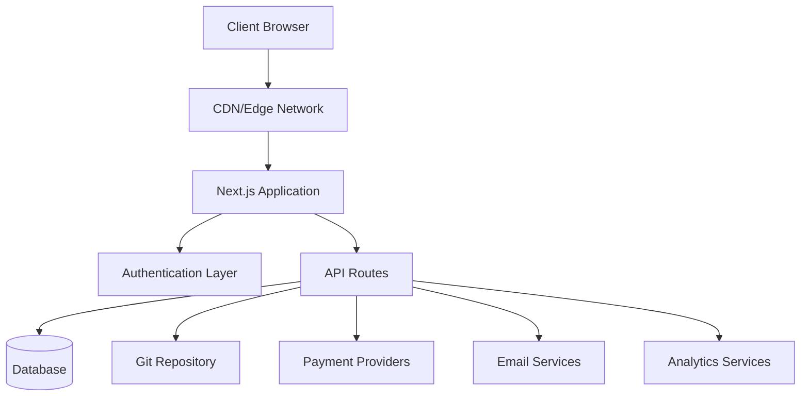
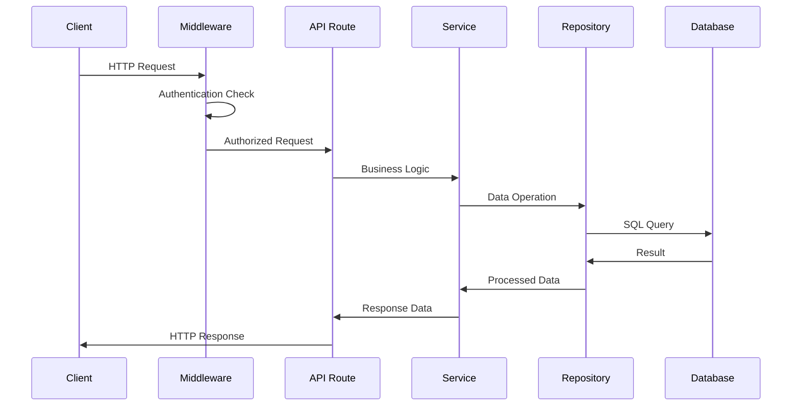
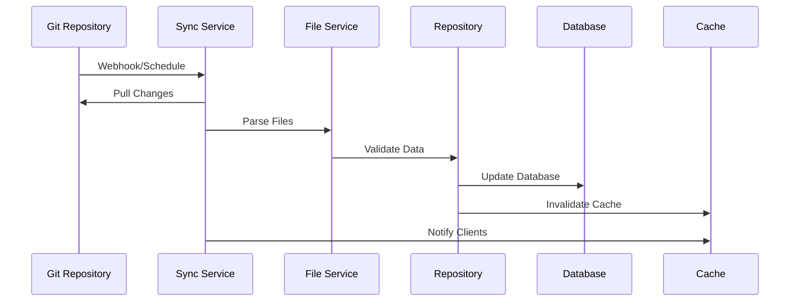
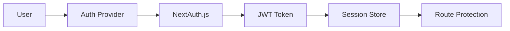

# Présentation de l'architecture

Ever Works suit une architecture moderne et évolutive conçue pour les performances, la maintenabilité et l'expérience des développeurs.

## Architecture de haut niveau



## Principes fondamentaux

### 1. Séparation des préoccupations
- **Couche de présentation** : composants React et logique de l'interface utilisateur
- **Couche métier** : services et référentiels
- **Couche de données** : base de données et API externes

### 2. Conception modulaire
- Organisation basée sur les fonctionnalités
- Composants réutilisables
- Intégrations de type plugin

### 3. Saisissez la sécurité
- TypeScript partout
- Vérification de type stricte
- Validation d'exécution avec Zod

### 4. La performance avant tout
- Rendu côté serveur
- Génération statique si possible
- Stratégies de mise en cache optimisées

## Couches d'application

### Couche frontale

**Technologie** : React 19 + Next.js 15
**Responsabilités** :
- Rendu de l'interface utilisateur
- Gestion de l'état côté client
- Interactions avec les utilisateurs
- Gestion des itinéraires

**Composants clés** :
- Composants de page (`app/[locale]/`)
- Composants d'interface utilisateur réutilisables (`components/`)
- Crochets personnalisés (`hooks/`)
- Fournisseurs de contexte (`components/providers/`)

### Couche API

**Technologie** : routes de l'API Next.js
**Responsabilités** :
- Exécution de la logique métier
- Validation des données
- Intégration de services externes
- Gestion de l'authentification

**Structure** :
```
app/api/
├── auth/           # Authentication endpoints
├── admin/          # Admin-only endpoints
├── items/          # Item management
└── webhooks/       # External service webhooks
```

### Couche de données

**Technologies** : Drizzle ORM + PostgreSQL
**Responsabilités** :
- Persistance des données
- Optimisation des requêtes
- Gestion des transactions
- Migrations de schéma

**Composants** :
- Schéma de base de données (`lib/db/schema.ts`)
- Dépôts (`lib/repositories/`)
- Fichiers de migration (`lib/db/migrations/`)

### Couche de contenu

**Technologie** : CMS basé sur Git
**Responsabilités** :
- Synchronisation du contenu
- Contrôle des versions
- Édition collaborative
- Validation du contenu

**Structure** :
```
.content/
├── config.yml      # Site configuration
├── items/          # Item definitions
├── categories/     # Category definitions
└── tags/           # Tag definitions
```

## Modèles de conception

### 1. Modèle de référentiel

Logique d'accès aux données des résumés :

```typescript
interface ItemRepository {
  findById(id: string): Promise<Item | null>;
  findBySlug(slug: string): Promise<Item | null>;
  findWithFilters(filters: ItemFilters): Promise<Item[]>;
  create(item: CreateItemRequest): Promise<Item>;
  update(id: string, updates: UpdateItemRequest): Promise<Item>;
  delete(id: string): Promise<void>;
}
```

### 2. Modèle de couche de service

Encapsule la logique métier :

```typescript
class ItemService {
  constructor(
    private itemRepository: ItemRepository,
    private gitService: GitService,
    private notificationService: NotificationService
  ) {}

  async submitItem(data: SubmitItemRequest): Promise<SubmissionResult> {
    // Business logic here
  }
}
```

### 3. Modèle d'usine

Crée des instances de service :

```typescript
class PaymentProviderFactory {
  static create(provider: PaymentProvider): PaymentService {
    switch (provider) {
      case 'stripe':
        return new StripePaymentService();
      case 'lemonsqueezy':
        return new LemonSqueezyPaymentService();
      default:
        throw new Error(`Unsupported provider: ${provider}`);
    }
  }
}
```

### 4. Modèle d'observateur

Mises à jour basées sur des événements :

```typescript
class ContentSyncService {
  private observers: ContentObserver[] = [];

  addObserver(observer: ContentObserver): void {
    this.observers.push(observer);
  }

  notifyObservers(event: ContentEvent): void {
    this.observers.forEach(observer => observer.update(event));
  }
}
```

## Flux de données

### 1. Flux de demande



### 2. Flux de synchronisation de contenu



## Architecture de sécurité

### 1. Flux d'authentification



### 2. Couches d'autorisation

- **Niveau route** : protection middleware
- **Niveau API** : protections des points de terminaison
- **Niveau des données** : sécurité au niveau des lignes
- **Au niveau de l'interface utilisateur** : contrôle d'accès basé sur les composants

### 3. Mesures de sécurité

- **Validation d'entrée** : schémas Zod
- **Injection SQL** : requêtes paramétrées
- **Protection XSS** : nettoyage du contenu
- **Protection CSRF** : validation du jeton
- **Limitation de débit** : limitation des demandes

## Stratégie de mise en cache

### 1. Cache des applications

- **React Query** : cache de données côté client
- **Cache Next.js** : cache de routes de pages et d'API
- **Génération statique** : pages prédéfinies

### 2. Cache de base de données

- **Regroupement de connexions** : connexions de base de données efficaces
- **Optimisation des requêtes** : requêtes indexées
- **Répliques de lecture** : opérations de lecture distribuées

### 3. Cache CDN

- **Actifs statiques** : images, CSS, JS
- **Réponses API** : points de terminaison pouvant être mis en cache
- **Emplacements périphériques** : distribution mondiale

## Considérations d'évolutivité

### 1. Mise à l'échelle horizontale

- **Conception sans état** : aucune session côté serveur
- **Mise à l'échelle de la base de données** : réplicas en lecture et partitionnement
- **Distribution CDN** : mise en cache périphérique globale

### 2. Optimisation des performances

- **Partage de code** : importations dynamiques
- **Optimisation d'image** : composant d'image Next.js
- **Optimisation du bundle** : secousse et minification des arbres

### 3. Surveillance et observabilité

- **Suivi des erreurs** : intégration de Sentry
- **Surveillance des performances** : éléments essentiels du Web
- **Analytics** : intégration PostHog
- **Journalisation** : journalisation structurée

## Décisions technologiques

### Pourquoi Next.js ?
- **Framework full-stack** : routes API + frontend
- **Performances** : SSR, SSG et ISR
- **Expérience développeur** : rechargement à chaud, prise en charge de TypeScript
- **Écosystème** : écosystème de plugins riche

### Pourquoi bruiner ORM ?
- **Sécurité des types** : prise en charge complète de TypeScript
- **Performances** : frais généraux minimes
- **Flexibilité** : SQL brut si nécessaire
- **Système de migration** : modifications du schéma contrôlées par la version

### Pourquoi un CMS basé sur Git ?
- **Contrôle de version** : suivi de l'historique complet
- **Collaboration** : workflow de demande d'extraction
- **Sauvegarde** : Distribuée par nature
- **Flexibilité** : tout fournisseur Git

### Pourquoi React Query ?
- **Mise en cache** : gestion intelligente du cache
- **Synchronisation** : mises à jour en arrière-plan
- **Mises à jour optimistes** : meilleure UX
- **Gestion des erreurs** : logique de nouvelle tentative

## Points d'extension

L'architecture offre plusieurs points d'extension :

### 1. Fournisseurs d'authentification personnalisés
```typescript
// lib/auth/providers/custom-provider.ts
export function CustomProvider(options: CustomProviderOptions) {
  return {
    id: "custom",
    name: "Custom Provider",
    type: "oauth",
    // Implementation
  }
}
```

### 3. Intégration de la source de contenu
```typescript
// lib/content/sources/custom-source.ts
export class CustomContentSource implements ContentSource {
  async sync(): Promise<SyncResult> {
    // Implementation
  }
}
```

## Prochaines étapes

- [Explorez la pile technologique](./tech-stack) en détail
