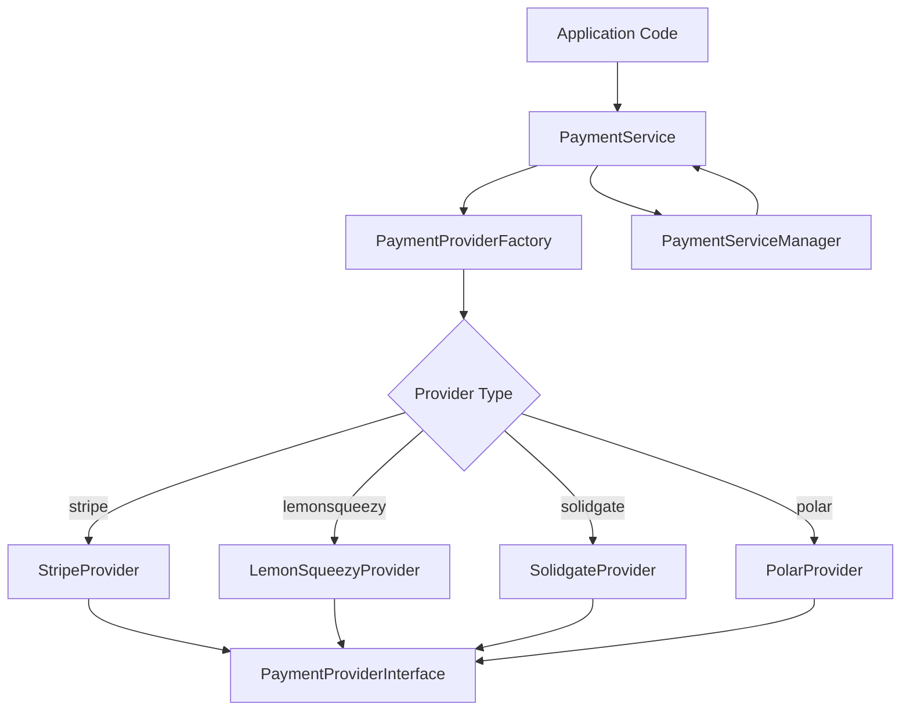
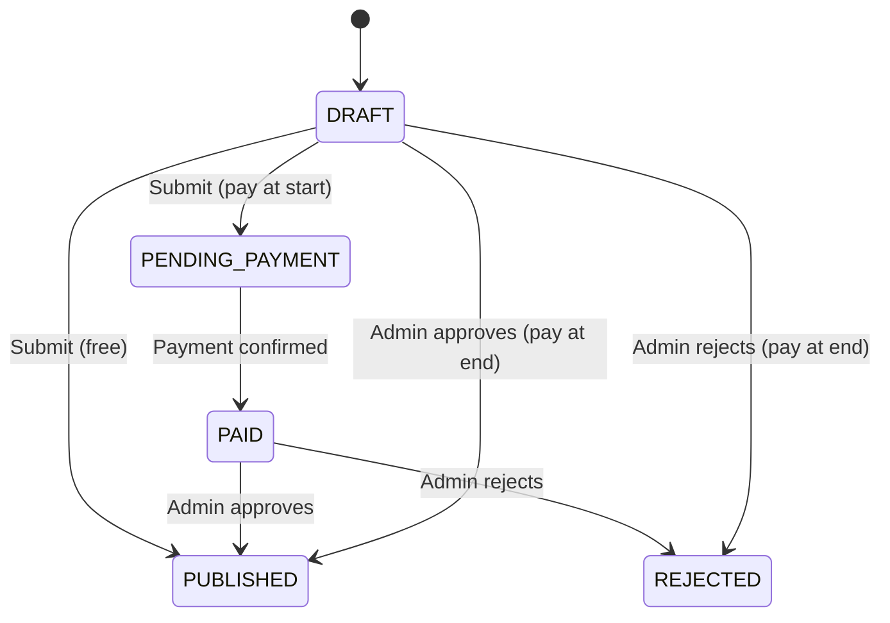

# Bibliothèque de paiement

Le modèle implémente un système de paiement multi-fournisseurs utilisant les modèles Factory et Strategy. Il prend en charge Stripe, LemonSqueezy, Solidgate et Polar en tant que fournisseurs de paiement, avec une interface unifiée pour les paiements, les abonnements, les webhooks et les remboursements.

## Présentation de l'architecture



## Fichiers sources

|Fichier|Objectif|
|------|---------|
|`lib/payment/index.ts`|Exportations d'API publiques|
|`lib/payment/lib/payment-provider-factory.ts`|Factory pour créer des instances de fournisseur|
|`lib/payment/lib/payment-service.ts`|Façade de service unifiée|
|`lib/payment/lib/payment-service-manager.ts`|Gestionnaire Singleton pour le cycle de vie des services|
|`lib/payment/types/payment-types.ts`|Interfaces principales et énumérations|
|`lib/payment/types/payment.ts`|Flux de paiement et types de soumission|
|`lib/payment/config/`|Configuration et validation du fournisseur|
|`lib/payment/lib/providers/`|Implémentations de fournisseurs individuels|
|`lib/payment/hooks/`|Hooks React pour les flux de paiement côté client|
|`lib/payment/ui/`|Composants du formulaire de paiement|

## Interfaces principales

### Interface du fournisseur de paiement

Chaque fournisseur implémente cette interface complète :

```typescript
export interface PaymentProviderInterface {
  // Payment operations
  createPaymentIntent(params: CreatePaymentParams): Promise<PaymentIntent>;
  confirmPayment(paymentId: string, paymentMethodId: string): Promise<PaymentIntent>;
  verifyPayment(paymentId: string): Promise<PaymentVerificationResult>;
  createSetupIntent(user: User | null): Promise<SetupIntent>;

  // Subscription management
  createCustomer(params: CreateCustomerParams): Promise<CustomerResult>;
  createSubscription(params: CreateSubscriptionParams): Promise<SubscriptionInfo>;
  cancelSubscription(subscriptionId: string, cancelAtPeriodEnd?: boolean): Promise<SubscriptionInfo>;
  updateSubscription(params: UpdateSubscriptionParams): Promise<SubscriptionInfo>;
  hasCustomerId(user: User | null): boolean;
  getCustomerId(user: User | null): Promise<string | null>;

  // Webhooks and refunds
  handleWebhook(payload: any, signature: string, ...args: any[]): Promise<WebhookResult>;
  refundPayment(paymentId: string, amount?: number): Promise<any>;

  // Client configuration and UI
  getClientConfig(): ClientConfig;
  getUIComponents(): UIComponents;
}
```

### PaiementProviderFactory

Crée des instances de fournisseur en fonction de la configuration :

```typescript
export type SupportedProvider = 'stripe' | 'solidgate' | 'lemonsqueezy' | 'polar';

export class PaymentProviderFactory {
  static createProvider(
    providerType: SupportedProvider,
    config: PaymentProviderConfig
  ): PaymentProviderInterface {
    switch (providerType) {
      case 'stripe':       return new StripeProvider(config);
      case 'solidgate':    return new SolidgateProvider(config);
      case 'lemonsqueezy': return new LemonSqueezyProvider(config);
      case 'polar':        return new PolarProvider(config);
      default:             throw new Error(`Unsupported payment provider: ${providerType}`);
    }
  }
}
```

## Service de paiement

La classe `PaymentService` fournit une façade unifiée sur toutes les opérations du fournisseur :

```typescript
export class PaymentService {
  private provider: PaymentProviderInterface;

  constructor(config: PaymentServiceConfig) {
    this.provider = PaymentProviderFactory.createProvider(config.provider, config.config);
  }

  // All methods delegate to the underlying provider
  async createPaymentIntent(params: CreatePaymentParams): Promise<PaymentIntent> {
    return this.provider.createPaymentIntent(params);
  }

  async createSubscription(params: CreateSubscriptionParams): Promise<SubscriptionInfo> {
    return this.provider.createSubscription(params);
  }

  // ... additional delegated methods
}
```

## Types de données

### Énumérations de paiement

```typescript
export enum PaymentType {
  ONE_TIME = 'one_time',
  SUBSCRIPTION = 'subscription',
  FREE = 'free',
}

export enum SubscriptionStatus {
  INCOMPLETE = 'incomplete',
  INCOMPLETE_EXPIRED = 'incomplete_expired',
  TRIALING = 'trialing',
  ACTIVE = 'active',
  PAST_DUE = 'past_due',
  CANCELED = 'canceled',
  UNPAID = 'unpaid',
}

export enum PaymentFlow {
  PAY_AT_START = "pay_at_start",
  PAY_AT_END = "pay_at_end",
}
```

### Événements Webhook

```typescript
export enum WebhookEventType {
  PAYMENT_SUCCEEDED = 'payment_succeeded',
  PAYMENT_FAILED = 'payment_failed',
  SUBSCRIPTION_CREATED = 'subscription_created',
  SUBSCRIPTION_UPDATED = 'subscription_updated',
  SUBSCRIPTION_CANCELLED = 'subscription_cancelled',
  INVOICE_PAID = 'invoice_paid',
  REFUND_CREATED = 'refund_created',
  // ... additional event types
}
```

### Structures de données clés

|Tapez|Objectif|
|------|---------|
|`PaymentIntent`|Session de paiement avec identifiant, montant, devise, statut, clientSecret|
|`SubscriptionInfo`|Détails de l'abonnement avec statut, fin de période, informations d'essai|
|`CustomerResult`|Client créé avec identifiant, email, nom|
|`WebhookResult`|Webhook traité avec type, identifiant et données|
|`ClientConfig`|Configuration sécurisée pour le front-end avec publicKey et type de passerelle|
|`UIComponents`|Composants React et ressources visuelles pour le fournisseur|

## Utilitaires de devises

La bibliothèque comprend des fonctions d'assistance pour le formatage des devises :

```typescript
// Format cents to display currency
export function formatCentsToCurrency(
  cents: number, currency: string = 'USD', locale: string = 'en-US'
): string {
  const amount = cents / 100;
  return new Intl.NumberFormat(locale, {
    style: 'currency', currency,
    minimumFractionDigits: 2, maximumFractionDigits: 2,
  }).format(amount);
}

// Convert between cents and decimal
export function convertCentsToDecimal(cents: number): number;
export function convertDecimalToCents(decimal: number): number;

// Convert timestamps to Date objects
export function convertNumberToDate(timestamp?: number): Date | null;
export function safeTimestampToDate(timestamp: number | null | undefined): Date | undefined;
```

## Types de flux de paiement

Le système prend en charge deux flux de paiement de soumission :

|Flux|Énumération|Descriptif|
|------|------|-------------|
|Payer au début|`PAY_AT_START`|Paiement requis avant l'examen de la soumission|
|Payer à la fin|`PAY_AT_END`|Paiement collecté après approbation de l'administrateur|

### Cycle de vie du statut de la soumission



## Interface des composants de l'interface utilisateur

Chaque fournisseur expose les composants de l'interface utilisateur pour l'intégration frontale :

```typescript
export interface UIComponents {
  PaymentForm: React.ComponentType<PaymentFormProps>;
  logo: string;
  cardBrands: CardBrandIcon[];
  supportedPaymentMethods: string[];
  translations: Record<string, Record<string, string>>;
}
```

## Intégration côté client

Le hook `usePayment` et le contexte `PaymentProvider` fournissent l'intégration de React :

```typescript
import { usePayment, PaymentProvider } from '@/lib/payment';

// Wrap your app with the payment provider
<PaymentProvider>
  <PaymentForm
    amount={2999}
    currency="usd"
    isSubscription={false}
    onSuccess={(paymentId) => console.log('Paid:', paymentId)}
    onError={(error) => console.error('Failed:', error)}
  />
</PaymentProvider>
```

## Configuration du fournisseur

```typescript
export interface PaymentProviderConfig {
  apiKey: string;
  webhookSecret?: string;
  secretKey?: string;
  options?: Record<string, any>;
}
```

Chaque fournisseur nécessite au minimum un `apiKey`. Stripe et Solidgate utilisent également `webhookSecret` pour la vérification de la signature du webhook.
