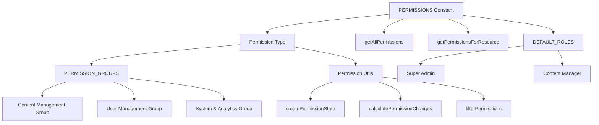

# Système d'autorisations

Le modèle implémente un système d'autorisations granulaire basé sur les ressources avec des définitions d'autorisations de type sécurisé, des regroupements logiques pour l'organisation de l'interface utilisateur et des fonctions utilitaires pour la gestion de l'état et la détection des modifications.

## Présentation de l'architecture



## Fichiers sources

|Fichier|Objectif|
|------|---------|
|`lib/permissions/definitions.ts`|Constantes d'autorisation, extraction de type, rôles par défaut|
|`lib/permissions/groups.ts`|Groupes d'autorisations orientés interface utilisateur avec métadonnées|
|`lib/permissions/utils.ts`|Gestion de l'état, calcul des différences et filtrage|

## Définitions des autorisations

Les autorisations suivent une convention de dénomination `resource:action`. L'objet `PERMISSIONS` les organise par ressource :

```typescript
export const PERMISSIONS = {
  items: {
    read: 'items:read',
    create: 'items:create',
    update: 'items:update',
    delete: 'items:delete',
    review: 'items:review',
    approve: 'items:approve',
    reject: 'items:reject',
  },
  categories: {
    read: 'categories:read',
    create: 'categories:create',
    update: 'categories:update',
    delete: 'categories:delete',
  },
  tags: {
    read: 'tags:read',
    create: 'tags:create',
    update: 'tags:update',
    delete: 'tags:delete',
  },
  roles: {
    read: 'roles:read',
    create: 'roles:create',
    update: 'roles:update',
    delete: 'roles:delete',
  },
  users: {
    read: 'users:read',
    create: 'users:create',
    update: 'users:update',
    delete: 'users:delete',
    assignRoles: 'users:assignRoles',
  },
  analytics: {
    read: 'analytics:read',
    export: 'analytics:export',
  },
  system: {
    settings: 'system:settings',
  },
} as const;
```

### Liste complète des autorisations

|Ressource|Actions|
|----------|---------|
|`items`|`read`, `create`, `update`, `delete`, `review`, `approve`, `reject`|
|`categories`|`read`, `create`, `update`, `delete`|
|`tags`|`read`, `create`, `update`, `delete`|
|`roles`|`read`, `create`, `update`, `delete`|
|`users`|`read`, `create`, `update`, `delete`, `assignRoles`|
|`analytics`|`read`, `export`|
|`system`|`settings`|

## Type d'autorisation de type sécurisé

Le type `Permission` est extrait de la constante `PERMISSIONS` à l'aide de types conditionnels récursifs :

```typescript
type PermissionValues<T> = T extends Record<string, infer U>
  ? U extends Record<string, infer V>
    ? V extends string ? V : never
    : never
  : never;

export type Permission = PermissionValues<typeof PERMISSIONS>;
// Resolves to: 'items:read' | 'items:create' | ... | 'system:settings'
```

Cela garantit la sécurité au moment de la compilation : toute chaîne d'autorisation qui n'existe pas dans la constante `PERMISSIONS` provoquera une erreur TypeScript.

## Fonctions de requête

```typescript
// Get all permissions as a flat array
export function getAllPermissions(): Permission[];

// Get permissions for a specific resource
export function getPermissionsForResource(resource: keyof typeof PERMISSIONS): Permission[];

// Validate whether a string is a valid permission
export function isValidPermission(permission: string): permission is Permission;
```

## Rôles par défaut

Deux définitions de rôles intégrées fournissent des points de départ :

```typescript
export const DEFAULT_ROLES = {
  SUPER_ADMIN: {
    id: 'super-admin',
    name: 'Super Administrator',
    description: 'Full system access with all permissions',
    permissions: getAllPermissions(), // Every permission
  },
  CONTENT_MANAGER: {
    id: 'content-manager',
    name: 'Content Manager',
    description: 'Manage content including items, categories, and tags',
    permissions: [
      ...getPermissionsForResource('items'),
      ...getPermissionsForResource('categories'),
      ...getPermissionsForResource('tags'),
    ],
  },
} as const;
```

## Groupes d'autorisations

Les groupes organisent les autorisations pour l'affichage de l'interface utilisateur avec des icônes et des descriptions :

```typescript
export interface PermissionGroup {
  id: string;
  name: string;
  description: string;
  icon: string;       // Lucide icon name
  permissions: Permission[];
}

export const PERMISSION_GROUPS: PermissionGroup[] = [
  {
    id: 'content',
    name: 'Content Management',
    description: 'Manage items, categories, and tags',
    icon: 'FileText',
    permissions: [...items, ...categories, ...tags],
  },
  {
    id: 'users',
    name: 'User Management',
    description: 'Manage users and their roles',
    icon: 'Users',
    permissions: [...users, ...roles],
  },
  {
    id: 'system',
    name: 'System & Analytics',
    description: 'System settings and analytics access',
    icon: 'Settings',
    permissions: [...analytics, ...system],
  },
];
```

### Fonctions de requête de groupe

```typescript
// Find which group a permission belongs to
export function getPermissionGroup(permission: Permission): PermissionGroup | undefined;

// Get all permissions in a group by group ID
export function getPermissionsByGroup(groupId: string): Permission[];
```

### Formatage de l'affichage des autorisations

```typescript
// Format for display: "items:approve" -> "Approve Items"
export function formatPermissionName(permission: Permission): string;

// Generate description: "items:approve" -> "Approve submissions items and submissions"
export function formatPermissionDescription(permission: Permission): string;
```

Le formateur de description utilise des tables de recherche pour les actions et les ressources :

|Action|Préfixe de description|
|--------|-------------------|
|`read`|Visualisation et accès|
|`create`|Créer nouveau|
|`update`|Modifier l'existant|
|`delete`|Supprimer|
|`review`|Réviser et modérer|
|`approve`|Approuver les soumissions|
|`reject`|Rejeter les soumissions|
|`assignRoles`|Attribuer des rôles à|
|`export`|Exporter des données depuis|
|`settings`|Gérer les paramètres de|

## Gestion de l'état des autorisations

Le module utilitaires fournit des fonctions pour gérer l'état des autorisations dans l'interface utilisateur :

### Création d'un état à partir des autorisations

```typescript
export function createPermissionState(currentPermissions: Permission[]): PermissionState;
// Returns: { 'items:read': true, 'items:create': true, ... }
```

### Extraction des autorisations sélectionnées

```typescript
export function getSelectedPermissions(permissionState: PermissionState): Permission[];
// Filters the state object to return only permissions where value is `true`
```

### Détection des changements

```typescript
export function calculatePermissionChanges(
  originalPermissions: Permission[],
  newPermissions: Permission[]
): PermissionChanges;
// Returns: { added: Permission[], removed: Permission[] }
```

### Contrôle d'égalité

```typescript
export function arePermissionsEqual(
  permissions1: Permission[],
  permissions2: Permission[]
): boolean;
// Uses Set-based comparison for order-independent equality
```

### Filtrage de recherche

```typescript
export function filterPermissions(
  permissions: Permission[],
  searchTerm: string
): Permission[];
// Matches against permission string and space-separated format
// e.g., "assign" matches "users:assignRoles" and "users assignRoles"
```

## Exemple d'utilisation

```typescript
import { PERMISSIONS, getAllPermissions } from '@/lib/permissions/definitions';
import { PERMISSION_GROUPS, formatPermissionName } from '@/lib/permissions/groups';
import { createPermissionState, calculatePermissionChanges } from '@/lib/permissions/utils';

// Check a specific permission
if (userPermissions.includes(PERMISSIONS.items.approve)) {
  // User can approve items
}

// Build a permission editor UI
const state = createPermissionState(user.permissions);

// After user toggles permissions
const changes = calculatePermissionChanges(user.permissions, newPermissions);
console.log(`Added: ${changes.added.length}, Removed: ${changes.removed.length}`);
```
