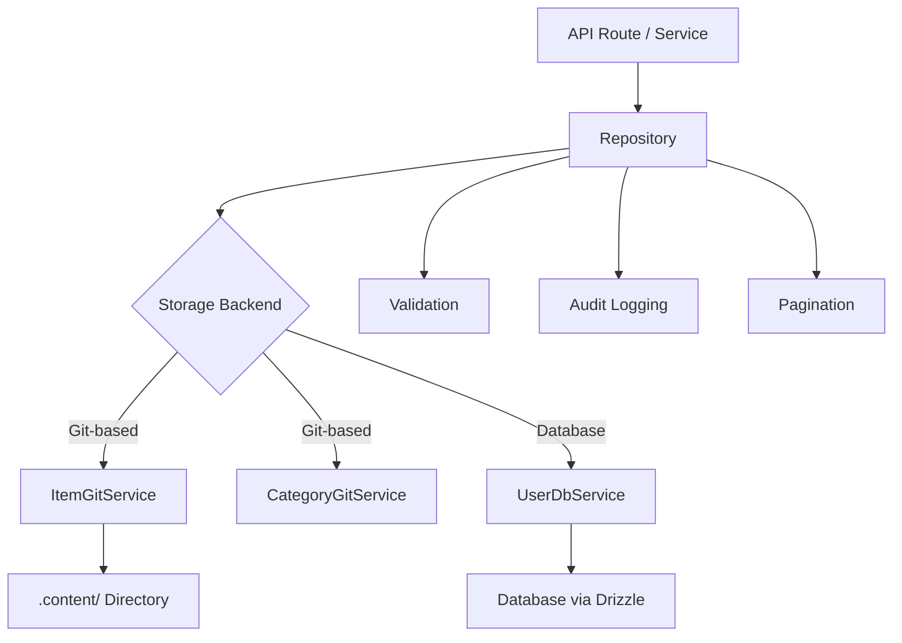

# Modèles de référentiel

Le modèle implémente le modèle Repository pour fournir une couche d'accès aux données propre entre la logique métier et le stockage des données. Les référentiels encapsulent la création de requêtes, la validation, la pagination et la journalisation d'audit tout en déléguant le stockage réel aux services sous-jacents (basés sur Git ou basés sur une base de données).

## Présentation de l'architecture



## Fichiers sources

|Fichier|Objectif|
|------|---------|
|`lib/repositories/item.repository.ts`|Article CRUD avec stockage Git, filtrage, audit|
|`lib/repositories/category.repository.ts`|Gestion des catégories avec le stockage Git|
|`lib/repositories/user.repository.ts`|Opérations utilisateur avec stockage de base de données|
|`lib/repositories/tag.repository.ts`|Gestion des balises|
|`lib/repositories/role.repository.ts`|Gestion des rôles|
|`lib/repositories/collection.repository.ts`|Gestion des collections|
|`lib/repositories/sponsor-ad.repository.ts`|Gestion des publicités des sponsors|
|`lib/repositories/client-item.repository.ts`|Opérations sur les éléments destinés au client|
|`lib/repositories/client-dashboard.repository.ts`|Données du tableau de bord client|
|`lib/repositories/admin-stats.repository.ts`|Statistiques d'administration|
|`lib/repositories/admin-analytics-optimized.repository.ts`|Requêtes d'analyse optimisées|
|`lib/repositories/integration-mapping.repository.ts`|Mappages d'intégration externes|
|`lib/repositories/twenty-crm-config.repository.ts`|Vingt configuration CRM|

## Méthodes de référentiel courantes

Tous les référentiels suivent une surface API cohérente :

|Méthode|Descriptif|
|--------|-------------|
|`findAll(options?)`|Récupérer tous les enregistrements avec un filtrage facultatif|
|`findAllPaginated(page, limit, options?)`|Récupération paginée|
|`findById(id)`|Rechercher un seul enregistrement par ID|
|`findBySlug(slug)`|Trouver un seul enregistrement par slug|
|`create(data)`|Créer un nouvel enregistrement avec validation|
|`update(id, data)`|Mettre à jour un enregistrement existant avec validation|
|`delete(id)`|Supprimer définitivement un enregistrement|
|`getStats()`|Obtenez des statistiques globales|

## Référentiel d'articles

Le référentiel le plus complet, démontrant tous les modèles clés.

### Initialisation paresseuse du service

Le service Git est initialisé paresseusement lors de la première utilisation :

```typescript
export class ItemRepository {
  private gitService: ItemGitService | null = null;

  private async getGitService(): Promise<ItemGitService> {
    if (!this.gitService) {
      const dataRepo = coreConfig.content.dataRepository;
      const token = coreConfig.content.ghToken;
      // Parse GitHub URL, create service config
      this.gitService = await createItemGitService(config);
    }
    return this.gitService;
  }
}
```

### Filtrage

La méthode `findAll` prend en charge le filtrage multicritère avec la logique OU pour les tableaux :

```typescript
async findAll(options: ItemListOptions = {}): Promise<ItemData[]> {
  const items = await gitService.readItems(options.includeDeleted ?? false);
  let filteredItems = items;

  if (options.status)
    filteredItems = filteredItems.filter(item => item.status === options.status);

  if (options.categories?.length > 0)
    filteredItems = filteredItems.filter(item => {
      const itemCategories = Array.isArray(item.category) ? item.category : [item.category];
      return options.categories!.some(cat => itemCategories.includes(cat));
    });

  if (options.tags?.length > 0)
    filteredItems = filteredItems.filter(item =>
      options.tags!.some(tag => item.tags.includes(tag))
    );

  if (options.search) {
    const searchLower = options.search.toLowerCase();
    filteredItems = filteredItems.filter(item =>
      item.name.toLowerCase().includes(searchLower) ||
      item.description.toLowerCase().includes(searchLower)
    );
  }

  return filteredItems;
}
```

### Pagination

```typescript
async findAllPaginated(page = 1, limit = 10, options = {}): Promise<{
  items: ItemData[];
  total: number;
  page: number;
  limit: number;
  totalPages: number;
}> {
  return await gitService.getItemsPaginated(page, limit, options);
}
```

### Journalisation d'audit

Toutes les opérations de mutation sont consignées dans une piste d'audit (au mieux, non bloquant) :

```typescript
async create(data: CreateItemRequest, auditUser?: AuditUser): Promise<ItemData> {
  this.validateCreateData(data);
  const item = await gitService.createItem(data);

  try {
    await itemAuditService.logCreation(item, auditUser);
  } catch (err) {
    console.warn('Audit logCreation failed:', err);
  }

  return item;
}
```

Événements d'audit capturés :

|Fonctionnement|Méthode d'audit|Données capturées|
|-----------|-------------|---------------|
|Créer|`logCreation`|Nouvel élément, utilisateur|
|Mise à jour|`logUpdate`|État précédent, nouvel état, utilisateur|
|Examen|`logReview`|Article, statut précédent, notes, utilisateur|
|Supprimer|`logDeletion`|Article, utilisateur, indicateur logiciel/dur|
|Restaurer|`logRestoration`|Article, utilisateur|

### Opérations par lots

La méthode `batchUpdate` optimise plusieurs mises à jour avec un seul commit Git :

```typescript
async batchUpdate(updates: Array<{ id: string; data: UpdateItemRequest }>): Promise<ItemData[]> {
  // Pre-validate ALL updates before writing
  for (const { id, data } of updates) {
    this.validateUpdateData(id, data);
  }

  // Write each update without committing
  for (const { id, data } of updates) {
    await gitService.updateItemWithoutCommit(id, data);
  }

  // Single commit for all changes
  await gitService.commitAndPushBatch(`Batch update ${updates.length} items`);

  // Audit logging after successful commit
  for (const entry of auditEntries) {
    await itemAuditService.logUpdate(entry.previous, entry.updated, auditUser);
  }
}
```

### Validation

Les référentiels effectuent la validation des entrées avant les opérations de stockage :

```typescript
private validateCreateData(data: CreateItemRequest): void {
  if (!data.id?.trim())          throw new Error('Item ID is required');
  if (!data.name?.trim())        throw new Error('Item name is required');
  if (!data.slug?.trim())        throw new Error('Item slug is required');
  if (!data.description?.trim()) throw new Error('Item description is required');
  if (!data.source_url?.trim())  throw new Error('Item source URL is required');

  if (!/^[a-z0-9-]+$/.test(data.slug))
    throw new Error('Slug must contain only lowercase letters, numbers, and hyphens');

  try { new URL(data.source_url); }
  catch { throw new Error('Invalid source URL format'); }
}
```

### Suppression et restauration logicielles

```typescript
async softDelete(id: string): Promise<ItemData> {
  return await gitService.softDeleteItem(id);
}

async restore(id: string): Promise<ItemData> {
  return await gitService.restoreItem(id);
}
```

## CatégorieRéférentiel

Démontre le modèle singleton et la vérification des doublons :

```typescript
export class CategoryRepository {
  // Duplicate name checking (case-insensitive, excludes self for updates)
  private async checkDuplicateName(name: string, excludeId?: string): Promise<void> {
    const categories = await gitService.readCategories();
    const duplicate = categories.find(cat =>
      cat.name.toLowerCase() === name.toLowerCase() && cat.id !== excludeId
    );
    if (duplicate) throw new Error(`Category with name "${name}" already exists`);
  }

  // Sorting
  private sortCategories(categories, options): CategoryData[] {
    return categories.sort((a, b) => {
      const comparison = a.name.localeCompare(b.name);
      return options.sortOrder === 'desc' ? -comparison : comparison;
    });
  }
}

// Singleton export
export const categoryRepository = new CategoryRepository();
```

## Référentiel utilisateur

Utilise le stockage basé sur une base de données via `UserDbService` avec validation Zod :

```typescript
export class UserRepository {
  private userDbService: UserDbService;

  async create(data: CreateUserRequest): Promise<AuthUserData> {
    // Zod schema validation
    const validatedData = userValidationSchema
      .pick({ email: true, password: true })
      .parse(data);

    // Uniqueness check
    const exists = await this.userDbService.emailExists(validatedData.email);
    if (exists) throw new Error('Email already in use');

    return await this.userDbService.createUser(validatedData);
  }
}
```

## Stratégie de gestion des erreurs

Les référentiels suivent un modèle de gestion des erreurs cohérent :

1. Relancez les erreurs commerciales connues (par exemple, « E-mail déjà utilisé »)
2. Consigner et envelopper les erreurs inconnues avec des messages génériques
3. Les échecs de journalisation d'audit sont détectés et avertis, sans jamais bloquer l'opération.
