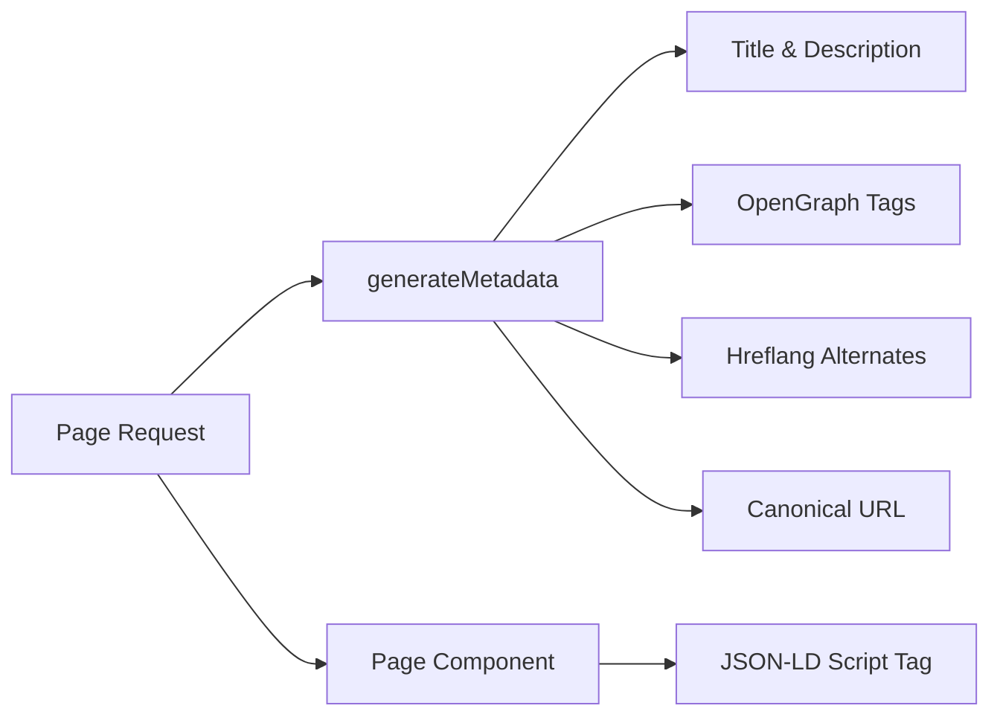

# Système de référencement

Le modèle Ever Works comprend un système de référencement complet qui génère des données structurées (JSON-LD), des balises hreflang, des métadonnées OpenGraph et des plans de site dynamiques. Tous les utilitaires de référencement se trouvent sous `lib/seo/` et s'intègrent à l'API de métadonnées Next.js.

## Présentation de l'architecture



### Fichiers sources

|Fichier|Objectif|
|---|---|
|`lib/seo/schema.ts`|Générateurs de données structurées JSON-LD|
|`lib/seo/hreflang.ts`|Générateurs d'URL alternatives de langue|
|`lib/seo/listing-metadata.ts`|Fabrique de métadonnées de page de liste|

## Données structurées JSON-LD

Le module `lib/seo/schema.ts` génère des données structurées Schema.org pour des résultats riches dans les moteurs de recherche.

### Schéma du produit

Pour les pages de détails des articles, génère un schéma `Product` :

```typescript
import { generateProductSchema } from '@/lib/seo/schema';

const schema = generateProductSchema({
  name: 'My App',
  description: 'A productivity tool',
  image: 'https://example.com/icon.png',
  url: 'https://example.com/items/my-app',
  category: 'Productivity',
  sourceUrl: 'https://myapp.com',
  brandName: 'MyApp Inc.',
});
```

Sortie générée :

```json
{
  "@context": "https://schema.org",
  "@type": "Product",
  "name": "My App",
  "description": "A productivity tool",
  "image": "https://example.com/icon.png",
  "url": "https://example.com/items/my-app",
  "category": "Productivity",
  "brand": {
    "@type": "Brand",
    "name": "MyApp Inc."
  },
  "offers": {
    "@type": "Offer",
    "url": "https://myapp.com",
    "availability": "https://schema.org/InStock"
  }
}
```

### Schéma d'organisation

Génère un schéma `Organization` à l'échelle du site pour la visibilité du Knowledge Panel :

```typescript
import { generateOrganizationSchema } from '@/lib/seo/schema';

const schema = generateOrganizationSchema();
```

Ce schéma comprend :
- Nom de la marque, URL et logo
- Liens de profil social (`sameAs` tableau) de `siteConfig.social`
- Point de contact avec e-mail (si configuré)

### Schéma de site Web avec SearchAction

Active le champ de recherche Google Sitelinks :

```typescript
import { generateWebSiteSchema } from '@/lib/seo/schema';

const schema = generateWebSiteSchema('en');
// Includes potentialAction with SearchAction targeting /?q={search_term_string}
```

Le schéma respecte les préfixes de paramètres régionaux :
- Paramètres régionaux par défaut : `https://example.com`
- Autres paramètres régionaux : `https://example.com/fr`

### Schéma du fil d'Ariane

Génère `BreadcrumbList` pour les résultats de recherche tenant compte de la navigation :

```typescript
import { generateBreadcrumbSchema } from '@/lib/seo/schema';

const schema = generateBreadcrumbSchema([
  { name: 'Home', url: 'https://example.com' },
  { name: 'Productivity', url: 'https://example.com/categories/productivity' },
  { name: 'My App', url: 'https://example.com/items/my-app' },
]);
```

### Intégration dans les pages

JSON-LD est intégré à l'aide d'une balise `<script>` dans le composant de page :

```tsx
export default function ItemDetailPage({ item }) {
  const schema = generateProductSchema({ ... });

  return (
    <>
      <script
        type="application/ld+json"
        dangerouslySetInnerHTML={{ __html: JSON.stringify(schema) }}
      />
      <ItemDetail item={item} />
    </>
  );
}
```

## Hreflang balises

Le module `lib/seo/hreflang.ts` génère des URL de langue alternative pour le référencement multilocal.

### Modèle d'URL

Le modèle utilise le modèle de préfixe de paramètres régionaux « selon les besoins » :

|Paramètres régionaux|Modèle d'URL|
|---|---|
|`en` (par défaut)|`https://example.com/items/my-app`|
|`fr`|`https://example.com/fr/items/my-app`|
|`es`|`https://example.com/es/items/my-app`|
|`x-default`|Identique à `en` (paramètres régionaux par défaut)|

### Générer des alternatives

```typescript
import { generateHreflangAlternates } from '@/lib/seo/hreflang';

// For any page path
const alternates = generateHreflangAlternates('/about');
// Returns: { en: 'https://example.com/about', fr: 'https://example.com/fr/about', ... }

// Convenience functions for common page types
import { generateItemHreflangAlternates } from '@/lib/seo/hreflang';
const itemAlternates = generateItemHreflangAlternates('my-app');

import { generatePageHreflangAlternates } from '@/lib/seo/hreflang';
const pageAlternates = generatePageHreflangAlternates('about');
```

### Intégration avec les métadonnées Next.js

```typescript
export async function generateMetadata({ params }) {
  const { locale, slug } = await params;
  return {
    alternates: {
      canonical: `https://example.com/${locale}/items/${slug}`,
      languages: generateItemHreflangAlternates(slug),
    },
  };
}
```

### Mappages de paramètres régionaux pris en charge

Les plus de 20 paramètres régionaux sont mappés dans `LOCALE_TO_HREFLANG` :

```
en -> en, fr -> fr, es -> es, de -> de, zh -> zh,
ar -> ar, he -> he, ru -> ru, uk -> uk, pt -> pt,
it -> it, ja -> ja, ko -> ko, nl -> nl, pl -> pl,
tr -> tr, vi -> vi, th -> th, hi -> hi, id -> id, bg -> bg
```

## Métadonnées de la page de liste

Le module `lib/seo/listing-metadata.ts` génère des objets `Metadata` complets pour les pages de listing et de catégorie.

### Utilisation

```typescript
import { generateListingMetadata } from '@/lib/seo/listing-metadata';

export async function generateMetadata({ params }) {
  const { locale } = await params;
  return generateListingMetadata({
    title: 'Time Tracking Tools',
    description: 'Browse the best time tracking tools',
    path: '/categories/time-tracking',
    locale,
    itemCount: 42,
    keywords: ['time tracking', 'productivity', 'tools'],
    imageUrl: 'https://example.com/og/time-tracking.png',
  });
}
```

### Structure des métadonnées générées

La fonction produit un objet Next.js `Metadata` complet :

|Champ|Origine|
|---|---|
|`title`|`{titre} \|{nom du site}`|
|`description`|Personnalisé ou généré automatiquement à partir du titre + du nombre d'articles|
|`keywords`|Tableau de mots-clés joint|
|`openGraph.type`|`'website'`|
|`openGraph.siteName`|De `siteConfig.name`|
|`openGraph.url`|URL canonique avec paramètres régionaux|
|`openGraph.images`|URL de l'image facultative|
|`twitter.card`|`'summary_large_image'`|
|`alternates.canonical`|URL canonique complète|
|`alternates.languages`|Hreflang alternatifs pour tous les paramètres régionaux|

## Génération d'images OpenGraph

Les images dynamiques OG sont générées à l'aide de Next.js `ImageResponse` à deux niveaux :

|Fichier|Itinéraire|Objectif|
|---|---|---|
|`app/opengraph-image.tsx`|`/opengraph-image`|Image OG par défaut à l'échelle du site|
|`app/[locale]/items/[slug]/opengraph-image.tsx`|`/items/{slug}/opengraph-image`|Image OG dynamique par article|

Ces fichiers utilisent le module `next/og` pour restituer les composants React sous forme d'images au moment de la demande, permettant du texte, des logos et une image de marque dynamiques.

## Liste de contrôle SEO

Lorsque vous ajoutez un nouveau type de page, assurez-vous que les éléments SEO suivants sont en place :

|Élément|Mise en œuvre|
|---|---|
|Titre de la page|`generateMetadata` avec titre descriptif|
|Méta description|Description personnalisée ou générée automatiquement|
|URL canonique|Définir dans `alternates.canonical`|
|Balises hreflang|Utilisez `generateHreflangAlternates`|
|Balises OpenGraph|Inclus via `generateListingMetadata` ou manuellement|
|Carte Twitter|Définissez `twitter.card` sur `summary_large_image`|
|JSON-LD|Ajouter un schéma via `<script type="application/ld+json">`|
|Fil d'Ariane|Utilisez `generateBreadcrumbSchema` pour les pages imbriquées|

## Meilleures pratiques

1. **Toujours définir des URL canoniques** : évite les problèmes de contenu en double dans les paramètres régionaux.
2. **Incluez le hreflang pour toutes les langues** : même si le contenu n'est pas encore traduit, la structure de l'URL aide les moteurs de recherche.
3. **Utilisez des titres descriptifs et uniques** : évitez les titres génériques comme "Accueil" sans le nom du site.
4. **Conservez les descriptions de moins de 160 caractères** : les descriptions plus longues sont tronquées dans les résultats de recherche.
5. **Testez les données structurées** avec l'outil Google Rich Results Test avant le déploiement.
6. **Générez des images OG de manière dynamique** : les images de secours statiques manquent des opportunités de branding spécifiques à un article.
