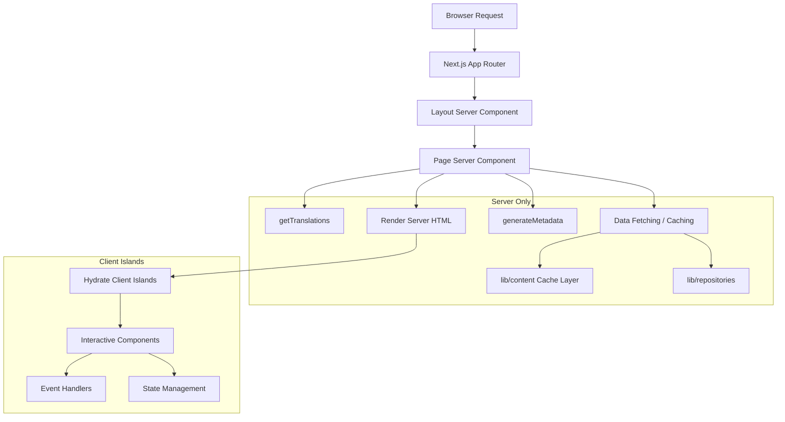

# Modèles de composants de serveur

## Aperçu

Le modèle Ever Works exploite les composants React Server (RSC) comme stratégie de rendu par défaut dans l'ensemble du routeur d'applications Next.js. Les composants du serveur gèrent la récupération des données, le chargement de la traduction, la génération de métadonnées et la composition de la mise en page sur le serveur, en envoyant uniquement le code HTML rendu au client.

## Architecture



## Fichiers sources

|Fichier|Modèle démontré|
|------|---------------------|
|`template/app/[locale]/about/page.tsx`|Récupération de données, i18n, métadonnées, rendu MDX|
|`template/app/[locale]/layout.tsx`|Disposition racine avec fournisseur de paramètres régionaux|
|`template/app/layout.tsx`|Disposition globale, polices, fournisseurs|
|`template/app/sitemap.ts`|Génération de routes uniquement sur le serveur|
|`template/app/robots.ts`|Configuration serveur uniquement|

## Modèles de base

### Modèle 1 : composants de page asynchrones avec i18n

Chaque page localisée suit ce modèle :

```typescript
// Server Component -- no "use client" directive
export const revalidate = 3600; // ISR: revalidate every hour

interface PageProps {
    params: Promise<{ locale: string }>;
}

export async function generateMetadata({ params }: PageProps): Promise<Metadata> {
    const { locale } = await params;
    const t = await getTranslations({ locale, namespace: 'footer' });
    return {
        title: t('ABOUT_US'),
        description: t('ABOUT_PAGE_META_DESCRIPTION'),
        alternates: {
            languages: generateHreflangAlternates('/about')
        }
    };
}

export default async function AboutPage({ params }: PageProps) {
    const { locale } = await params;
    const pageData = await getCachedPageContent('about', locale);
    const tCommon = await getTranslations({ locale, namespace: 'common' });

    return (
        <PageContainer>
            <MDX source={pageData?.content || DEFAULT_CONTENT} />
        </PageContainer>
    );
}
```

Principales caractéristiques :
- `params` est un `Promise` (convention Next.js 15+ App Router)
- Plusieurs appels `getTranslations()` pour différents espaces de noms
- Récupération de contenu mis en cache via `getCachedPageContent()`
- Intervalle de revalidation statique avec `export const revalidate`

### Modèle 2 : génération de métadonnées

Les composants du serveur génèrent des métadonnées SEO au niveau de l'itinéraire :

```typescript
export async function generateMetadata({ params }: PageProps): Promise<Metadata> {
    const { locale } = await params;
    const t = await getTranslations({ locale, namespace: 'pages' });

    return {
        metadataBase: new URL(appUrl),
        title: t('PAGE_TITLE'),
        description: t('PAGE_DESCRIPTION'),
        alternates: {
            languages: generateHreflangAlternates('/path')
        }
    };
}
```

L'utilitaire `generateHreflangAlternates()` de `lib/seo/hreflang.ts` génère automatiquement des liens vers d'autres langues pour tous les paramètres régionaux pris en charge.

### Modèle 3 : ISR avec mise en cache de contenu

```typescript
export const revalidate = 3600; // Revalidate every hour

export default async function Page({ params }: PageProps) {
    const data = await getCachedPageContent('page-name', locale);
    // Render with cached data...
}
```

La fonction `getCachedPageContent()` fournit une couche de cache côté serveur sur le contenu CMS basé sur Git dans `.content/`. Combiné avec `revalidate`, cela crée un modèle ISR (Incremental Static Regeneration) dans lequel les pages sont générées statiquement et actualisées périodiquement.

### Modèle 4 : vérifications d'authentification côté serveur

Les pages protégées utilisent des protections côté serveur de `lib/auth/guards.ts` :

```typescript
import { requireAuth, requireAdmin } from '@/lib/auth/guards';

export default async function ProtectedPage() {
    const session = await requireAuth();
    // session.user is guaranteed to exist here
    return <div>Welcome {session.user.email}</div>;
}

export default async function AdminPage() {
    const session = await requireAdmin();
    // session.user.isAdmin is guaranteed true here
    return <AdminDashboard />;
}
```

Ces gardes appellent `auth()` en interne et utilisent `redirect()` depuis `next/navigation` pour envoyer les utilisateurs non authentifiés vers la page de connexion. La redirection s'effectue côté serveur, aucun JavaScript client n'est donc nécessaire.

### Modèle 5 : composition des composants serveur et client

Les composants serveur délèguent l'interactivité aux « îlots » des composants clients :

```typescript
// Server Component (page.tsx)
export default async function Page({ params }: PageProps) {
    const { locale } = await params;
    const data = await fetchData();
    const t = await getTranslations({ locale, namespace: 'page' });

    return (
        <div>
            <h1>{t('TITLE')}</h1>
            {/* Server-rendered static content */}
            <StaticContent data={data} />
            {/* Client island for interactivity */}
            <InteractiveFilter initialData={data} />
        </div>
    );
}
```

Les données circulent du serveur au client sous forme d'accessoires sérialisables. Les composants clients reçoivent des données pré-extraites et gèrent les interactions des utilisateurs.

## Stratégies de récupération de données

### Accès direct au référentiel

Les composants du serveur peuvent importer et appeler directement les fonctions du référentiel :

```typescript
import { getItemBySlug } from '@/lib/repositories/item-repository';

export default async function ItemPage({ params }) {
    const item = await getItemBySlug(params.slug);
    // ...
}
```

### Couche de contenu mis en cache

Pour le contenu CMS basé sur Git :

```typescript
import { getCachedPageContent } from '@/lib/content';

const pageData = await getCachedPageContent('about', locale);
```

### Appels d'API externes

Les fonctions de service dans `lib/services/` encapsulent les interactions API externes :

```typescript
import { triggerManualSync } from '@/lib/services/sync-service';
```

## Streaming et suspense

Les composants du serveur prennent en charge le streaming via les limites de React Suspense. Les grandes pages peuvent afficher les états de chargement pour des sections individuelles :

```typescript
import { Suspense } from 'react';

export default async function Page() {
    return (
        <div>
            <Header /> {/* Renders immediately */}
            <Suspense fallback={<LoadingSkeleton />}>
                <SlowDataSection /> {/* Streams when ready */}
            </Suspense>
        </div>
    );
}
```

## Meilleures pratiques dans le modèle

1. **Non `"use client"` sauf si nécessaire** -- les composants sont des composants serveur par défaut
2. **Traductions chargées côté serveur** -- `getTranslations()` s'exécute uniquement sur le serveur
3. **Les métadonnées colocalisées avec les pages** -- `generateMetadata` sont exportées à partir du même fichier
4. **Revalidation au niveau de la route** -- `export const revalidate` contrôle le timing ISR
5. **Fonctions de protection pour l'authentification** – redirections côté serveur sans coût du bundle client
6. **Accessoires désactivés, événements activés** : les composants du serveur transmettent les données aux îlots clients en tant qu'accessoires.
