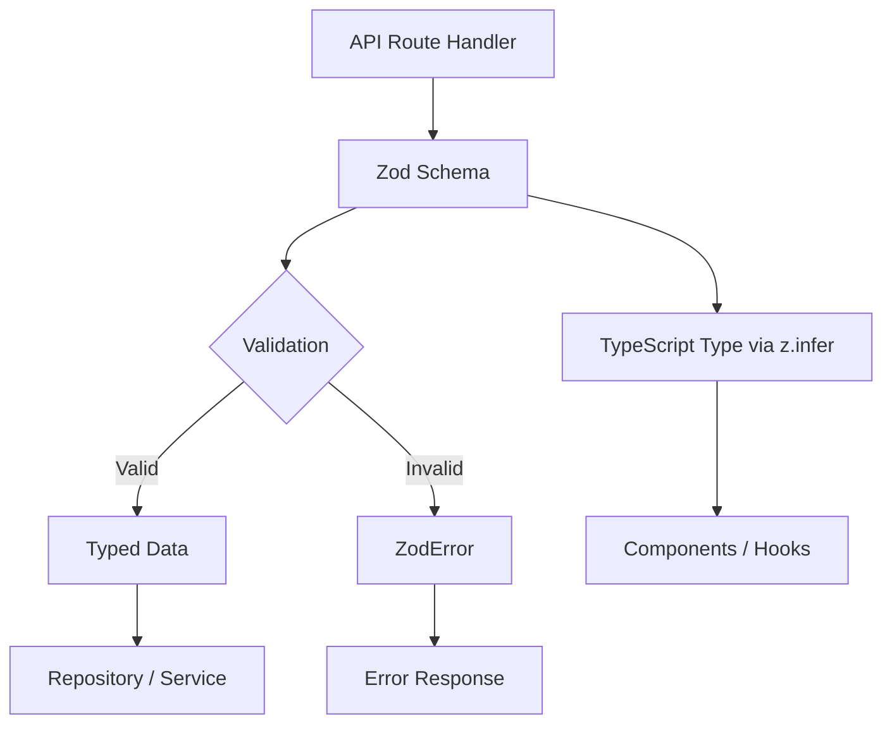

# Modèles de validation

Le modèle utilise Zod pour la validation basée sur un schéma dans toutes les limites de l'API. Les schémas de validation définissent les formes de données, les contraintes, les transformations et l'inférence de type dans une source unique de vérité. Chaque domaine possède son propre module de validation avec des schémas pour les opérations de création, de mise à jour et de requête.

## Présentation de l'architecture



## Fichiers sources

|Fichier|Objectif|
|------|---------|
|`lib/validations/auth.ts`|Schémas de mot de passe et d'authentification|
|`lib/validations/item.ts`|Schéma des données de localisation des articles|
|`lib/validations/client-item.ts`|Schémas de création/mise à jour/requête d'éléments destinés au client|
|`lib/validations/company.ts`|Schémas CRUD d’entreprise et association article-société|
|`lib/validations/sponsor-ad.ts`|Schémas du cycle de vie des publicités sponsorisées|
|`lib/validations/client-dashboard.ts`|Schémas des paramètres de requête du tableau de bord|
|`lib/validations/user-location.ts`|Localisation de l'utilisateur et paramètres de confidentialité|

## Modèles de base

### Modèle 1 : schéma + type déduit

Chaque schéma exporte un type TypeScript correspondant via `z.infer` :

```typescript
import { z } from 'zod';

export const createCompanySchema = z.object({
  name: z.string().min(1, "Company name is required").max(255),
  website: z.string().url("Invalid URL format").optional().or(z.literal("")),
  status: z.enum(["active", "inactive"]).default("active"),
});

export type CreateCompanyInput = z.infer<typeof createCompanySchema>;
// Inferred type:
// {
//   name: string;
//   website?: string | "";
//   status: "active" | "inactive";
// }
```

### Modèle 2 : Transformer et normaliser

Les schémas utilisent `.transform()` pour normaliser les données d'entrée :

```typescript
domain: z.string()
  .max(255)
  .optional()
  .transform((val) => val?.toLowerCase().trim() || undefined),

slug: z.string()
  .max(255)
  .optional()
  .transform((val) => val?.toLowerCase().trim() || undefined)
  .refine(
    (val) => !val || /^[a-z0-9-]+$/.test(val),
    { message: "Slug must contain only lowercase letters, numbers, and hyphens" }
  ),
```

### Modèle 3 : contraintes d'énumération

Les champs d'état utilisent `z.enum()` avec des tableaux const pour la sécurité des types :

```typescript
export const companyStatus = ["active", "inactive"] as const;
export const sponsorAdStatuses = [
  "pending_payment", "pending", "rejected",
  "active", "expired", "cancelled",
] as const;
export const sponsorAdIntervals = ["weekly", "monthly"] as const;

// Usage in schemas
status: z.enum(companyStatus).default("active"),
interval: z.enum(sponsorAdIntervals),
```

### Modèle 4 : paramètres de requête forcés

Les paramètres de chaîne de requête des requêtes HTTP sont forcés à partir des chaînes :

```typescript
export const querySponsorAdsSchema = z.object({
  page: z.coerce.number().int().positive().default(1),
  limit: z.coerce.number().int().positive().max(100).default(10),
  status: z.enum(sponsorAdStatuses).optional(),
  sortBy: z.enum(["createdAt", "updatedAt", "startDate", "endDate", "status"]).default("createdAt"),
  sortOrder: z.enum(["asc", "desc"]).default("desc"),
});
```

### Modèle 5 : transformation de chaîne en nombre

Pour les paramètres de requête qui arrivent sous forme de chaînes mais représentent des nombres :

```typescript
page: z.string()
  .optional()
  .transform(val => (val ? parseInt(val, 10) : 1))
  .refine(val => !Number.isNaN(val), { message: 'Page must be a valid number' })
  .refine(val => val >= 1, { message: 'Page must be at least 1' }),

deleted: z.string()
  .optional()
  .transform(val => val === 'true'),  // String "true" -> boolean true
```

### Modèle 6 : validation inter-champs avec raffinement

Règles de validation complexes qui couvrent plusieurs champs :

```typescript
export const updateLocationSchema = z.object({
  defaultLatitude: z.number().min(-90).max(90).nullable().optional(),
  defaultLongitude: z.number().min(-180).max(180).nullable().optional(),
  defaultCity: z.string().max(200).nullable().optional(),
  defaultCountry: z.string().max(100).nullable().optional(),
  locationPrivacy: locationPrivacySchema.optional(),
}).refine(
  (data) => {
    const hasLat = data.defaultLatitude != null;
    const hasLng = data.defaultLongitude != null;
    return hasLat === hasLng;  // Both or neither
  },
  { message: 'Both latitude and longitude must be provided together' }
);
```

### Modèle 7 : Types d’unions

Champs acceptant plusieurs formats :

```typescript
category: z.union([
  z.string().min(1, 'Category is required'),
  z.array(z.string().min(1)).min(1, 'At least one category is required'),
]).optional().nullable(),
```

## Schémas de domaine

### Authentification

Validation du mot de passe avec plusieurs contraintes regex :

```typescript
export const passwordSchema = z.string()
  .min(8, "Password must be at least 8 characters")
  .regex(/[A-Z]/, "Must contain at least one uppercase letter")
  .regex(/[a-z]/, "Must contain at least one lowercase letter")
  .regex(/[0-9]/, "Must contain at least one number")
  .regex(/[^A-Za-z0-9]/, "Must contain at least one special character");
```

### Emplacement de l'article

Données géographiques avec coordonnées délimitées :

```typescript
export const locationSchema = z.object({
  address: z.string().optional(),
  city: z.string().optional(),
  state: z.string().optional(),
  country: z.string().optional(),
  postal_code: z.string().optional(),
  latitude: z.number().min(-90).max(90).optional(),
  longitude: z.number().min(-180).max(180).optional(),
  service_area: z.enum(['local', 'regional', 'national', 'global']).optional(),
  is_remote: z.boolean().optional(),
  geocoded_by: z.enum(['mapbox', 'google']).optional(),
}).optional();
```

### Confidentialité de la localisation de l'utilisateur

Paramètres de confidentialité basés sur une énumération :

```typescript
export const locationPrivacyValues = ['private', 'city', 'exact'] as const;
export const locationPrivacySchema = z.enum(locationPrivacyValues);
export type LocationPrivacy = z.infer<typeof locationPrivacySchema>;
```

### Soumission d'articles client

Schéma de création complet avec constantes de validation externes :

```typescript
import { ITEM_VALIDATION } from '@/lib/types/item';

export const clientCreateItemSchema = z.object({
  name: z.string()
    .min(ITEM_VALIDATION.NAME_MIN_LENGTH)
    .max(ITEM_VALIDATION.NAME_MAX_LENGTH),
  description: z.string()
    .min(ITEM_VALIDATION.DESCRIPTION_MIN_LENGTH)
    .max(ITEM_VALIDATION.DESCRIPTION_MAX_LENGTH),
  source_url: z.string().url('Invalid URL format'),
  category: z.union([
    z.string().min(1),
    z.array(z.string().min(1)).min(1),
  ]).optional().nullable(),
  tags: z.array(z.string().min(1)).optional().default([]),
  icon_url: z.string().url().optional().or(z.literal('')),
  location: locationSchema,
});
```

### Cycle de vie des publicités des sponsors

Plusieurs schémas couvrant l'intégralité du flux de travail publicitaire des sponsors :

|Schéma|Objectif|
|--------|---------|
|`createSponsorAdSchema`|Soumission d'une nouvelle annonce de sponsor|
|`updateSponsorAdSchema`|Mise à jour de l'administrateur (statut, dates, abonnement)|
|`approveSponsorAdSchema`|Approbation de l'administrateur|
|`rejectSponsorAdSchema`|Rejet de l'administrateur avec motif (10 à 500 caractères)|
|`cancelSponsorAdSchema`|Annulation avec motif optionnel|
|`querySponsorAdsSchema`|Liste paginée avec filtres|

## Modèles de réutilisation de schéma

### Schémas partiels pour les mises à jour

Les schémas de mise à jour reflètent souvent les schémas de création avec tous les champs facultatifs :

```typescript
export const updateCompanySchema = z.object({
  id: z.string().uuid(),
  name: z.string().min(1).max(255).optional(),
  website: z.string().url().optional().or(z.literal("")),
  status: z.enum(companyStatus).optional(),
});
```

### Alias de schéma

Lorsque deux opérations ont des besoins de validation identiques :

```typescript
export const assignCompanyToItemSchema = z.object({
  itemSlug: z.string().min(1).max(255).transform(val => val.toLowerCase().trim()),
  companyId: z.string().uuid("Invalid company ID format"),
});

// Reuse for updates (identical validation)
export const updateItemCompanySchema = assignCompanyToItemSchema;
```

### Cueillette sélective

Utilisation de `.pick()` pour créer des schémas de sous-ensemble :

```typescript
const validatedData = userValidationSchema
  .pick({ email: true, password: true })
  .parse(data);
```

## Utilisation dans les routes API

```typescript
import { clientCreateItemSchema } from '@/lib/validations/client-item';

export async function POST(request: Request) {
  const body = await request.json();

  // Validation + transformation in one step
  const result = clientCreateItemSchema.safeParse(body);

  if (!result.success) {
    return Response.json(
      { errors: result.error.flatten().fieldErrors },
      { status: 400 }
    );
  }

  // result.data is fully typed and transformed
  const item = await repository.create(result.data);
  return Response.json(item, { status: 201 });
}
```
