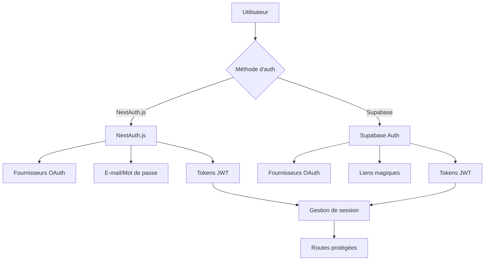

# Aperçu de l'authentification

Ever Works fournit un système d'authentification flexible et sécurisé qui prend en charge plusieurs fournisseurs et méthodes d'authentification.

## Architecture d'authentification

Le modèle utilise une approche d'authentification hybride, prenant en charge à la fois NextAuth.js et Supabase Auth simultanément, vous permettant de choisir la meilleure solution selon vos besoins.



## Méthodes d'authentification prises en charge

### 1. Fournisseurs OAuth

#### OAuth NextAuth.js
- **Google** - Google OAuth 2.0
- **GitHub** - GitHub OAuth
- **Facebook** - Facebook Login
- **Twitter/X** - Twitter OAuth 2.0
- **Microsoft** - Microsoft OAuth 2.0

#### OAuth Supabase
- **Google** - Google OAuth 2.0
- **GitHub** - GitHub OAuth
- **Facebook** - Facebook Login
- **Twitter/X** - Twitter OAuth 2.0
- **Discord** - Discord OAuth
- **Apple** - Sign in with Apple

### 2. Authentification par e-mail/mot de passe

#### Identifiants NextAuth.js
- Authentification personnalisée par e-mail/mot de passe
- Hachage de mot de passe avec bcrypt
- Logique de validation personnalisée
- Stockage de session en base de données

#### Supabase Auth
- Authentification intégrée par e-mail/mot de passe
- Vérification d'e-mail
- Fonctionnalité de réinitialisation du mot de passe
- Politiques de mots de passe sécurisées

### 3. Authentification sans mot de passe

- **Liens magiques** (via Supabase) — Connexion par e-mail sans mot de passe
- **WebAuthn/Passkeys** — Authentification biométrique/matérielle

## Sécurité

Le système d'authentification implémente :

- **Rotation des tokens JWT** — Les tokens sont rafraîchis automatiquement
- **Gestion de session** — Contrôle des sessions côté serveur
- **Protection CSRF** — Intégrée dans NextAuth.js
- **Limitation du débit** — Prévention des attaques par force brute
- **Hachage sécurisé des mots de passe** — bcrypt avec sel

## Configuration rapide

```bash
# Variables d'environnement requises
AUTH_SECRET="$(openssl rand -base64 32)"
NEXTAUTH_URL="http://localhost:3000"

# Pour les fournisseurs OAuth (ajoutez selon vos besoins)
GOOGLE_CLIENT_ID="votre-client-id"
GOOGLE_CLIENT_SECRET="votre-client-secret"
```

## Prochaines étapes

- [Guide de configuration](/authentication/setup-guide) — Instructions détaillées de configuration
- [Fournisseurs](/authentication/providers) — Tous les fournisseurs OAuth supportés
- [WebAuthn](/authentication/webauthn) — Authentification par passkey
- [Gestion de session](/authentication/session-management) — Gestion des sessions
- [RBAC](/authentication/rbac) — Contrôle d'accès basé sur les rôles
