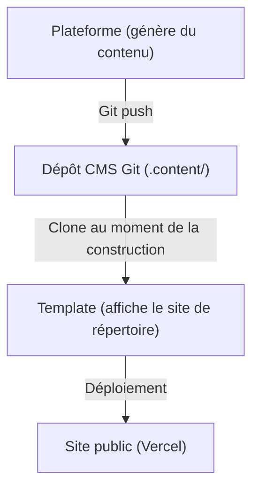

# Plateforme vs Template

Ever Works se compose de deux produits principaux qui servent des objectifs différents mais fonctionnent ensemble comme un écosystème unifié. Cette page explique la différence et quand utiliser lequel.

## Plateforme Ever Works

La **Plateforme Ever Works** est l'infrastructure backend pour la création et la gestion de sites web de répertoires à grande échelle. Elle fournit une API REST, des pipelines de génération de contenu alimentés par l'IA, un système de plugins et une orchestration de déploiement.

Pour la documentation complète de la Plateforme, visitez [docs.ever.works](https://docs.ever.works).

## Directoire Web Template

Le **Directoire Web Template** (ce projet) est un site web de répertoire complet et prêt pour la production que vous pouvez cloner, personnaliser et déployer en tant qu'application autonome.

### Ce qu'il fait

- Fournit un **site web de répertoire** complet avec des listes d'éléments, une recherche, des filtres, des catégories, des tags et des collections
- Inclut l'**authentification** via NextAuth.js v5 avec des fournisseurs OAuth (Google, GitHub, Facebook, Twitter, Microsoft) et Supabase Auth
- Prend en charge les **paiements** via Stripe, LemonSqueezy et Polar avec gestion des abonnements
- Dispose d'une **internationalisation** avec plusieurs langues et support RTL via next-intl
- Utilise un **CMS basé sur Git** pour synchroniser le contenu du répertoire depuis des dépôts Git
- Inclut un **système de thèmes** avec des thèmes intégrés et une génération dynamique de couleurs
- Fournit des **analytics et du monitoring** via PostHog et Sentry
- Inclut une **optimisation SEO**, la génération de sitemap et des données structurées (JSON-LD)
- Inclut un **tableau de bord administrateur** avec gestion de contenu, gestion des utilisateurs et analytics

### Stack technique

- **Framework :** Next.js 15, React 19
- **Langage :** TypeScript 5
- **ORM :** Drizzle ORM (PostgreSQL)
- **UI :** Tailwind CSS 4, HeroUI React, Radix UI
- **Auth :** NextAuth.js v5, Supabase Auth
- **Paiements :** Stripe, LemonSqueezy, Polar
- **Tests :** Playwright (E2E)
- **Déploiement :** Vercel (principal), Docker (alternatif)

## Comparaison côte à côte

| Aspect | Plateforme | Template |
| ------ | ---------- | -------- |
| **Objectif** | Infrastructure backend et pipeline IA | Site web de répertoire frontend |
| **Architecture** | Monorepo (Turborepo + pnpm) | Application Next.js autonome |
| **Backend** | API NestJS 11 | Routes API Next.js |
| **ORM de base de données** | TypeORM | Drizzle ORM |
| **Authentification** | JWT + OAuth (Guards NestJS) | NextAuth.js v5 + Supabase Auth |
| **Paiements** | Non inclus | Stripe, LemonSqueezy, Polar |
| **Fonctionnalités IA** | Agents LangChain, 7 fournisseurs LLM | Aucun (consomme le contenu généré par IA) |
| **Contenu** | Génère du contenu via des pipelines IA | Lit le contenu depuis CMS basé sur Git |
| **Déploiement** | Docker sur n'importe quel VPS | Vercel (ou Docker) |
| **Tests** | Jest + Vitest | Playwright |
| **Audience** | Opérateurs de plateforme, développeurs IA | Créateurs de sites, créateurs de répertoires |

## Comment ils se connectent

La Plateforme et la Template fonctionnent ensemble via le modèle **CMS basé sur Git** :

### Fonctionnement indépendant

- **Template sans Plateforme :** Maintenez manuellement le contenu du répertoire en éditant des fichiers YAML et Markdown dans le dépôt CMS Git. La Template fonctionne comme un site de répertoire pleinement fonctionnel sans génération IA.
- **Plateforme sans Template :** Utilisez l'API de la Plateforme pour générer des données de répertoire et les exporter vers n'importe quel frontend.

## Quand utiliser lequel

### Utilisez la Template quand...

- Vous souhaitez lancer rapidement un site de répertoire avec une configuration backend minimale
- Vous avez besoin d'un site web prêt pour la production avec authentification et paiements
- Vous voulez personnaliser l'apparence et les fonctionnalités d'un site de répertoire
- Vous souhaitez maintenir manuellement le contenu du répertoire

### Utilisez la Plateforme quand...

- Vous avez besoin d'une génération de contenu alimentée par l'IA à grande échelle
- Vous gérez plusieurs sites de répertoire
- Vous souhaitez une API backend pour alimenter des frontends personnalisés
- Vous avez besoin de capacités avancées de pipeline de données
