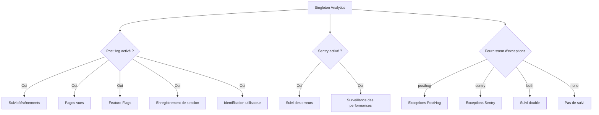

# Configuration Analytics

Le template fournit un système d'analytics unifié qui intègre PostHog pour les analytics produit et Sentry pour le suivi des erreurs. Les deux fournisseurs sont gérés via une classe `Analytics` singleton avec comportement de repli automatique.

## Architecture



## Variables d'environnement

### Configuration PostHog

| Variable | Requis | Défaut | Description |
|---|---|---|---|
| `NEXT_PUBLIC_POSTHOG_KEY` | Oui (pour analytics) | -- | Clé API projet PostHog |
| `NEXT_PUBLIC_POSTHOG_HOST` | Oui (pour analytics) | -- | URL de l'instance PostHog |
| `POSTHOG_DEBUG` | Non | `false` | Activer la journalisation debug |
| `POSTHOG_SESSION_RECORDING_ENABLED` | Non | `true` | Activer les enregistrements de session |
| `POSTHOG_AUTO_CAPTURE` | Non | `false` | Capture auto des pages vues |
| `POSTHOG_EXCEPTION_TRACKING` | Non | `true` | Activer le suivi d'exceptions PostHog |

### Configuration Sentry

| Variable | Requis | Défaut | Description |
|---|---|---|---|
| `NEXT_PUBLIC_SENTRY_DSN` | Oui (pour les erreurs) | -- | Data Source Name Sentry |
| `SENTRY_ENABLE_DEV` | Non | `false` | Activer Sentry en développement |
| `SENTRY_DEBUG` | Non | `false` | Activer le mode debug Sentry |
| `SENTRY_EXCEPTION_TRACKING` | Non | `true` | Activer le suivi d'exceptions Sentry |

### Suivi unifié des exceptions

| Variable | Requis | Défaut | Description |
|---|---|---|---|
| `EXCEPTION_TRACKING_PROVIDER` | Non | `both` | Fournisseur à utiliser : `posthog`, `sentry`, `both`, ou `none` |

## Configuration PostHog

### Étape 1 : Obtenir les identifiants

1. Inscrivez-vous sur [posthog.com](https://posthog.com) ou hébergez PostHog vous-même
2. Créez un projet
3. Copiez la clé API du projet et l'URL de l'hôte

### Étape 2 : Configurer l'environnement

```env
NEXT_PUBLIC_POSTHOG_KEY=phc_votre_cle_projet_ici
NEXT_PUBLIC_POSTHOG_HOST=https://app.posthog.com
```

PostHog est automatiquement activé lorsque `NEXT_PUBLIC_POSTHOG_KEY` et `NEXT_PUBLIC_POSTHOG_HOST` sont définis.

### Étape 3 : Taux d'échantillonnage

Les taux d'échantillonnage sont automatiquement ajustés selon l'environnement :

| Environnement | Taux d'échantillonnage événements | Taux d'enregistrement de session |
|---|---|---|
| Production | 10% (`0.1`) | 10% (`0.1`) |
| Développement | 100% (`1.0`) | 100% (`1.0`) |

## Configuration Sentry

### Étape 1 : Obtenir le DSN

1. Créez un projet sur [sentry.io](https://sentry.io)
2. Copiez le DSN depuis les paramètres du projet

### Étape 2 : Configurer l'environnement

```env
NEXT_PUBLIC_SENTRY_DSN=https://clePubExample@o0.ingest.sentry.io/0
SENTRY_ENABLE_DEV=true  # Optionnel : activer en développement
```

Sentry est activé automatiquement en production lorsque le DSN est défini.

## API de la classe Analytics

La classe `Analytics` est un singleton accessible dans toute l'application :

```typescript
import { analytics } from '@/lib/analytics';

// Initialiser les analytics (appeler une fois à la racine de l'app)
analytics.init();
```
