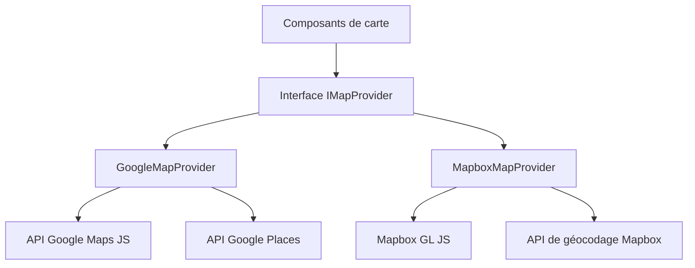

# Configuration des cartes

Le template inclut un système de cartes agnostique aux fournisseurs, supportant Google Maps et Mapbox GL JS. Une couche d'interface partagée permet de changer de fournisseur sans modifier le code des composants.

## Architecture



## Sélection du fournisseur

Le fournisseur de carte est déterminé par les clés API configurées :

| Fournisseur | Variable d'environnement requise |
|---|---|
| Google Maps | `NEXT_PUBLIC_GOOGLE_MAPS_API_KEY` |
| Mapbox | `NEXT_PUBLIC_MAPBOX_ACCESS_TOKEN` |

## Configuration Google Maps

### Étape 1 : Obtenir une clé API

1. Accédez à [Google Cloud Console](https://console.cloud.google.com)
2. Activez les APIs suivantes :
   - Maps JavaScript API
   - Places API
   - Geocoding API
3. Créez une clé API avec des restrictions de référent HTTP

### Étape 2 : Configurer l'environnement

```env
NEXT_PUBLIC_GOOGLE_MAPS_API_KEY=AIzaSy...votre-cle-api
NEXT_PUBLIC_GOOGLE_MAPS_MAP_ID=votre-map-id        # Optionnel : pour les cartes stylisées
```

### Sécurité

**Restrictions requises pour la clé API :**
- Restriction d'application : Référents HTTP
- Ajoutez vos modèles de domaine (ex. `https://votredomaine.com/*`)
- Restriction API : Limitez aux APIs Maps JavaScript, Places et Geocoding

## Configuration Mapbox

### Étape 1 : Obtenir un token d'accès

1. Inscrivez-vous sur [mapbox.com](https://www.mapbox.com)
2. Copiez votre token d'accès par défaut depuis le tableau de bord

### Étape 2 : Configurer l'environnement

```env
NEXT_PUBLIC_MAPBOX_ACCESS_TOKEN=pk.eyJ1...votre-token
```

## Style de carte

Configuré via `settings.location.map_style` dans votre `config.yml` :

| Valeur | Description |
|--------|-------------|
| `streets` | Vue street map standard (défaut) |
| `satellite` | Vue satellite/aérienne |
