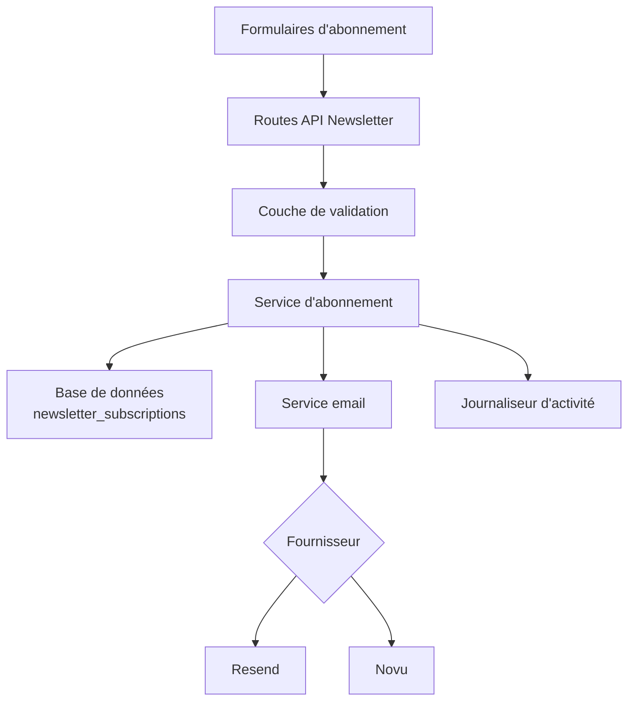

# Configuration newsletter

Le template inclut un système complet d'abonnement newsletter avec intégration de fournisseur email, validation, gestion du cycle de vie des abonnements et journalisation des activités.

## Architecture



## Structure des fichiers

```
lib/newsletter/
├── config.ts    # Configuration, types, schémas de validation
└── utils.ts     # Envoi d'emails, validation d'abonnement, journalisation
```

## Configuration Resend (Défaut)

```env
RESEND_API_KEY=re_votre_cle_api_ici
```

1. Inscrivez-vous sur [resend.com](https://resend.com)
2. Créez une clé API
3. Vérifiez votre domaine d'envoi (ou utilisez `onboarding@resend.dev` pour les tests)

## Configuration Novu

```env
NOVU_API_KEY=votre_cle_api_novu
NOVU_SUBSCRIBER_ID=votre_id_abonne
```

1. Créez un compte sur [novu.co](https://novu.co)
2. Créez une clé API depuis les paramètres
3. Configurez un flux de travail de bienvenue email

## Variables d'environnement

| Variable | Requis | Description |
|----------|--------|-------------|
| `RESEND_API_KEY` | Non | Clé API Resend (active Resend) |
| `NOVU_API_KEY` | Non | Clé API Novu (active Novu) |
| `NOVU_SUBSCRIBER_ID` | Non | ID abonné Novu |
| `NEWSLETTER_FROM_EMAIL` | Non | Adresse email expéditrice |
| `NEWSLETTER_FROM_NAME` | Non | Nom affiché de l'expéditeur |
