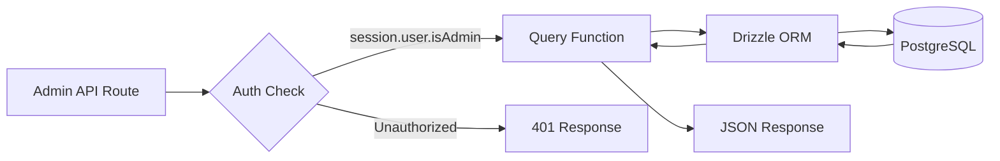
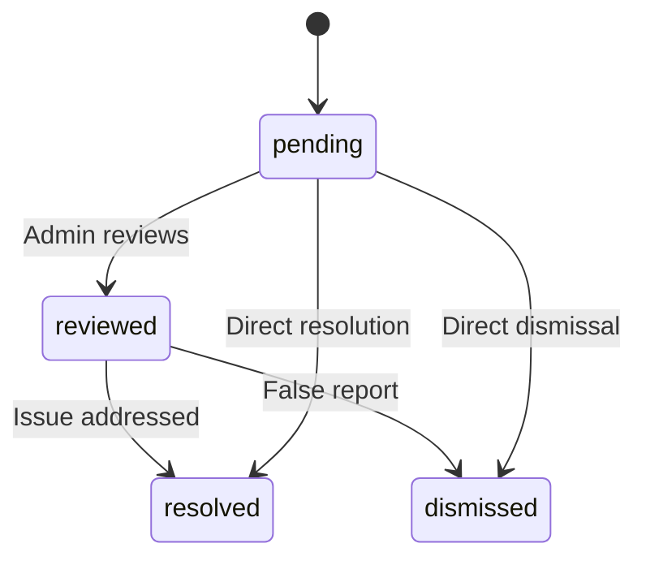

# Requêtes de base de données d'administration

Les requêtes d'administrateur gèrent la gestion des éléments, la gestion des utilisateurs/clients, l'accès basé sur les rôles, les statistiques du tableau de bord, la modération des rapports et les paramètres. Ces fonctions sont principalement utilisées par les routes API sous `app/api/admin/`.

## Flux de requête d'administrateur



## Gestion des utilisateurs (`user.queries.ts`)

### Fonctions principales

|Fonction|Paramètres|Retours|Descriptif|
|----------|-----------|---------|-------------|
|`getUserByEmail`|`email: string`|`Utilisateur \|nul`|Rechercher un utilisateur par adresse e-mail|
|`getUserById`|`id: string`|`Utilisateur \|nul`|Rechercher un utilisateur par clé primaire|
|`insertNewUser`|`user: NewUser`|`User[]`|Créer un nouvel enregistrement utilisateur|
|`updateUserPassword`|`hash, userId`|`void`|Mettre à jour le hachage du mot de passe|
|`updateUserVerification`|`email, verified`|`void`|Définir le statut de vérification des e-mails|
|`softDeleteUser`|`userId: string`|`void`|Suppression logicielle (ajoute `-deleted` à l'e-mail)|
|`isUserAdmin`|`userId: string`|`boolean`|Vérifier le rôle d'administrateur via rejoindre|

### Vérification du rôle d'administrateur

La fonction `isUserAdmin` effectue une jointure multi-tables pour vérifier le statut d'administrateur :

```typescript
export async function isUserAdmin(userId: string): Promise<boolean> {
  const result = await db
    .select({ isAdmin: roles.isAdmin })
    .from(userRoles)
    .innerJoin(roles, eq(userRoles.roleId, roles.id))
    .where(and(
      eq(userRoles.userId, userId),
      eq(roles.isAdmin, true),
      eq(roles.status, 'active')
    ))
    .limit(1);

  return result.length > 0;
}
```

### Modèle de suppression logicielle

Les utilisateurs ne sont jamais physiquement supprimés. La suppression logicielle concatène l'ID utilisateur à l'e-mail pour libérer l'adresse e-mail pour la réinscription :

```typescript
export async function softDeleteUser(userId: string) {
  return db
    .update(users)
    .set({
      deletedAt: sql`CURRENT_TIMESTAMP`,
      email: sql`CONCAT(email, '-', id, '-deleted')`
    })
    .where(eq(users.id, userId));
}
```

## Gestion des clients (`client.queries.ts`)

### Profil CRUD

|Fonction|Descriptif|
|----------|-------------|
|`createClientProfile(data)`|Créer un profil avec un nom d'utilisateur unique généré automatiquement|
|`getClientProfileById(id)`|Récupérer par ID de profil|
|`getClientProfileByUserId(userId)`|Récupérer par référence utilisateur|
|`getClientProfileByEmail(email)`|Récupérer via la recherche dans la table des comptes|
|`updateClientProfile(id, data)`|Mise à jour partielle avec horodatage|
|`deleteClientProfile(id)`|Suppression définitive de l'enregistrement de profil|

### Données du tableau de bord d'administration

La fonction `getAdminDashboardData` est optimisée pour le tableau de bord d'administration, renvoyant à la fois une liste de clients paginée et des statistiques complètes dans un nombre minimal de requêtes :

```typescript
export async function getAdminDashboardData(params: {
  page: number;
  limit: number;
  search?: string;
  status?: string;
  plan?: string;
  accountType?: string;
  provider?: string;
  createdAfter?: Date;
  createdBefore?: Date;
}): Promise<{
  clients: ClientProfileWithAuth[];
  stats: { overview, byProvider, byPlan, byAccountType, activity, growth };
  pagination: { page, totalPages, total, limit };
}>
```

La fonction exclut les utilisateurs administrateurs des listes de clients à l'aide d'un modèle LEFT JOIN + IS NULL :

```typescript
// Exclude admin users from client listing
.leftJoin(userRoles, eq(userRoles.userId, clientProfiles.userId))
.leftJoin(roles, and(eq(userRoles.roleId, roles.id), eq(roles.isAdmin, true)))
.where(isNull(roles.id))  // Only non-admin users
```

### Recherche avancée de clients

`advancedClientSearch` prend en charge le filtrage multicritère complexe :

|Catégorie de filtre|Paramètres|
|----------------|------------|
|**Recherche de texte**|`search` (sur le nom, l'adresse e-mail, le nom d'utilisateur, l'entreprise, la biographie, le titre du poste, le secteur d'activité, l'emplacement)|
|**Filtres d'énumération**|`status`, `plan`, `accountType`, `provider`|
|**Plages de dates**|`createdAfter`, `createdBefore`, `updatedAfter`, `updatedBefore`, `dateRange`|
|**Spécifique au domaine**|`emailDomain`, `companySearch`, `locationSearch`, `industrySearch`|
|**Numérique**|`minSubmissions`, `maxSubmissions`|
|**Booléen**|`hasAvatar`, `hasWebsite`, `hasPhone`, `emailVerified`, `twoFactorEnabled`|
|**Tri**|`sortBy` (createdAt, updateAt, nom, email, société, totalSubmissions), `sortOrder`|

### Statistiques clients

`getEnhancedClientStats` renvoie une répartition complète :

```typescript
{
  overview: { total, active, inactive, suspended, trial },
  byProvider: { credentials, google, github, facebook, twitter, linkedin, other },
  byPlan: { free: number, standard: number, premium: number },
  byAccountType: { individual, business, enterprise },
  activity: { newThisWeek, newThisMonth, activeThisWeek, activeThisMonth },
  growth: { weeklyGrowth, monthlyGrowth },
}
```

## Gestion des rapports (`report.queries.ts`)

### Signaler CRUD

|Fonction|Descriptif|
|----------|-------------|
|`createReport(data)`|Créer un rapport de contenu (élément ou commentaire)|
|`getReportById(id)`|Obtenez un rapport avec les détails du journaliste et du réviseur|
|`getReports(params)`|Liste de rapports paginés avec filtres|
|`updateReport(id, data)`|Mettre à jour l'état, la résolution, ajouter des notes de révision|
|`getReportStats()`|Statistiques par statut, type de contenu, raison|
|`hasUserReportedContent(reportedBy, contentType, contentId)`|Vérification du rapport en double|

### Flux d'état du rapport



### Filtrage des rapports

Les rapports prennent en charge le filtrage par statut, type de contenu (élément/commentaire) et motif (spam, harcèlement, inapproprié, autre) :

```typescript
export async function getReports(params: {
  page?: number;
  limit?: number;
  search?: string;
  status?: ReportStatusValues;
  contentType?: ReportContentTypeValues;
  reason?: ReportReasonValues;
}): Promise<{
  reports: ReportWithReporter[];
  total: number;
  page: number;
  totalPages: number;
  limit: number;
}>
```

## Statistiques du tableau de bord (`dashboard.queries.ts`)

### Métriques disponibles

|Fonction|Objectif|Utilisé dans|
|----------|---------|---------|
|`getVotesReceivedCount(itemSlugs)`|Total des votes sur les éléments|Résumé du tableau de bord|
|`getCommentsReceivedCount(itemSlugs)`|Total des commentaires sur les éléments|Résumé du tableau de bord|
|`getUniqueItemsInteractedCount(clientId)`|Éléments avec lesquels l'utilisateur a interagi|Panneau d'activité|
|`getUserTotalActivityCount(clientId)`|Total des votes + commentaires par utilisateur|Panneau d'activité|
|`getWeeklyEngagementData(itemSlugs, weeks)`|Tableau des votes/commentaires hebdomadaires|Tableau d'engagement|
|`getDailyActivityData(clientId, itemSlugs, days)`|Répartition de l'activité quotidienne|Tableau d'activité|
|`getTopItemsEngagement(itemSlugs, limit)`|Meilleurs articles par engagement|Panneau des principaux éléments|

### Données d'engagement hebdomadaires

Renvoie les données d'engagement agrégées par semaine ISO, correspondant au format `to_char(date, 'IYYY-IW')` de PostgreSQL :

```typescript
const weeklyVotes = await db
  .select({
    week: sql<string>`to_char(${votes.createdAt}, 'IYYY-IW')`.as('week'),
    count: count(),
  })
  .from(votes)
  .where(and(inArray(votes.itemId, itemSlugs), gte(votes.createdAt, startDate)))
  .groupBy(sql`to_char(${votes.createdAt}, 'IYYY-IW')`)
  .orderBy(sql`to_char(${votes.createdAt}, 'IYYY-IW')`);
```

## Gestion des jetons d'authentification (`auth.queries.ts`)

|Fonction|Descriptif|
|----------|-------------|
|`getPasswordResetTokenByEmail(email)`|Rechercher un jeton de réinitialisation par e-mail|
|`getPasswordResetTokenByToken(token)`|Rechercher un jeton de réinitialisation par chaîne de jeton|
|`deletePasswordResetToken(token)`|Supprimer le jeton utilisé/expiré|
|`getVerificationTokenByEmail(email)`|Rechercher un jeton de vérification par e-mail|
|`getVerificationTokenByToken(token)`|Rechercher un jeton de vérification par chaîne de jeton|
|`deleteVerificationToken(token)`|Supprimer le jeton utilisé/expiré|

Toutes les fonctions de jeton suivent le même modèle simple de sélection par champ avec `.limit(1)`.
