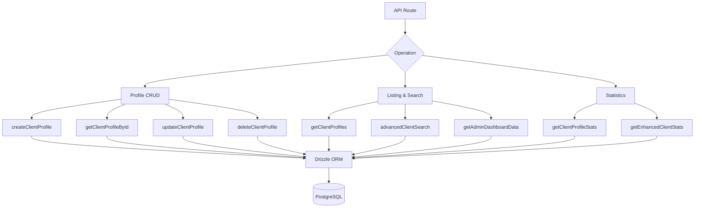

# Requêtes destinées aux clients

Les requêtes des clients gèrent la gestion des profils, la liste des métadonnées d'authentification, la recherche multicritère avancée et les statistiques complètes. Toutes les fonctions résident dans `client.queries.ts` et sont utilisées par les routes API destinées à l'administrateur et au client.

## Architecture des requêtes clients



## Profil CRUD

### Créer un profil

Les nouveaux profils génèrent automatiquement des noms d'utilisateur uniques à partir de l'adresse e-mail lorsqu'aucun nom d'utilisateur n'est fourni :

```typescript
export async function createClientProfile(data: {
  userId: string;
  email: string;
  name: string;
  displayName?: string;
  username?: string;
  bio?: string;
  jobTitle?: string;
  company?: string;
  status?: string;
  plan?: string;
  accountType?: string;
}): Promise<ClientProfile>
```

Logique de génération du nom d'utilisateur :

1. Si `username` est fourni, normalisez et assurez l'unicité
2. Sinon, extrayez le nom d'utilisateur de l'e-mail via `extractUsernameFromEmail()`
3. Solution de secours : générer le préfixe `user<timestamp>`
4. Tous les chemins passent par `ensureUniqueUsername()` qui ajoute des suffixes numériques si nécessaire

Valeurs par défaut appliquées lors de la création :

|Champ|Par défaut|
|-------|---------|
|`displayName`|Identique à `name`|
|`bio`|`"Welcome! I'm a new user on this platform."`|
|`jobTitle`|`"User"`|
|`company`|`"Unknown"`|
|`status`|`"active"`|
|`plan`|`"free"`|
|`accountType`|`"individual"`|

### Opérations de lecture

|Fonction|Champ de recherche|Retours|
|----------|-------------|---------|
|`getClientProfileById(id)`|`clientProfiles.id`|`ProfilClient\|nul`|
|`getClientProfileByUserId(userId)`|`clientProfiles.userId`|`ProfilClient\|nul`|
|`getClientProfileByEmail(email)`|Via la table `accounts`|`ProfilClient\|nul`|

La recherche par courrier électronique est résolue via la table `accounts` pour trouver le `userId` associé, puis interroge `clientProfiles` :

```typescript
export async function getClientProfileByEmail(email: string): Promise<ClientProfile | null> {
  const account = await getClientAccountByEmail(email);
  if (!account) return null;
  const [profile] = await db
    .select()
    .from(clientProfiles)
    .where(eq(clientProfiles.userId, account.userId))
    .limit(1);
  return profile || null;
}
```

### Mettre à jour et supprimer

- **`updateClientProfile(id, data)`** -- Mise à jour partielle avec horodatage automatique `updatedAt`
- **`deleteClientProfile(id)`** -- Suppression définitive (renvoie le succès booléen)

## Liste paginée

`getClientProfiles` renvoie des résultats paginés avec les données du fournisseur d'authentification, à l'exclusion des utilisateurs administrateurs :

```typescript
export async function getClientProfiles(params: {
  page?: number;
  limit?: number;
  search?: string;
  status?: string;
  plan?: string;
  accountType?: string;
  provider?: string;
}): Promise<{
  profiles: ClientProfileWithAuth[];
  total: number;
  page: number;
  totalPages: number;
  limit: number;
}>
```

### Modèle d'exclusion d'administrateur

La requête de comptage et la requête de données utilisent un modèle LEFT JOIN + IS NULL pour exclure les utilisateurs administrateurs :

```typescript
.leftJoin(userRoles, eq(userRoles.userId, clientProfiles.userId))
.leftJoin(roles, and(eq(userRoles.roleId, roles.id), eq(roles.isAdmin, true)))
.where(isNull(roles.id))  // Only non-admin users
```

### Sous-requête du fournisseur

Pour éviter les lignes en double lorsqu'un utilisateur dispose de plusieurs comptes d'authentification, le fournisseur est résolu via une sous-requête scalaire :

```typescript
accountProvider: sql<string>`coalesce(
  (SELECT provider FROM ${accounts}
   WHERE ${accounts.userId} = ${clientProfiles.userId}
   LIMIT 1),
  'unknown'
)`
```

### Filtre de recherche

La recherche de texte utilise `ILIKE` dans plusieurs champs avec prévention des injections SQL :

```typescript
const escapedSearch = search
  .replace(/\\/g, '\\\\')
  .replace(/[%_]/g, '\\$&');

whereConditions.push(
  sql`(${clientProfiles.username} ILIKE ${`%${escapedSearch}%`} OR
       ${clientProfiles.displayName} ILIKE ${`%${escapedSearch}%`} OR
       ${clientProfiles.company} ILIKE ${`%${escapedSearch}%`} OR
       ${clientProfiles.name} ILIKE ${`%${escapedSearch}%`} OR
       ${clientProfiles.email} ILIKE ${`%${escapedSearch}%`})`
);
```

## Recherche avancée de clients

`advancedClientSearch` prend en charge plus de 20 critères de filtrage dans plusieurs catégories :

|Catégorie de filtre|Paramètres|
|----------------|------------|
|**Recherche de texte**|`search` (sur le nom, l'adresse e-mail, le nom d'utilisateur, l'entreprise, la biographie, le titre du poste, le secteur d'activité, l'emplacement)|
|**Filtres d'énumération**|`status`, `plan`, `accountType`, `provider`|
|**Plages de dates**|`createdAfter`, `createdBefore`, `updatedAfter`, `updatedBefore`, `dateRange`|
|**Spécifique au domaine**|`emailDomain`, `companySearch`, `locationSearch`, `industrySearch`|
|**Numérique**|`minSubmissions`, `maxSubmissions`|
|**Booléen**|`hasAvatar`, `hasWebsite`, `hasPhone`, `emailVerified`, `twoFactorEnabled`|
|**Tri**|`sortBy`, `sortOrder`|

## Statistiques clients

### Statistiques de base

`getClientProfileStats` renvoie des décomptes simples :

```typescript
{
  total: number;
  active: number;
  inactive: number;
  byPlan: Record<string, number>;
  byAccountType: Record<string, number>;
}
```

### Statistiques améliorées

`getEnhancedClientStats` fournit une répartition multidimensionnelle complète :

```typescript
{
  overview: { total, active, inactive, suspended, trial },
  byProvider: { credentials, google, github, facebook, twitter, linkedin, other },
  byPlan: { free: number, standard: number, premium: number },
  byAccountType: { individual, business, enterprise },
  activity: { newThisWeek, newThisMonth, activeThisWeek, activeThisMonth },
  growth: { weeklyGrowth, monthlyGrowth },
}
```

Les statistiques améliorées utilisent `countDistinct` avec des jointures multi-tables pour produire des décomptes précis même lorsque les utilisateurs disposent de plusieurs fournisseurs de comptes :

```typescript
const statsResult = await db
  .select({
    status: clientProfiles.status,
    plan: clientProfiles.plan,
    accountType: clientProfiles.accountType,
    provider: accounts.provider,
    count: countDistinct(clientProfiles.id)
  })
  .from(clientProfiles)
  .leftJoin(accounts, eq(clientProfiles.userId, accounts.userId))
  .leftJoin(userRoles, eq(userRoles.userId, clientProfiles.userId))
  .leftJoin(roles, and(eq(userRoles.roleId, roles.id), eq(roles.isAdmin, true)))
  .where(isNull(roles.id))
  .groupBy(
    clientProfiles.status,
    clientProfiles.plan,
    clientProfiles.accountType,
    accounts.provider
  );
```

### Mesures d'activité

Les fenêtres d'activité sont calculées à l'aide de l'arithmétique des dates :

```typescript
const oneWeekAgo = new Date(now.getTime() - 7 * 24 * 60 * 60 * 1000);
const oneMonthAgo = new Date(now.getTime() - 30 * 24 * 60 * 60 * 1000);
```

Les taux de croissance sont des pourcentages simplifiés de nouvelles inscriptions par rapport au total :

```typescript
const weeklyGrowth = total > 0 ? Math.round((newThisWeek / total) * 100) : 0;
```

## Espèces

Tous les types de requêtes client sont définis dans `lib/db/queries/types.ts` :

```typescript
export type ClientProfileWithAuth = ClientProfile & {
  accountProvider: string;
  isActive: boolean;
};

export type ClientStatus = "active" | "inactive" | "suspended" | "trial";
export type ClientPlan = "free" | "standard" | "premium";
export type ClientAccountType = "individual" | "business" | "enterprise";
```
