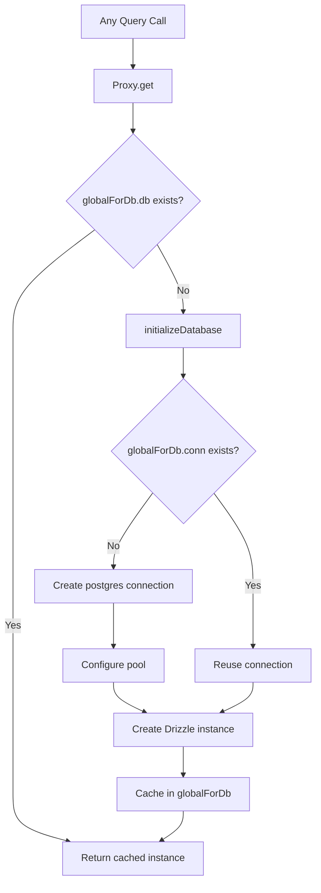

# Connexion et pooling de base de données

Le modèle utilise `postgres.js` (le package `postgres` npm) comme pilote PostgreSQL avec Drizzle ORM. La gestion des connexions est gérée via un modèle d'initialisation paresseux avec une mise en cache singleton globale pour survivre au remplacement à chaud du module Next.js (HMR) en cours de développement.

## Architecture de connexion



## Configuration de la base de données (`lib/db/drizzle.ts`)

### Initialisation paresseuse avec proxy

L'instance de base de données est exportée sous la forme d'un `Proxy` qui initialise la connexion lors du premier accès :

```typescript
export const db = new Proxy({} as ReturnType<typeof drizzle>, {
  get(target, prop) {
    const database = initializeDatabase();
    return database[prop as keyof typeof database];
  },
});
```

Cela garantit :
- Aucune connexion n'est créée au moment de l'importation
- Les scripts qui importent le module mais n'interrogent pas la base de données n'entraînent aucune surcharge de connexion
- La première opération réelle de la base de données déclenche l'initialisation

### Fonction d'initialisation

```typescript
function initializeDatabase(): ReturnType<typeof drizzle> {
  if (!getDatabaseUrl()) {
    throw new Error('DATABASE_URL environment variable is required');
  }

  if (globalForDb.db) {
    return globalForDb.db;
  }

  const poolSize = getPoolSize();
  const conn = postgres(getDatabaseUrl()!, {
    max: poolSize,
    idle_timeout: 20,
    connect_timeout: 30,
    prepare: false,
    onnotice: getNodeEnv() === 'development' ? console.log : undefined,
  });

  globalForDb.conn = conn;
  globalForDb.db = drizzle(conn, { schema });
  return globalForDb.db;
}
```

### Options de connexion

|Options|Valeur|Objectif|
|--------|-------|---------|
|`max`|Configurable (voir dimensionnement de la piscine)|Connexions maximales dans la piscine|
|`idle_timeout`|`20` secondes|Fermez les connexions inactives après cette durée|
|`connect_timeout`|`30` secondes|Temps maximum pour établir une connexion|
|`prepare`|`false`|Désactiver les instructions préparées (obligatoire pour certains environnements PaaS)|
|`onnotice`|`console.log` (développeur uniquement)|Consigner les messages PostgreSQL NOTICE en cours de développement|

## Dimensionnement de la piscine

### Configuration

La taille du pool est configurable via la variable d'environnement `DB_POOL_SIZE`, avec des valeurs par défaut adaptées à l'environnement :

```typescript
const getPoolSize = (): number => {
  const envPoolSize = process.env.DB_POOL_SIZE;
  if (envPoolSize) {
    const parsed = parseInt(envPoolSize, 10);
    return isNaN(parsed) ? 20 : Math.max(1, Math.min(parsed, 50));
  }
  return getNodeEnv() === 'production' ? 20 : 10;
};
```

### Valeurs par défaut

|Environnement|Taille du pool par défaut|Gamme|
|-------------|------------------|-------|
|Fabrication| 20 | 1 - 50 |
|Développement| 10 | 1 - 50 |

La taille du pool est comprise entre 1 et 50 quelle que soit la valeur configurée.

### Directives relatives à la taille de la piscine

- **Développement (10) :** Suffisant pour un seul développeur avec HMR. Maintient l’utilisation des ressources à un faible niveau.
- **Production (20) :** Gère les requêtes API simultanées. Augmentation pour les déploiements à fort trafic.
- **Sans serveur (1-5) :** Utilisez de petits pools lors d'un déploiement sur des plates-formes sans serveur où chaque instance dispose de son propre pool.

## Modèle Singleton global

### Sécurité HMR

Le mode de développement Next.js réexécute les modules lors des modifications de fichiers. Sans protection, chaque cycle HMR créerait un nouveau pool de connexions, épuisant rapidement les connexions aux bases de données.

Le modèle attache la connexion à `globalThis` pour survivre à HMR :

```typescript
const globalForDb = globalThis as unknown as {
  conn: postgres.Sql | undefined;
  db: ReturnType<typeof drizzle> | undefined;
};
```

Lorsqu'un module se réexécute :
1. `initializeDatabase()` vérifie `globalForDb.db`
2. Si l'instance existe, elle est renvoyée immédiatement
3. Si la connexion existe mais pas l'instance Drizzle, la connexion existante est réutilisée

La journalisation du développement indique si une connexion a été réutilisée :

```
Reusing existing database connection; pool size is unchanged
```

ou fraîchement créé :

```
Database connection established successfully with pool size: 10
```

### Accès direct aux instances

Pour les bibliothèques qui nécessitent une instance concrète de Drizzle (par exemple, l'adaptateur Auth.js), une fonction getter est fournie :

```typescript
export function getDrizzleInstance(): ReturnType<typeof drizzle> {
  return initializeDatabase();
}
```

## Module de configuration (`lib/db/config.ts`)

Un module de configuration sécurisé pour les scripts qui n'importe **pas** `server-only`, ce qui lui permet d'être utilisé par les scripts de migration et de départ :

```typescript
export function getDatabaseUrl(): string | undefined {
  return process.env.DATABASE_URL;
}

export function getNodeEnv(): 'development' | 'production' | 'test' {
  const env = process.env.NODE_ENV;
  if (env === 'production' || env === 'test') return env;
  return 'development';
}

export function isProduction(): boolean {
  return getNodeEnv() === 'production';
}
```

## Exécuteur de migration (`lib/db/migrate.ts`)

L'exécuteur de migration est idempotent et peut être appelé en toute sécurité à chaque démarrage d'application :

```typescript
export async function runMigrations(): Promise<boolean> {
  const { db } = await import('./drizzle');
  await migrate(db, { migrationsFolder: './lib/db/migrations' });
  return true;
}
```

Comportements clés :
- Drizzle suit les migrations appliquées dans `drizzle.__drizzle_migrations`
- Les migrations déjà appliquées sont automatiquement ignorées
- Renvoie `true` en cas de succès, `false` en cas d'échec (ne lance pas)
- Enregistre l'état de la migration avant et après l'exécution

## Variables d'environnement

|Variable|Obligatoire|Par défaut|Descriptif|
|----------|----------|---------|-------------|
|`DATABASE_URL`|Oui| -- |Chaîne de connexion PostgreSQL|
|`DB_POOL_SIZE`|Non|`20` (prod) / `10` (dév.)|Taille du pool de connexions (1-50)|
|`NODE_ENV`|Non|`development`|Environnement (développement/production/test)|

## Configuration du kit de bruine

La configuration de Drizzle Kit pour la génération de schémas et la gestion des migrations :

```typescript
// drizzle.config.ts
export default {
  schema: "./lib/db/schema.ts",
  out: "./lib/db/migrations",
  dialect: "postgresql",
  dbCredentials: {
    url: process.env.DATABASE_URL,
  },
} satisfies Config;
```

## Dépannage

|Problème|Parce que|Solution|
|-------|-------|----------|
|`DATABASE_URL is required`|Var d'environnement manquante|Définir `DATABASE_URL` dans `.env.local`|
|Délais d'expiration de connexion|Réseau lent ou base de données surchargée|Augmentez `connect_timeout` ou vérifiez l'état de la base de données|
|Épuisement de la piscine en développement|HMR créant plusieurs pools|Assurez-vous que le motif `globalForDb` est intact.|
|Épuisement de la piscine en prod|Trop de demandes simultanées|Augmenter `DB_POOL_SIZE` (max 50)|
|`prepare` erreurs sur PaaS|PaaS pgBouncer en mode transaction|Conserver `prepare: false`|
