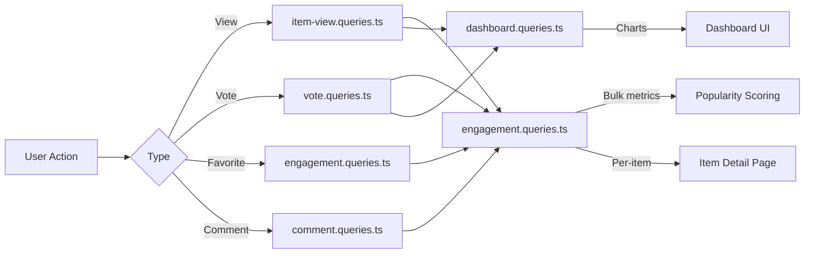

# Requêtes d'engagement et d'interaction

Les requêtes d'engagement regroupent les interactions des utilisateurs (vues, votes, favoris, commentaires) sur plusieurs éléments. Ces requêtes alimentent le tri par popularité, les graphiques de tableau de bord et les panneaux d'engagement par article. Les modules pertinents sont `engagement.queries.ts`, `vote.queries.ts`, `comment.queries.ts`, `item-view.queries.ts` et `dashboard.queries.ts`.

## Flux de données d'engagement



## Métriques d'engagement groupé (`engagement.queries.ts`)

### `getEngagementMetricsPerItem`

La fonction principale de notation de popularité. Renvoie toutes les dimensions d'engagement pour plusieurs éléments dans un seul lot de requêtes parallèle :

```typescript
export async function getEngagementMetricsPerItem(
  itemSlugs: string[]
): Promise<Map<string, ItemEngagementMetrics>>
```

Type de retour :

```typescript
export interface ItemEngagementMetrics {
  views: number;
  votes: number;       // Net votes (upvotes - downvotes)
  favorites: number;
  comments: number;
  avgRating: number;   // Average rating from comments (0-5)
}
```

### Stratégie de requête parallèle

Quatre requêtes indépendantes exécutées via `Promise.all` pour un débit maximal :

```typescript
const [viewsData, votesData, favoritesData, commentsData] = await Promise.all([
  // 1. Views per item
  db.select({ itemId: itemViews.itemId, count: count() })
    .from(itemViews)
    .where(inArray(itemViews.itemId, itemSlugs))
    .groupBy(itemViews.itemId),

  // 2. Net votes per item (upvotes - downvotes)
  db.select({
      itemId: votes.itemId,
      netScore: sql<number>`SUM(CASE
        WHEN vote_type = 'upvote' THEN 1
        WHEN vote_type = 'downvote' THEN -1
        ELSE 0 END)`.as('netScore'),
    })
    .from(votes)
    .where(inArray(votes.itemId, itemSlugs))
    .groupBy(votes.itemId),

  // 3. Favorites per item
  db.select({ itemSlug: favorites.itemSlug, count: count() })
    .from(favorites)
    .where(inArray(favorites.itemSlug, itemSlugs))
    .groupBy(favorites.itemSlug),

  // 4. Comments count + average rating (excluding soft-deleted)
  db.select({
      itemId: comments.itemId,
      count: count(),
      avgRating: sql<number>`COALESCE(AVG(${comments.rating}), 0)`.as('avgRating'),
    })
    .from(comments)
    .where(and(inArray(comments.itemId, itemSlugs), isNull(comments.deletedAt)))
    .groupBy(comments.itemId),
]);
```

### Normalisation des résultats

Chaque résultat de requête est converti en un `Map` pour la recherche O(1), puis combiné dans la carte de métriques finale :

```typescript
const viewsMap = new Map<string, number>(
  viewsData.map(v => [v.itemId, Number(v.count)])
);
// ... same for votesMap, favoritesMap, commentsMap

for (const slug of itemSlugs) {
  metricsMap.set(slug, {
    views: viewsMap.get(slug) ?? 0,
    votes: votesMap.get(slug) ?? 0,
    favorites: favoritesMap.get(slug) ?? 0,
    comments: commentsMap.get(slug)?.count ?? 0,
    avgRating: commentsMap.get(slug)?.avgRating ?? 0,
  });
}
```

### Fonctions métriques autonomes

|Fonction|Retours|Descriptif|
|----------|---------|-------------|
|`getFavoritesPerItem(itemSlugs)`|`Map<string, number>`|Nombre de favoris par article|
|`getCommentsPerItem(itemSlugs)`|`Map<string, { count, avgRating }>`|Nombre de commentaires et notes moyennes|

Les deux fonctions utilisent le même modèle : retour anticipé pour les tableaux vides, `groupBy` agrégation, `Map` construction.

## Requêtes de vote (`vote.queries.ts`)

### Votez CRUD

|Fonction|Descriptif|
|----------|-------------|
|`createVote(vote)`|Créer un vote avec la normalisation des slugs|
|`getVoteByUserIdAndItemId(userId, itemSlug)`|Vérifier le vote existant|
|`deleteVote(voteId)`|Supprimer un vote|

Toutes les fonctions de vote normalisent les slugs d'éléments via `getItemIdFromSlug()` avant l'interrogation.

### Calcul du score net

Score d'élément individuel à l'aide du conditionnel `SUM` :

```typescript
export async function getVoteCountForItem(itemSlug: string): Promise<number> {
  const itemId = getItemIdFromSlug(itemSlug);
  const [result] = await db
    .select({
      netScore: sql<number>`
        SUM(CASE
          WHEN vote_type = 'upvote' THEN 1
          WHEN vote_type = 'downvote' THEN -1
          ELSE 0
        END)`.as('netScore')
    })
    .from(votes)
    .where(eq(votes.itemId, itemId));
  return Number(result?.netScore ?? 0);
}
```

### Résultats des votes groupés

`getVotesPerItem` renvoie un `Map<string, number>` de scores nets pour plusieurs éléments en utilisant `inArray` et `groupBy`.

### Éléments triés par vote

```typescript
export async function getItemsSortedByVotes(limit = 10, offset = 0) {
  return db
    .select({
      itemId: votes.itemId,
      voteCount: sql<number>`count(${votes.id})`.as('vote_count')
    })
    .from(votes)
    .groupBy(votes.itemId)
    .orderBy(sql`vote_count DESC`)
    .limit(limit)
    .offset(offset);
}
```

## Requêtes de commentaires (`comment.queries.ts`)

### Commentaire

|Fonction|Descriptif|
|----------|-------------|
|`createComment(data)`|Créer avec la normalisation slug|
|`getCommentById(id)`|Enregistrement de commentaires bruts|
|`getCommentWithUserById(id)`|Commentaire en rejoignant le profil utilisateur|
|`updateComment(id, { content?, rating? })`|Mettre à jour avec l'horodatage `editedAt`|
|`updateCommentRating(id, rating)`|Mise à jour de la note uniquement|
|`deleteComment(id)`|Suppression logicielle (`deletedAt = new Date()`)|

### Commentaires avec données utilisateur

`getCommentsByItemId` utilise un `innerJoin` avec `clientProfiles` pour enrichir chaque commentaire avec des informations sur l'auteur :

```typescript
export async function getCommentsByItemId(itemSlug: string): Promise<CommentWithUser[]> {
  const itemId = getItemIdFromSlug(itemSlug);
  return db
    .select({
      id: comments.id,
      content: comments.content,
      rating: comments.rating,
      userId: comments.userId,
      itemId: comments.itemId,
      createdAt: comments.createdAt,
      updatedAt: comments.updatedAt,
      editedAt: comments.editedAt,
      deletedAt: comments.deletedAt,
      user: {
        id: clientProfiles.id,
        name: clientProfiles.name,
        email: clientProfiles.email,
        image: clientProfiles.avatar
      }
    })
    .from(comments)
    .innerJoin(clientProfiles, eq(comments.userId, clientProfiles.id))
    .where(and(eq(comments.itemId, itemId), isNull(comments.deletedAt)))
    .orderBy(desc(comments.createdAt));
}
```

## Afficher le suivi (`item-view.queries.ts`)

### Déduplication quotidienne

Les vues sont dédupliquées par spectateur, par élément et par jour UTC à l'aide du modèle d'upsert `onConflictDoNothing` :

```typescript
export async function recordItemView(
  view: Pick<NewItemView, 'itemId' | 'viewerId' | 'viewedDateUtc'>
): Promise<boolean> {
  const result = await db
    .insert(itemViews)
    .values(view)
    .onConflictDoNothing()
    .returning({ id: itemViews.id });
  return result.length > 0; // true = new view, false = duplicate
}
```

### Afficher les fonctions d'agrégation

|Fonction|Paramètres|Retours|Descriptif|
|----------|-----------|---------|-------------|
|`getTotalViewsCount(itemSlugs)`|`string[]`|`number`|Nombre total de vues sur tous les éléments|
|`getRecentViewsCount(itemSlugs, days)`|`string[], number`|`number`|Vues au cours des N derniers jours|
|`getDailyViewsData(itemSlugs, days)`|`string[], number`|`Map<string, number>`|Le nombre de vues quotidiennes|
|`getViewsPerItem(itemSlugs)`|`string[]`|`Map<string, number>`|Nombre de vues par article|

### Assistant de date UTC

Tous les calculs de date utilisent UTC pour éviter les erreurs ponctuelles liées au fuseau horaire :

```typescript
function getUtcDateString(daysAgo: number = 0): string {
  const date = new Date();
  date.setUTCDate(date.getUTCDate() - daysAgo);
  return date.toISOString().split('T')[0]; // "YYYY-MM-DD"
}
```

## Statistiques du tableau de bord (`dashboard.queries.ts`)

### Métriques disponibles

|Fonction|Objectif|
|----------|---------|
|`getVotesReceivedCount(itemSlugs)`|Total des votes sur les éléments de l'utilisateur|
|`getCommentsReceivedCount(itemSlugs)`|Total des commentaires sur les éléments de l'utilisateur|
|`getUniqueItemsInteractedCount(clientId)`|Éléments avec lesquels l'utilisateur a interagi|
|`getUserTotalActivityCount(clientId)`|Total des votes + commentaires par utilisateur|
|`getWeeklyEngagementData(itemSlugs, weeks)`|Données graphiques agrégées hebdomadaires|
|`getDailyActivityData(clientId, itemSlugs, days)`|Répartition de l'activité quotidienne|
|`getTopItemsEngagement(itemSlugs, limit)`|Principaux éléments par score d'engagement|

### Agrégation d'engagement hebdomadaire

Utilise le `to_char` de PostgreSQL avec le format de semaine ISO pour un regroupement hebdomadaire cohérent :

```typescript
const weeklyVotes = await db
  .select({
    week: sql<string>`to_char(${votes.createdAt}, 'IYYY-IW')`.as('week'),
    count: count(),
  })
  .from(votes)
  .where(and(inArray(votes.itemId, itemSlugs), gte(votes.createdAt, startDate)))
  .groupBy(sql`to_char(${votes.createdAt}, 'IYYY-IW')`)
  .orderBy(sql`to_char(${votes.createdAt}, 'IYYY-IW')`);
```

## Considérations relatives aux performances

- Toutes les fonctions groupées acceptent les tableaux et utilisent `inArray` pour le traitement par lots
- Les entrées de tableau vide reviennent plus tôt sans toucher la base de données
- `Promise.all` exécute simultanément des agrégations indépendantes
- `Map` les structures de données fournissent une recherche O(1) lors de l'assemblage des résultats
- Les commentaires supprimés de manière logicielle sont exclus via `isNull(comments.deletedAt)` dans toutes les agrégations
