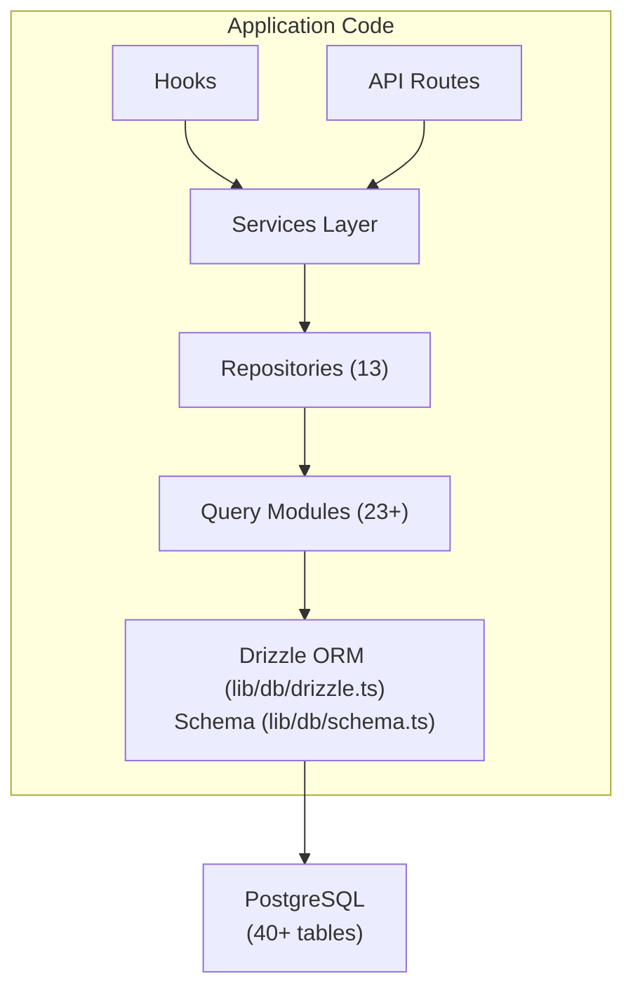

# Présentation de la base de données

Le modèle Ever Works utilise **Drizzle ORM** avec **PostgreSQL** comme couche de base de données. La base de données est facultative : l'application peut s'exécuter sans elle pour les déploiements de contenu uniquement - mais elle alimente toutes les fonctionnalités d'utilisateur, d'abonnement, d'engagement et d'administration.

## Pile technologique

|Composant|Technologie|Objectif|
|-----------|-----------|---------|
|ORM|Bruine ORM|Générateur de requêtes de type sécurisé et gestion des schémas|
|Base de données|PostgreSQL|Base de données relationnelle principale|
|Chauffeur|`postgres` (postgres.js)|Client PostgreSQL pour Node.js|
|Migrations|Kit de bruine|Génération et exécution de migration de schéma|
|Semis|`drizzle-seed` + scripts personnalisés|Initialisation de la base de données avec les données par défaut|

## Architecture de base de données



## Configuration

### Configuration de bruine (`drizzle.config.ts`)

```typescript
export default {
  schema: "./lib/db/schema.ts",
  out: "./lib/db/migrations",
  dialect: "postgresql",
  dbCredentials: {
    url: process.env.DATABASE_URL,
  },
} satisfies Config;
```

La configuration pointe vers :
- **Fichier de schéma** : `lib/db/schema.ts` -- la source unique de vérité pour toutes les définitions de table
- **Sortie des migrations** : `lib/db/migrations/` -- où les fichiers de migration SQL générés sont stockés
- **Dialecte** : PostgreSQL
- **Connexion** : via la variable d'environnement `DATABASE_URL`

### Gestion des connexions (`lib/db/drizzle.ts`)

La connexion à la base de données est initialisée paresseusement lors de la première utilisation et réutilise les connexions lors des rechargements à chaud en cours de développement via un modèle singleton global.

Principales caractéristiques :
- **Initialisation paresseuse** : la connexion à la base de données n'est créée que lorsque la première requête est exécutée
- **Accès basé sur proxy** : L'objet `db` exporté utilise un JavaScript `Proxy` pour initialiser la connexion de manière transparente
- **Regroupement de connexions** : taille du pool configurable via la variable d'environnement `DB_POOL_SIZE` (par défaut : 20 en production, 10 en développement, limité 1-50)
- **Délai d'inactivité** : les connexions sont libérées après 20 secondes d'inactivité
- **Délai d'expiration de connexion** : délai d'attente de 30 secondes pour établir de nouvelles connexions
- **Modèle Singleton** : utilise `globalThis` pour conserver les connexions lors des rechargements à chaud Next.js

```typescript
// Usage - just import and use
import { db } from '@/lib/db/drizzle';

const users = await db.select().from(schema.users);
```

### Variables d'environnement

|Variable|Obligatoire|Par défaut|Descriptif|
|----------|----------|---------|-------------|
|`DATABASE_URL`|Non| - |Chaîne de connexion PostgreSQL|
|`DB_POOL_SIZE`|Non| 10/20 |Taille du pool de connexions (dev/prod)|

Lorsque `DATABASE_URL` n'est pas défini, les fonctionnalités de la base de données sont désactivées silencieusement, permettant à l'application de s'exécuter en mode contenu uniquement.

## Présentation du schéma

Le schéma de la base de données est défini dans un seul fichier (`lib/db/schema.ts`) contenant plus de 40 tables organisées par domaine :

|Domaine|Tableaux|Descriptif|
|--------|--------|-------------|
|Utilisateurs et authentification| 8 |Utilisateurs, comptes, sessions, jetons, authentificateurs|
|Rôles et autorisations| 3 |RBAC avec rôles, autorisations et mappages rôle-autorisation|
|Profils clients| 1 |Profils d'utilisateurs étendus pour les comptes clients|
|Engagement de contenu| 4 |Commentaires, votes, favoris, vues d'éléments|
|Abonnements| 4 |Forfaits, historique des abonnements, prestataires de paiement, comptes de paiement|
|Notifications| 1 |Système de notification dans l'application|
|Administrateur et modération| 4 |Rapports, historique de modération, journaux d'audit des éléments, journaux d'activité|
|Intégrations| 2 |Configuration CRM, mappages d'intégration|
|Entreprises| 2 |Entreprises et associations article-entreprise|
|Annonces de sponsor| 1 |Annonces d'articles sponsorisés|
|Enquêtes| 2 |Enquêtes et réponses aux enquêtes|
|Bulletin| 1 |Abonnements à la newsletter|
|Système| 1 |Suivi de l'état des semences|

## Initialisation de la base de données

Au démarrage de l'application (via `instrumentation.ts`), le modèle automatiquement :

1. **Exécute les migrations** : la fonction `migrate()` de Drizzle applique toutes les migrations en attente (idempotente : les migrations déjà appliquées sont ignorées)
2. **Données de départ** : si la base de données n'a pas été prédéfinie, le script de départ s'exécute avec une protection de verrouillage consultative pour éviter les conditions de concurrence dans les déploiements multi-processus.

Ceci est géré par `lib/db/initialize.ts`. Consultez le [Guide des migrations](./migrations-guide) et [Amorçage de base de données](./seeding) pour plus de détails.

## Commandes clés

```bash
# Generate a migration from schema changes
pnpm db:generate

# Run pending migrations
pnpm db:migrate

# Seed the database
pnpm db:seed

# Open Drizzle Studio (database GUI)
pnpm db:studio
```
