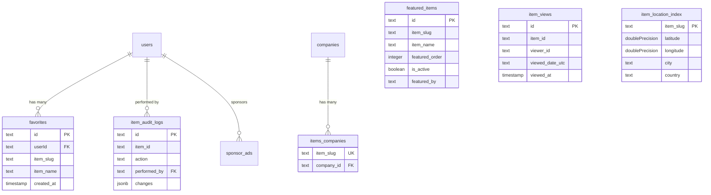

# Analyse approfondie du schéma des éléments

## Aperçu

Dans le modèle Ever Works, **les éléments sont stockés dans un CMS basé sur Git** (`.content/`), et non dans une table de base de données traditionnelle. Cependant, plusieurs tables de base de données prennent en charge les opérations liées aux éléments telles que le suivi des vues, l'audit des modifications, l'indexation des emplacements, la gestion des favoris, la présentation des éléments et la liaison des éléments aux entreprises.

Cette page documente chaque table de base de données qui référence ou prend en charge des éléments.

**Fichier source :** `template/lib/db/schema.ts`

---

## Item-Supporting Tables

| Table | Purpose |
|---|---|
| `favorites` | User-saved favorite items |
| `featured_items` | Admin-curated featured items |
| `item_views` | Per-day unique view tracking |
| `item_audit_logs` | Complete change history for admin panel |
| `item_location_index` | Geospatial index for "Near Me" filtering |
| `items_companies` | Links items to company records |
| `location_index_meta` | Singleton metadata for location index |

---

## Tableau : `favorites`

Stocke les relations entre les signets/favoris de l'utilisateur et les éléments, identifiés par slug.

### Colonnes

|Colonne|Nom de la base de données|Tapez|Nullable|Par défaut|Contraintes|
|---|---|---|---|---|---|
|`id`|`id`|`text`|Non|`crypto.randomUUID()`|Clé primaire|
|`userId`|`userId`|`text`|Non| - |FK -> `users.id` (CASCADE)|
|`itemSlug`|`item_slug`|`text`|Non| - | - |
|`itemName`|`item_name`|`text`|Non| - | - |
|`itemIconUrl`|`item_icon_url`|`text`|Oui| - | - |
|`itemCategory`|`item_category`|`text`|Oui| - | - |
|`createdAt`|`created_at`|`timestamp`|Non|`now()`| - |
|`updatedAt`|`updated_at`|`timestamp`|Non|`now()`| - |

### Index

|Nom|Colonnes|Tapez|
|---|---|---|
|`user_item_favorite_unique_idx`|`(userId, itemSlug)`|Unique|
|`favorites_user_id_idx`|`userId`|Arbre B|
|`favorites_item_slug_idx`|`itemSlug`|Arbre B|
|`favorites_created_at_idx`|`createdAt`|Arbre B|

### Types de scripts dactylographiés

```typescript
export type Favorite = typeof favorites.$inferSelect;
export type NewFavorite = typeof favorites.$inferInsert;
export type FavoriteWithUser = Favorite & {
    user: typeof users.$inferSelect;
};
```

---

## Table: `featured_items`

Admin-curated list of items to highlight on the site. Supports ordering and optional expiration.

### Columns

| Column | DB Name | Type | Nullable | Default | Constraints |
|---|---|---|---|---|---|
| `id` | `id` | `text` | No | `crypto.randomUUID()` | Primary Key |
| `itemSlug` | `item_slug` | `text` | No | - | - |
| `itemName` | `item_name` | `text` | No | - | - |
| `itemIconUrl` | `item_icon_url` | `text` | Yes | - | - |
| `itemCategory` | `item_category` | `text` | Yes | - | - |
| `itemDescription` | `item_description` | `text` | Yes | - | - |
| `featuredOrder` | `featured_order` | `integer` | No | `0` | Display ordering |
| `featuredUntil` | `featured_until` | `timestamp` | Yes | - | Optional expiration |
| `isActive` | `is_active` | `boolean` | No | `true` | - |
| `featuredBy` | `featured_by` | `text` | No | - | Admin user ID |
| `featuredAt` | `featured_at` | `timestamp` | No | `now()` | - |
| `createdAt` | `created_at` | `timestamp` | No | `now()` | - |
| `updatedAt` | `updated_at` | `timestamp` | No | `now()` | - |

### Indexes

| Name | Columns | Type |
|---|---|---|
| `featured_items_item_slug_idx` | `itemSlug` | B-tree |
| `featured_items_featured_order_idx` | `featuredOrder` | B-tree |
| `featured_items_is_active_idx` | `isActive` | B-tree |
| `featured_items_featured_at_idx` | `featuredAt` | B-tree |
| `featured_items_featured_until_idx` | `featuredUntil` | B-tree |

### TypeScript Types

```typescript
export type FeaturedItem = typeof featuredItems.$inferSelect;
export type NewFeaturedItem = typeof featuredItems.$inferInsert;
```

---

## Tableau : `item_views`

Suit les vues quotidiennes uniques par élément. Utilise l'identification anonyme du spectateur basée sur des cookies et la déduplication de la date UTC. Ne stocke pas les adresses IP pour des raisons de confidentialité.

### Colonnes

|Colonne|Nom de la base de données|Tapez|Nullable|Par défaut|Contraintes|
|---|---|---|---|---|---|
|`id`|`id`|`text`|Non|`crypto.randomUUID()`|Clé primaire|
|`itemId`|`item_id`|`text`|Non| - |Limace d'objet|
|`viewerId`|`viewer_id`|`text`|Non| - |Identifiant de cookie anonyme|
|`viewedDateUtc`|`viewed_date_utc`|`text`|Non| - |Format AAAA-MM-JJ|
|`viewedAt`|`viewed_at`|`timestamp (tz)`|Non|`now()`|Temps de visualisation précis|

### Index

|Nom|Colonnes|Tapez|
|---|---|---|
|`item_views_unique_daily_idx`|`(itemId, viewerId, viewedDateUtc)`|Unique|
|`item_views_item_date_idx`|`(itemId, viewedDateUtc)`|Arbre B composite|

### Types de scripts dactylographiés

```typescript
export type ItemView = typeof itemViews.$inferSelect;
export type NewItemView = typeof itemViews.$inferInsert;
```

---

## Table: `item_audit_logs`

Stores the complete change history for items managed through the admin panel. Since items live in Git, `itemId` is the slug (not a foreign key).

### Columns

| Column | DB Name | Type | Nullable | Default | Constraints |
|---|---|---|---|---|---|
| `id` | `id` | `text` | No | `crypto.randomUUID()` | Primary Key |
| `itemId` | `item_id` | `text` | No | - | Item slug |
| `itemName` | `item_name` | `text` | No | - | Denormalized |
| `action` | `action` | `text (enum)` | No | - | See enum values below |
| `previousStatus` | `previous_status` | `text` | Yes | - | For status changes |
| `newStatus` | `new_status` | `text` | Yes | - | For status changes |
| `changes` | `changes` | `jsonb` | Yes | - | `{ field: { old, new } }` |
| `performedBy` | `performed_by` | `text` | Yes | - | FK -> `users.id` (SET NULL) |
| `performedByName` | `performed_by_name` | `text` | Yes | - | Denormalized |
| `notes` | `notes` | `text` | Yes | - | Review notes |
| `metadata` | `metadata` | `jsonb` | Yes | - | IP, user agent, etc. |
| `createdAt` | `created_at` | `timestamp (tz)` | No | `now()` | - |

### Action Enum Values

```typescript
export const ItemAuditAction = {
    CREATED: 'created',
    UPDATED: 'updated',
    STATUS_CHANGED: 'status_changed',
    REVIEWED: 'reviewed',
    DELETED: 'deleted',
    RESTORED: 'restored'
} as const;
```

### Indexes

| Name | Columns | Type |
|---|---|---|
| `item_audit_logs_item_id_idx` | `itemId` | B-tree |
| `item_audit_logs_action_idx` | `action` | B-tree |
| `item_audit_logs_performed_by_idx` | `performedBy` | B-tree |
| `item_audit_logs_created_at_idx` | `createdAt` | B-tree |
| `item_audit_logs_item_id_action_idx` | `(itemId, action)` | Composite B-tree |

### TypeScript Types

```typescript
export type ItemAuditLog = typeof itemAuditLogs.$inferSelect;
export type NewItemAuditLog = typeof itemAuditLogs.$inferInsert;
export type ItemAuditChanges = Record<string, { old: unknown; new: unknown }>;
```

---

## Tableau : `item_location_index`

Index géospatial des éléments, permettant le filtrage « à proximité » et le tri basé sur la distance. Il s'agit d'une table uniquement d'index : la source de vérité reste dans le CMS Git.

### Colonnes

|Colonne|Nom de la base de données|Tapez|Nullable|Par défaut|Contraintes|
|---|---|---|---|---|---|
|`itemSlug`|`item_slug`|`text`|Non| - |Clé primaire|
|`latitude`|`latitude`|`doublePrecision`|Non| - | - |
|`longitude`|`longitude`|`doublePrecision`|Non| - | - |
|`address`|`address`|`text`|Oui| - | - |
|`city`|`city`|`text`|Oui| - | - |
|`state`|`state`|`text`|Oui| - | - |
|`country`|`country`|`text`|Oui| - | - |
|`cityNormalized`|`city_normalized`|`text`|Oui| - |Minuscules, rognés|
|`countryNormalized`|`country_normalized`|`text`|Oui| - |Minuscules, rognés|
|`postalCode`|`postal_code`|`text`|Oui| - | - |
|`serviceArea`|`service_area`|`text`|Oui| - | - |
|`isRemote`|`is_remote`|`boolean`|Non|`false`| - |
|`indexedAt`|`indexed_at`|`timestamp (tz)`|Non|`now()`| - |

### Index

|Nom|Colonnes|Tapez|
|---|---|---|
|`item_location_index_latitude_idx`|`latitude`|Arbre B|
|`item_location_index_longitude_idx`|`longitude`|Arbre B|
|`item_location_index_city_idx`|`city`|Arbre B|
|`item_location_index_country_idx`|`country`|Arbre B|
|`item_location_index_city_normalized_idx`|`cityNormalized`|Arbre B|
|`item_location_index_country_normalized_idx`|`countryNormalized`|Arbre B|
|`item_location_index_is_remote_idx`|`isRemote`|Arbre B|
|`item_location_index_indexed_at_idx`|`indexedAt`|Arbre B|
|`item_location_index_lat_long_idx`|`(latitude, longitude)`|Arbre B composite|

### Types de scripts dactylographiés

```typescript
export type ItemLocationIndex = typeof itemLocationIndex.$inferSelect;
export type NewItemLocationIndex = typeof itemLocationIndex.$inferInsert;
```

---

## Table: `items_companies`

Links item slugs to company database records.

### Columns

| Column | DB Name | Type | Nullable | Default | Constraints |
|---|---|---|---|---|---|
| `itemSlug` | `item_slug` | `text` | No | - | Unique |
| `companyId` | `company_id` | `text` | No | - | FK -> `companies.id` (CASCADE) |
| `createdAt` | `created_at` | `timestamp (tz)` | No | `now()` | - |
| `updatedAt` | `updated_at` | `timestamp (tz)` | No | `now()` | - |

### Indexes

| Name | Columns | Type |
|---|---|---|
| `items_companies_company_id_idx` | `companyId` | B-tree |

---

## Tableau : `location_index_meta`

L'index d'emplacement de suivi de table Singleton reconstruit les métadonnées à travers les déploiements.

### Colonnes

|Colonne|Nom de la base de données|Tapez|Nullable|Par défaut|Contraintes|
|---|---|---|---|---|---|
|`id`|`id`|`text`|Non|`'singleton'`|Clé primaire|
|`lastRebuildAt`|`last_rebuild_at`|`timestamp (tz)`|Oui| - | - |
|`lastRebuildDurationMs`|`last_rebuild_duration_ms`|`integer`|Oui| - | - |
|`lastRebuildItemCount`|`last_rebuild_item_count`|`integer`|Oui| - | - |
|`updatedAt`|`updated_at`|`timestamp (tz)`|Non|`now()`| - |

### Index

|Nom|Colonnes|Tapez|
|---|---|---|
|`location_index_meta_singleton_idx`|`id`|Unique|

---

## Relations Diagram



---

## Exemples de requête

### Récupérer les favoris des utilisateurs

```typescript
import { db } from '@/lib/db/drizzle';
import { favorites } from '@/lib/db/schema';
import { eq } from 'drizzle-orm';

const userFavorites = await db
    .select()
    .from(favorites)
    .where(eq(favorites.userId, userId));
```

### Enregistrer une vue d'élément

```typescript
import { itemViews } from '@/lib/db/schema';

await db.insert(itemViews).values({
    itemId: 'my-item-slug',
    viewerId: cookieViewerId,
    viewedDateUtc: '2025-01-15',
}).onConflictDoNothing();
```

### Obtenez des articles en vedette actifs

```typescript
import { featuredItems } from '@/lib/db/schema';
import { eq, asc, or, isNull, gte } from 'drizzle-orm';

const featured = await db
    .select()
    .from(featuredItems)
    .where(eq(featuredItems.isActive, true))
    .orderBy(asc(featuredItems.featuredOrder));
```

### Rechercher des éléments à proximité d'un emplacement (cadre de délimitation)

```typescript
import { itemLocationIndex } from '@/lib/db/schema';
import { and, between } from 'drizzle-orm';

const nearby = await db
    .select()
    .from(itemLocationIndex)
    .where(
        and(
            between(itemLocationIndex.latitude, minLat, maxLat),
            between(itemLocationIndex.longitude, minLng, maxLng)
        )
    );
```

### Obtenir l'historique d'audit pour un élément

```typescript
import { itemAuditLogs } from '@/lib/db/schema';
import { eq, desc } from 'drizzle-orm';

const history = await db
    .select()
    .from(itemAuditLogs)
    .where(eq(itemAuditLogs.itemId, 'my-item-slug'))
    .orderBy(desc(itemAuditLogs.createdAt));
```

---

## Design Notes

- **Items are NOT in the database.** They live in a Git-based CMS cloned into `.content/`. The database only stores metadata, indexes, and relationships.
- **Item identification is by slug.** All item-supporting tables reference items via `item_slug` or `item_id` (which IS the slug), not via foreign keys.
- **Denormalization is intentional.** Tables like `favorites` and `featured_items` store `item_name` and `item_icon_url` to avoid cross-system lookups at read time.
- **Privacy-first views.** The `item_views` table uses anonymous cookie IDs and does not store IP addresses.
