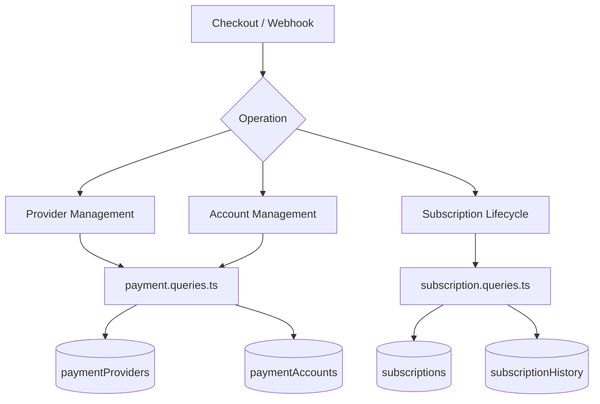
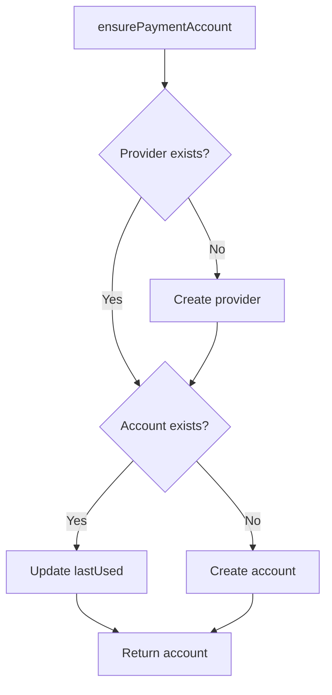
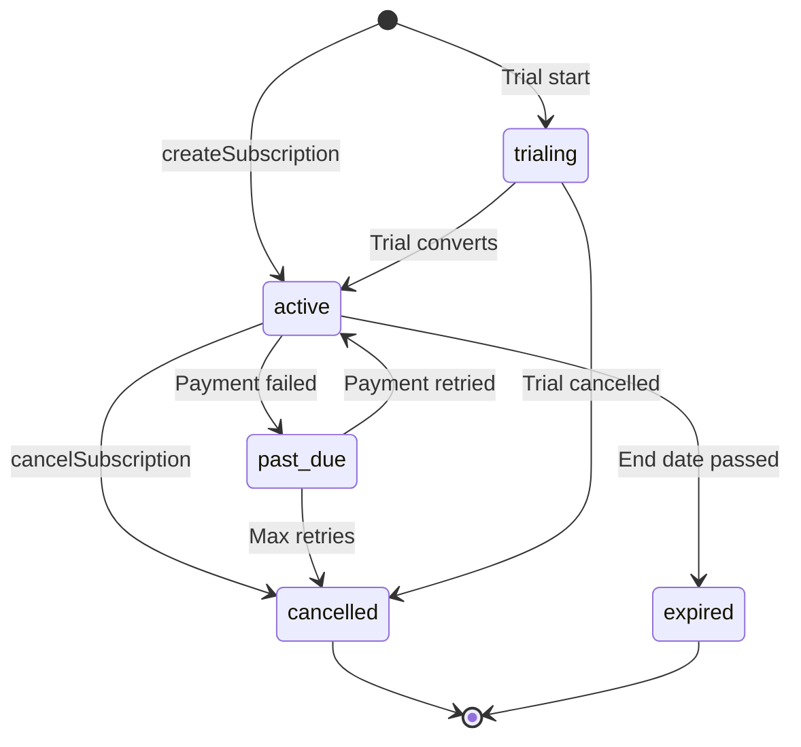

# Requêtes de paiement et d'abonnement

Les requêtes de paiement gèrent le registre des fournisseurs, les comptes de paiement des utilisateurs et le cycle de vie complet de l'abonnement. Les modules pertinents sont `payment.queries.ts` et `subscription.queries.ts`.

## Architecture du système de paiement



## Requêtes du fournisseur de paiement (`payment.queries.ts`)

### Fournisseur CRUD

|Fonction|Descriptif|
|----------|-------------|
|`getPaymentProvider(id)`|Obtenir le fournisseur par ID|
|`getPaymentProviderByName(name)`|Obtenez le fournisseur par son nom (par exemple, `'stripe'`)|
|`getActivePaymentProviders()`|Répertorier tous les fournisseurs actifs, classés par nom|
|`createPaymentProvider(data)`|Créer un nouvel enregistrement de fournisseur|
|`updatePaymentProvider(id, data)`|Mise à jour partielle des champs du fournisseur|
|`deactivatePaymentProvider(id)`|Définir `isActive = false`|

Noms de fournisseurs pris en charge : `stripe`, `lemonsqueezy`, `polar`, `solidgate`.

### Requêtes sur les comptes de paiement

Les comptes de paiement associent un utilisateur à un identifiant client spécifique au fournisseur :

|Fonction|Descriptif|
|----------|-------------|
|`getPaymentAccountByUserId(userId, providerId)`|Obtenez un compte avec un chèque de fournisseur actif|
|`getPaymentAccountByCustomerId(customerId, providerId)`|Recherche inversée par numéro client|
|`createPaymentAccount(data)`|Créer un compte avec l'horodatage `lastUsed`|
|`updatePaymentAccountLastUsed(accountId)`|Appuyez sur `lastUsed` horodatage|
|`getUserPaymentAccountByProvider(userId, providerName)`|Recherche par nom de fournisseur (résout le fournisseur en premier)|

### Validation du fournisseur actif

`getPaymentAccountByUserId` effectue une triple jointure interne pour garantir la validité du fournisseur et de l'utilisateur :

```typescript
export async function getPaymentAccountByUserId(
  userId: string,
  providerId: string
): Promise<PaymentAccount | null> {
  const result = await db
    .select({ /* payment account fields */ })
    .from(paymentAccounts)
    .innerJoin(paymentProviders, eq(paymentAccounts.providerId, paymentProviders.id))
    .innerJoin(users, eq(paymentAccounts.userId, users.id))
    .where(and(
      eq(paymentAccounts.userId, userId),
      eq(paymentAccounts.providerId, providerId),
      eq(paymentProviders.isActive, true)
    ))
    .limit(1);
  return result[0] || null;
}
```

### Assurer le compte de paiement

`ensurePaymentAccount` implémente un modèle d'upsert idempotent pour les comptes de paiement :



```typescript
export async function ensurePaymentAccount(
  providerName: string,
  userId: string,
  customerId: string,
  accountId?: string
): Promise<PaymentAccount>
```

### Configurer le compte de paiement de l'utilisateur

`setupUserPaymentAccount` étend le modèle d'assurance avec la détection des changements d'ID client :

```typescript
if (existingAccount.customerId !== customerId) {
  await db
    .update(paymentAccounts)
    .set({
      customerId,
      accountId: accountId || existingAccount.accountId,
      lastUsed: new Date(),
      updatedAt: new Date()
    })
    .where(eq(paymentAccounts.id, existingAccount.id));
}
```

### Alias de commodité

- `getOrCreatePaymentAccount` -- alias pour `ensurePaymentAccount`
- `createOrGetPaymentAccount` -- alias pour `setupUserPaymentAccount`

## Requêtes d'abonnement (`subscription.queries.ts`)

### Recherche d'abonnement

|Fonction|Paramètres|Retours|
|----------|-----------|---------|
|`getUserActiveSubscription(userId)`|Identifiant utilisateur|Abonnement actif ou nul|
|`getUserSubscriptions(userId)`|Identifiant utilisateur|Tous les abonnements (classés par date)|
|`getSubscriptionByProviderSubscriptionId(provider, subId)`|Fournisseur + sous-ID|Abonnement ou nul|
|`getSubscriptionByUserIdAndSubscriptionId(userId, subId)`|Utilisateur + sous-ID|Abonnement ou nul|
|`getSubscriptionWithUser(subId)`|Identifiant d'abonnement|Abonnement avec inscription d'utilisateur|
|`hasActiveSubscription(userId)`|Identifiant utilisateur|Booléen|

### Cycle de vie de l'abonnement

#### Créer

```typescript
export async function createSubscription(data: NewSubscription): Promise<Subscription> {
  const result = await db
    .insert(subscriptions)
    .values({ ...data, createdAt: new Date(), updatedAt: new Date() })
    .returning();
  return result[0];
}
```

#### Statut de la mise à jour

Les changements de statut définissent automatiquement `cancelledAt` et `cancelReason` lors de la transition vers `CANCELLED` :

```typescript
export async function updateSubscriptionStatus(
  subscriptionId: string,
  status: string,
  reason?: string
): Promise<Subscription | null>
```

#### Annuler

Prend en charge à la fois l'annulation immédiate et l'annulation de fin de période :

```typescript
export async function cancelSubscription(
  subscriptionId: string,
  reason?: string,
  cancelAtPeriodEnd: boolean = false
): Promise<Subscription | null>
```

Lorsque `cancelAtPeriodEnd = true`, le statut reste `ACTIVE` mais `cancelledAt` et `cancelAtPeriodEnd` sont définis.

### Flux de statut d'abonnement



### Résolution du régime

`getUserPlan` vérifie l'expiration de l'abonnement et revient au forfait gratuit :

```typescript
export async function getUserPlan(userId: string): Promise<string> {
  const subscription = await getUserActiveSubscription(userId);
  if (!subscription) return PaymentPlan.FREE;
  return getEffectivePlan(subscription.planId, subscription.endDate, subscription.status);
}
```

`getUserPlanWithExpiration` renvoie tous les détails d'expiration :

```typescript
{
  planId: string;         // Stored plan
  effectivePlan: string;  // Actual plan after expiration check
  isExpired: boolean;
  expiresAt: Date | null;
  status: string | null;
  subscriptionId: string | null;
}
```

### Expiration et renouvellement

|Fonction|Descriptif|
|----------|-------------|
|`getSubscriptionsExpiringSoon(days)`|Abonnements actifs expirant dans N jours|
|`getExpiredSubscriptions()`|Abonnements passés leur date de fin|
|`getSubscriptionsForRenewalReminder(days)`|Abonnements nécessitant des avis de renouvellement|

### Historique des abonnements

Les modifications sont enregistrées dans la table `subscriptionHistory` :

```typescript
export async function logSubscriptionHistory(data: NewSubscriptionHistory)
export async function getSubscriptionHistory(subscriptionId: string)
```

### Statistiques d'abonnement

`getSubscriptionStats` renvoie le nombre total :

```typescript
{
  total: number;
  active: number;
  cancelled: number;
  expired: number;
  pastDue: number;
  trialing: number;
}
```

## Constantes de schéma

```typescript
// lib/db/schema.ts
export const SubscriptionStatus = {
  ACTIVE: 'active',
  CANCELLED: 'cancelled',
  EXPIRED: 'expired',
  PAST_DUE: 'past_due',
  TRIALING: 'trialing',
} as const;

// lib/constants/payment.ts
export const PaymentPlan = {
  FREE: 'free',
  STANDARD: 'standard',
  PREMIUM: 'premium',
} as const;

export const PaymentProvider = {
  STRIPE: 'stripe',
  LEMONSQUEEZY: 'lemonsqueezy',
  POLAR: 'polar',
  SOLIDGATE: 'solidgate',
} as const;
```
