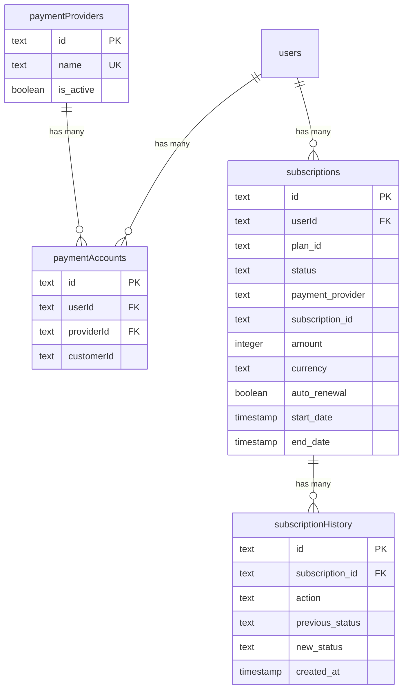
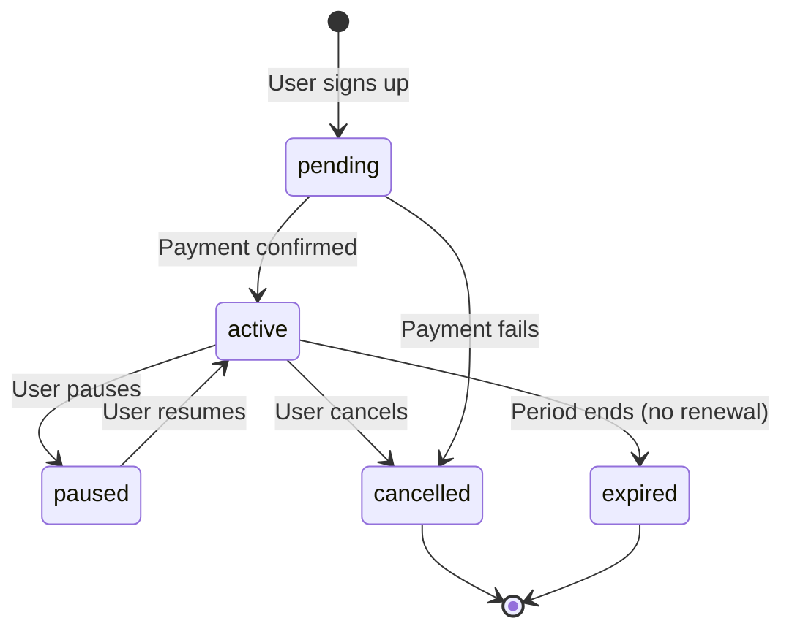

# Présentation approfondie du schéma de paiements et d'abonnements

## Aperçu

Le module de paiement gère le cycle de vie complet de l'abonnement : fournisseurs de paiement, comptes clients, abonnements avec support d'essai, gestion du renouvellement automatique et piste d'audit complète de l'historique des abonnements. Le système prend en charge plusieurs fournisseurs de paiement (Stripe, Solidgate, LemonSqueezy, Polar).

**Fichier source :** `template/lib/db/schema.ts`
**Constantes :** `template/lib/constants/payment.ts`
**Fichier relationnel :** `template/lib/db/migrations/relations.ts`

---

## Tables in This Module

| Table | Purpose |
|---|---|
| `paymentProviders` | Registry of available payment providers |
| `paymentAccounts` | Links users to their payment provider customer IDs |
| `subscriptions` | Active and historical subscription records |
| `subscriptionHistory` | Audit trail of subscription lifecycle events |

---

## Tableau : `paymentProviders`

Registre des prestataires de paiement pris en charge.

### Colonnes

|Colonne|Nom de la base de données|Tapez|Nullable|Par défaut|Contraintes|
|---|---|---|---|---|---|
|`id`|`id`|`text`|Non|`crypto.randomUUID()`|Clé primaire|
|`name`|`name`|`text`|Non|`'stripe'`|Unique|
|`isActive`|`is_active`|`boolean`|Non|`true`| - |
|`createdAt`|`created_at`|`timestamp`|Non|`now()`| - |
|`updatedAt`|`updated_at`|`timestamp`|Non|`now()`| - |

### Index

|Nom|Colonnes|Tapez|
|---|---|---|
|`paymentProviders_name_unique`|`name`|Unique|
|`payment_provider_active_idx`|`isActive`|Arbre B|
|`payment_provider_created_at_idx`|`createdAt`|Arbre B|

### Fournisseurs pris en charge (Enum)

```typescript
export enum PaymentProvider {
    STRIPE = 'stripe',
    SOLIDGATE = 'solidgate',
    LEMONSQUEEZY = 'lemonsqueezy',
    POLAR = 'polar'
}
```

---

## Table: `paymentAccounts`

Links users to their external payment provider customer accounts.

### Columns

| Column | DB Name | Type | Nullable | Default | Constraints |
|---|---|---|---|---|---|
| `id` | `id` | `text` | No | `crypto.randomUUID()` | Primary Key |
| `userId` | `userId` | `text` | No | - | FK -> `users.id` (CASCADE) |
| `providerId` | `providerId` | `text` | No | - | FK -> `paymentProviders.id` (CASCADE) |
| `customerId` | `customerId` | `text` | No | - | External customer ID |
| `accountId` | `accountId` | `text` | Yes | - | Optional account identifier |
| `lastUsed` | `lastUsed` | `timestamp` | Yes | - | - |
| `createdAt` | `created_at` | `timestamp` | No | `now()` | - |
| `updatedAt` | `updated_at` | `timestamp` | No | `now()` | - |

### Indexes

| Name | Columns | Type |
|---|---|---|
| `user_provider_unique_idx` | `(userId, providerId)` | Unique |
| `customer_provider_unique_idx` | `(customerId, providerId)` | Unique |
| `payment_account_customer_id_idx` | `customerId` | B-tree |
| `payment_account_provider_idx` | `providerId` | B-tree |
| `payment_account_created_at_idx` | `createdAt` | B-tree |

### Key Constraints

- **One account per provider per user:** The `user_provider_unique_idx` ensures a user can only have one customer account per payment provider.
- **Unique customer IDs per provider:** The `customer_provider_unique_idx` ensures no duplicate customer IDs within a provider.

---

## Tableau : `subscriptions`

Le tableau d'abonnement de base avec une prise en charge complète des essais, du renouvellement automatique, de l'annulation et de la facturation multi-fournisseurs.

### Colonnes

|Colonne|Nom de la base de données|Tapez|Nullable|Par défaut|Contraintes|
|---|---|---|---|---|---|
|`id`|`id`|`text`|Non|`crypto.randomUUID()`|Clé primaire|
|`userId`|`userId`|`text`|Non| - |FK -> `users.id` (CASCADE)|
|`planId`|`plan_id`|`text`|Non|`'free'`|Identifiant du forfait|
|`status`|`status`|`text`|Non|`'pending'`|Statut de l'abonnement|
|`startDate`|`start_date`|`timestamp`|Non|`now()`| - |
|`endDate`|`end_date`|`timestamp`|Oui| - | - |
|`paymentProvider`|`payment_provider`|`text`|Non|`'stripe'`| - |
|`subscriptionId`|`subscription_id`|`text`|Oui| - |ID d'abonnement externe|
|`invoiceId`|`invoice_id`|`text`|Oui| - |ID de facture externe|
|`amountDue`|`amount_due`|`integer`|Oui| `0` |En centimes|
|`amountPaid`|`amount_paid`|`integer`|Oui| `0` |En centimes|
|`priceId`|`price_id`|`text`|Oui| - |ID de prix externe|
|`customerId`|`customer_id`|`text`|Oui| - |Numéro client externe|
|`currency`|`currency`|`text`|Oui|`'usd'`|Code de devise ISO|
|`amount`|`amount`|`integer`|Oui| `0` |En centimes|
|`interval`|`interval`|`text`|Oui|`'month'`|Intervalle de facturation|
|`intervalCount`|`interval_count`|`integer`|Oui| `1` | - |
|`trialStart`|`trial_start`|`timestamp`|Oui| - | - |
|`trialEnd`|`trial_end`|`timestamp`|Oui| - | - |
|`autoRenewal`|`auto_renewal`|`boolean`|Oui|`true`| - |
|`renewalReminderSent`|`renewal_reminder_sent`|`boolean`|Oui|`false`| - |
|`lastRenewalAttempt`|`last_renewal_attempt`|`timestamp (tz)`|Oui| - | - |
|`failedPaymentCount`|`failed_payment_count`|`integer`|Oui| `0` | - |
|`cancelledAt`|`cancelled_at`|`timestamp`|Oui| - | - |
|`cancelAtPeriodEnd`|`cancel_at_period_end`|`boolean`|Oui|`false`| - |
|`cancelReason`|`cancel_reason`|`text`|Oui| - | - |
|`hostedInvoiceUrl`|`hosted_invoice_url`|`text`|Oui| - | - |
|`invoicePdf`|`invoice_pdf`|`text`|Oui| - | - |
|`metadata`|`metadata`|`text`|Oui| - |Chaîne JSON|
|`createdAt`|`created_at`|`timestamp`|Non|`now()`| - |
|`updatedAt`|`updated_at`|`timestamp`|Non|`now()`| - |

### Index

|Nom|Colonnes|Tapez|
|---|---|---|
|`user_subscription_idx`|`userId`|Arbre B|
|`subscription_status_idx`|`status`|Arbre B|
|`provider_subscription_idx`|`(paymentProvider, subscriptionId)`|Unique|
|`subscription_plan_idx`|`planId`|Arbre B|
|`subscription_created_at_idx`|`createdAt`|Arbre B|

### Vérifier les contraintes

```sql
-- auto_renewal and cancel_at_period_end cannot both be true
CHECK (NOT (auto_renewal AND cancel_at_period_end))
```

### Énumération de statut

```typescript
export const SubscriptionStatus = {
    ACTIVE: 'active',
    CANCELLED: 'cancelled',
    EXPIRED: 'expired',
    PENDING: 'pending',
    PAUSED: 'paused'
} as const;
```

### Énumération du plan

```typescript
export enum PaymentPlan {
    FREE = 'free',
    STANDARD = 'standard',
    PREMIUM = 'premium'
}
```

### Types de scripts dactylographiés

```typescript
export type Subscription = typeof subscriptions.$inferSelect;
export type NewSubscription = typeof subscriptions.$inferInsert;
export type SubscriptionWithUser = Subscription & {
    user: typeof users.$inferSelect;
};
```

---

## Table: `subscriptionHistory`

Immutable audit trail of every subscription lifecycle event.

### Columns

| Column | DB Name | Type | Nullable | Default | Constraints |
|---|---|---|---|---|---|
| `id` | `id` | `text` | No | `crypto.randomUUID()` | Primary Key |
| `subscriptionId` | `subscription_id` | `text` | No | - | FK -> `subscriptions.id` (CASCADE) |
| `action` | `action` | `text` | No | - | Event description |
| `previousStatus` | `previous_status` | `text` | Yes | - | Status before change |
| `newStatus` | `new_status` | `text` | Yes | - | Status after change |
| `previousPlan` | `previous_plan` | `text` | Yes | - | Plan before change |
| `newPlan` | `new_plan` | `text` | Yes | - | Plan after change |
| `reason` | `reason` | `text` | Yes | - | - |
| `metadata` | `metadata` | `text` | Yes | - | JSON string |
| `createdAt` | `created_at` | `timestamp` | No | `now()` | - |

### Indexes

| Name | Columns | Type |
|---|---|---|
| `subscription_history_idx` | `subscriptionId` | B-tree |
| `subscription_action_idx` | `action` | B-tree |
| `subscription_history_created_at_idx` | `createdAt` | B-tree |

### TypeScript Types

```typescript
export type SubscriptionHistory = typeof subscriptionHistory.$inferSelect;
export type NewSubscriptionHistory = typeof subscriptionHistory.$inferInsert;
```

---

## Diagramme des relations



---

## Subscription Lifecycle



---

## Exemples de requête

### Obtenir un abonnement actif pour un utilisateur

```typescript
import { db } from '@/lib/db/drizzle';
import { subscriptions } from '@/lib/db/schema';
import { eq, and } from 'drizzle-orm';

const activeSub = await db
    .select()
    .from(subscriptions)
    .where(
        and(
            eq(subscriptions.userId, userId),
            eq(subscriptions.status, 'active')
        )
    )
    .limit(1);
```

### Créer un nouvel abonnement

```typescript
await db.insert(subscriptions).values({
    userId,
    planId: 'standard',
    status: 'active',
    paymentProvider: 'stripe',
    subscriptionId: stripeSubscription.id,
    customerId: stripeCustomer.id,
    priceId: stripePriceId,
    amount: 1999, // $19.99 in cents
    currency: 'usd',
    interval: 'month',
});
```

### Enregistrer une modification d'abonnement

```typescript
await db.insert(subscriptionHistory).values({
    subscriptionId: sub.id,
    action: 'plan_upgrade',
    previousStatus: 'active',
    newStatus: 'active',
    previousPlan: 'free',
    newPlan: 'standard',
    reason: 'User upgraded via billing page',
});
```

### Trouver un compte de paiement par numéro client Stripe

```typescript
import { paymentAccounts } from '@/lib/db/schema';

const account = await db
    .select()
    .from(paymentAccounts)
    .where(eq(paymentAccounts.customerId, stripeCustomerId))
    .limit(1);
```
