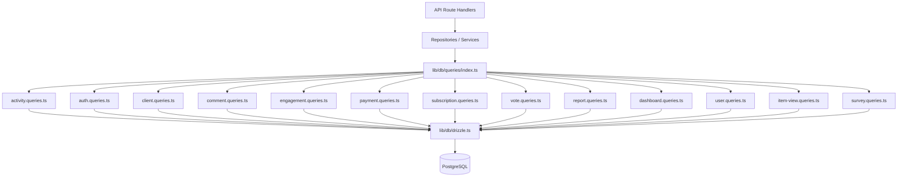

# Système de modèles de requête

Le modèle organise toutes les requêtes de base de données en modules spécifiques au domaine sous `lib/db/queries/`. Chaque module suit le principe de responsabilité unique (SRP), regroupant les opérations associées. Une exportation baril dans `index.ts` fournit un point d'entrée unique pour toutes les fonctions de requête.

## Présentation de l'architecture



## Modules de requête

|Module|Fichier|Objectif|
|--------|------|---------|
|Activité|`activity.queries.ts`|Journalisation des activités et piste d'audit|
|Authentification|`auth.queries.ts`|Jetons de réinitialisation de mot de passe, jetons de vérification|
|Client|`client.queries.ts`|Profil client CRUD, recherche, statistiques|
|Commentaire|`comment.queries.ts`|Commentez CRUD avec les jointures d'utilisateurs|
|Entreprise|`company.queries.ts`|Gestion de l'entreprise et liaison article-entreprise|
|Tableau de bord|`dashboard.queries.ts`|Statistiques du tableau de bord et graphiques d'engagement|
|Fiançailles|`engagement.queries.ts`|Mesures d'engagement agrégées (vues, votes, favoris, commentaires)|
|Cartographie d'intégration|`integration-mapping.queries.ts`|Mappages d'intégration CRM|
|Article|`item.queries.ts`|Normalisation et validation des slugs d'articles|
|Vérification des articles|`item-audit.queries.ts`|Historique des modifications d'articles|
|Vue de l'article|`item-view.queries.ts`|Afficher le suivi avec déduplication|
|Index de localisation|`location-index.queries.ts`|Indexation des éléments géospatiaux|
|Modération|`moderation.queries.ts`|Actions de modération du contenu|
|Bulletin|`newsletter.queries.ts`|Gestion des abonnés à la newsletter|
|Paiement|`payment.queries.ts`|Fournisseur de paiement et gestion de compte|
|Rapport|`report.queries.ts`|Rapports de contenu avec filtrage|
|Abonnement|`subscription.queries.ts`|Gestion du cycle de vie des abonnements|
|Enquête|`survey.queries.ts`|Réponses et analyses à l'enquête|
|Utilisateur|`user.queries.ts`|Vérifications CRUD et administratives des utilisateurs principaux|
|Voter|`vote.queries.ts`|Votez CRUD et calcul du score net|

## Modèles courants

### 1. Modèle de pagination

Toutes les requêtes de liste suivent un modèle de pagination cohérent en utilisant `limit` et `offset` :

```typescript
export async function getClientProfiles(params: {
  page?: number;
  limit?: number;
  search?: string;
  status?: string;
}): Promise<{
  profiles: ClientProfileWithAuth[];
  total: number;
  page: number;
  totalPages: number;
  limit: number;
}> {
  const { page = 1, limit = 10, search, status } = params;
  const offset = (page - 1) * limit;

  // 1. Build WHERE conditions dynamically
  const whereConditions: SQL[] = [];
  if (search) { /* add ILIKE condition */ }
  if (status) { whereConditions.push(eq(clientProfiles.status, status)); }
  const whereClause = whereConditions.length > 0
    ? and(...whereConditions)
    : undefined;

  // 2. Count query for total
  const countResult = await db
    .select({ count: sql<number>`count(distinct ${clientProfiles.id})` })
    .from(clientProfiles)
    .where(whereClause);
  const total = Number(countResult[0]?.count || 0);

  // 3. Data query with limit/offset
  const profiles = await db
    .select({ /* fields */ })
    .from(clientProfiles)
    .where(whereClause)
    .orderBy(desc(clientProfiles.createdAt))
    .limit(limit)
    .offset(offset);

  return {
    profiles,
    total,
    page,
    totalPages: Math.ceil(total / limit),
    limit,
  };
}
```

### 2. Modèle de filtrage dynamique

Les filtres sont accumulés sous forme de tableau de conditions SQL et composés avec `and()` :

```typescript
const whereConditions: SQL[] = [];

if (search) {
  const escapedSearch = search
    .replace(/\\/g, '\\\\')
    .replace(/[%_]/g, '\\$&');
  whereConditions.push(
    sql`(${clientProfiles.name} ILIKE ${`%${escapedSearch}%`} OR
         ${clientProfiles.email} ILIKE ${`%${escapedSearch}%`})`
  );
}

if (status) {
  whereConditions.push(eq(clientProfiles.status, status));
}

if (provider) {
  whereConditions.push(
    sql`exists (
      select 1 from ${accounts}
      where ${accounts.userId} = ${clientProfiles.userId}
        and ${accounts.provider} = ${provider}
    )`
  );
}

const whereClause = whereConditions.length > 0
  ? and(...whereConditions)
  : undefined;
```

### 3. Rejoindre le modèle

La base de code utilise à la fois `innerJoin`/`leftJoin` explicite et des sous-requêtes pour gérer les données associées :

**Jointure interne pour les relations requises :**

```typescript
const result = await db
  .select({
    id: comments.id,
    content: comments.content,
    user: {
      id: clientProfiles.id,
      name: clientProfiles.name,
      email: clientProfiles.email,
      image: clientProfiles.avatar,
    },
  })
  .from(comments)
  .innerJoin(clientProfiles, eq(comments.userId, clientProfiles.id))
  .where(and(eq(comments.itemId, itemId), isNull(comments.deletedAt)))
  .orderBy(desc(comments.createdAt));
```

**Sous-requête pour éviter les lignes en double provenant de plusieurs jointures :**

```typescript
const profiles = await db
  .select({
    id: clientProfiles.id,
    // ... other fields
    accountProvider: sql<string>`coalesce(
      (SELECT provider FROM ${accounts}
       WHERE ${accounts.userId} = ${clientProfiles.userId}
       LIMIT 1),
      'unknown'
    )`,
  })
  .from(clientProfiles);
```

### 4. Modèle d'agrégation

Les fonctions d'agrégation telles que `count`, `SUM` et `AVG` sont utilisées avec `groupBy` :

```typescript
// Net vote score using conditional SUM
const voteCounts = await db
  .select({
    itemId: votes.itemId,
    netScore: sql<number>`
      SUM(CASE
        WHEN vote_type = 'upvote' THEN 1
        WHEN vote_type = 'downvote' THEN -1
        ELSE 0
      END)
    `.as('netScore'),
  })
  .from(votes)
  .where(inArray(votes.itemId, itemSlugs))
  .groupBy(votes.itemId);
```

### 5. Modèle de requête parallèle

Lorsque plusieurs agrégations indépendantes sont nécessaires, les requêtes s'exécutent en parallèle avec `Promise.all` :

```typescript
const [viewsData, votesData, favoritesData, commentsData] =
  await Promise.all([
    db.select({ itemId: itemViews.itemId, count: count() })
      .from(itemViews)
      .where(inArray(itemViews.itemId, itemSlugs))
      .groupBy(itemViews.itemId),

    db.select({ itemId: votes.itemId, netScore: sql`...` })
      .from(votes)
      .where(inArray(votes.itemId, itemSlugs))
      .groupBy(votes.itemId),

    db.select({ itemSlug: favorites.itemSlug, count: count() })
      .from(favorites)
      .where(inArray(favorites.itemSlug, itemSlugs))
      .groupBy(favorites.itemSlug),

    db.select({ itemId: comments.itemId, count: count(), avgRating: sql`...` })
      .from(comments)
      .where(and(inArray(comments.itemId, itemSlugs), isNull(comments.deletedAt)))
      .groupBy(comments.itemId),
  ]);
```

### 6. Modèle d'insertion/résolution de conflits

Utilisé pour la déduplication, notamment dans le suivi des vues :

```typescript
export async function recordItemView(
  view: Pick<NewItemView, 'itemId' | 'viewerId' | 'viewedDateUtc'>
): Promise<boolean> {
  const result = await db
    .insert(itemViews)
    .values(view)
    .onConflictDoNothing()
    .returning({ id: itemViews.id });

  return result.length > 0;
}
```

### 7. Modèle de suppression logicielle

Les enregistrements sont marqués comme supprimés plutôt que physiquement supprimés :

```typescript
export async function deleteComment(id: string) {
  const [comment] = await db
    .update(comments)
    .set({ deletedAt: new Date() })
    .where(eq(comments.id, id))
    .returning();
  return comment;
}

// Querying always filters out soft-deleted records
.where(and(eq(comments.itemId, itemId), isNull(comments.deletedAt)))
```

### 8. Modèle de normalisation des résultats

Les résultats de la requête sont souvent mappés via des objets de recherche `Map` pour un accès O(1) efficace :

```typescript
const viewsMap = new Map<string, number>(
  viewsData.map(v => [v.itemId, Number(v.count)])
);
const votesMap = new Map<string, number>(
  votesData.map(v => [v.itemId, Number(v.netScore ?? 0)])
);

// Combine into final metrics
for (const slug of itemSlugs) {
  metricsMap.set(slug, {
    views: viewsMap.get(slug) ?? 0,
    votes: votesMap.get(slug) ?? 0,
  });
}
```

## Utilitaires partagés

### `lib/db/queries/utils.ts`

Fournit des fonctions d'assistance partagées entre les modules de requête :

- **`extractUsernameFromEmail(email)`** -- Extrait et nettoie un nom d'utilisateur d'une adresse e-mail
- **`ensureUniqueUsername(baseUsername)`** -- Génère un nom d'utilisateur unique en ajoutant des suffixes numériques si nécessaire

### `lib/db/queries/types.ts`

Définit les types partagés utilisés dans les modules de requête :

- **`ClientProfileWithAuth`** -- Profil client combiné aux données du fournisseur d'authentification
- **`ClientStatus`** / **`ClientPlan`** / **`ClientAccountType`** -- Types d'énumération pour le filtrage
- **`CommentWithUser`** -- Données de commentaires enrichies d'informations utilisateur

## Convention d'importation

Toutes les requêtes sont importées via l'export Barrel :

```typescript
import {
  getClientProfiles,
  createVote,
  getEngagementMetricsPerItem,
  getUserActiveSubscription,
} from '@/lib/db/queries';
```
