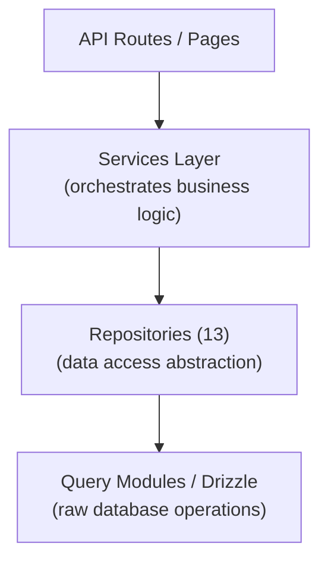

# Modèle de référentiel

Le modèle Ever Works implémente un modèle de référentiel via 13 classes de référentiel spécialisées dans `lib/repositories/`. Les référentiels fournissent une abstraction de niveau supérieur sur les requêtes de base de données brutes, encapsulant une logique de requête complexe, des règles métier et la transformation des données.

## Architecture



## Liste des référentiels

|Référentiel|Fichier|Domaine|
|------------|------|--------|
|Analyses d'administration (optimisées)|`admin-analytics-optimized.repository.ts`|Analyses d'administration avec optimisation des performances|
|Statistiques administratives|`admin-stats.repository.ts`|Statistiques du tableau de bord d'administration|
|Catégorie|`category.repository.ts`|Gestion des catégories|
|Tableau de bord client|`client-dashboard.repository.ts`|Opérations du tableau de bord client|
|Article client|`client-item.repository.ts`|Soumissions d'articles clients|
|Collecte|`collection.repository.ts`|Gestion des collections|
|Cartographie d'intégration|`integration-mapping.repository.ts`|Mappages d'intégration CRM|
|Article|`item.repository.ts`|Opérations sur les articles|
|Rôle|`role.repository.ts`|Gestion des rôles|
|Annonce de sponsor|`sponsor-ad.repository.ts`|Gestion des publicités sponsorisées|
|Étiquette|`tag.repository.ts`|Gestion des balises|
|Vingt configuration CRM|`twenty-crm-config.repository.ts`|Configuration du CRM|
|Utilisateur|`user.repository.ts`|Gestion des utilisateurs|

## Référentiel de contenu basé sur Git (`lib/repository.ts`)

En plus des référentiels de base de données, le modèle comprend un référentiel de contenu basé sur Git à l'adresse `lib/repository.ts`. Cela gère les opérations Git CMS :

- Cloner le référentiel de contenu à partir de l'URL `DATA_REPOSITORY`
- Synchroniser le contenu avec l'amont (pull/push avec détection de conflit)
- Suivez les modifications locales et validez-les
- Protection contre l'expiration du délai d'attente pour les opérations Git (délai d'expiration de 120 secondes)

Celui-ci est distinct des référentiels de bases de données et gère le répertoire `.content/` utilisé par la couche de contenu.

## Détails du référentiel

### admin-analytics-optimisé.repository.ts

Référentiel d'analyse aux performances optimisées pour le tableau de bord d'administration. Utilise des requêtes par lots et des stratégies de mise en cache pour minimiser la charge de la base de données lors de la génération de vues analytiques.

Capacités clés :
- Statistiques de vue agrégées
- Tendances de croissance des utilisateurs
- Résumés d'engagement de contenu
- Analyse des revenus

### admin-stats.repository.ts

Fournit des statistiques de tableau de bord pour le panneau d'administration.

Capacités clés :
- Nombre total d'utilisateurs
- Nombre d'abonnements actifs
- Statistiques de contenu (éléments, commentaires, rapports)
- Résumés des activités récentes

### catégorie.repository.ts

Gère les données de catégorie avec les opérations CRUD et la gestion des relations.

Capacités clés :
- Liste des catégories avec le nombre d'articles
- Parcours de l'arborescence des catégories (parent/enfant)
- Recherche et filtrage de catégories
- Ordre des catégories

### tableau de bord client.repository.ts

Le plus grand référentiel (28 Ko), gérant toutes les données du tableau de bord côté client.

Capacités clés :
- Gestion des soumissions clients
- Analyse des soumissions (vues, votes, commentaires par article)
- Historique des activités des clients
- Statistiques récapitulatives du tableau de bord
- Liste d'articles paginée avec filtres

### élément-client.repository.ts

Gère les éléments du point de vue du client (émetteur).

Capacités clés :
- Création et mises à jour de soumissions d'articles
- Suivi de l'état des articles
- Historique des soumissions
- Filtrage des articles spécifiques au client

### collection.repository.ts

Gestion des collections pour les groupes d'articles sélectionnés.

Capacités clés :
- Opérations CRUD de collecte
- Associations objet-collection
- Ordre et statut de la collecte
- Liste paginée des collections

### intégration-mapping.repository.ts

Persistance du mappage d’intégration CRM.

Capacités clés :
- Créer et mettre à jour les mappages entre les identifiants internes et les identifiants CRM
- Opérations d'insertion en masse
- Recherche par ID interne ou ID CRM
- Suivi de l'horodatage de synchronisation
- Gestion du hachage de version pour la détection des changements

### article.repository.ts

Opérations de données d'élément de base (pour les métadonnées stockées dans la base de données, pas pour le contenu Git).

Capacités clés :
- Gestion des métadonnées des articles
- Recherche d'articles avec plusieurs filtres
- Agrégation de données sur l'engagement des articles
- Gestion des articles en vedette

### rôle.repository.ts

Gestion des rôles pour le système RBAC.

Capacités clés :
- Rôle Opérations CRUD
- Associations rôle-autorisation
- Attributions des rôles d'utilisateur
- Validation des rôles

### sponsor-ad.repository.ts

Gestion du cycle de vie des publicités sponsorisées.

Capacités clés :
- Création et gestion des annonces sponsors
- Transitions de statut (en attente, actif, expiré)
- Filtrage des annonces par statut, utilisateur ou article
- Données d'intégration des paiements
- Gestion des expirations

### tag.repository.ts

Gestion des tags avec associations d'articles.

Capacités clés :
- Marquer les opérations CRUD
- Recherche de balises et saisie semi-automatique
- Statistiques d'utilisation des balises
- Associations article-étiquette

### vingt-crm-config.repository.ts

Gestion de vingt configurations singleton CRM.

Capacités clés :
- Obtenir/mettre à jour la configuration CRM
- Activer/désactiver l'intégration CRM
- Gestion du mode synchronisation
- Gestion des clés API

### utilisateur.repository.ts

Gestion des comptes utilisateurs.

Capacités clés :
- Opérations de profil utilisateur
- Recherche et filtrage des utilisateurs
- Gestion du statut du compte
- Suppression d'un utilisateur (suppression logicielle)

## Modèle d'utilisation

Les référentiels sont importés et utilisés directement dans les routes API, les services et les composants serveur :

```typescript
import { clientDashboardRepository } from '@/lib/repositories/client-dashboard.repository';

// In an API route
export async function GET(request: NextRequest) {
  const session = await auth();
  const dashboard = await clientDashboardRepository.getDashboardStats(session.user.id);
  return NextResponse.json({ success: true, data: dashboard });
}
```

```typescript
import { itemRepository } from '@/lib/repositories/item.repository';

// In a server component
export default async function ItemPage({ params }) {
  const item = await itemRepository.findBySlug(params.slug);
  return <ItemDetail item={item} />;
}
```

## Référentiel vs modules de requête

|Aspect|Modules de requête (`lib/db/queries/`)|Dépôts (`lib/repositories/`)|
|--------|-----------------------------------|-------------------------------------|
|Complexité|Requêtes simples et ciblées|Opérations multi-tables complexes|
|Logique métier|Aucun (accès pur aux données)|Comprend des règles de validation et de gestion|
|Transformation des données|Résultats bruts de la base de données|Données transformées/enrichies|
|Cas d'utilisation|Opérations directes de base de données|Accès aux données au niveau des fonctionnalités|
|Consommateur type|Autres modules de requêtes, itinéraires simples|Services, routes API, composants serveur|

Les deux couches utilisent Drizzle ORM et importent la connexion à la base de données depuis `lib/db/drizzle.ts`. Le choix entre eux dépend de la complexité de l’opération : les lectures simples utilisent directement les modules de requêtes, tandis que les fonctionnalités complexes passent par des référentiels.
