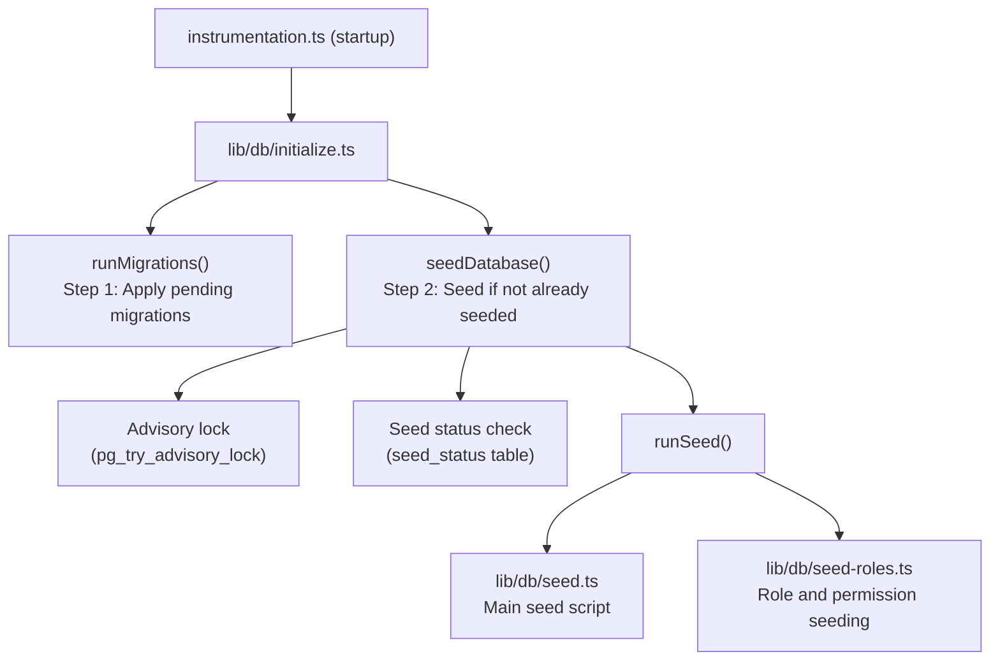

# Amorçage de base de données

Le modèle Ever Works comprend un système d'amorçage de base de données complet qui initialise les données essentielles (rôles, autorisations, fournisseurs de paiement) et génère éventuellement des données de démonstration pour le développement et les tests.

## Architecture des semences



## Scripts de départ

### Script de départ principal (`lib/db/seed.ts`)

Le script de départ principal gère toutes les initialisations de la base de données. Il fonctionne selon deux modes :

**Mode de production** : génère uniquement les données essentielles nécessaires au fonctionnement de l'application :
- Rôles d'administrateur et de client
- Autorisations système
- Fournisseurs de paiement par défaut
- Enregistrements système requis

**Mode démo** : génère en outre des données de test complètes pour le développement :
- Exemples d'utilisateurs avec différents rôles
- Exemples de profils clients
- Exemples d'abonnements
- Commentaires, votes et favoris de la démo
- Notifications de tests
- Entrées du journal d'activité

Le mode démo est activé lorsque la variable d'environnement `DEMO_MODE` est définie.

Principales caractéristiques :
- **Idempotence par table** : chaque table est vérifiée avant l'amorçage ; seules les tables vides sont remplies
- **Vérifications de l'existence des tables** : vérifie que les tables existent avant de tenter une insertion
- **Utilise `drizzle-seed`** : exploite la bibliothèque officielle de semis Drizzle pour la génération de données structurées
- **Sûr pour les réexécutions** : peut être appelé plusieurs fois sans dupliquer les données

```typescript
// Simplified seed flow
export async function runSeed(): Promise<void> {
  await ensureDb();
  const isDemo = isDemoMode();

  if (isDemo) {
    // Seed comprehensive test data
  } else {
    // Seed minimal essential data only
  }

  // Seed roles (always)
  if (await isTableEmpty('roles', roles)) {
    await seedRoles();
  }

  // Seed permissions (always)
  if (await isTableEmpty('permissions', permissions)) {
    await seedPermissions();
  }

  // Seed payment providers (always)
  if (await isTableEmpty('paymentProviders', paymentProviders)) {
    await seedPaymentProviders();
  }

  // Demo-only: seed users, profiles, subscriptions, etc.
  if (isDemo) {
    await seedDemoData();
  }
}
```

### Classement des rôles (`lib/db/seed-roles.ts`)

Un script dédié pour amorcer le système RBAC, qui peut également être exécuté indépendamment.

**`seedPermissions()`** crée l'ensemble d'autorisations initial :

|Clé d'autorisation|Descriptif|
|---------------|-------------|
|`read:own`|Peut lire ses propres données|
|`write:own`|Peut écrire ses propres données|
|`admin:all`|Accès administratif complet|
|`client:manage`|Peut gérer des opérations spécifiques au client|
|`user:read`|Peut lire les données utilisateur|
|`user:write`|Peut écrire des données utilisateur|

Utilise `onConflictDoUpdate` pour mettre à jour en toute sécurité les autorisations existantes sans échouer lors des réexécutions.

**`linkRolesToPermissions()`** crée des associations rôle-autorisation :

- **Rôle d'administrateur** : obtient TOUTES les autorisations
- **Rôle client** : obtient `read:own`, `write:own` et `client:manage`

La fonction valide que les rôles requis (administrateur, client) existent et sont actifs avant de créer des associations.

**`seedRolesAndPermissions()`** orchestre les deux opérations au sein d'une transaction de base de données :

```typescript
export async function seedRolesAndPermissions() {
  await db.transaction(async () => {
    await seedPermissions();
    await linkRolesToPermissions();
  });
}
```

Peut être exécuté de manière autonome :
```bash
# Run directly (if configured as a script)
npx tsx lib/db/seed-roles.ts
```

## Système d'initialisation (`lib/db/initialize.ts`)

Le système d'initialisation gère la séquence de démarrage complète avec protection contre la concurrence.

### Suivi de l'état des semences

Une table `seed_status` suit l'état d'amorçage :

|Statut|Signification|
|--------|---------|
|`seeding`|Opération de semis en cours|
|`completed`|Semence terminée avec succès|
|`failed`|Échec de la graine (erreur stockée)|

### Protection de la concurrence

Dans les déploiements multi-processus (par exemple, plusieurs fonctions sans serveur Vercel démarrant simultanément), le système empêche l'amorçage en double en utilisant :

1. **Verrous consultatifs PostgreSQL** : `pg_try_advisory_lock(12345)` fournit un verrou non bloquant. Un seul processus peut l'acquérir.
2. **Tableau d'état des semences** : d'autres processus vérifient la table `seed_status` et attendent la fin.
3. **Détection obsolète** : si un statut `seeding` date de plus de 5 minutes, il est traité comme obsolète et nettoyé.
4. **Délai d'attente** : les processus en attente de la fin d'une autre instance expireront après 60 secondes.

### Flux d'initialisation

```
initializeDatabase()
│
├── DATABASE_URL not set? → Silent skip (DB is optional)
│
├── Step 1: Run migrations (always, idempotent)
│   └── Failure? → Error in production, warning in dev/preview
│
├── Step 2: Check if already seeded
│   └── seed_status = 'completed'? → Done
│
├── Step 3: Handle edge cases
│   ├── Previous seed failed? → Delete failed status, retry
│   ├── Stale seeding (>5min)? → Clean up, retry
│   └── Another instance seeding? → Wait for completion
│
├── Step 4: Acquire advisory lock
│   └── Lock not available? → Wait for other instance
│
├── Step 5: Double-check (another instance may have finished)
│
├── Step 6: Run seed
│   ├── Create seed_status record ('seeding')
│   ├── Execute runSeed()
│   └── Update seed_status ('completed' or 'failed')
│
└── Step 7: Release advisory lock (always, in finally block)
```

## Exécuter les graines manuellement

### Semence standard

```bash
pnpm db:seed
```

### Scripts de départ individuels

```bash
# Seed roles and permissions only
npx tsx lib/db/seed-roles.ts
```

### Mode démo

Pour générer des données de démonstration, définissez la variable d'environnement `DEMO_MODE` :

```bash
DEMO_MODE=true pnpm db:seed
```

## Variables d'environnement

|Variable|Par défaut|Descriptif|
|----------|---------|-------------|
|`DATABASE_URL`| - |Chaîne de connexion PostgreSQL (obligatoire pour l'amorçage)|
|`DEMO_MODE`|`false`|Activer l'amorçage des données de démonstration|

## Résumé des données sur les semences

### Toujours semé (mode production)

|Tableau|Données|
|-------|------|
|`roles`|Rôles d'administrateur et de client|
|`permissions`|Définitions des autorisations système|
|`rolePermissions`|Associations rôle-autorisation|
|`paymentProviders`|Rayure, LemonSqueezy, Polar, Solidgate|

### Mode démo uniquement

|Tableau|Données|
|-------|------|
|`users`|Exemples d'utilisateurs administrateurs et clients|
|`accounts`|Comptes d'authentification pour les exemples d'utilisateurs|
|`clientProfiles`|Des profils clients aux statuts variés|
|`subscriptions`|Exemples d'abonnements pour tous les forfaits|
|`comments`|Exemple de commentaires sur un élément|
|`votes`|Exemples de votes|
|`favorites`|Exemples de favoris|
|`notifications`|Exemples de notifications d'administrateur|
|`activityLogs`|Exemple d'historique d'activité|

## Meilleures pratiques

1. **Ne jamais exécuter de seed en production avec DEMO_MODE** : les données de démonstration ne doivent être utilisées qu'en développement et en préparation.
2. **Vérifiez l'état de la graine avant de réamorcer manuellement** : interrogez la table `seed_status` pour comprendre l'état actuel.
3. **Utiliser des transactions** : le rôle d'amorçage utilise des transactions pour garantir la cohérence
4. **Conception idempotente** : vérifiez toujours si les données existent avant de les insérer pour prendre en charge les réexécutions en toute sécurité
5. **Verrous consultatifs** : le système de verrouillage consultatif évite les problèmes dans les environnements sans serveur où plusieurs instances peuvent démarrer simultanément.
