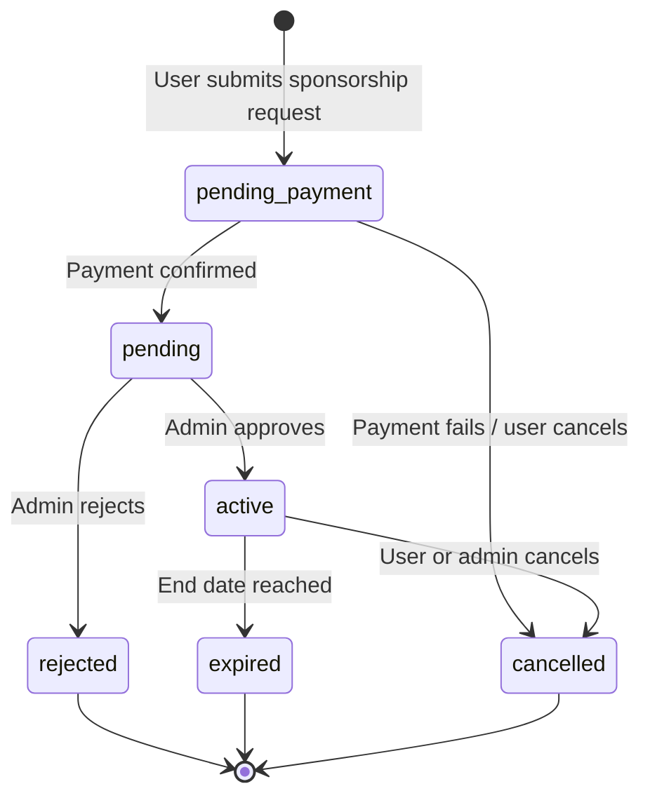
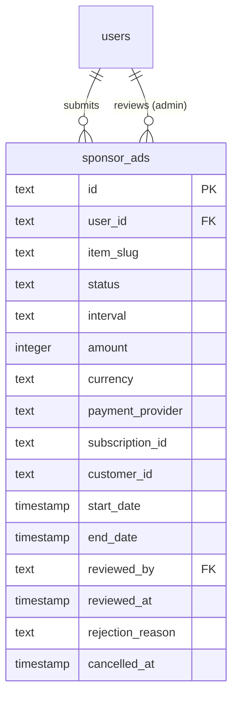

# Présentation approfondie du schéma des publicités sponsorisées

## Aperçu

Le module de publicités sponsorisées permet aux utilisateurs de payer pour le placement promu d'articles sur le site. Il met en œuvre un cycle de vie complet : soumission, paiement, examen par l'administrateur, affichage actif et expiration/annulation. Le système s'intègre à l'infrastructure du fournisseur de paiement et prend en charge les intervalles de parrainage hebdomadaires et mensuels.

**Fichier source :** `template/lib/db/schema.ts`

---

## Table: `sponsor_ads`

### Columns

| Column | DB Name | Type | Nullable | Default | Constraints |
|---|---|---|---|---|---|
| `id` | `id` | `text` | No | `crypto.randomUUID()` | Primary Key |
| **User/Submitter** | | | | | |
| `userId` | `user_id` | `text` | No | - | FK -> `users.id` (CASCADE) |
| **Item** | | | | | |
| `itemSlug` | `item_slug` | `text` | No | - | Item being sponsored |
| **Sponsorship Details** | | | | | |
| `status` | `status` | `text (enum)` | No | `'pending_payment'` | See status enum |
| `interval` | `interval` | `text (enum)` | No | - | `weekly`, `monthly` |
| **Pricing** | | | | | |
| `amount` | `amount` | `integer` | No | - | In dollars |
| `currency` | `currency` | `text` | No | `'usd'` | ISO currency code |
| **Payment** | | | | | |
| `paymentProvider` | `payment_provider` | `text` | No | - | Provider name |
| `subscriptionId` | `subscription_id` | `text` | Yes | - | External subscription ID |
| `customerId` | `customer_id` | `text` | Yes | - | External customer ID |
| **Subscription Period** | | | | | |
| `startDate` | `start_date` | `timestamp` | Yes | - | - |
| `endDate` | `end_date` | `timestamp` | Yes | - | - |
| **Admin Review** | | | | | |
| `reviewedBy` | `reviewed_by` | `text` | Yes | - | FK -> `users.id` (SET NULL) |
| `reviewedAt` | `reviewed_at` | `timestamp` | Yes | - | - |
| `rejectionReason` | `rejection_reason` | `text` | Yes | - | - |
| **Cancellation** | | | | | |
| `cancelledAt` | `cancelled_at` | `timestamp` | Yes | - | - |
| `cancelReason` | `cancel_reason` | `text` | Yes | - | - |
| **Timestamps** | | | | | |
| `createdAt` | `created_at` | `timestamp` | No | `now()` | - |
| `updatedAt` | `updated_at` | `timestamp` | No | `now()` | - |

### Foreign Keys

| Column | References | On Delete |
|---|---|---|
| `user_id` | `users.id` | CASCADE |
| `reviewed_by` | `users.id` | SET NULL |

### Indexes

| Name | Columns | Type |
|---|---|---|
| `sponsor_ads_user_id_idx` | `userId` | B-tree |
| `sponsor_ads_item_slug_idx` | `itemSlug` | B-tree |
| `sponsor_ads_status_idx` | `status` | B-tree |
| `sponsor_ads_interval_idx` | `interval` | B-tree |
| `sponsor_ads_provider_subscription_idx` | `(paymentProvider, subscriptionId)` | Unique |
| `sponsor_ads_start_date_idx` | `startDate` | B-tree |
| `sponsor_ads_end_date_idx` | `endDate` | B-tree |
| `sponsor_ads_created_at_idx` | `createdAt` | B-tree |

---

## Énumération de statut

```typescript
export const SponsorAdStatus = {
    PENDING_PAYMENT: 'pending_payment', // User submitted, waiting for payment
    PENDING: 'pending',                 // User paid, waiting for admin review
    REJECTED: 'rejected',               // Admin rejected
    ACTIVE: 'active',                   // Admin approved, displaying on site
    EXPIRED: 'expired',                 // Subscription period ended
    CANCELLED: 'cancelled'              // Cancelled by user or admin
} as const;

export type SponsorAdStatusValues =
    (typeof SponsorAdStatus)[keyof typeof SponsorAdStatus];
```

## Énumération d'intervalle

```typescript
export const SponsorAdInterval = {
    WEEKLY: 'weekly',
    MONTHLY: 'monthly'
} as const;

export type SponsorAdIntervalValues =
    (typeof SponsorAdInterval)[keyof typeof SponsorAdInterval];
```

---

## TypeScript Types

```typescript
export type SponsorAd = typeof sponsorAds.$inferSelect;
export type NewSponsorAd = typeof sponsorAds.$inferInsert;
```

---

## Flux de travail de statut



---

## Relations Diagram



---

## Décisions de conception clés

### Deux clés étrangères vers `users`

La table comporte deux références à la table `users` :
1. **`userId` (CASCADE) :** L'utilisateur qui a soumis et payé le parrainage. La suppression de l'utilisateur supprime toutes ses annonces de sponsor.
2. **`reviewedBy` (SET NULL) :** L'administrateur qui a approuvé/rejeté. Si l'administrateur est supprimé, l'enregistrement de révision est conservé avec un réviseur nul.

### Intégration des paiements externes

La combinaison `paymentProvider` + `subscriptionId` possède un index unique, reflétant le modèle de la table `subscriptions`. Cela permet de rechercher des annonces de sponsors par leur référence d'abonnement externe pendant le traitement du webhook.

### Montant en dollars

Contrairement à la table `subscriptions` qui stocke les montants en cents, la colonne `sponsor_ads.amount` stocke les valeurs en dollars entiers. Soyez conscient de cette différence lors de l’intégration avec les fournisseurs de paiement.

---

## Query Examples

### Create a sponsor ad request

```typescript
import { db } from '@/lib/db/drizzle';
import { sponsorAds, SponsorAdStatus } from '@/lib/db/schema';

await db.insert(sponsorAds).values({
    userId,
    itemSlug: 'my-tool-slug',
    status: SponsorAdStatus.PENDING_PAYMENT,
    interval: 'monthly',
    amount: 49,
    currency: 'usd',
    paymentProvider: 'stripe',
});
```

### Confirm payment (update status)

```typescript
await db
    .update(sponsorAds)
    .set({
        status: SponsorAdStatus.PENDING,
        subscriptionId: stripeSubscription.id,
        customerId: stripeCustomer.id,
        updatedAt: new Date(),
    })
    .where(eq(sponsorAds.id, sponsorAdId));
```

### Admin approves a sponsor ad

```typescript
await db
    .update(sponsorAds)
    .set({
        status: SponsorAdStatus.ACTIVE,
        reviewedBy: adminUserId,
        reviewedAt: new Date(),
        startDate: new Date(),
        endDate: new Date(Date.now() + 30 * 24 * 60 * 60 * 1000), // 30 days
        updatedAt: new Date(),
    })
    .where(eq(sponsorAds.id, sponsorAdId));
```

### Admin rejects a sponsor ad

```typescript
await db
    .update(sponsorAds)
    .set({
        status: SponsorAdStatus.REJECTED,
        reviewedBy: adminUserId,
        reviewedAt: new Date(),
        rejectionReason: 'Content does not meet advertising guidelines.',
        updatedAt: new Date(),
    })
    .where(eq(sponsorAds.id, sponsorAdId));
```

### Get active sponsor ads for display

```typescript
import { and, eq, lte, gte } from 'drizzle-orm';

const now = new Date();
const activeAds = await db
    .select()
    .from(sponsorAds)
    .where(
        and(
            eq(sponsorAds.status, SponsorAdStatus.ACTIVE),
            lte(sponsorAds.startDate, now),
            gte(sponsorAds.endDate, now)
        )
    );
```

### Find sponsor ad by Stripe subscription ID

```typescript
const ad = await db
    .select()
    .from(sponsorAds)
    .where(
        and(
            eq(sponsorAds.paymentProvider, 'stripe'),
            eq(sponsorAds.subscriptionId, stripeSubscriptionId)
        )
    )
    .limit(1);
```

### Get pending reviews for admin dashboard

```typescript
const pendingReviews = await db
    .select()
    .from(sponsorAds)
    .where(eq(sponsorAds.status, SponsorAdStatus.PENDING))
    .orderBy(asc(sponsorAds.createdAt));
```

### Expire sponsor ads past their end date

```typescript
await db
    .update(sponsorAds)
    .set({
        status: SponsorAdStatus.EXPIRED,
        updatedAt: new Date(),
    })
    .where(
        and(
            eq(sponsorAds.status, SponsorAdStatus.ACTIVE),
            lte(sponsorAds.endDate, new Date())
        )
    );
```

---

## Notes de conception

- **Identification de l'élément par slug.** Comme toutes les tables de référencement d'éléments, `itemSlug` stocke le slug de contenu de l'élément, et non une clé étrangère de base de données.
- **Index unique de fournisseur et d'abonnement.** Garantit l'absence d'enregistrements d'abonnement en double et permet des recherches rapides de webhooks.
- ** Transitions de statut douces. ** Les changements de statut sont suivis via la colonne de statut elle-même. Pour une piste d'audit complète, envisagez de l'associer à la table `activityLogs`.
- **Expiration manuelle.** Il n'existe pas de mécanisme d'expiration automatique au niveau de la base de données. Une tâche cron ou un gestionnaire de webhook doit vérifier périodiquement et faire expirer les annonces de sponsors en retard.
