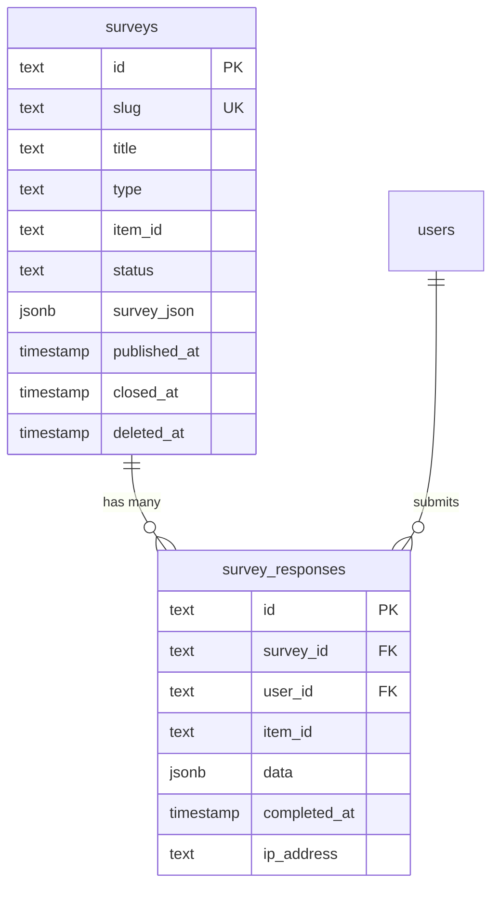
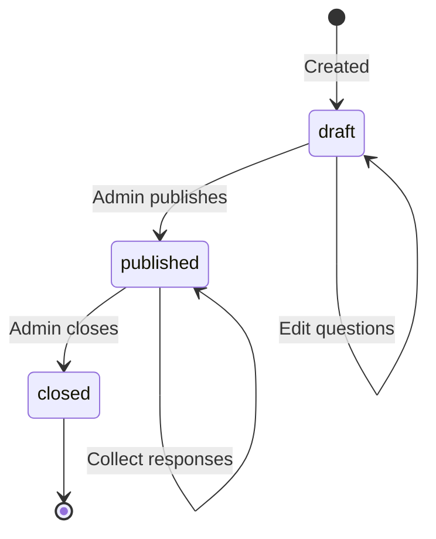

# Analyse approfondie du schéma d'enquête

## Aperçu

Le module d'enquêtes fournit un système d'enquête flexible avec deux types de tableaux : `surveys` pour les définitions d'enquête et `survey_responses` pour les réponses collectées. Les enquêtes peuvent être soit globales (à l’échelle du site), soit spécifiques à un élément. La structure de l'enquête est stockée sous forme de blob JSON (`surveyJson`) à l'aide du type de colonne JSONB, permettant des schémas de questions dynamiques sans modélisation de base de données rigide.

**Fichier source :** `template/lib/db/schema.ts`

---

## Table: `surveys`

Stores survey definitions with their question structure in a JSON column.

### Columns

| Column | DB Name | Type | Nullable | Default | Constraints |
|---|---|---|---|---|---|
| `id` | `id` | `text` | No | `crypto.randomUUID()` | Primary Key |
| `slug` | `slug` | `text` | No | - | Unique |
| `title` | `title` | `text` | No | - | - |
| `description` | `description` | `text` | Yes | - | - |
| `type` | `type` | `text (enum)` | No | - | `global`, `item` |
| `itemId` | `item_id` | `text` | Yes | - | Item slug (for item surveys) |
| `status` | `status` | `text (enum)` | No | `'draft'` | `draft`, `published`, `closed` |
| `surveyJson` | `survey_json` | `jsonb` | No | - | Full survey structure |
| `createdAt` | `created_at` | `timestamp (tz)` | No | `now()` | - |
| `updatedAt` | `updated_at` | `timestamp (tz)` | No | `now()` | - |
| `publishedAt` | `published_at` | `timestamp (tz)` | Yes | - | - |
| `closedAt` | `closed_at` | `timestamp (tz)` | Yes | - | - |
| `deletedAt` | `deleted_at` | `timestamp (tz)` | Yes | - | Soft delete |

### Indexes

| Name | Columns | Type |
|---|---|---|
| `surveys_slug_idx` | `slug` | B-tree |
| `surveys_type_idx` | `type` | B-tree |
| `surveys_item_id_idx` | `itemId` | B-tree |
| `surveys_status_idx` | `status` | B-tree |
| `surveys_created_at_idx` | `createdAt` | B-tree |

### Survey Type Enum

| Value | Description |
|---|---|
| `global` | Site-wide survey visible to all users |
| `item` | Survey attached to a specific item (referenced by `itemId`) |

### Survey Status Enum

| Value | Description |
|---|---|
| `draft` | Not yet published, only visible to admins |
| `published` | Live and accepting responses |
| `closed` | No longer accepting responses |

---

## Tableau : `survey_responses`

Stocke les réponses des utilisateurs individuels aux enquêtes. Les données de réponse sont stockées sous forme de blob JSONB.

### Colonnes

|Colonne|Nom de la base de données|Tapez|Nullable|Par défaut|Contraintes|
|---|---|---|---|---|---|
|`id`|`id`|`text`|Non|`crypto.randomUUID()`|Clé primaire|
|`surveyId`|`survey_id`|`text`|Non| - |FK -> `surveys.id` (RESTRICTE)|
|`userId`|`user_id`|`text`|Oui| - |FK -> `users.id` (SET NULL)|
|`itemId`|`item_id`|`text`|Oui| - |Slug de contexte d'élément|
|`data`|`data`|`jsonb`|Non| - |Réponses|
|`completedAt`|`completed_at`|`timestamp (tz)`|Non| - |Lorsque l'utilisateur a terminé|
|`ipAddress`|`ip_address`|`text`|Oui| - |IP de l'émetteur|
|`userAgent`|`user_agent`|`text`|Oui| - |Agent utilisateur du navigateur|
|`createdAt`|`created_at`|`timestamp (tz)`|Non|`now()`| - |
|`updatedAt`|`updated_at`|`timestamp (tz)`|Non|`now()`| - |

### Clés étrangères

|Colonne|Références|Lors de la suppression|
|---|---|---|
|`surveyId`|`surveys.id`|RESTREINDRE|
|`userId`|`users.id`|FIXER NULL|

:::info SUPPRIMER le comportement
La clé étrangère `surveyId` utilise `RESTRICT` (et non `CASCADE`), ce qui signifie qu'une enquête ne peut pas être supprimée tant qu'elle contient des réponses. Cela protège les données de réponse contre toute perte accidentelle. Utilisez plutôt la suppression réversible (`deletedAt`) sur l'enquête.

La clé étrangère `userId` utilise `SET NULL`, préservant les données de réponse anonymes même lorsqu'un compte utilisateur est supprimé.
:::

### Index

|Nom|Colonnes|Tapez|
|---|---|---|
|`survey_responses_survey_id_idx`|`surveyId`|Arbre B|
|`survey_responses_user_id_idx`|`userId`|Arbre B|
|`survey_responses_item_id_idx`|`itemId`|Arbre B|
|`survey_responses_completed_at_idx`|`completedAt`|Arbre B|

---

## TypeScript Types

```typescript
export type Survey = typeof surveys.$inferSelect;

export type SurveyItem = Survey & {
    responseCount?: number;
    isCompletedByUser?: boolean;
};

export type NewSurvey = typeof surveys.$inferInsert;
export type SurveyResponse = typeof surveyResponses.$inferSelect;
export type NewSurveyResponse = typeof surveyResponses.$inferInsert;
```

---

## Diagramme des relations



---

## Survey Lifecycle



---

## La colonne `surveyJson`

La colonne `surveyJson` JSONB stocke la définition complète de l'enquête. Il s'agit d'un schéma flexible qui peut représenter différents types de questions :

```typescript
// Example surveyJson structure
{
  "pages": [
    {
      "name": "page1",
      "elements": [
        {
          "type": "rating",
          "name": "satisfaction",
          "title": "How satisfied are you?",
          "rateMin": 1,
          "rateMax": 5
        },
        {
          "type": "text",
          "name": "feedback",
          "title": "Any additional feedback?"
        },
        {
          "type": "radiogroup",
          "name": "recommend",
          "title": "Would you recommend this?",
          "choices": ["Yes", "No", "Maybe"]
        }
      ]
    }
  ]
}
```

---

## Query Examples

### Create a survey

```typescript
import { db } from '@/lib/db/drizzle';
import { surveys } from '@/lib/db/schema';

await db.insert(surveys).values({
    slug: 'user-satisfaction-2025',
    title: 'Enquête de satisfaction des utilisateurs 2025',
    description: 'Help us improve our platform',
    type: 'global',
    status: 'draft',
    surveyJson: {
        pages: [{
            name: 'page1',
            elements: [
                { type: 'rating', name: 'overall', title: 'Overall satisfaction' }
            ]
        }]
    },
});
```

### Publish a survey

```typescript
await db
    .update(surveys)
    .set({
        status: 'published',
        publishedAt: new Date(),
        updatedAt: new Date(),
    })
    .where(eq(surveys.id, surveyId));
```

### Submit a response

```typescript
import { surveyResponses } from '@/lib/db/schema';

await db.insert(surveyResponses).values({
    surveyId,
    userId,
    itemId: 'specific-item-slug', // Optional, for item-type surveys
    data: {
        overall: 4,
        feedback: 'Great platform, minor UI issues',
        recommend: 'Yes',
    },
    completedAt: new Date(),
    ipAddress: request.headers.get('x-forwarded-for'),
    userAgent: request.headers.get('user-agent'),
});
```

### Get surveys with response counts

```typescript
import { sql } from 'drizzle-orm';

const surveysWithCounts = await db
    .select({
        id: surveys.id,
        title: enquêtes.titre,
        status: surveys.status,
        responseCount: sql<number>`(
            SELECT count(*) FROM survey_responses
            WHERE survey_responses.survey_id = surveys.id
        )`,
    })
    .from(surveys)
    .where(isNull(surveys.deletedAt))
    .orderBy(desc(surveys.createdAt));
```

### Check if user completed a survey

```typescript
const completed = await db
    .select({ id: surveyResponses.id })
    .from(surveyResponses)
    .where(
        and(
            eq(surveyResponses.surveyId, surveyId),
            eq(surveyResponses.userId, userId)
        )
    )
    .limit(1);

const hasCompleted = completed.length > 0;
```

### Get published surveys for an item

```typescript
const itemSurveys = await db
    .select()
    .from(surveys)
    .where(
        and(
            eq(surveys.type, 'item'),
            eq(surveys.itemId, 'my-item-slug'),
            eq(surveys.status, 'published'),
            isNull(surveys.deletedAt)
        )
    );
```

---

## Notes de conception

- **JSONB pour la flexibilité.** L'utilisation de `surveyJson` et `data` comme colonnes JSONB permet au système d'enquête de prendre en charge tout type de question sans migration de schéma. Le compromis est une sécurité de type moins stricte au niveau de la base de données.
- **RESTRICT lors de la suppression.** Les enquêtes avec réponses ne peuvent pas être supprimées définitivement. Utilisez plutôt la colonne de suppression logicielle `deletedAt`.
- **Réponses anonymes prises en charge.** Le `userId` sur `survey_responses` est nullable et utilise `SET NULL` lors de la suppression, permettant des soumissions d'enquêtes authentifiées et anonymes.
- **Contexte de l'élément.** Le champ `itemId` des deux tables permet des enquêtes spécifiques à un élément (par exemple, « Évaluer cet outil ») tout en gardant le schéma suffisamment générique pour les enquêtes mondiales.
