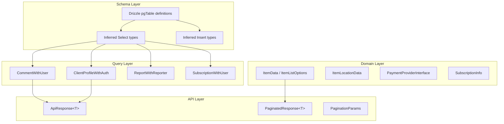

# Système de saisie TypeScript

Le modèle utilise un système de types en couches qui couvre les types au niveau du schéma (auto-déduits de Drizzle), les types de domaine pour la logique métier et les types d'API pour les contrats de demande/réponse.

## Emplacements des types

|Annuaire|Objectif|
|-----------|---------|
|`lib/db/schema.ts`|Définitions de table de bruine et types d'insertion/sélection déduits|
|`lib/db/queries/types.ts`|Types composites au niveau de la requête (jointures, enregistrements enrichis)|
|`lib/types/`|Types de domaines pour les articles, les clients, les commentaires, les catégories, etc.|
|`lib/api/types.ts`|Types de clients API et contrats de réponse|
|`lib/payment/types/`|Interfaces des fournisseurs de paiement et types de paiement|
|`types/`|Augmentations globales (`next-auth.d.ts`) et types d'interface utilisateur partagée|

## Types déduits par schéma

Drizzle ORM déduit automatiquement les types TypeScript à partir des définitions de table à l'aide des utilitaires `$inferSelect` et `$inferInsert`. Ceux-ci sont exportés directement depuis `lib/db/schema.ts` :

```typescript
// From lib/db/schema.ts
export const users = pgTable('users', {
  id: text('id').primaryKey().$defaultFn(() => crypto.randomUUID()),
  email: text('email').unique(),
  image: text('image'),
  emailVerified: timestamp('emailVerified', { mode: 'date' }),
  passwordHash: text('password_hash'),
  createdAt: timestamp('created_at').notNull().defaultNow(),
  updatedAt: timestamp('updated_at').notNull().defaultNow(),
  deletedAt: timestamp('deleted_at'),
});

// Inferred types
export type User = typeof users.$inferSelect;
export type NewUser = typeof users.$inferInsert;
```

### Types de schémas de base

|Tableau|Sélectionnez le type|Type d'insertion|Champs clés|
|-------|------------|-------------|------------|
|`users`|`User`|`NewUser`|`id`, `email`, `passwordHash`, `createdAt`|
|`accounts`|`Account`| -- |`userId`, `provider`, `providerAccountId`|
|`clientProfiles`|`ClientProfile`|`NewClientProfile`|`userId`, `email`, `name`, `username`, `plan`, `status`|
|`roles`|`Role`| -- |`id`, `name`, `isAdmin`, `status`|
|`permissions`|`Permission`| -- |`id`, `key`, `description`|
|`subscriptions`|`Subscription`|`NewSubscription`|`userId`, `planId`, `status`, `startDate`, `endDate`|
|`subscriptionHistory`|`SubscriptionHistory`|`NewSubscriptionHistory`|`subscriptionId`, `action`, `previousStatus`|
|`votes`|`Vote`|`InsertVote`|`userId`, `itemId`, `voteType`|
|`comments`|`Comment`|`NewComment`|`userId`, `itemId`, `content`, `rating`|
|`favorites`|`Favorite`| -- |`userId`, `itemSlug`|
|`itemViews`|`ItemView`|`NewItemView`|`itemId`, `viewerId`, `viewedDateUtc`|
|`reports`|`Report`|`NewReport`|`contentType`, `contentId`, `reason`, `status`|
|`paymentProviders`|`OldPaymentProvider`|`NewPaymentProvider`|`name`, `isActive`|
|`paymentAccounts`|`PaymentAccount`|`NewPaymentAccount`|`userId`, `providerId`, `customerId`|
|`notifications`|`Notification`| -- |`userId`, `type`, `title`, `read`|

## Types composites de requête

Trouvés dans `lib/db/queries/types.ts`, ces types représentent des données jointes ou enrichies :

```typescript
// Client profile with authentication metadata
export type ClientProfileWithAuth = ClientProfile & {
  accountProvider: string;
  isActive: boolean;
};

// Enum types used in filtering
export type ClientStatus = "active" | "inactive" | "suspended" | "trial";
export type ClientPlan = "free" | "standard" | "premium";
export type ClientAccountType = "individual" | "business" | "enterprise";

// Comment enriched with user info from a join
export type CommentWithUser = {
  id: string;
  content: string;
  rating: number | null;
  userId: string;
  itemId: string;
  createdAt: Date;
  updatedAt: Date;
  editedAt: Date | null;
  deletedAt: Date | null;
  user: {
    id: string;
    name: string | null;
    email: string | null;
    image: string | null;
  };
};
```

## Types de domaines

### Types d'éléments (`lib/types/item.ts`)

```typescript
export interface ItemData {
  id: string;
  name: string;
  slug: string;
  description: string;
  source_url: string;
  category: string | string[];
  tags: string[];
  collections?: string[];
  featured?: boolean;
  icon_url?: string;
  updated_at: string;
  status: 'draft' | 'pending' | 'approved' | 'rejected';
  submitted_by?: string;
  location?: ItemLocationData;
}

export interface ItemListOptions {
  status?: ItemStatus;
  categories?: string[];
  tags?: string[];
  page?: number;
  limit?: number;
  sortBy?: SortField;
  sortOrder?: SortOrder;
  includeDeleted?: boolean;
  submittedBy?: string;
  search?: string;
  city?: string;
  country?: string;
}

export interface ItemListResponse {
  items: ItemData[];
  total: number;
  page: number;
  limit: number;
  totalPages: number;
}
```

### Types de clients (`lib/types/client.ts`, `lib/types/client-item.ts`)

Types orientés client pour la gestion des profils et les soumissions d’éléments.

### Types d'authentification (`types/next-auth.d.ts`)

Augmente les types NextAuth `Session` et `User` :

```typescript
declare module "next-auth" {
  interface User {
    isAdmin?: boolean;
    role?: string;
  }
  interface Session {
    user: User & DefaultSession["user"];
  }
}
```

### Types de rapport (en ligne dans `report.queries.ts`)

```typescript
export type ReportWithReporter = Report & {
  reporter: {
    id: string;
    name: string;
    email: string;
    avatar: string | null;
  } | null;
  reviewer: {
    id: string;
    email: string | null;
  } | null;
};
```

## Types de paiement (`lib/payment/types/payment-types.ts`)

Un système de type riche pour l'intégration de paiement multi-fournisseurs :

```typescript
// Provider interface (Stripe, LemonSqueezy, Polar, Solidgate)
export interface PaymentProviderInterface {
  createPaymentIntent(params: CreatePaymentParams): Promise<PaymentIntent>;
  createSubscription(params: CreateSubscriptionParams): Promise<SubscriptionInfo>;
  cancelSubscription(subscriptionId: string): Promise<SubscriptionInfo>;
  handleWebhook(payload: any, signature: string): Promise<WebhookResult>;
  getClientConfig(): ClientConfig;
}

export type SupportedProvider = 'stripe' | 'solidgate' | 'lemonsqueezy' | 'polar';

export enum SubscriptionStatus {
  INCOMPLETE = 'incomplete',
  TRIALING = 'trialing',
  ACTIVE = 'active',
  PAST_DUE = 'past_due',
  CANCELED = 'canceled',
  UNPAID = 'unpaid',
}

export enum WebhookEventType {
  PAYMENT_SUCCEEDED = 'payment_succeeded',
  SUBSCRIPTION_CREATED = 'subscription_created',
  SUBSCRIPTION_CANCELLED = 'subscription_cancelled',
  // ... 20+ event types
}
```

## Types d'API (`lib/api/types.ts`)

Types d'union discriminés pour les réponses API :

```typescript
// Success/error discriminated union
export type ApiResponse<T = unknown> =
  | { success: true; data: T; total?: number; page?: number; }
  | { success: false; error: string };

// Paginated response with metadata
export type PaginatedResponse<T> =
  | {
      success: true;
      data: T[];
      meta: { page: number; totalPages: number; total: number; limit: number };
    }
  | { success: false; error: string };

// Pagination query params
export interface PaginationParams {
  page?: number;
  limit?: number;
  search?: string;
  sortBy?: string;
  sortOrder?: 'asc' | 'desc';
}
```

## Diagramme de hiérarchie des types



## Constantes d'énumération

Le schéma utilise des énumérations de chaînes définies à la fois dans le schéma et sous forme de constantes :

```typescript
// Schema-level enums (lib/db/schema.ts)
export const SubscriptionStatus = {
  ACTIVE: 'active',
  CANCELLED: 'cancelled',
  EXPIRED: 'expired',
  PAST_DUE: 'past_due',
  TRIALING: 'trialing',
} as const;

// Payment constants (lib/constants/payment.ts)
export const PaymentPlan = {
  FREE: 'free',
  STANDARD: 'standard',
  PREMIUM: 'premium',
} as const;

export const PaymentProvider = {
  STRIPE: 'stripe',
  LEMONSQUEEZY: 'lemonsqueezy',
  POLAR: 'polar',
  SOLIDGATE: 'solidgate',
} as const;
```

## Meilleures pratiques

1. **Préférez les types déduits du schéma** pour les opérations de base de données plutôt que de définir manuellement les types
2. **Utilisez des types composites** (`CommentWithUser`, `ClientProfileWithAuth`) pour les résultats de jointure
3. **Utilisez des unions discriminées** (`ApiResponse<T>`) pour les réponses de l'API afin de permettre une gestion des erreurs de type sécurisé
4. **Définissez les types de domaine** dans `lib/types/` pour la logique métier qui ne mappe pas 1:1 aux tables de base de données
5. **Exportez les types déduits par Zod** avec les schémas pour la sécurité des types au niveau de la couche de validation
