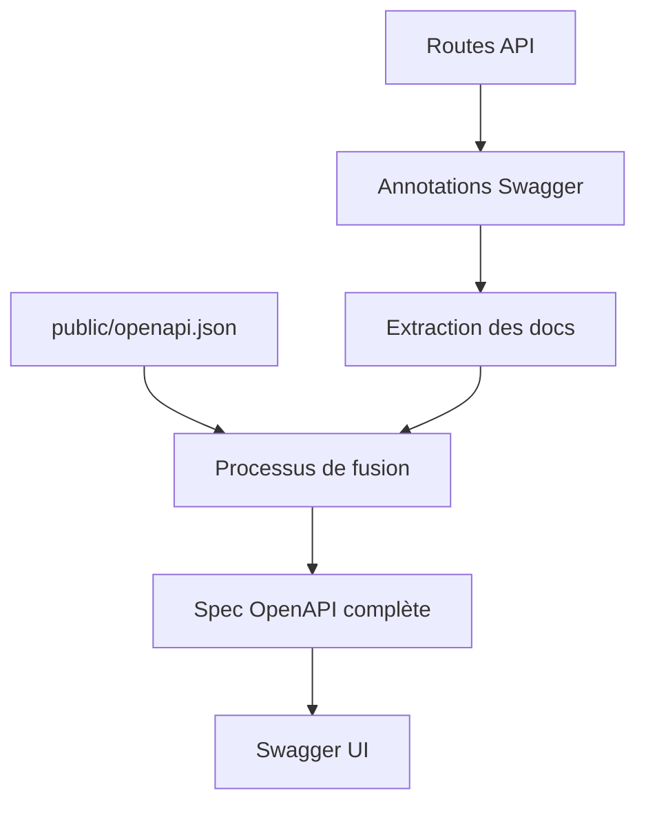

# Système de documentation API automatisé

Ever Works inclut un système de documentation OpenAPI automatisé qui génère une documentation API complète depuis votre code.

## Vue d'ensemble

Le système fournit :
- **Génération automatisée** — Des annotations de code vers la spec OpenAPI
- **Approche hybride** — Préserve les docs manuelles, ajoute les automatisées
- **Typé de façon sécurisée** — Intégration TypeScript
- **Interface Swagger UI** — Explorateur API interactif

## Architecture



## Utilisation

### Ajouter des annotations aux routes

```typescript
// app/api/example/route.ts

/**
 * @swagger
 * /api/example:
 *   get:
 *     tags: ["Example"]
 *     summary: "Obtenir des données exemple"
 *     description: "Retourne des données exemple depuis l'API"
 *     responses:
 *       200:
 *         description: Succès
 *         content:
 *           application/json:
 *             schema:
 *               type: object
 */
export async function GET(request: NextRequest) {
  return NextResponse.json({ data: "example" });
}
```

### Exécuter le générateur

```bash
# Génération standard
tsx scripts/generate-openapi.ts

# Mode silencieux (pour CI/CD)
tsx scripts/generate-openapi.ts --silent
```

La sortie est écrite dans `public/openapi.json` et une sauvegarde est créée dans `public/openapi.backup.json`.

## Accéder à la documentation

La documentation Swagger UI est disponible sur `/api-docs` lorsque l'application est en cours d'exécution.
